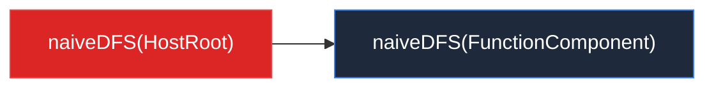
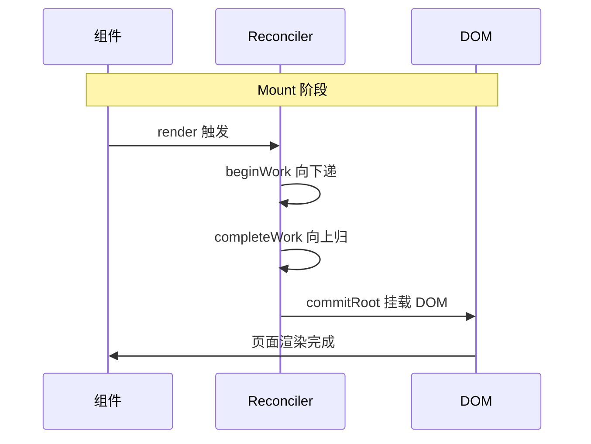

# AGENTS.md

This file provides guidance to the AI assistant when working with code in this repository.

## Project overview

This is **Big-React**, a from-scratch implementation of React 18 used for learning how React works internally. It is organized as a pnpm monorepo under `packages/`.

## Common commands

- **Install dependencies**: `pnpm install`
- **Build development bundles**: `pnpm run build:dev`
  - Outputs UMD bundles to `dist/node_modules/` for `react`, `react-dom`, and `react/jsx-dev-runtime`.
  - The root `package.json` depends on `react` and `react-dom` `^0.0.0` so the built packages in `dist/node_modules` can be linked for local testing.
- **Lint and auto-fix**: `pnpm run lint`
  - Runs ESLint with Prettier on `packages/**/*.{js,ts,jsx,tsx}`.
- **Type-check**: `npx tsc --noEmit`
  - `tsconfig.json` already sets `noEmit: true`; this checks the whole `packages` tree.

There is no test runner configured yet (Jest is on the TODO list).

## Monorepo structure

The workspace is defined in `pnpm-workspace.yaml`:

- `packages/react` — public React API and JSX transform (`jsxDEV`).
- `packages/react-dom` — DOM renderer; wires the reconciler to browser DOM via `hostConfig`.
- `packages/react-reconciler` — core Fiber reconciler. It is renderer-agnostic and imports host operations through `hostConfig.ts`.
- `packages/shared` — shared symbols (`REACT_ELEMENT_TYPE`) and TypeScript types.

Cross-package imports use `workspace:*` dependencies and import by package name, e.g. `import { ReactElement } from 'shared/ReactTypes'`.

## High-level architecture

### Renderer-agnostic reconciler

`react-reconciler` does not talk to the DOM directly. Instead, `packages/react-dom/src/hostConfig.ts` defines the host environment operations (`createInstance`, `appendInitialChild`, etc.), and `packages/react-reconciler/src/hostConfig.ts` re-exports them. To add another renderer (e.g. ReactNoop), provide a different host config and keep the reconciler unchanged.

### Fiber tree and work loop

- `FiberNode` (`react-reconciler/src/fiber.ts`) is the unit of work. It stores props, state, effects (`flags`/`subtreeFlags`), and tree pointers (`return`, `sibling`, `child`).
- `FiberRootNode` wraps the host container and points to the current tree via `current`.
- `createWorkInProgress` creates the alternate Fiber for the next render, linking `current.alternate` and `wip.alternate`.

The render phase is synchronous and split into two passes:

1. **beginWork** (`react-reconciler/src/beginWork.ts`) — walks down the tree, processes updates, and creates/reconciles child fibers.
2. **completeWork** (`react-reconciler/src/completeWork.ts`) — walks back up, creates host DOM nodes, appends children, and bubbles `subtreeFlags`.

`workLoop.ts` orchestrates the passes via `performUnitOfWork` and `completeUnitOfWork`. The commit phase is not yet implemented.

### Update queue

`updateQueue.ts` manages pending updates on a Fiber. `createContainer` initializes the queue; `updateContainer` creates an update, enqueues it, and calls `scheduleUpdateOnFiber`, which currently triggers `performSyncWorkOnRoot` immediately.

### JSX / React elements

`packages/react/src/jsx.ts` implements the automatic JSX runtime (`jsxDEV`). Elements are plain objects marked with `REACT_ELEMENT_TYPE` (`shared/ReactSymbols.ts`) and a `__mark: 'KaSong'` field.

## Code style

- Prettier config: tabs, single quotes, no trailing commas, 80-char print width.
- ESLint extends `@typescript-eslint/recommended` and Prettier; `no-case-declarations` and `no-constant-condition` are disabled.
- Commit messages follow Conventional Commits via commitlint and Husky hooks.

## Mermaid 图表语法规则

在项目文档（如 `docs/` 目录下的 `.md` 文件）中使用 Mermaid 图表时，必须遵守以下规则以避免渲染错误。这些规则也适用于本项目的所有代码注释和文档。

### 核心原则

**凡是节点文本中包含 Mermaid 特殊符号（`[`、`]`、`(`、`)`、`{`、`}`、`"`），必须用双引号 `""` 包裹节点文本。**

### 节点形状与易错符号对照

| 节点写法 | 形状 | 文本中不能出现的符号 | 正确写法 |
|---------|------|-------------------|---------|
| `id[text]` | 矩形 | `]` | `id["naiveDFS(HostRoot)"]` |
| `id(text)` | 圆角矩形 | `)` | `id("naiveDFS(HostRoot)")` |
| `id{text}` | 菱形 | `}` | `id{"naiveDFS(HostRoot)"}` |
| `id>text]` | 非对称 | `]` | `id>"naiveDFS(HostRoot)"]` |

### 四条具体规则

1. **节点文本含 `[]`、`()`、`{}`、`""` 时，必须用引号包裹。** 虽然 `()` 在外层 `[]` 内部通常不直接导致解析失败，但作为统一安全规范，一律加引号，避免复杂嵌套时出错。  
   ❌ `R1[naiveDFS(HostRoot)]` → ✅ `R1["naiveDFS(HostRoot)"]`

2. **节点文本含 `]` 时，必须用引号包裹。** 否则解析器会将第一个 `]` 误认为是节点结束符。  
   ❌ `A[something[inner]]` → ✅ `A["something[inner]"]`

3. **节点文本含 `"` 时，必须用引号包裹，内部改用单引号。** 外层 `""` 标记节点文本的起止，内部绝对不能出现相同的 `"`，否则解析器会提前结束文本。  
   ❌ `HOSTT["HostText (tag=6)<br/>"文本内容""]` — 内层 `"` 与外层 `"` 冲突  
   ❌ `C2["需要向下找"顶级 DOM 节点""]`  
   ✅ `HOSTT["HostText (tag=6)<br/>'文本内容'"]` — 内层改单引号  
   ✅ `A["text with 'quotes'"]`

4. **`style` 语句中的颜色值、`subgraph` 标题建议加引号。**  
   ❌ `style A fill:#dc2626,stroke:#ef4444,color:white`  
   ✅ `style A fill:#dc2626,stroke:#ef4444,color:#fff`

### 正确示例



### 快速判断

问自己：**"文本中的符号会不会让 Mermaid 解析器提前匹配到结束符？"** 如果答案是"会"，就加 `""`。

### sequenceDiagram（时序图）特殊规则

`sequenceDiagram` 的语法与 `flowchart` 完全不同，上述 flowchart 的引号规则**不适用**于时序图。时序图有自己的一套容易出错的点：

#### 规则 1：Note over 文本禁止加引号

`Note over` 后面的文本是**纯文本**，`:` 之后的所有内容就是显示文本。加引号会导致引号本身也成为显示内容的一部分，或者直接解析失败。

❌ `Note over A,B: "Phase 1: 创建骨架"` — 引号会导致解析错误
✅ `Note over A,B: Phase 1 创建骨架` — 纯文本，不要引号

#### 规则 2：消息文本禁止包含 `()`、`->`、`→`、`<>`、`{}` 等特殊符号

时序图中 `->>` 后面的消息文本虽然可以用引号包裹，但以下符号即使在引号内也会被解析器误读：
- `(` `)` — 被误认为 participant 语法
- `->` — 被误认为箭头
- `<` `>` — 被误认为标签或 participant 别名
- `{` `}` — 被误认为块语法

❌ `A->>B: "HostRoot: processUpdateQueue -> reconcilerChildFibers -> App fiber(Placement)"`
❌ `A->>B: "root.render(<App/>)"`
✅ `A->>B: HostRoot reconcileChildFibers App fiber` — 纯文本，无特殊符号
✅ `A->>B: root.render App` — 纯文本

#### 规则 3：消息文本可以省略引号

时序图的消息文本**本来就是纯文本**，不需要加引号。加了反而容易出错。

❌ `A->>B: "some text"`
✅ `A->>B: some text`

#### 规则 4：participant 别名用 `as` 而非引号

❌ `participant "CR" as createRoot` — 不需要给 ID 加引号
✅ `participant Root as createRoot` — 直接用简单 ID

#### 时序图正确示例



#### 核心原则

**时序图中每一步，消息文本只用中文 + 英文字母 + 空格，宁可简化文本也不要加任何特殊符号。**

## 注释方法论

项目代码中函数注释遵循以下规范，AI assistant 编写注释时也应遵守。

### 通用原则（所有函数都适用）

1. **职责描述**：函数签名第一段，用一句清晰的话说明函数做什么
2. **执行流程**：简述函数内部的主要步骤
3. **具体举例**：用一个**真实的 fiber 树 / ReactElement 结构**作为例子
4. **逐步骤推演**：顺着例子一步步推导，标注每步的输入输出
5. **结论**：最终能达到什么效果

### commit 流程（`commitWork.ts`）—— 从 FiberNode 角度解释

commit 阶段操作的是已经构建好的 fiber 树和真实 DOM。注释中给出的例子应包含：

- **fiber 树结构**：节点类型（`tag`）、`stateNode`（对应 DOM）、`child` / `sibling` / `return` 关系
- **真实 DOM 树**：与 fiber 树对应的 DOM 结构
- **遍历步骤**：`commitNestedComponent` 的 DFS 顺序
- **收集/操作过程**：`recordHostChildrenToDelete` 的数组变化过程，或 `insertOrAppendPlacementNodeIntoContainer` 的递归调用过程

示例片段（`commitDeletion`）：

````
fiber 树（childToDelete = Fragment）：
  ul (HostComponent, stateNode = <ul>)
    └── Fragment (tag=7)  ← childToDelete
          ├── li#1 (HostComponent, stateNode = <li>1</li>)
          ├── li#2 (HostComponent, stateNode = <li>2</li>)
          └── li#3 (HostComponent, stateNode = <li>3</li>)

收集过程：
  ① Fragment：tag=7 → default → 什么都不做
  ② li#1：rootChildrenToDelete 为空 → push li#1 → [li#1]
  ③ li#2：lastOne = li#1，li#1.sibling = li#2 → push → [li#1, li#2]
  ④ li#3：lastOne = li#2，li#2.sibling = li#3 → push → [li#1, li#2, li#3]

最终删除：
  removeChild(<li>1</li>, <ul>)
  removeChild(<li>2</li>, <ul>)
  removeChild(<li>3</li>, <ul>)
````

### beginWork 流程（`beginWork.ts` / `childFibers.ts`）—— 从 FiberNode + ReactElement 两个角度解释

beginWork 的核心是"用 ReactElement 对比旧 fiber，生成新 fiber"。注释中给出的例子应同时包含：

- **旧 fiber 树结构**：`current.child`，包含各节点的 `key` / `index` / `type`
- **新 ReactElement 结构**：来自组件返回值或 jsx 编译产物，包含 `type` / `key` / `props`
- **对比过程**：`reconcileSingleElement` 的 key 匹配 + type 匹配，或 `reconcileChildrenArray` 的 `oldIndex` / `lastPlacedIndex` 计算

示例片段（`reconcileChildrenArray`）：

````
旧 fiber 树（current）：
  key='1'(index=0), key='2'(index=1), key='3'(index=2)

新 children：
  [li(k='3'), li(k='2'), li(k='1')]

diff 过程：
  i=0, li(k='3'): oldIndex=2 >= lastPlacedIndex=0 → 不移动, lastPlacedIndex=2
  i=1, li(k='2'): oldIndex=1 <  lastPlacedIndex=2 → 移动
  i=2, li(k='1'): oldIndex=0 <  lastPlacedIndex=2 → 移动
````
