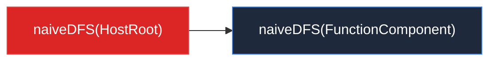

# AGENTS.md

This file provides guidance to the AI assistant when working with code in this repository.

## Project overview

This is **Big-React**, a from-scratch implementation of React 18 used for learning how React works internally. It is organized as a pnpm monorepo under `packages/`.

## Common commands

- **Install dependencies**: `pnpm install`
- **Build development bundles**: `pnpm run build:dev`
  - Outputs UMD bundles to `dist/node_modules/` for `react`, `react-dom`, and `react/jsx-dev-runtime`.
  - The root `package.json` depends on `react` and `react-dom` `^0.0.0` so the built packages in `dist/node_modules` can be linked for local testing.
- **Lint and auto-fix**: `pnpm run lint`
  - Runs ESLint with Prettier on `packages/**/*.{js,ts,jsx,tsx}`.
- **Type-check**: `npx tsc --noEmit`
  - `tsconfig.json` already sets `noEmit: true`; this checks the whole `packages` tree.

There is no test runner configured yet (Jest is on the TODO list).

## Monorepo structure

The workspace is defined in `pnpm-workspace.yaml`:

- `packages/react` — public React API and JSX transform (`jsxDEV`).
- `packages/react-dom` — DOM renderer; wires the reconciler to browser DOM via `hostConfig`.
- `packages/react-reconciler` — core Fiber reconciler. It is renderer-agnostic and imports host operations through `hostConfig.ts`.
- `packages/shared` — shared symbols (`REACT_ELEMENT_TYPE`) and TypeScript types.

Cross-package imports use `workspace:*` dependencies and import by package name, e.g. `import { ReactElement } from 'shared/ReactTypes'`.

## High-level architecture

### Renderer-agnostic reconciler

`react-reconciler` does not talk to the DOM directly. Instead, `packages/react-dom/src/hostConfig.ts` defines the host environment operations (`createInstance`, `appendInitialChild`, etc.), and `packages/react-reconciler/src/hostConfig.ts` re-exports them. To add another renderer (e.g. ReactNoop), provide a different host config and keep the reconciler unchanged.

### Fiber tree and work loop

- `FiberNode` (`react-reconciler/src/fiber.ts`) is the unit of work. It stores props, state, effects (`flags`/`subtreeFlags`), and tree pointers (`return`, `sibling`, `child`).
- `FiberRootNode` wraps the host container and points to the current tree via `current`.
- `createWorkInProgress` creates the alternate Fiber for the next render, linking `current.alternate` and `wip.alternate`.

The render phase is synchronous and split into two passes:

1. **beginWork** (`react-reconciler/src/beginWork.ts`) — walks down the tree, processes updates, and creates/reconciles child fibers.
2. **completeWork** (`react-reconciler/src/completeWork.ts`) — walks back up, creates host DOM nodes, appends children, and bubbles `subtreeFlags`.

`workLoop.ts` orchestrates the passes via `performUnitOfWork` and `completeUnitOfWork`. The commit phase is not yet implemented.

### Update queue

`updateQueue.ts` manages pending updates on a Fiber. `createContainer` initializes the queue; `updateContainer` creates an update, enqueues it, and calls `scheduleUpdateOnFiber`, which currently triggers `performSyncWorkOnRoot` immediately.

### JSX / React elements

`packages/react/src/jsx.ts` implements the automatic JSX runtime (`jsxDEV`). Elements are plain objects marked with `REACT_ELEMENT_TYPE` (`shared/ReactSymbols.ts`) and a `__mark: 'KaSong'` field.

## Code style

- Prettier config: tabs, single quotes, no trailing commas, 80-char print width.
- ESLint extends `@typescript-eslint/recommended` and Prettier; `no-case-declarations` and `no-constant-condition` are disabled.
- Commit messages follow Conventional Commits via commitlint and Husky hooks.

## Mermaid 图表语法规则

在项目文档（如 `docs/` 目录下的 `.md` 文件）中使用 Mermaid 图表时，必须遵守以下规则以避免渲染错误。这些规则也适用于本项目的所有代码注释和文档。

### 核心原则

**凡是节点文本中包含 Mermaid 特殊符号（`[`、`]`、`(`、`)`、`{`、`}`、`"`），必须用双引号 `""` 包裹节点文本。**

### 节点形状与易错符号对照

| 节点写法 | 形状 | 文本中不能出现的符号 | 正确写法 |
|---------|------|-------------------|---------|
| `id[text]` | 矩形 | `]` | `id["naiveDFS(HostRoot)"]` |
| `id(text)` | 圆角矩形 | `)` | `id("naiveDFS(HostRoot)")` |
| `id{text}` | 菱形 | `}` | `id{"naiveDFS(HostRoot)"}` |
| `id>text]` | 非对称 | `]` | `id>"naiveDFS(HostRoot)"]` |

### 四条具体规则

1. **节点文本含 `[]`、`()`、`{}`、`""` 时，必须用引号包裹。** 虽然 `()` 在外层 `[]` 内部通常不直接导致解析失败，但作为统一安全规范，一律加引号，避免复杂嵌套时出错。  
   ❌ `R1[naiveDFS(HostRoot)]` → ✅ `R1["naiveDFS(HostRoot)"]`

2. **节点文本含 `]` 时，必须用引号包裹。** 否则解析器会将第一个 `]` 误认为是节点结束符。  
   ❌ `A[something[inner]]` → ✅ `A["something[inner]"]`

3. **节点文本含 `"` 时，必须用引号包裹，内部改用单引号。** 外层 `""` 标记节点文本的起止，内部绝对不能出现相同的 `"`，否则解析器会提前结束文本。  
   ❌ `HOSTT["HostText (tag=6) "文本内容""]` — 内层 `"` 与外层 `"` 冲突  
   ❌ `C2["需要向下找"顶级 DOM 节点""]`  
   ✅ `HOSTT["HostText (tag=6) '文本内容'"]` — 内层改单引号  
   ✅ `A["text with 'quotes'"]`

4. **`style` 语句中的颜色值、`subgraph` 标题建议加引号。**  
   ❌ `style A fill:#dc2626,stroke:#ef4444,color:white`  
   ✅ `style A fill:#dc2626,stroke:#ef4444,color:#fff`

### 正确示例

### 快速判断

问自己：**"文本中的符号会不会让 Mermaid 解析器提前匹配到结束符？"** 如果答案是"会"，就加 `""`。
