# completeWork 源码导读

本文跟随当前仓库里的实现解释 `completeWork`，重点解释：

- `completeWork` 到底在 Fiber 架构里负责什么
- 第一个执行 `completeWork` 的节点为什么通常没有子节点
- `appendAllChildren` 为什么要“下探”
- Fiber 树和真实 DOM 树之间是什么关系
- 当前代码已经实现了什么，哪些位置还只是骨架

相关源码：

- `packages/react-reconciler/src/workLoop.ts`
- `packages/react-reconciler/src/beginWork.ts`
- `packages/react-reconciler/src/completeWork.ts`
- `packages/react-reconciler/src/childFibers.ts`
- `packages/react-reconciler/src/fiber.ts`
- `packages/react-reconciler/src/hostConfig.ts`

## 一句话理解 completeWork

`completeWork` 的意思不是“整个 React 更新完成了”。

它的意思是：

> 当前 Fiber 的子树已经处理完了，现在轮到当前 Fiber 做收尾工作。

在当前实现里，`completeWork` 最核心的收尾工作是：

1. 为 `HostComponent` 创建宿主节点，也就是类似真实 DOM 的对象。
2. 把子 Fiber 已经创建好的宿主节点 append 到当前宿主节点里。
3. 把当前宿主节点保存到 `wip.stateNode`。

也就是说：

```txt
beginWork     负责往下走，创建或复用 child Fiber
completeWork  负责往上回，创建当前 Fiber 对应的宿主节点
```

可以先记住这个方向：

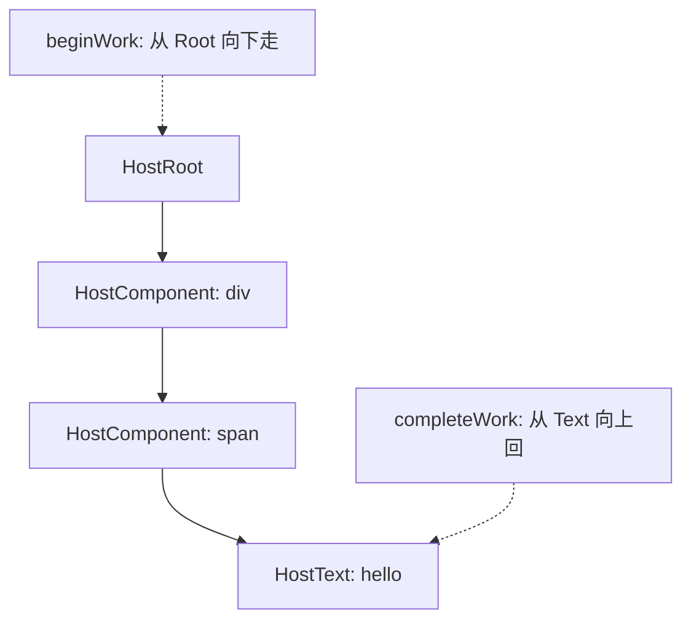

`beginWork` 是“递”的过程，`completeWork` 是“归”的过程。

## workLoop 怎样触发 completeWork

当前代码在 `workLoop.ts` 中：

```ts
function performUnitOfWork(fiber: FiberNode) {
	const next = beginWork(fiber);
	fiber.memoizedProps = fiber.pendingProps;

	if (next === null) {
		completeUnitOfWork(fiber);
	} else {
		workInProgress = next as FiberNode | null;
	}
}
```

这段逻辑非常关键：

```txt
beginWork 当前 Fiber

如果 beginWork 返回 child:
	继续处理 child

如果 beginWork 返回 null:
	说明当前 Fiber 没有更深的 child 要处理
	开始 completeUnitOfWork 当前 Fiber
```

因此，第一个执行 `completeWork` 的节点，通常就是最深处的叶子节点。

比如：

```tsx
<div>
	<span>hello</span>
</div>
```

Fiber 树：

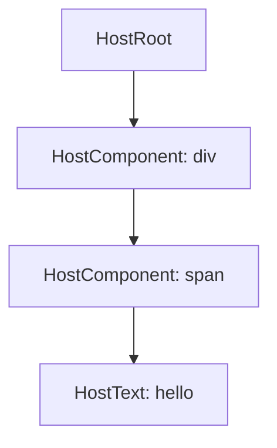

执行顺序是：

```txt
beginWork(HostRoot)
beginWork(div)
beginWork(span)
beginWork(HostText: hello)

HostText 没有 child，beginWork 返回 null

completeWork(HostText: hello)
completeWork(span)
completeWork(div)
completeWork(HostRoot)
```

用时序图看：

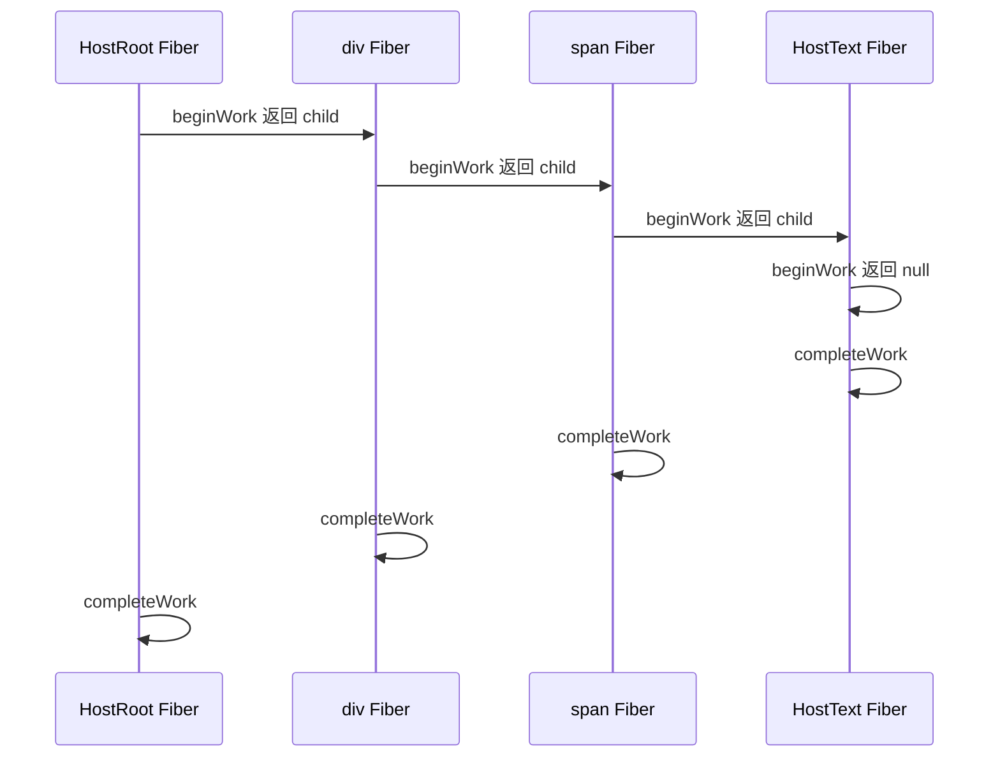

所以，“第一个 completeWork 的 node 没有任何子节点”不是异常，而是这个算法的入口。

## 没有子节点的 node complete 什么

`completeWork` 不是只负责 append child。

它更本质的职责是：

> 把当前 Fiber 转换成父级可以使用的完成结果。

对于 `HostComponent`，完成结果就是一个宿主节点：

```txt
HostComponent: div  ->  <div></div>
HostComponent: span ->  <span></span>
```

对于 `HostText`，完成结果应该是一个文本节点：

```txt
HostText: hello -> Text("hello")
```

当前代码中的 `HostText` 分支还没有真正创建文本节点：

```ts
case HostText:
	// 构建 Dom,
	// 将 Dom 插入 Dom 树中
	if (current !== null && wip.stateNode) {
	}
	return null;
```

所以当前实现里，`HostText` 还只是保留了位置。后续通常会补一个类似 `createTextInstance` 的 hostConfig 方法，然后给 `wip.stateNode` 赋值。

如果未来补上，逻辑大概会变成：

```ts
case HostText:
	if (current !== null && wip.stateNode) {
		// 更新文本
	} else {
		const instance = createTextInstance(newProps.content);
		wip.stateNode = instance;
	}
	return null;
```

这时第一个叶子节点的作用就很清楚了：

```txt
它没有 child 可以 append。
但它仍然要创建自己的 stateNode。
```

## 当前 completeWork 的真实代码

当前 `completeWork.ts` 的核心是：

```ts
export const completeWork = (wip: FiberNode) => {
	const newProps = wip.pendingProps;
	const current = wip.alternate;

	switch (wip.tag) {
		case HostComponent:
			if (current !== null && wip.stateNode) {
				// TODO: 更新
			} else {
				const instance = createInstance(wip.type, newProps);
				appendAllChildren(instance, wip);
				wip.stateNode = instance;
			}

			return null;
		case HostText:
			if (current !== null && wip.stateNode) {
			}
			return null;
		case HostRoot:
			if (current !== null && wip.stateNode) {
			}
			return null;
	}
};
```

这里要注意三个点。

第一，`current` 来自：

```ts
const current = wip.alternate;
```

`alternate` 是双缓存 Fiber 树里的另一棵树。初次 mount 时，很多新 Fiber 没有对应的已渲染节点，所以 `current` 可能是 `null`。更新时，`current` 通常代表上一次已经完成的 Fiber。

第二，`HostComponent` 的 mount 分支做了三件事：

```ts
const instance = createInstance(wip.type, newProps);
appendAllChildren(instance, wip);
wip.stateNode = instance;
```

可以翻译成：

```txt
1. 创建自己的宿主节点
2. 找到子树里已经完成的宿主节点，append 到自己下面
3. 把自己的宿主节点保存到 stateNode，方便父级 append
```

第三，当前 `hostConfig.ts` 还是占位：

```ts
export const createInstance = (...args: any[]) => {
	return {} as any;
};

export const appendInitialChild = (...args: any[]) => {
	return {} as any;
};
```

所以目前它还没有真正操作浏览器 DOM。本文用 `<div>`、`<span>` 这些 DOM 形态解释的是“设计意图”。当前代码的 `createInstance` 实际只返回了一个空对象。

## Fiber 树和 DOM 树不是一回事

这是理解 `appendAllChildren` 的前提。

Fiber 树描述的是 React 内部工作单元。

DOM 树描述的是最后要挂到页面上的宿主节点。

它们不一定一一对应。

比如：

```tsx
function App() {
	return <span>hello</span>;
}

<div>
	<App />
</div>
```

Fiber 树可能是：

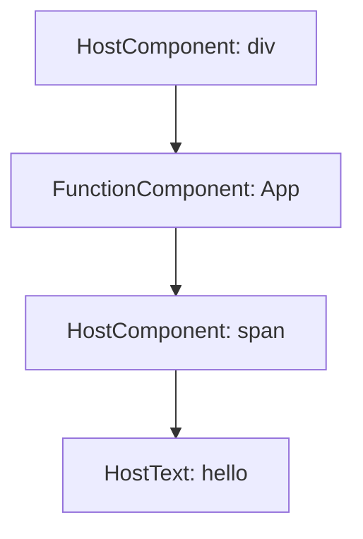

但 DOM 树应该是：

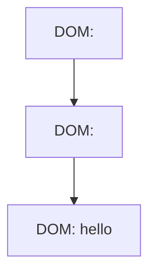

中间的 `FunctionComponent: App` 在 DOM 树里没有位置。

所以 Fiber 树和 DOM 树之间存在一个重要规则：

```txt
HostComponent 和 HostText 通常有宿主节点。
FunctionComponent、Fragment 等通常没有自己的宿主节点。
```

这就是 `appendAllChildren` 必须下探的原因。

## appendAllChildren 的职责

当前代码：

```ts
export function appendAllChildren(parent: FiberNode, wip: FiberNode) {
	let node = wip.child;
	while (node !== null) {
		if (node.tag === HostComponent || node.tag === HostText) {
			appendInitialChild(parent, node?.stateNode);
		} else if (node.child !== null) {
			node.child.return = node;
			node = node.child;
			continue;
		}
		if (node === wip) {
			return;
		}
		while (node.sibling === null) {
			if (node.return === null || node.return === wip) {
				return;
			}
			node = node?.return;
		}
		node.sibling.return = node.return;
		node = node.sibling;
	}
}
```

先说一个类型细节：这里的 `parent` 标成了 `FiberNode`，但从调用处看：

```ts
const instance = createInstance(wip.type, newProps);
appendAllChildren(instance, wip);
```

`parent` 实际上传入的是 `instance`，也就是宿主节点。等真实 DOM renderer 接好后，它应该更像 DOM 节点，而不是 FiberNode。

因此可以把函数理解成：

```txt
appendAllChildren(parentDOM, 当前 wip Fiber)
```

它的职责是：

> 从 `wip` 的 Fiber 子树里，找到应该直接挂到 `parentDOM` 下面的宿主节点。

不是找所有 Fiber。

也不是把所有后代 DOM 都扁平 append 到 parent。

而是：

```txt
遇到 HostComponent / HostText:
	它本身有宿主节点，append 它的 stateNode
	不要继续下探它的 child

遇到 FunctionComponent / Fragment 等无宿主节点:
	它自己不能 append
	继续下探它的 child
```

## 为什么遇到 HostComponent 后不继续下探

看这个例子：

```tsx
<div>
	<span>hello</span>
</div>
```

正确 DOM 树是：

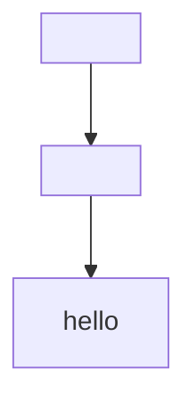

`completeWork(span)` 的时候，`span` 已经负责把 `hello` 放进自己里面：

```txt
completeWork(HostText: hello)
	创建 Text 节点

completeWork(span)
	创建 span 节点
	append Text 节点到 span
	span.stateNode = span 节点
```

所以到了 `completeWork(div)`：

```txt
div 只需要 append span.stateNode。
div 不应该直接 append hello。
```

如果 `div` 继续下探 `span.child`，就可能把 DOM 层级弄错。

正确关系是：

```txt
div
└── span
    └── hello
```

不是：

```txt
div
├── span
└── hello
```

所以 `appendAllChildren` 的这个分支很重要：

```ts
if (node.tag === HostComponent || node.tag === HostText) {
	appendInitialChild(parent, node?.stateNode);
}
```

命中 `HostComponent` 或 `HostText` 后，它 append 当前节点的 `stateNode`，但不会进入当前节点的 child。

因为当前节点自己的 child，应该已经在这个节点执行 `completeWork` 时被组装好了。

## appendAllChildren 的下探案例

下探是为了处理“没有宿主节点的中间 Fiber”。

先用一个概念性案例：

```tsx
function App() {
	return <span>hello</span>;
}

<div>
	<App />
</div>
```

Fiber 树：


目标 DOM 树：


当执行：

```ts
appendAllChildren(divDOM, divFiber);
```

初始：

```ts
let node = wip.child;
```

也就是：

```txt
node = App Fiber
```

第一轮：

```ts
if (node.tag === HostComponent || node.tag === HostText) {
	appendInitialChild(parent, node?.stateNode);
} else if (node.child !== null) {
	node.child.return = node;
	node = node.child;
	continue;
}
```

`App Fiber` 不是 `HostComponent`，也不是 `HostText`。它没有自己的 DOM。

所以进入：

```ts
node = node.child;
continue;
```

这一步就是“下探”：

```txt
App Fiber 没有 DOM
继续找 App Fiber 下面真正有 DOM 的节点
```

下探之后：

```txt
node = Span Fiber
```

第二轮：

```txt
Span Fiber 是 HostComponent
appendInitialChild(divDOM, span.stateNode)
```

于是 `divDOM` 得到：

```html
<div>
	<span>hello</span>
</div>
```

注意，`span` 里的 `hello` 不是在 `div` 这里 append 的。

`hello` 是在更早的 `completeWork(span)` 里 append 到 `span` 的。

## appendAllChildren 的完整行走路径

再看一个带兄弟节点的概念性例子：

```tsx
function App() {
	return <span>hello</span>;
}

<div>
	<App />
	<p>world</p>
</div>
```

注意：当前 `childFibers.ts` 暂时还没有实现多子节点 reconcile，这里是为了说明 `appendAllChildren` 的遍历意图。后续实现多节点后，这个路径就会真正出现。

Fiber 树概念上是：

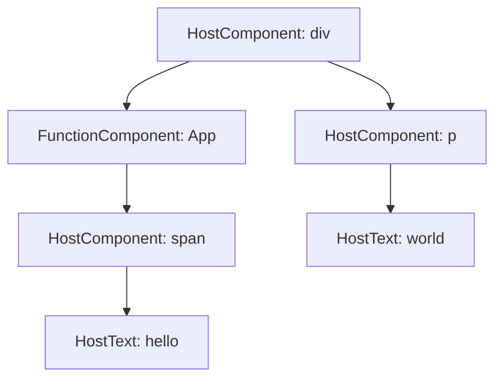

Fiber 的指针关系更准确地说是：

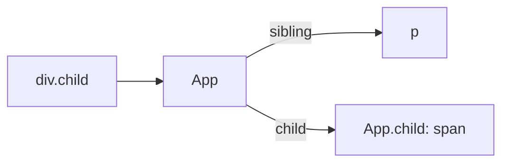

目标 DOM 树是：

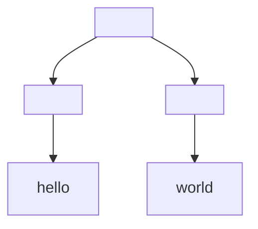

执行：

```ts
appendAllChildren(divDOM, divFiber);
```

行走过程：

```txt
1. node = div.child = App

2. App 不是 HostComponent / HostText
   App 有 child
   所以下探到 App.child，也就是 span

3. span 是 HostComponent
   append span.stateNode 到 divDOM

4. span 没有 sibling
   往 return 回退到 App

5. App 有 sibling，也就是 p
   切换到 p

6. p 是 HostComponent
   append p.stateNode 到 divDOM

7. p 没有 sibling
   p.return 是 div，也就是本次 appendAllChildren 的 wip
   遍历结束
```

对应代码分段：

### 1. 从第一个 child 开始

```ts
let node = wip.child;
```

`appendAllChildren` 只关心 `wip` 的子树。

如果 `wip.child === null`，说明当前节点没有子 Fiber，循环不会执行。

这就是叶子 `HostComponent` 的情况：

```tsx
<div />
```

执行：

```txt
createInstance("div")
appendAllChildren(divDOM, divFiber) 什么也不做
wip.stateNode = divDOM
```

### 2. 遇到宿主节点就 append

```ts
if (node.tag === HostComponent || node.tag === HostText) {
	appendInitialChild(parent, node?.stateNode);
}
```

这一步的意思是：

```txt
这个 Fiber 有真实宿主节点。
把它的 stateNode 挂到 parent 下面。
```

这里默认了一个前提：

```txt
由于 completeWork 是从子到父执行的，
所以 child 的 stateNode 应该已经准备好了。
```

### 3. 遇到没有宿主节点的 Fiber 就下探

```ts
else if (node.child !== null) {
	node.child.return = node;
	node = node.child;
	continue;
}
```

这就是你特别问的“下探代码”。

它处理的是：

```txt
当前 node 自己没有 DOM
但它下面可能有 DOM
```

典型节点包括：

```txt
FunctionComponent
Fragment
ContextProvider
SuspenseComponent
OffscreenComponent
```

当前 `beginWork.ts` 还没有真正实现这些类型，但 `workTags.ts` 已经定义了这些 tag，所以 `appendAllChildren` 先写成了通用遍历形态。

下探前：

```txt
div
└── App
    └── span
```

下探后：

```txt
当前 node 从 App 变成 span
```

`continue` 的作用是：

```txt
立刻进入下一轮 while
不要执行下面的 sibling / return 回退逻辑
```

因为刚下探到 child，还没有处理这个 child。

### 4. 没有 sibling 时向上回退

```ts
while (node.sibling === null) {
	if (node.return === null || node.return === wip) {
		return;
	}
	node = node?.return;
}
```

这段处理的是：

```txt
当前分支走完了，找不到右兄弟。
那就回到父级，看父级有没有右兄弟。
```

比如：

```txt
div
└── App
    └── span
```

`span` 没有 sibling，于是回退到 `App`。

如果 `App` 也没有 sibling，并且 `App.return === div`，说明已经回到本次遍历的边界了。

这时：

```ts
if (node.return === null || node.return === wip) {
	return;
}
```

表示：

```txt
不能再往 wip 外面找了。
appendAllChildren 只负责 wip 的子树。
```

### 5. 找到 sibling 后横向移动

```ts
node.sibling.return = node.return;
node = node.sibling;
```

这两句负责切到右兄弟。

比如：

```txt
div
├── App
│   └── span
└── p
```

当 `span` 完成后：

```txt
span 没有 sibling
回退到 App
App 有 sibling: p
切到 p
```

于是继续处理 `p`。

这里重新赋值：

```ts
node.sibling.return = node.return;
```

是为了保证 sibling 的 `return` 指针正确，方便后续继续向上回退。

## appendAllChildren 不是 commit

这里容易混淆。

`appendAllChildren` 并不是把 DOM 插入页面。

它只是把当前 Fiber 子树内部的宿主节点组装起来，形成一棵离屏的宿主树。

比如：

```tsx
<div>
	<span>hello</span>
</div>
```

在 render 阶段完成后，会先得到类似这样的离屏结构：

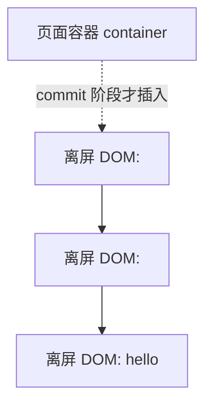

当前仓库里 commit 阶段还没有完整实现，所以 `completeWork` 只是在 render 阶段把子树组装好。

真正把这棵树插入页面容器，应该发生在后续 commit 阶段。

## HostRoot 为什么不创建 DOM

`HostRoot` 不是 JSX 里的真实标签。

它代表 React 根节点，对应的是 `FiberRootNode`，里面保存了宿主容器：

```ts
export class FiberRootNode {
	container: Container;
	current: FiberNode;
	finishedWork: FiberNode | null;

	constructor(container: Container, hostRootFiber: FiberNode) {
		this.container = container;
		this.current = hostRootFiber;
		hostRootFiber.stateNode = this;
		this.finishedWork = null;
	}
}
```

所以：

```txt
HostRoot Fiber 的 stateNode 指向 FiberRootNode
FiberRootNode.container 才是外部传入的宿主容器
```

概念关系：

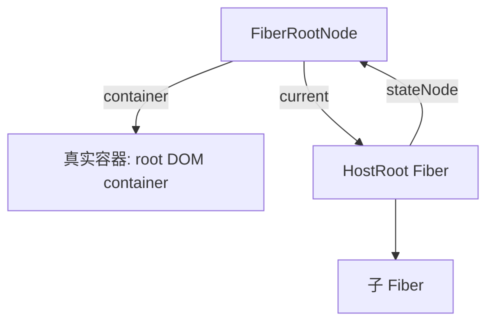

因此 `HostRoot` 自己不应该创建一个新的 DOM 节点。

它更多是后续 commit 阶段把完成的子树挂到 `container` 的入口。

当前 `completeWork.ts` 的 `HostRoot` 分支还没有做实际事情：

```ts
case HostRoot:
	if (current !== null && wip.stateNode) {
	}
	return null;
```

## 当前代码状态记录

截至当前代码，`completeWork` 周边实现状态如下：

| 模块 | 当前状态 |
| --- | --- |
| `HostComponent` mount | 已创建 `instance`，调用 `appendAllChildren`，并赋值给 `wip.stateNode` |
| `HostComponent` update | 只有 TODO，还没有 diff props |
| `HostText` mount | 分支存在，但还没有创建文本宿主节点 |
| `HostText` update | 分支存在，但还没有更新文本 |
| `HostRoot` | 分支存在，但还没有收集 finishedWork 或 commit 逻辑 |
| `appendAllChildren` | 已包含下探、回退、兄弟切换逻辑 |
| `hostConfig` | `createInstance`、`appendInitialChild` 仍是占位实现 |
| 多子节点 reconcile | `childFibers.ts` 中标了 TODO，暂时未实现数组 children |

## 再压缩成一张图

以：

```tsx
<div>
	<span>hello</span>
</div>
```

为例。

Fiber 树：

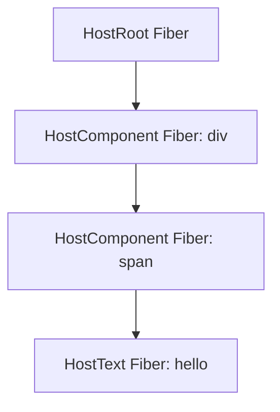

`completeWork` 执行顺序：

```txt
1. completeWork(HostText: hello)
   未来：创建 Text DOM，保存到 textFiber.stateNode

2. completeWork(span)
   创建 spanDOM
   appendAllChildren(spanDOM, spanFiber)
   把 textFiber.stateNode append 到 spanDOM
   spanFiber.stateNode = spanDOM

3. completeWork(div)
   创建 divDOM
   appendAllChildren(divDOM, divFiber)
   把 spanFiber.stateNode append 到 divDOM
   divFiber.stateNode = divDOM

4. completeWork(HostRoot)
   当前暂未处理
   未来 commit 阶段会把完成的子树挂到 container
```

最终 DOM 树：


对应的 `stateNode` 关系：

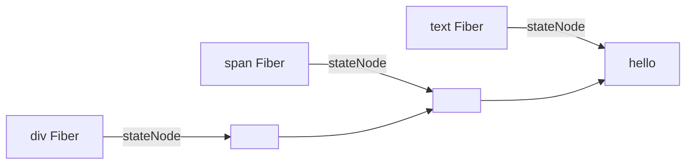

## 读 appendAllChildren 时的口诀

可以按下面这套规则读：

```txt
从 wip.child 开始。

看到 HostComponent / HostText：
	它有 DOM，append 它的 stateNode。
	不要继续钻它的孩子。

看到没有 DOM 的 Fiber：
	它自己不能 append。
	如果它有 child，就下探到 child。

当前分支走完：
	如果有 sibling，去 sibling。
	如果没有 sibling，向 return 回退。
	如果回退到 wip，结束。
```

最关键的是：

```txt
appendAllChildren 的下探，是为了穿过没有 DOM 的 Fiber。
appendAllChildren 不下探 HostComponent，是为了保持 DOM 层级正确。
```

这两个点同时成立，才是这段代码的完整含义。
