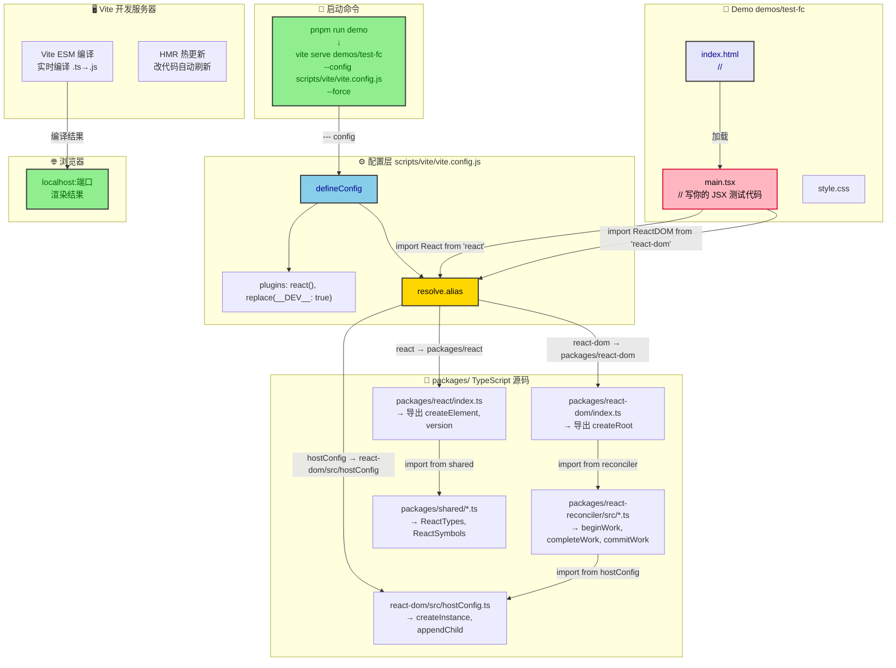
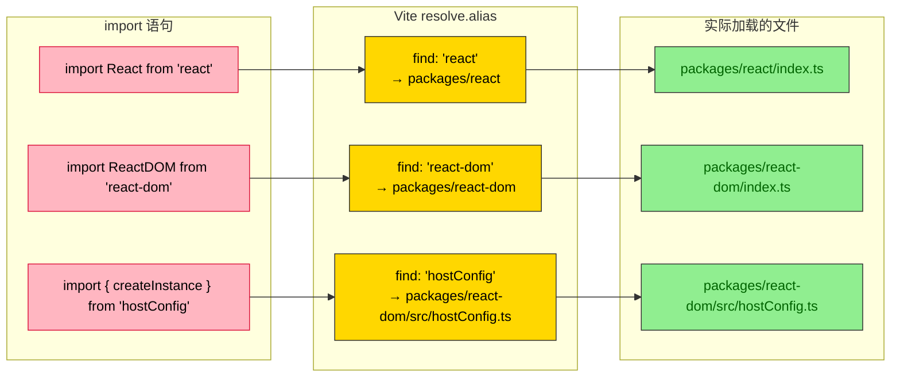
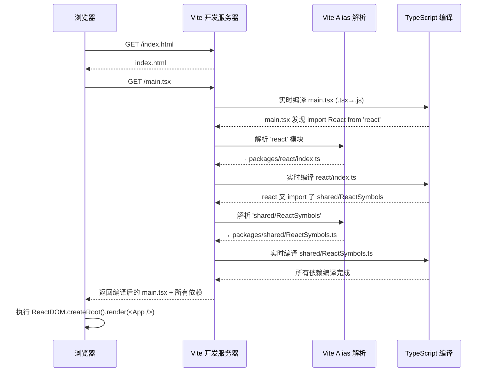

# 源码级调试架构：零构建秒级验证

## 一句话核心

> **通过 Vite `resolve.alias`，让 Demo 项目直接引用 `packages/` 下的 TypeScript 源码，利用 Vite 的原生 ESM 编译能力实时运行，省去 `build:dev` 构建步骤。**

---

## 完整架构图



---

## 核心组件拆解

### 1. 启动命令

```json
// package.json
"demo": "vite serve demos/test-fc --config scripts/vite/vite.config.js --force"
```

关键参数拆解：

| 参数 | 作用 |
|------|------|
| `vite serve demos/test-fc` | 把 `demos/test-fc` 目录作为项目根目录启动 Vite |
| `--config scripts/vite/vite.config.js` | 指定**根目录**的 Vite 配置文件，而非 `demos/test-fc/vite.config.js` |
| `--force` | 强制清除 Vite 预构建缓存，确保每次加载最新源码 |

**为什么用 `--config` 指定外部配置？** 因为 `demos/test-fc` 没有自己的 `package.json` 和 `vite.config.js`，它寄生在根目录的统一配置上。

### 2. Vite 配置

```javascript
// scripts/vite/vite.config.js
import { defineConfig } from 'vite';
import react from '@vitejs/plugin-react';
import replace from '@rollup/plugin-replace';
import { resolvePkgPath } from '../rollup/utils';
import path from 'path';

export default defineConfig({
  plugins: [
    react(),                                    // ① JSX 编译支持
    replace({ __DEV__: true, preventAssignment: true }) // ② 替换 __DEV__ 为 true
  ],
  resolve: {
    alias: [
      {                                          // ③ react → packages/react
        find: 'react',
        replacement: resolvePkgPath('react')     // → packages/react
      },
      {                                          // ④ react-dom → packages/react-dom
        find: 'react-dom',
        replacement: resolvePkgPath('react-dom') // → packages/react-dom
      },
      {                                          // ⑤ hostConfig → react-dom/src/hostConfig.ts
        find: 'hostConfig',
        replacement: path.resolve(
          resolvePkgPath('react-dom'),
          './src/hostConfig.ts'
        )
      }
    ]
  }
});
```

`resolvePkgPath` 返回的是**源码目录**，不是 dist：

```javascript
// scripts/rollup/utils.js
const pkgPath = path.resolve(__dirname, '../../packages');   // 源码
const distPath = path.resolve(__dirname, '../../dist/node_modules'); // 构建产物

export function resolvePkgPath(pkgName, isDist) {
  if (isDist) {
    return `${distPath}/${pkgName}`;      // dist/node_modules/react
  }
  return `${pkgPath}/${pkgName}`;         // packages/react（如果不传 isDist，默认走源码）
}
```

### 3. 三个 alias 分别解析到什么



### 4. Demo 项目结构

```
demos/test-fc/
├── index.html          ← 入口 HTML，引入 main.tsx
├── main.tsx            ← React 组件测试代码
├── main.ts             ← scheduler 孤立测试（不依赖 build）
└── style.css           ← 样式
```

关键点：**`test-fc/` 没有 `package.json`、`vite.config.js`、`node_modules`**。它是一个纯内容目录，所有配置都从根目录的 `scripts/vite/vite.config.js` 继承。

```html
<!-- index.html -->
<body>
  <div id="root"></div>
  <script type="module" src="main.tsx"></script>
</body>
```

```tsx
// main.tsx — 写你想要测试的任意 React 代码
import React from 'react';      // ← Vite alias 指向 packages/react/index.ts
import ReactDOM from 'react-dom';

function App() {
  return (
    <div>
      <Child />
    </div>
  );
}

function Child() {
  return <li>big-react</li>;
}

const root = ReactDOM.createRoot(document.querySelector('#root'));
root.render(<App />);
```

### 5. 运行时模块加载链路



### 6. 预构建缓存的处理

Vite 默认会预构建第三方依赖（`node_modules` 中的包），将 CJS/UMD 转为 ESM。但对于本地源码，不需要预构建——Vite 直接读取源码文件。

```javascript
// scripts/vite/vite.config.js
// 注意：没有 optimizeDeps.exclude
// 因为 react/react-dom 已被 alias 指向源码，Vite 不会把它们当作 node_modules 依赖去预构建
```

**`--force` 参数的作用**：清除 `.vite/deps/` 目录，强制重新预构建。虽然我们的 react 走 alias 不经过预构建，但 `--force` 可以确保其他潜在缓存不影响调试。

---

## 与 `demos/react-demo` 的完整对比

```mermaid
flowchart TB
    subgraph "📦 方案 A: test-fc（源码直连）"
        A1["npm run demo"] --> A2["Vite alias → packages/* 源码"]
        A2 --> A3["Vite 实时编译 TypeScript"]
        A3 --> A4["浏览器刷新即可见效"]
        A1 -.->|"耗时"| A1_TIME["0 秒 (零构建)"]
    end

    subgraph "📦 方案 B: react-demo（dist 引用）"
        B1["pnpm run build:dev"] --> B2["Rollup 编译到 dist/node_modules"]
        B2 --> B3["pnpm run dev (Vite)"]
        B3 --> B4["Vite alias → dist/node_modules/*"]
        B4 --> B5["浏览器刷新"]
        B1 -.->|"耗时"| B1_TIME["~2 秒"]
    end

    style A1 fill:#90EE90,stroke:#333,color:darkgreen
    style A2 fill:#87CEEB,stroke:#333,color:darkblue
    style A3 fill:#87CEEB,stroke:#333,color:darkblue
    style A4 fill:#90EE90,stroke:#333,color:darkgreen
    style A1_TIME fill:#90EE90,stroke:#333,color:darkgreen

    style B1 fill:#FFB6C1,stroke:#DC143C,color:black
    style B2 fill:#FFD700,stroke:#333,color:black
    style B3 fill:#87CEEB,stroke:#333,color:darkblue
    style B4 fill:#87CEEB,stroke:#333,color:darkblue
    style B5 fill:#90EE90,stroke:#333,color:darkgreen
    style B1_TIME fill:#FFB6C1,stroke:#DC143C,color:black
```



| 对比维度 | `test-fc`（源码直连） | `react-demo`（dist 引用） |
|---------|-------------------|------------------------|
| **启动方式** | `npm run demo`（全局命令） | `cd demos/react-demo && pnpm run dev` |
| **编译方式** | Vite 实时编译 `.ts` | Rollup 预编译 + Vite 加载 |
| **编译耗时** | **0 秒** | ~2 秒 |
| **修改后验证** | 改源码 → 刷新浏览器 | 改源码 → build:dev → 重启 Vite → 刷新 |
| **测试对象** | 源码（开发阶段） | 构建产物（验证 UMD 输出） |
| **配置位置** | 根目录统一管理 | 各自目录独立管理 |
| **依赖对齐** | alias 到 packages/ | alias 到 dist/node_modules/ |

---

## 如何在自己项目中使用这个模式

### 三步搭建

**第 1 步：创建 `scripts/demo/vite.config.js`**

```javascript
import { defineConfig } from 'vite';
import react from '@vitejs/plugin-react';
import path from 'path';

const packagesDir = path.resolve(__dirname, '../../packages');

export default defineConfig({
  plugins: [react()],
  resolve: {
    alias: [
      { find: 'react',    replacement: path.resolve(packagesDir, 'react') },
      { find: 'react-dom', replacement: path.resolve(packagesDir, 'react-dom') },
    ]
  }
});
```

**第 2 步：创建 `demos/test-fc/` 目录**

```
demos/test-fc/
├── index.html                  ← <script type="module" src="main.tsx">
├── main.tsx                    ← 你的测试代码
└── style.css                   ← 可选
```

**第 3 步：在根 `package.json` 加命令**

```json
{
  "scripts": {
    "demo": "vite serve demos/test-fc --config scripts/demo/vite.config.js --force"
  }
}
```

### 日常调试流程

```bash
# 启动调试环境
npm run demo

# 浏览器自动打开（或手动访问 localhost:端口）

# ── 开始调试 ──
# 1. 修改 packages/ 下的源码
# 2. 浏览器刷新
# 3. 立即看到效果

# ── 确认无误后 ──
pnpm run build:dev    # 构建生产包
cd demos/react-demo
pnpm run dev          # 确认构建产物正确
```

### 核心要点

| 要素 | 要求 | 说明 |
|------|------|------|
| 统一的 Vite 配置 | ✅ 必须 | Demo 不自带配置，从根目录继承 |
| alias 指向源码目录 | ✅ 必须 | 不要指向 `dist/`，要指向 `packages/` |
| Demo 无 package.json | ✅ 推荐 | Demo 不需要自己的依赖，全从 alias 获取 |
| 替换 `__DEV__` | ⚠️ 建议 | 通过 `@rollup/plugin-replace` 设为 `true`，触发开发模式代码 |
| `--force` 参数 | ⚠️ 建议 | 清除缓存，确保每次加载最新源码 |
