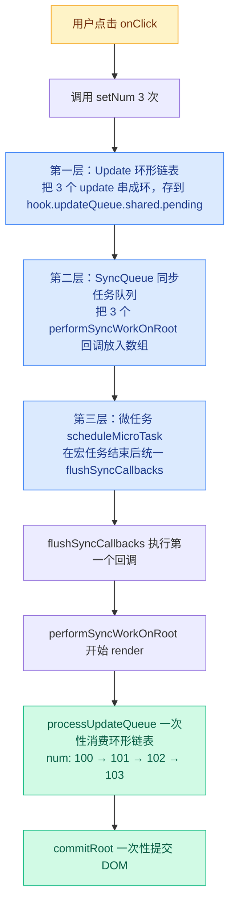
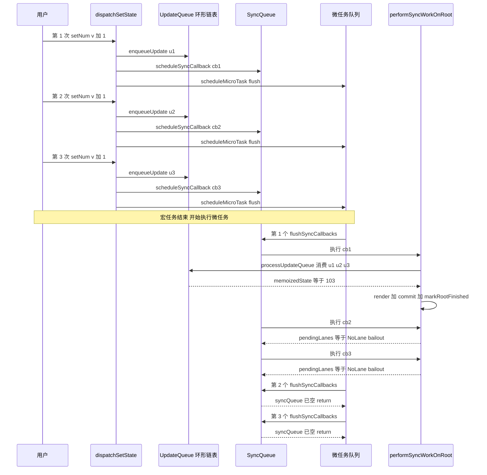

# Big-React 批量更新机制详解

> 本文以 `demos/test-fc/main.tsx` 中的真实例子为线索，一步一步拆解 Big-React 的批量更新（Batch Update）机制。
>
> 涉及的核心源码文件：
> - `packages/react-reconciler/src/fiberHooks.ts` — Hook 与 dispatchSetState
> - `packages/react-reconciler/src/updateQueue.ts` — 更新队列（环形链表）
> - `packages/react-reconciler/src/workLoop.ts` — 调度入口与工作循环
> - `packages/react-reconciler/src/syncTaskQueue.ts` — 同步任务队列
> - `packages/react-reconciler/src/fiberLanes.ts` — Lane 优先级模型

---

## 目录

- [一、从一个真实例子说起](#一从一个真实例子说起)
- [二、核心问题：React 为什么要"批量更新"？](#二核心问题react-为什么要批量更新)
- [三、批量更新的三层机制总览](#三批量更新的三层机制总览)
- [四、第一层：Update 环形链表 —— 多次 setState 如何被"暂存"](#四第一层update-环形链表--多次-setstate-如何被暂存)
- [五、第二层：SyncQueue 同步任务队列 —— 多次调度如何被"合并"](#五第二层syncqueue-同步任务队列--多次调度如何被合并)
- [六、第三层：Lane 优先级 + 微任务 —— 整批更新何时"真正执行"](#六第三层lane-优先级--微任务--整批更新何时真正执行)
- [七、完整时序图：一次点击触发的三次 setState](#七完整时序图一次点击触发的三次-setstate)
- [八、关键设计细节与易错点](#八关键设计细节与易错点)
- [九、总结](#九总结)

---

## 一、从一个真实例子说起

打开 `demos/test-fc/main.tsx`，我们看到这样的代码：

```tsx
function App() {
	const [num, setNum] = useState<number>(100);

	return (
		<ul
			onClick={() => {
				setNum((_v) => _v + 1);
				setNum((_v) => _v + 1);
				setNum((_v) => _v + 1);
			}}
		>
			{/* ... */}
		</ul>
	);
}
```

**问题：** 用户点击一次 `<ul>`，连续调用了 3 次 `setNum`，最终 `num` 是多少？

- 如果每次 `setState` 都立刻触发一次完整的 render + commit，那么会执行 3 次渲染流程，页面会闪烁 3 次。
- 但 Big-React（和真实 React）的做法是：**把这 3 次更新"攒起来"，只执行一次 render，一次性计算出 `num = 103`，只 commit 一次。**

这就是**批量更新（Batch Update）**。

---

## 二、核心问题：React 为什么要"批量更新"？

### 2.1 朴素做法的问题

设想一个最朴素的 `setState` 实现：

```ts
function setState(newValue) {
	state = newValue;
	render(); // 每次 setState 都重新渲染整个组件树
}
```

如果在一个事件回调里连续调用 3 次 `setNum`：
- 第 1 次：`num = 101`，render 一次
- 第 2 次：`num = 102`，render 一次
- 第 3 次：`num = 103`，render 一次

**问题：**
1. **性能浪费**：3 次完整的 render + DOM commit，中间两次完全是无用功
2. **视觉闪烁**：浏览器可能真的把中间状态绘制到屏幕上
3. **语义错误**：用户期望"一次点击 → 一次响应"，而不是"一次点击 → 三次响应"

### 2.2 React 的解决思路

React 的做法可以概括为一句话：

> **把"状态变更"和"重新渲染"解耦。**
> - 状态变更（`setState`）只做一件事：**把 update 记录到一个队列里**，然后**安排一次调度**
> - 真正的 render 由一个统一的调度器来触发，调度器会把"同一时间段内"积攒的所有 update 一次性消费掉

要实现这个思路，需要回答三个问题：
1. 多次 `setState` 的 update 存在哪里？ → **环形链表（Update Queue）**
2. 多次"调度请求"如何合并成一次？ → **同步任务队列（SyncQueue）**
3. 什么时候才真正开始 render？ → **微任务（MicroTask）**

下面逐层拆解。

---

## 三、批量更新的三层机制总览



**三层机制各自解决的问题：**

| 层级 | 机制 | 解决的问题 | 核心数据结构 |
|------|------|-----------|-------------|
| 第一层 | Update 环形链表 | 多次 setState 的"状态变更记录"如何存储 | `shared.pending` 环形单向链表 |
| 第二层 | SyncQueue 任务队列 | 多次 scheduleUpdateOnFiber 的"渲染请求"如何合并 | `syncQueue` 数组 |
| 第三层 | Lane + 微任务 | 渲染何时真正执行，如何保证"只 render 一次" | `pendingLanes` 位掩码 + `Promise.then` |

---

## 四、第一层：Update 环形链表 —— 多次 setState 如何被"暂存"

### 4.1 setState 到底做了什么？

打开 `fiberHooks.ts` 中的 `dispatchSetState`：

```ts
function dispatchSetState<State>(
	fiber: FiberNode,
	updateQueue: UpdateQueue<State>,
	action: Action<State>
) {
	const lane = requestUpdateLane();           // ① 申请一个优先级
	const update = createUpdate(action, lane);  // ② 把 action 包装成 update 对象
	enqueueUpdate(updateQueue, update);          // ③ 把 update 加入环形链表
	scheduleUpdateOnFiber(fiber, lane);          // ④ 触发调度
}
```

**关键点：** `setNum((_v) => _v + 1)` 传入的 `(_v) => _v + 1` 是一个函数，叫做 `action`。
`dispatchSetState` 不会立刻执行这个函数，而是把它**包装成一个 Update 对象**，存到队列里。

```ts
// updateQueue.ts
export const createUpdate = <State>(action, lane): Update<State> => {
	return {
		action,   // 用户传入的 (prev) => next 函数，或直接的新值
		lane,     // 本次更新的优先级
		next: null
	};
};
```

### 4.2 环形链表：为什么不用普通数组？

连续调用 3 次 `setNum`，会产生 3 个 Update 对象。最简单的存储方式是数组：

```ts
queue.updates = [u1, u2, u3];
```

但 Big-React 选择了**环形单向链表**。为什么？我们来看 `enqueueUpdate` 的实现：

```ts
export const enqueueUpdate = <State>(updateQueue, update) => {
	const pending = updateQueue.shared.pending;
	if (pending === null) {
		// 第一个 update：自己指向自己，形成自环
		update.next = update;
	} else {
		// 后续 update：插入到 pending 后面
		update.next = pending.next;
		pending.next = update;
	}
	updateQueue.shared.pending = update;
};
```

#### 三次 setNum 的链表演化过程

我们用 `u1`、`u2`、`u3` 代表三次 `setNum` 产生的 Update。

**第 1 次 `setNum(v => v + 1)`：**

```
shared.pending = null  →  u1.next = u1（自环）

   ┌──────┐
   ↓      │
   u1 ────┘
   ↑
   pending
```

**第 2 次 `setNum(v => v + 1)`：**

```
pending = u1
u2.next = u1.next = u1   →  u2 → u1
u1.next = u2              →  u1 → u2
shared.pending = u2

   ┌──────────┐
   ↓          │
   u1 ───→ u2─┘
            ↑
            pending
```

**第 3 次 `setNum(v => v + 1)`：**

```
pending = u2
u3.next = u2.next = u1   →  u3 → u1
u2.next = u3              →  u2 → u3
shared.pending = u3

   ┌───────────────┐
   ↓               │
   u1 ──→ u2 ──→ u3┘
                 ↑
               pending
```

#### 环形链表的巧妙之处

注意 `shared.pending` 始终指向**最后一个入队**的 update（`u3`），而 `pending.next` 始终指向**第一个入队**的 update（`u1`）。

这样设计的好处是：
- **入队 O(1)**：不需要遍历找到队尾，直接在 `pending` 后面插入
- **找到队头 O(1)**：`pending.next` 就是队头
- **遍历顺序 = 入队顺序**：从 `pending.next` 开始，沿 `next` 走一圈回到起点，正好是 u1 → u2 → u3

### 4.3 消费：processUpdateQueue 如何一次性计算最终状态

当 render 阶段真正执行函数组件时，`updateState` 会调用 `processUpdateQueue`：

```ts
export const processUpdateQueue = <State>(
	baseState: State,               // 旧状态，比如 num = 100
	pendingUpdate: Update<State> | null,
	renderLane: Lane
): { memoizedState: State } => {
	const result = { memoizedState: baseState };
	if (pendingUpdate !== null) {
		const first = pendingUpdate.next;   // 队头 u1
		let pending = pendingUpdate.next;   // 从 u1 开始

		do {
			const action = pending.action;
			if (action instanceof Function) {
				baseState = action(baseState);  // 关键：把上一次的结果传给下一次
			} else {
				baseState = action;
			}
			pending = pending.next;
		} while (pending !== first);  // 回到队头，说明遍历完整环
	}
	result.memoizedState = baseState;
	return result;
};
```

**代入我们的例子，baseState = 100：**

```
初始: baseState = 100

处理 u1: action = v => v + 1
         baseState = (100) => 100 + 1 = 101

处理 u2: action = v => v + 1
         baseState = (101) => 101 + 1 = 102

处理 u3: action = v => v + 1
         baseState = (102) => 102 + 1 = 103

result.memoizedState = 103 ✓
```

**这就是批量更新的核心：** 3 个 update 被"积攒"在环形链表上，render 阶段一次性消费，state 从 100 直接跳到 103，**只 render 一次**。

> 💡 **思考题：** 如果三次 setState 传的是固定值 `setNum(200); setNum(300); setNum(400)`，最终结果是多少？
>
> 答案：400。因为每个 action 不是函数，直接覆盖 baseState，最后一个生效。

---

## 五、第二层：SyncQueue 同步任务队列 —— 多次调度如何被"合并"

第一层解决了"状态如何积攒"，但每次 `setState` 都会调用 `scheduleUpdateOnFiber`，这会不会触发 3 次 render？

### 5.1 scheduleUpdateOnFiber 的工作

```ts
// workLoop.ts
export function scheduleUpdateOnFiber(fiber: FiberNode, lane: Lane) {
	const root = markUpdateFromFiberToRoot(fiber);  // 向上找到 FiberRootNode
	markRootUpdated(root, lane);                     // 在 root.pendingLanes 上标记
	ensureRootIsScheduled(root);                     // 安排调度
}
```

三次 `setNum` 会调用三次 `scheduleUpdateOnFiber`，每次都会执行：

1. `markRootUpdated(root, SyncLane)` —— 在 `root.pendingLanes` 上把 SyncLane 那一位置 1
2. `ensureRootIsScheduled(root)` —— 取出最高优先级 lane，安排一次调度

### 5.2 ensureRootIsScheduled：每次都往 syncQueue 里塞一个回调

```ts
export function ensureRootIsScheduled(root: FiberRootNode) {
	const updateLane = getHighestPriorityLane(root.pendingLanes);
	if (updateLane === NoLane) return;

	if (updateLane === SyncLane) {
		// 把 render 入口函数包装成回调，加入同步任务队列
		scheduleSyncCallback(performSyncWorkOnRoot.bind(null, root, updateLane));
		// 安排一个微任务，在宏任务结束后统一执行所有回调
		scheduleMicroTask(flushSyncCallbacks);
	}
}
```

三次 `setNum` 之后，`syncQueue` 的状态：

```ts
syncQueue = [
	performSyncWorkOnRoot.bind(null, root, SyncLane),  // 第 1 次 setNum 安排
	performSyncWorkOnRoot.bind(null, root, SyncLane),  // 第 2 次 setNum 安排
	performSyncWorkOnRoot.bind(null, root, SyncLane)   // 第 3 次 setNum 安排
];
```

> ⚠️ **注意：** 这里队列里有 **3 个相同的回调**！如果直接全部执行，岂不是要 render 3 次？

### 5.3 flushSyncCallbacks：只执行第一个有效回调

关键在于 `flushSyncCallbacks` 的执行时机和 `performSyncWorkOnRoot` 内部的 **bailout 逻辑**。

```ts
// syncTaskQueue.ts
export function flushSyncCallbacks() {
	if (!isFlushingSyncQueue && syncQueue) {
		isFlushingSyncQueue = true;
		try {
			syncQueue.forEach((callback) => callback());  // 依次执行
		} finally {
			isFlushingSyncQueue = false;
			syncQueue = null;  // 清空队列
		}
	}
}
```

```ts
// workLoop.ts
function performSyncWorkOnRoot(root: FiberRootNode, lane: Lane) {
	const nextLane = getHighestPriorityLane(root.pendingLanes);
	if (nextLane !== SyncLane) {
		// ★ Bailout：如果 pendingLanes 已经被前面的回调清空了，直接返回，不 render
		ensureRootIsScheduled(root);
		return;
	}
	// ... 真正的 render + commit
	commitRoot(root);  // commitRoot 内部会调用 markRootFinished 清掉 SyncLane
}
```

**执行流程：**

```
flushSyncCallbacks 开始
  ↓
执行回调 1：performSyncWorkOnRoot(root, SyncLane)
  ├─ nextLane = getHighestPriorityLane(0b00001) = SyncLane ✓
  ├─ render + commit
  └─ commitRoot → markRootFinished(root, SyncLane)
                  → root.pendingLanes = 0b00001 & ~0b00001 = 0b00000
  ↓
执行回调 2：performSyncWorkOnRoot(root, SyncLane)
  ├─ nextLane = getHighestPriorityLane(0b00000) = NoLane ✗
  ├─ nextLane !== SyncLane → bailout，直接 return ✓（不 render）
  ↓
执行回调 3：同上，直接 bailout ✓（不 render）
  ↓
清空 syncQueue
```

**结论：** 虽然 `syncQueue` 里有 3 个回调，但**只有第 1 个真正执行了 render**，后面 2 个通过 `pendingLanes === NoLane` 的检查被快速 bailout。

这就是第二层批量合并的巧妙之处：**不是阻止回调入队，而是让多余回调在执行时自我淘汰**。

---

## 六、第三层：Lane 优先级 + 微任务 —— 整批更新何时"真正执行"

### 6.1 为什么要用微任务？

如果 `setState` 同步触发 render，那么每次 `setNum` 都会立刻 render，批量更新就失效了。

Big-React 的做法是：**把 render 推迟到当前宏任务结束后的微任务阶段**。

```ts
// 在 react-dom 的 hostConfig.ts 中
export const scheduleMicroTask =
	typeof queueMicrotask === 'function'
		? queueMicrotask
		: typeof Promise === 'function'
			? (callback) => Promise.resolve(null).then(callback)
			: setTimeout;
```

**事件循环视角的时间线：**

```
宏任务（点击事件 onClick）开始
  ├─ setNum(v => v+1)  →  update 入队 + scheduleSyncCallback + scheduleMicroTask
  ├─ setNum(v => v+1)  →  update 入队 + scheduleSyncCallback + scheduleMicroTask
  └─ setNum(v => v+1)  →  update 入队 + scheduleSyncCallback + scheduleMicroTask
宏任务结束
  ↓
微任务队列（按入队顺序执行）
  ├─ flushSyncCallbacks  ← 第 1 个微任务
  │     └─ 执行 syncQueue 中所有回调（只有第 1 个真正 render）
  ├─ flushSyncCallbacks  ← 第 2 个微任务（syncQueue 已空，直接 return）
  └─ flushSyncCallbacks  ← 第 3 个微任务（同上）
```

**关键点：** 3 次 `setNum` 在同一个宏任务（点击事件回调）中同步执行完毕，**此时还没有任何 render 发生**。直到宏任务结束，微任务 `flushSyncCallbacks` 才统一触发 render。

### 6.2 Lane 优先级的位掩码设计

```ts
// fiberLanes.ts
export const SyncLane = 0b00001;
export const NoLane = 0b00000;

export function mergeLanes(laneA: Lane, laneB: Lane): Lanes {
	return laneA | laneB;
}

export function getHighestPriorityLane(lanes: Lanes): Lane {
	return lanes & -lanes;  // 取最低位的 1（即最高优先级）
}

export function markRootFinished(root: FiberRootNode, lane: Lane) {
	root.pendingLanes &= ~lane;  // 把指定 lane 那一位置 0
}
```

**位运算演示（3 次 setNum 都是 SyncLane）：**

```
初始: root.pendingLanes = 0b00000

第 1 次 markRootUpdated: pendingLanes = 0b00000 | 0b00001 = 0b00001
第 2 次 markRootUpdated: pendingLanes = 0b00001 | 0b00001 = 0b00001（不变）
第 3 次 markRootUpdated: pendingLanes = 0b00001 | 0b00001 = 0b00001（不变）

commit 完成后 markRootFinished:
  pendingLanes = 0b00001 & ~0b00001
               = 0b00001 &  0b11110
               = 0b00000  ✓ 清零
```

**设计精髓：** 用**一个整数的二进制位**来表示"哪些优先级的更新还没处理"，多次 markRootUpdated 只是重复置位，commit 一次就清零。这就是为什么后续回调能通过 `nextLane === NoLane` 检查快速 bailout。

---

## 七、完整时序图：一次点击触发的三次 setState

把三层机制串起来，完整的时序如下：



---

## 八、关键设计细节与易错点

### 8.1 为什么 action 是函数才能"累加"？

```ts
// 函数形式：基于上一次计算结果累加
setNum(v => v + 1);  // action(100) = 101
setNum(v => v + 1);  // action(101) = 102
setNum(v => v + 1);  // action(102) = 103 ✓ 最终 103

// 值形式：直接覆盖
setNum(200);  // baseState = 200
setNum(300);  // baseState = 300
setNum(400);  // baseState = 400 ✓ 最终 400
```

源码中的体现（`processUpdateQueue`）：

```ts
if (action instanceof Function) {
	baseState = action(baseState);  // 函数：基于旧值计算新值
} else {
	baseState = action;             // 值：直接覆盖
}
```

### 8.2 项目真实踩过的坑：markRootFinished 清错字段

`fiberLanes.ts` 的注释里记录了一个真实 bug：

> ⚠️ **常见笔误（本项目曾真实踩过的坑）：**
> 写成 `root.finishedLane &= ~lane` —— 清错了字段！
> - `finishedLane` 只是"本次提交的 lane"的记录字段，不影响调度判断
> - 真正决定"还有没有更新要处理"的是 `pendingLanes`

**故障现象推演（demo：一次点击里连续 3 次 setNum(v => v + 1)，初始 num = 100）：**

```
① 点击触发 3 次 dispatchSetState：
     - 3 个 update 进入同一个 hook 的环形链表
     - markRootUpdated × 3 → pendingLanes = 0b00001
     - scheduleSyncCallback × 3 → syncQueue = [cb1, cb2, cb3]

② 微任务 flushSyncCallbacks 依次执行 3 个回调：
     cb1：nextLane === SyncLane → render（num 100 → 103）→ commit
           → markRootFinished 清的是 finishedLane，pendingLanes 仍是 0b00001 ❌
     cb2：读取 pendingLanes → nextLane 仍是 SyncLane → 无法 bailout
           → 又 render 一次（num 103 → 106）→ 又 commit 一次 ❌
     cb3：同理，第三次 render（num 106 → 109）→ 第三次 commit ❌

③ 最终表现：只点了一次，却 render 3 次、commit 3 次、num 从 100 跳到 109
```

**结论：** `markRootFinished` 必须与 `markRootUpdated` 操作同一个字段 `pendingLanes`，一个置位、一个清零，构成完整的"更新记账"闭环。

### 8.3 为什么不能在 render 阶段触发新的 setState？

`updateWorkInProgressHook` 中有一行注释：

```ts
// TODO:render阶段触发的更新还没处理
```

如果在 render 函数体内直接调用 `setNum`（而不是在事件回调中），会导致：
1. `dispatchSetState` 被调用，新的 update 入队
2. `scheduleUpdateOnFiber` 又被触发，调度新的 render
3. 新的 render 又会执行函数组件，又调用 `setNum`... → **无限循环**

真实 React 的做法是检测到 render 阶段的更新时，**在同一个 render 中立刻重新执行该组件**（而不是开启新的 render），并有最大次数限制（25 次）防止无限循环。Big-React 目前还没有实现这个机制。

### 8.4 批量更新的边界：setTimeout / Promise 中的 setState

在真实 React 17 及之前，**只有 React 事件回调中的 setState 才会被批量处理**，`setTimeout` 中的 `setState` 是同步执行的。

```ts
// React 17 行为
onClick={() => {
	setNum(v => v + 1);
	setNum(v => v + 1);  // 批量：num 只加 1 次
}};

setTimeout(() => {
	setNum(v => v + 1);
	setNum(v => v + 1);  // 不批量：num 加 2 次（每次都同步 render）
}, 0);
```

React 18 引入了 `createRoot`，**所有更新默认都是批量的**（包括 setTimeout、Promise、原生事件）。Big-React 的实现就是 React 18 的行为：因为它通过 `scheduleMicroTask` 统一在微任务阶段 flush，所以无论 setState 在哪里被调用，只要在同一个宏任务内，都会被批量处理。

---

## 九、总结

Big-React 的批量更新机制，用一句话概括：

> **把"状态变更"记录到环形链表，把"渲染请求"压入同步任务队列，用微任务统一调度，用 Lane 位掩码去重，最终实现"N 次 setState → 1 次 render + 1 次 commit"。**

### 三层机制对照表

| 层级 | 数据结构 | 作用 | 关键函数 |
|------|---------|------|---------|
| **存储层** | Update 环形链表 | 积攒多次 setState 的 action | `createUpdate` / `enqueueUpdate` / `processUpdateQueue` |
| **调度层** | SyncQueue 数组 | 积攒多次调度请求 | `scheduleSyncCallback` / `flushSyncCallbacks` |
| **去重层** | pendingLanes 位掩码 | 让多余的调度回调自我淘汰 | `markRootUpdated` / `markRootFinished` / `getHighestPriorityLane` |
| **时机层** | 微任务 | 把 render 推迟到宏任务结束后 | `scheduleMicroTask` |

### 设计哲学

1. **空间换时间**：用两个队列（UpdateQueue + SyncQueue）把"频繁的小操作"积攒成"一次大操作"
2. **延迟执行**：不立刻 render，而是安排一个微任务，给后续的 setState 留出"搭便车"的时间窗口
3. **位掩码记账**：用一个整数的二进制位记录"哪些优先级的更新待处理"，commit 后清零，多余回调自然失效
4. **单向闭环**：`markRootUpdated`（置位）→ `render + commit` → `markRootFinished`（清零），形成完整的更新闭环

理解了这套机制，再看 React 18 的 `unstable_batchedUpdates`、Automatic Batching、并发渲染的 Lane 模型，就会有"万变不离其宗"的感觉。

---

## 参考资料

- 源码：`packages/react-reconciler/src/updateQueue.ts`
- 源码：`packages/react-reconciler/src/syncTaskQueue.ts`
- 源码：`packages/react-reconciler/src/workLoop.ts`
- 源码：`packages/react-reconciler/src/fiberLanes.ts`
- Demo：`demos/test-fc/main.tsx`
- [React 18 Automatic Batching RFC](https://github.com/reactwg/react-18/discussions/21)
- [卡颂《自顶向下学 React 源码》](https://ke.segmentfault.com/course/1650000023864436)
