# React 完整流程：从 JSX 到 DOM（以 demos/test-fc/main.tsx 为例）

> 基于 `demos/test-fc/main.tsx` 的完整走读，覆盖 mount + update 全流程。

## 源码上下文

```tsx
// demos/test-fc/main.tsx
import React, { useState } from 'react';
import ReactDOM from 'react-dom';

function App() {
    const [num, setNum] = useState<number>(100);
    window.setNum = setNum;
    const [num2, update2] = useState<number>(150);
    return num === 3 ? <Child /> : <div>{num}</div>;
}

function Child() {
    return <li>big - 2121react</li>;
}

const root = ReactDOM.createRoot(document.querySelector('#root'));
root.render(<App />);
```

---

## 全景流程图

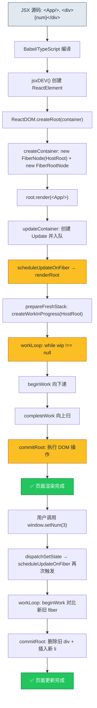

---

# Phase 0：JSX 编译 → ReactElement

## 编译器做了什么

Babel/TypeScript 遇到 JSX 时，自动将 JSX 转译为 `jsxDEV()` 调用：

| JSX 源码 | 编译结果 |
|---------|---------|
| `<App />` | `jsxDEV(App, {}, undefined)` |
| `<div>{num}</div>` | `jsxDEV("div", { children: num }, undefined)` |
| `<li>big - 2121react</li>` | `jsxDEV("li", { children: "big - 2121react" }, undefined)` |

## jsxDEV 源码 ([jsx.ts](file:///d:/BaiduNetdiskDownload/B站卡颂从0实现React18/big-react/packages/react/src/jsx.ts#L73-L103))

```typescript
// packages/react/src/jsx.ts
export const jsxDEV = (type: ElementType, config: any, maybeKey: any) => {
    let key: Key = null;
    const props: Props = {};
    let ref: Ref = null;

    // 分离 key, ref, 其余进 props
    for (const prop in config) {
        if (prop === 'key')    { key = '' + val; continue; }
        if (prop === 'ref')    { ref = val; continue; }
        if ({}.hasOwnProperty.call(config, prop)) {
            props[prop] = val;
        }
    }
    return ReactElement(type, key, ref, props);
};
```

## ReactElement 函数 ([jsx.ts](file:///d:/BaiduNetdiskDownload/B站卡颂从0实现React18/big-react/packages/react/src/jsx.ts#L12-L27))

```typescript
const ReactElement = function (type, key, ref, props): ReactElementType {
    return {
        $$typeof: REACT_ELEMENT_TYPE, // Symbol.for('react.element')
        type,    // "div" | App函数 | "li"
        key,
        ref,
        props,   // { children: ... }
        __mark: 'stl'  // 标记字段
    };
};
```

## 编译结果可视化

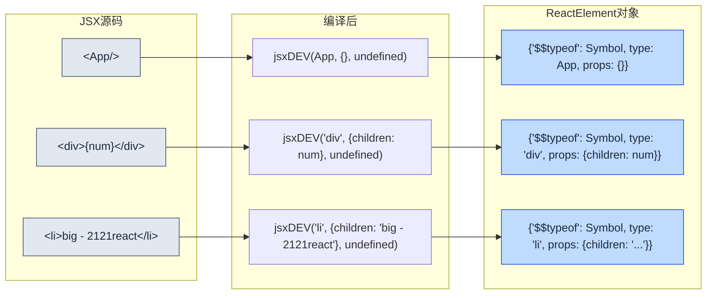

**关键点**：ReactElement 只是一个**轻量级的 JS 对象**，没有任何 DOM 关联。它是 fiber 的"原材料"。

---

# Phase 1：createRoot → 创建 FiberRoot + HostRoot Fiber

## createRoot 调用链

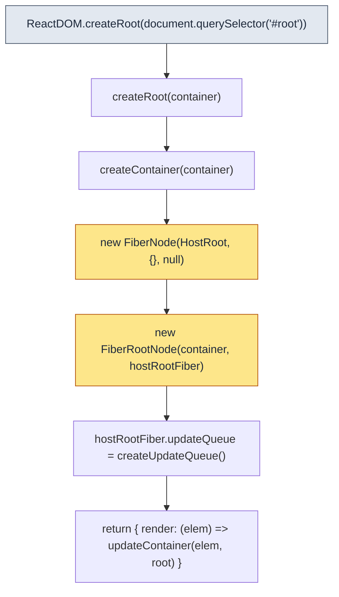

## createContainer 源码 ([fiberReconciler.ts](file:///d:/BaiduNetdiskDownload/B站卡颂从0实现React18/big-react/packages/react-reconciler/src/fiberReconciler.ts#L13-L22))

```typescript
export function createContainer(container: Container) {
    const hostRootFiber = new FiberNode(HostRoot, {}, null);
    const root = new FiberRootNode(container, hostRootFiber);
    hostRootFiber.updateQueue = createUpdateQueue();
    return root;
}
```

## FiberRootNode 源码 ([fiber.ts](file:///d:/BaiduNetdiskDownload/B站卡颂从0实现React18/big-react/packages/react-reconciler/src/fiber.ts#L86-L98))

```typescript
export class FiberRootNode {
    container: Container;      // 指向真实的 #root DOM 节点
    current: FiberNode;        // 指向 HostRoot fiber（当前已渲染的树）
    finishedWork: FiberNode | null;  // 指向构建完成的新树
    constructor(container, hostRootFiber) {
        this.container = container;
        this.current = hostRootFiber;     // ← 关键！互为引用
        hostRootFiber.stateNode = this;   // ← 关键！互为引用
        this.finishedWork = null;
    }
}
```

## 此时内存结构

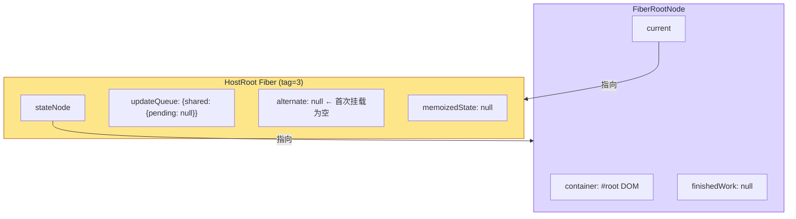

**此时没有 ReactElement 也没有子 fiber，只有骨架。**

---

# Phase 2：root.render(\<App/\>) → updateContainer → scheduleUpdateOnFiber

## render 调用链

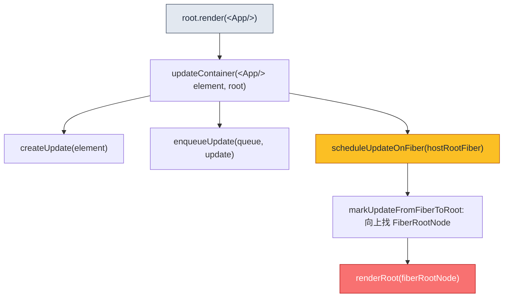

## updateContainer 源码 ([fiberReconciler.ts](file:///d:/BaiduNetdiskDownload/B站卡颂从0实现React18/big-react/packages/react-reconciler/src/fiberReconciler.ts#L32-L46))

```typescript
export function updateContainer(element: ReactElementType, root: FiberRootNode) {
    const hostRootFiber = root.current;
    const update = createUpdate<ReactElementType | null>(element);
    enqueueUpdate(
        hostRootFiber.updateQueue as UpdateQueue<ReactElementType | null>,
        update
    );
    scheduleUpdateOnFiber(hostRootFiber);
    return element;
}
```

**`element` 就是 `<App/>` 对应的 ReactElement `{$$typeof: Symbol, type: App, props: {}}`**

## scheduleUpdateOnFiber 源码 ([workLoop.ts](file:///d:/BaiduNetdiskDownload/B站卡颂从0实现React18/big-react/packages/react-reconciler/src/workLoop.ts#L36-L60))

```typescript
export function scheduleUpdateOnFiber(fiber: FiberNode) {
    const root = markUpdateFromFiberToRoot(fiber);
    renderRoot(root as FiberRootNode);
}

function renderRoot(root: FiberRootNode) {
    prepareFreshStack(root);  // ← 创建 HostRoot 的 workInProgress
    do {
        try { workLoop(); break; }
        catch (error) {
            if (__DEV__) console.warn('workLoop发生错误', error);
            workInProgress = null;
        }
    } while (true);

    const finishedWork = root.current.alternate;  // ← 拿到构建完成的新树
    root.finishedWork = finishedWork;
    commitRoot(root);  // ← 执行 DOM 操作
}
```

---

# Phase 3：render 阶段 —— beginWork（递）

## prepareFreshStack 创建 workInProgress

[prepareFreshStack](file:///d:/BaiduNetdiskDownload/B站卡颂从0实现React18/big-react/packages/react-reconciler/src/workLoop.ts#L26-L30) 是工作循环的起点：

```typescript
function prepareFreshStack(fiber: FiberRootNode) {
    workInProgress = createWorkInProgress(fiber.current, fiber.current.pendingProps);
}
```

## createWorkInProgress 首次执行时 ([fiber.ts](file:///d:/BaiduNetdiskDownload/B站卡颂从0实现React18/big-react/packages/react-reconciler/src/fiber.ts#L100-L127))

```typescript
export const createWorkInProgress = (current: FiberNode, pendingProps: Props) => {
    let wip = current.alternate;
    if (wip === null) {
        // 首次：alternate 为空 → 新建一个 FiberNode 作为 wip
        wip = new FiberNode(current.tag, pendingProps, current.key);
        wip.stateNode = current.stateNode;
        wip.alternate = current;      // wip.alternate → 旧的 HostRoot
        current.alternate = wip;      // 旧的 HostRoot.alternate → wip
    } else {
        // 非首次：复用已有 wip，但重置副作用标记
        wip.pendingProps = pendingProps;
        wip.flags = NoFlags;
        wip.subtreeFlags = NoFlags;
        wip.deletions = null;
    }
    wip.type = current.type;
    wip.updateQueue = current.updateQueue;
    wip.child = current.child;
    wip.memoizedProps = current.memoizedProps;
    wip.memoizedState = current.memoizedState;
    return wip;
};
```

**首次 mount 的关键效果**：`wip.alternate` 指向 `current`（旧的 HostRoot）→ **不为 null！** 这就是 HostRoot 在 `reconcilerChildren` 中走 update 分支的原因。

## 此时 Fiber 双缓冲结构

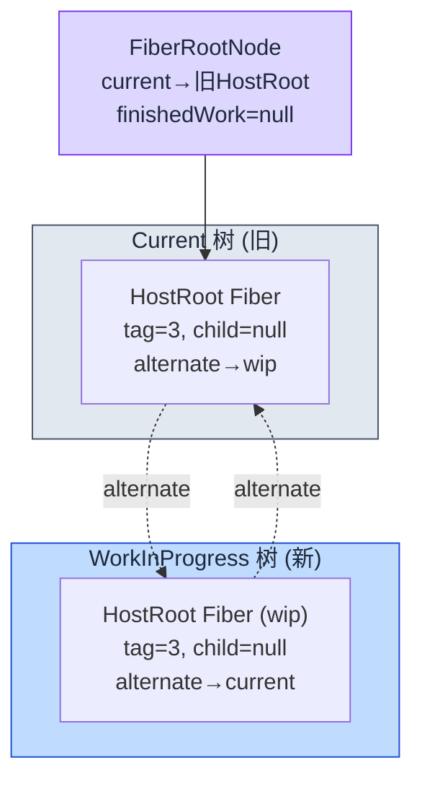

## beginWork 完整序列：5 个 fiber 节点依次处理

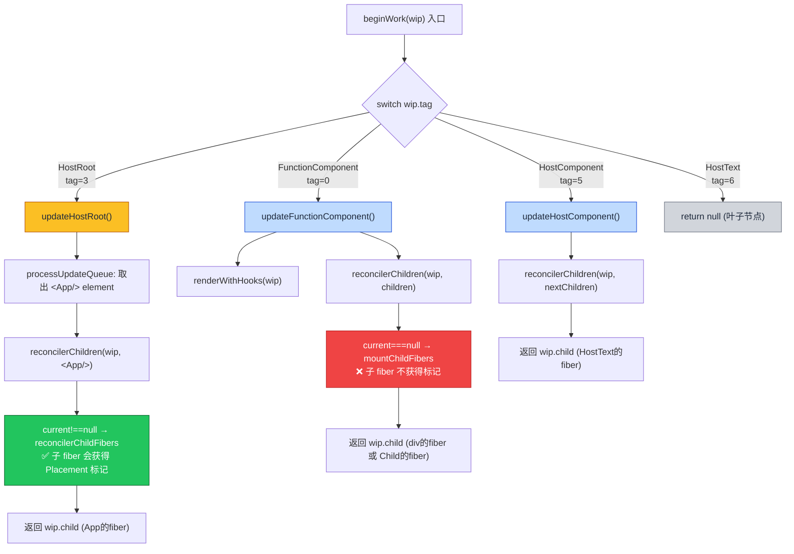

### 节点 1：HostRoot 的 beginWork

`updateHostRoot` [源码](file:///d:/BaiduNetdiskDownload/B站卡颂从0实现React18/big-react/packages/react-reconciler/src/beginWork.ts#L76-L94)：

```typescript
function updateHostRoot(wip: FiberNode) {
    const baseState = wip.memoizedState;           // null（首次）
    const updateQueue = wip.updateQueue;
    const pending = updateQueue.shared.pending;   // { action: <App/> element }
    updateQueue.shared.pending = null;

    const { memoizedState } = processUpdateQueue(baseState, pending);
    wip.memoizedState = memoizedState;             // ← 现在 = <App/> element

    const nextChildren = wip.memoizedState;
    reconcilerChildren(wip, nextChildren);         // ← 关键！协调子节点
    return wip.child;
}
```

`processUpdateQueue` 逻辑很简单：pending.action 是 `<App/> element`，不是函数，所以直接 `memoizedState = action`。

然后 `reconcilerChildren(wip, <App/> element)` 中：
- `current = wip.alternate` → **不为 null**（因為 `createWorkInProgress` 建立了双向链接）
- 走 `reconcilerChildFibers(wip, current.child, <App/> element)`
- `current.child` 是 `null`（第一次挂载，还没有子节点）
- 调用 `reconcileSingleElement(wip, null, <App/> element)` → `createFiberFromElement` 创建 App 的 fiber

**结果**：创建了 `FunctionComponent(tag=0, type=App)` 的 fiber，并且因為 `reconcilerChildFibers` 的 `shouldTrackEffects=true`，App 的 fiber 会通过 `placeSingleChild` 获得 `Placement` 标记！

### 节点 2：App (FunctionComponent) 的 beginWork — **mount useState**

`updateFunctionComponent` [源码](file:///d:/BaiduNetdiskDownload/B站卡颂从0实现React18/big-react/packages/react-reconciler/src/beginWork.ts#L40-L44)：

```typescript
function updateFunctionComponent(wip: FiberNode) {
    const nextChildren = renderWithHooks(wip);
    reconcilerChildren(wip, nextChildren);
    return wip.child;
}
```

`renderWithHooks` [源码](file:///d:/BaiduNetdiskDownload/B站卡颂从0实现React18/big-react/packages/react-reconciler/src/fiberHooks.ts#L36-L61)：

```typescript
export function renderWithHooks(wip: FiberNode) {
    currentlyRenderingFiber = wip;     // 设置当前环境
    wip.memoizedState = null;          // 重置 hook 链表

    const current = wip.alternate;
    if (current !== null) {
        currentDispatcher.current = HookDispatcherOnUpdate;  // 更新
    } else {
        currentDispatcher.current = HookDispatcherOnMount;   // ← mount
    }

    const Component = wip.type;        // App 函数
    const props = wip.pendingProps;
    const children = Component(props); // ← 执行 App()

    currentlyRenderingFiber = null;    // 清理
    return children;
}
```

**mount 时 `current === null`，设置 `HookDispatcherOnMount`**。执行 `App()`：

```typescript
function App() {
    const [num, setNum] = useState<number>(100);    // → mountState(100)
    window.setNum = setNum;
    const [num2, update2] = useState<number>(150);  // → mountState(150)
    return num === 3 ? <Child /> : <div>{num}</div>; // num=100，返回 <div>100</div>
}
```

**mountState 做了什么**：

```typescript
function mountState(initialState) {
    const hook = mountWorkInProgressHook();  // 创建 Hook 节点，加入链表
    hook.memoizedState = initialState;       // 100
    hook.updateQueue = createUpdateQueue();  // 创建更新队列
    const dispatch = dispatchSetState.bind(null, currentlyRenderingFiber, queue);
    queue.dispatch = dispatch;
    return [memoizedState, dispatch];
}
```

**mount 后的 Hook 链表**：

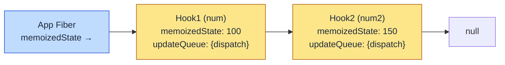

`App()` 返回 `<div>{num}</div>` → `jsxDEV("div", {children: 100}, undefined)` → ReactElement `{type: "div", props: {children: 100}}`

然后在 `reconcilerChildren(wip, ReactElement)` 中：
- `current = wip.alternate` → **为 null**（App 的 fiber 是刚创建的，没有 alternate）
- 走 `mountChildFibers(wip, null, ReactElement)` → `shouldTrackEffects=false`
- **子 fiber 不会获得 Placement 标记** ✅（性能优化：离屏构建，只给根打标记）

### 节点 3：div (HostComponent) 的 beginWork

```typescript
function updateHostComponent(wip: FiberNode) {
    const nextChildren = wip.pendingProps.children;  // 100
    reconcilerChildren(wip, nextChildren);
    return wip.child;
}
```

`reconcilerChildren(wip, 100)` 中：
- `current === null`
- `typeof 100 === 'number'` → `reconcileSingleTextNode(wip, null, 100)` → 创建 `HostText(tag=6, props: {content: 100})` fiber

**此时 fiber 树结构**：

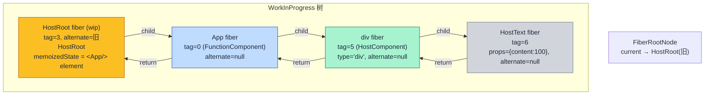

### 节点 4：HostText 的 beginWork

```typescript
case HostText:
    return null;  // 文本节点无子节点
```

返回 `null`，意味着 beginWork 阶段结束，`performUnitOfWork` 会转而调用 `completeUnitOfWork`。

---

# Phase 4：render 阶段 —— completeWork（归）

## completeUnitOfWork 遍历顺序

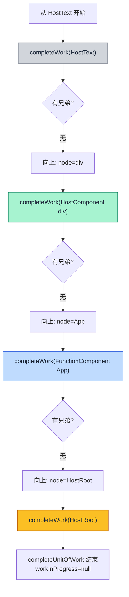

## completeWork 对每种节点的处理

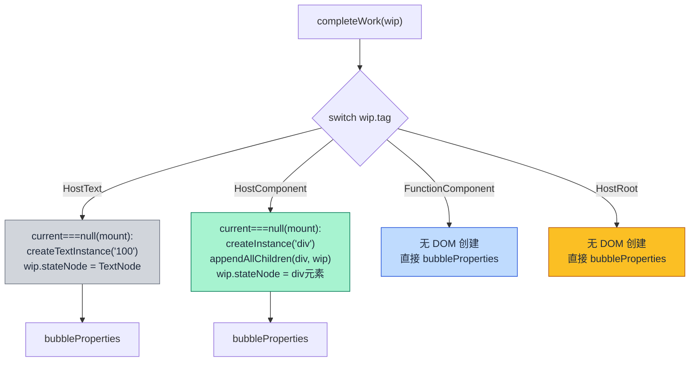

### 关键函数：appendAllChildren

```typescript
export function appendAllChildren(parent: Container, wip: FiberNode) {
    let node = wip.child;
    while (node !== null) {
        if (node.tag === HostComponent || node.tag === HostText) {
            appendInitialChild(parent, node.stateNode);  // parent.appendChild(dom)
        } else if (node.child !== null) {
            node = node.child; continue;  // 跳过非 DOM 节点，向下钻
        }
        // ... 找兄弟 / 向上找
    }
}
```

它从 `div` 的 child 开始遍历，找到 `HostText` 的 `stateNode`（真实的 TextNode），然后 `div.appendChild(textNode)`。

### bubbleProperties：副作用标记冒泡

```typescript
function bubbleProperties(wip: FiberNode) {
    let subtreeFlags = NoFlags;
    let child = wip.child;
    while (child !== null) {
        subtreeFlags |= child.subtreeFlags;
        subtreeFlags |= child.flags;
        child = child.sibling;
    }
    wip.subtreeFlags |= subtreeFlags;
}
```

**completeWork 完成后 fiber 树的状态**：

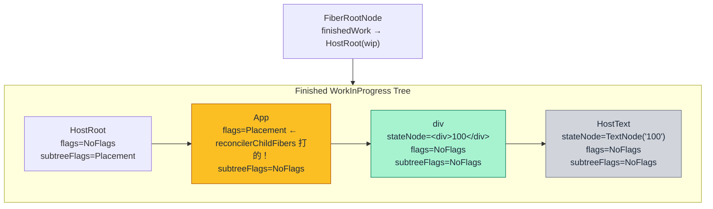

**关键观察**：只有 `App` fiber 有 `Placement` 标记（因为它是 HostRoot 用 `reconcilerChildFibers` 创建的）。`subtreeFlags` 从 App → HostRoot 冒泡上去。

---

# Phase 5：commit 阶段 —— DOM 操作执行

## commitRoot 源码 ([workLoop.ts](file:///d:/BaiduNetdiskDownload/B站卡颂从0实现React18/big-react/packages/react-reconciler/src/workLoop.ts#L84-L110))

```typescript
function commitRoot(root: FiberRootNode) {
    const finishedWork = root.finishedWork;
    const subtreeHasEffect = (finishedWork.subtreeFlags & MutationMask) !== NoFlags;
    const rootHasEffect = finishedWork.flags & MutationMask;

    if (subtreeHasEffect || rootHasEffect) {
        commitMutationEffect(finishedWork);  // ← 执行 DOM 操作
    }
    root.current = finishedWork;  // ← 双缓冲切换！
}
```

## commitMutationEffect 遍历执行

```typescript
const commitMutationEffectOnFiber = (finishedWork: FiberNode) => {
    const flags = finishedWork.flags;
    if ((flags & Placement) !== NoFlags) {
        commitPlacement(finishedWork);  // ← App fiber 的 Placement 标记在这里被处理！
    }
    // ... Update, ChildDeletion ...
};
```

## commitPlacement 步骤

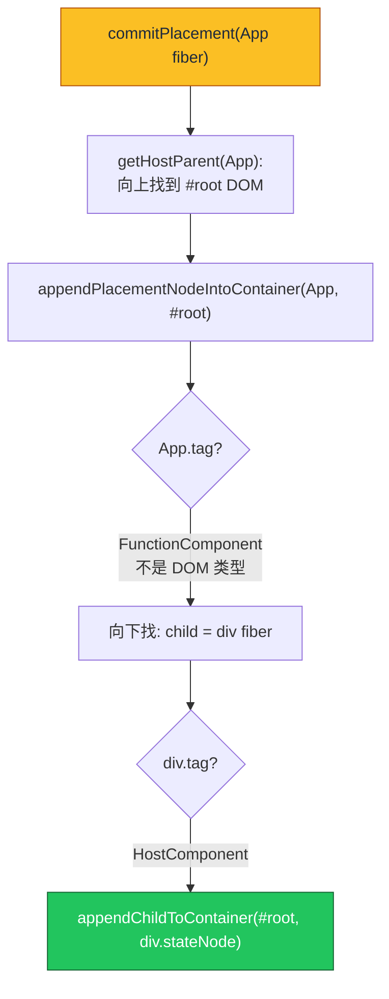

**最终效果**：`#root.appendChild(<div>100</div>)`，整个 DOM 树一次性挂载。

### 为什么不必为 div 和 HostText 单独打 Placement？

因为 `appendPlacementNodeIntoContainer` 在遇到 `HostComponent` 时，直接把它的 `stateNode` 插入了。`stateNode` 在 completeWork 阶段已经通过 `appendAllChildren` 把子 DOM 都挂好了：

```
<div>              ← stateNode, 包含子节点
  "100"            ← 已经在 completeWork 阶段 appendChild 到 div 上了
```

所以只需要给 App 这个根打 `Placement` 标记，整个子树就一次性挂载了。

---

# Phase 6：更新流程 —— setNum(3) 触发 re-render

用户调用 `window.setNum(3)`，实际执行的是：

```typescript
function dispatchSetState(fiber, updateQueue, action) {
    const update = createUpdate(action);   // action = 3，不是函数
    enqueueUpdate(updateQueue, update);    // queue.shared.pending = update
    scheduleUpdateOnFiber(fiber);          // ← 再次触发渲染！
}
```

## 更新流程全景

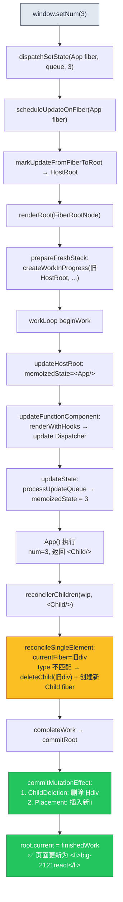

## 关键差异对比

| 阶段 | mount 时 (首次) | update 时 (setNum(3)) |
|------|----------------|----------------------|
| HostRoot.reconcilerChildren | update 分支 (有 alternate) | update 分支 (有 alternate) |
| App.renderWithHooks | mount 分支 (无 alternate) | **update 分支** (有 alternate) |
| App.useState | mountState(100) → new Hook | **updateState** → 从 current hook 读，有 pending → processUpdateQueue → 3 |
| App 返回值 | `<div>100</div>` | **`<Child/>`** |
| 子节点协调 | 创建新的 div fiber | 旧 div 的 type 与新 Child type 不匹配 → **deleteChild(旧div)** + 创建新 Child fiber |
| commit 操作 | Placement: 插入 div | **ChildDeletion: 删除旧 div** + Placement: 插入 li |

## updateState 源码 ([fiberHooks.ts](file:///d:/BaiduNetdiskDownload/B站卡颂从0实现React18/big-react/packages/react-reconciler/src/fiberHooks.ts#L70-L83))

```typescript
function updateState() {
    const hook = updateWorkInProgressHook();   // 从 current fiber 的 hook 链表找对应位置
    const queue = hook.updateQueue;
    const pending = queue.shared.pending;
    if (pending !== null) {
        const { memoizedState } = processUpdateQueue(hook.memoizedState, pending);
        hook.memoizedState = memoizedState;     // 100 → 3
    }
    return [hook.memoizedState, queue.dispatch];
}
```

## 子节点协调差异：reconcileSingleElement

mount 时：`currentFiber = null` → 直接创建新 fiber → `placeSingleChild` **不**打 Placement（因为 mountChildFibers 的 `shouldTrackEffects=false`）

update 时：`currentFiber = 旧的 div fiber` → 比较：
- key 相同 ✓
- type 不同：`"div" !== Child 函数`
- → `deleteChild(returnFiber, currentFiber)` 把旧 div fiber 放入 [deletions 数组](file:///d:/BaiduNetdiskDownload/B站卡颂从0实现React18/big-react/packages/react-reconciler/src/childFibers.ts#L18-L30) + 标记 `ChildDeletion`
- → 然后 `createFiberFromElement` 创建新的 Child fiber
- → `placeSingleChild` **打 Placement**（因为 reconcilerChildFibers 的 `shouldTrackEffects=true`）

---

# 完整流程时序总结

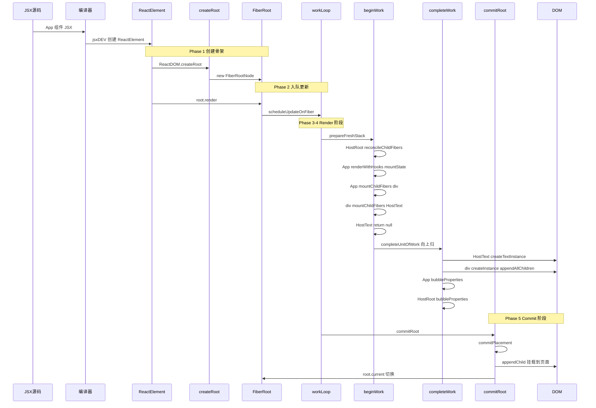

---

# 一句话总结

1. **JSX** → 编译器转 `jsxDEV()` → 轻量 **ReactElement** 对象
2. **createRoot** → 创建 HostRoot fiber + FiberRootNode 骨架（双缓冲入口）
3. **render** → ReactElement 入队更新队列 → `scheduleUpdateOnFiber` 触发工作循环
4. **beginWork**（递）：HostRoot(update分支) → App(mount分支, useState创建 Hook 链表) → div → HostText
5. **completeWork**（归）：HostText(创建文本节点) → div(创建 DOM + 组装子树) → App + HostRoot(副作用冒泡)
6. **commitRoot**：深度遍历 → 遇到 Placement → `appendChildToContainer` 一次性挂载整个 DOM 树 → 双缓冲切换
7. **更新**：`setNum(3)` → `dispatchSetState` → `scheduleUpdateOnFiber` → 重新走完整循环 → beginWork 中对比新旧 fiber(Diff) → commit 执行 ChildDeletion + Placement
