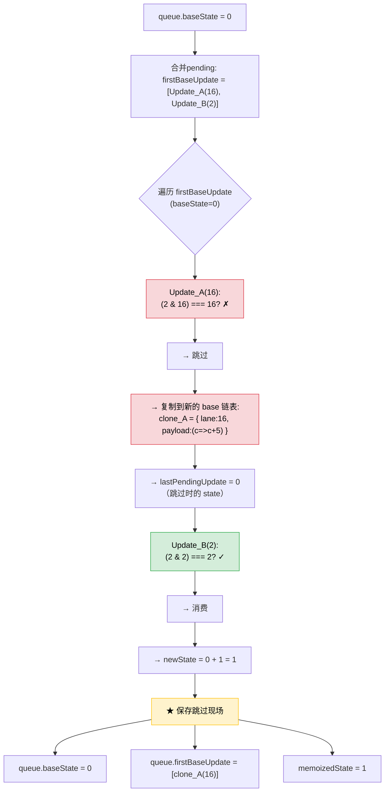
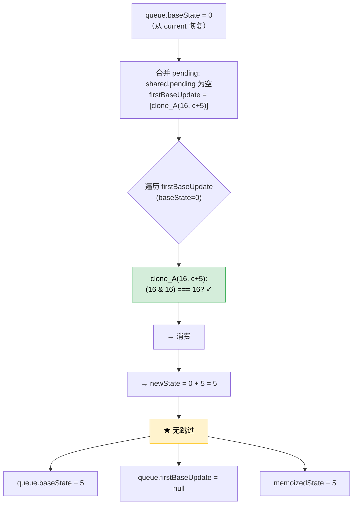
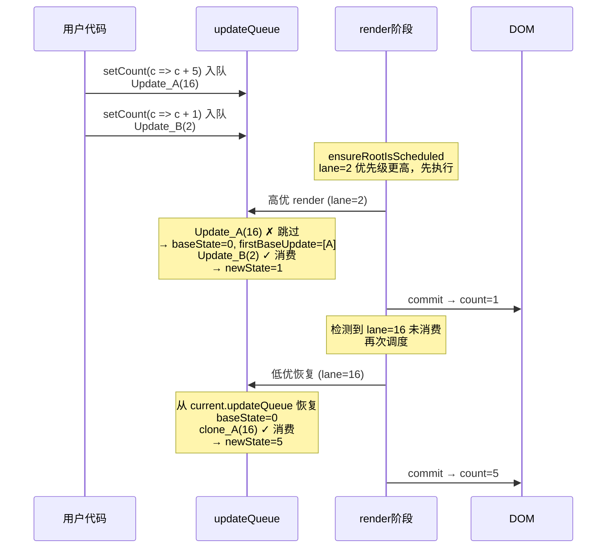

# 并发模式下状态一致性机制详解

> 基于 react-reconciler@0.33.0（React 18.3.1）官方源码 + big-react 本地源码

---

## 一、你的问题

```tsx
function Counter() {
    const [count, setCount] = useState(0);

    // 低优先级（定时器触发）
    useEffect(() => {
        setCount(c => c + 5);  // lane = 16 (DefaultLane)
    }, []);

    // 高优先级（用户点击）
    return <button onClick={() => setCount(c => c + 1)}>{count}</button>;
}
```

**担心：** 高优更新打断低优后，低优的 `c => c + 5` 是基于错误的中间状态 `1` 而不是 `0` 来计算的？

---

## 二、答案

**低优的 `c => c + 5` 仍然基于初始值 `0` 计算，结果是 `5`，不是 `1+5=6`。**

```
最终 UI：先显示 1（高优），再显示 5（低优恢复后）
```

---

## 三、核心机制：双基线队列

### 3.1 UpdateQueue 数据结构

```typescript
// 官方源码中的 UpdateQueue 关键字段
queue: {
    baseState: State,                   // ★ 跳过时的 state 快照
    firstBaseUpdate: Update | null,     // ★ 第一个被跳过的 update
    lastBaseUpdate: Update | null,      // ★ 最后一个被跳过的 update
    shared: {
        pending: Update | null,         // 新入队的 update（环形链表）
    },
}
```

### 3.2 官方 processUpdateQueue 核心逻辑

```typescript
// react-reconciler.development.js:4933
function processUpdateQueue(workInProgress, props, instance, renderLanes) {
    var queue = workInProgress.updateQueue;
    var firstBaseUpdate = queue.firstBaseUpdate;
    var pendingQueue = queue.shared.pending;

    // ① 合并新入队的 pending 到 base 链表的尾部
    if (null !== pendingQueue) {
        queue.shared.pending = null;
        // ... 环形解环，追加到 firstBaseUpdate 链表
    }

    if (null !== firstBaseUpdate) {
        var newState = queue.baseState;  // ★ 从 baseState 开始
        lastBaseUpdate = 0;
        current = firstPendingUpdate = lastPendingUpdate = null;
        pendingQueue = firstBaseUpdate;

        do {
            var updateLane = pendingQueue.lane & -536870913;
            var isHiddenUpdate = updateLane !== pendingQueue.lane;

            // ★★★ 只有与 renderLanes 匹配的 update 才被消费 ★★★
            if (isHiddenUpdate
                    ? (workInProgressRootRenderLanes & updateLane) === updateLane
                    : (renderLanes & updateLane) === updateLane) {
                // ✅ 匹配 → 执行 action，更新 newState
                // 此 update 被移除，不会出现在后续的 base 链表中
                break a;
            } else {
                // ❌ 不匹配 → 复制一份，存入新的 baseUpdate 链表
                // ★ 复制的 update 保留 original 的 lane / payload / callback
                // ★ lastPendingUpdate = newState（跳过时的 state 值）
                isHiddenUpdate = {
                    lane: updateLane,
                    tag: pendingQueue.tag,
                    payload: pendingQueue.payload,
                    callback: pendingQueue.callback,
                    next: null
                };
                // ... 追加到新的 base 链表
            }
        } while (pendingQueue !== null);

        // ★★★ 双基线保存 ★★★
        queue.baseState = lastPendingUpdate;          // 被跳过时的 state
        queue.firstBaseUpdate = firstPendingUpdate;   // 被跳过的 update 链表
        queue.lastBaseUpdate = current;               // 链表尾
        workInProgress.memoizedState = newState;      // 当前可用的 state

        // ★★★ 同时写入 current 树 ★★★
        null !== current &&
            ((current = current.updateQueue),
            (current.firstBaseUpdate = firstPendingUpdate),
            (current.lastBaseUpdate = lastPendingUpdate));
    }
}
```

### 3.3 本地 big-react 的对应实现

```typescript
// updateQueue.ts:130（本地源码）
export const processUpdateQueue = <State>(
    baseState: State,
    pendingUpdate: Update<State> | null,
    renderLane: Lane
): { memoizedState: State } => {
    const result: ReturnType<typeof processUpdateQueue<State>> = {
        memoizedState: baseState
    };

    if (pendingUpdate !== null) {
        const first = pendingUpdate.next;
        let pending = pendingUpdate.next as Update<any>;

        do {
            const updateLane = pending?.lane;
            // ★ 同样按 lane 过滤
            if (updateLane === renderLane) {
                const action = pending.action;
                if (action instanceof Function) {
                    baseState = action(baseState);
                } else {
                    baseState = action;
                }
            }
            // 不匹配 → 本地简化版仅报错（不支持跳过恢复）
            pending = pending?.next;
        } while (pending !== first);
    }

    result.memoizedState = baseState;
    return result;
};
```

⚠️ **注意：本地 big-react 是简化版，没有 `firstBaseUpdate` 跳过保留和双基线恢复机制。** 以下分析均基于官方 React 18 源码。

---

## 四、完整场景逐步骤推演

### 4.1 初始状态

```
setCount(c => c + 5);   // 先入队 → Update_A(16)
setCount(c => c + 1);   // 后入队 → Update_B(2), 高优先级

queue.shared.pending = [Update_A(16) → Update_B(2)]  // 环形链表
queue.baseState = 0
queue.firstBaseUpdate = null
```

### 4.2 步骤①：调度阶段

```typescript
// workLoop.ts（本地源码）
export function ensureRootIsScheduled(root: FiberRootNode) {
    const updateLane = getHighestPriorityLane(root.pendingLanes);
    // pendingLanes = 16 | 2 = 18
    // getHighestPriorityLane(18) → 2（InputDiscreteLane 数值最小优先级最高）

    if (updateLane === SyncLane) {
        // SyncLane = 1, 这里是 2
    } else {
        // 其他优先级 → 根据调度器调度
    }
}
```

**结果：** 高优先级 lane=2 先执行。低优 lane=16 后执行。

### 4.3 步骤②：高优 render（renderLanes = 2）

```
prepareFreshStack(root, 2):
  workInProgress = createWorkInProgress(root.current, null)
  // wip.updateQueue === current.updateQueue（共享同一个对象）

processUpdateQueue(wip, null, null, renderLanes=2):
```



**高优 render 结果：**

| 字段 | 值 | 说明 |
|------|-----|------|
| `queue.baseState` | `0` | Update_A 被跳过时的 state 值 |
| `queue.firstBaseUpdate` | `[clone_A(16, c+5)]` | 被跳过的 update 的克隆，等待下次处理 |
| `wip.memoizedState` | `1` | 高优 render 可用的 state |
| **commit** | `count = 1` ✅ | DOM 更新 |

### 4.4 commit 后的状态

```
root.current = finishedWork（WIP 树成为新的 current 树）
current.memoizedState = 1
current.updateQueue.baseState = 0       ← 从 processUpdateQueue 写入
current.updateQueue.firstBaseUpdate = [clone_A(16, c+5)] ← 从 processUpdateQueue 写入

ensureRootIsScheduled(root):
  发现 root.pendingLanes 中还有 lane=16 未消费
  → 再次调度低优先级任务
```

### 4.5 步骤③：低优恢复 render（renderLanes = 16）

```
prepareFreshStack(root, 16):
  workInProgress = createWorkInProgress(root.current, null)
  // wip.updateQueue === current.updateQueue
  // 此时 updateQueue 中：
  //   baseState = 0（从高优 render 保存下来的）
  //   firstBaseUpdate = [clone_A(16, c+5)]

processUpdateQueue(wip, null, null, renderLanes=16):
```



**低优 render 结果：**

| 字段 | 值 |
|------|------|
| `memoizedState` | `5` |
| **commit** | `count = 5` ✅ |

### 4.6 完整时间线



---

## 五、更多场景

### 场景 1：三个 setState，高优在中间

```tsx
setCount(5);        // Update_A(16)  低优
setCount(1);        // Update_B(2)   高优
setCount(100);      // Update_C(16)  低优
```

**第一轮高优 render（lane=2）：**

| Update | Lane | 匹配? | 结果 |
|--------|------|-------|------|
| A(5) | 16 | ✗ | 跳过，克隆到 firstBaseUpdate |
| B(1) | 2 | ✓ | 消费，newState=1 |
| C(100) | 16 | ✗ | 跳过，追加到 firstBaseUpdate |

```
baseState = 0（跳过时的）
firstBaseUpdate = [clone_A(16, 5), clone_C(16, 100)]
memoizedState = 1
commit → UI: 1
```

**第二轮低优 render（lane=16）：**

```
baseState = 0（从 current 恢复）
firstBaseUpdate = [clone_A(16, 5), clone_C(16, 100)]

clone_A(16, 5): ✓ → newState = 5
clone_C(16, 100): ✓ → newState = 100（直接覆盖）

memoizedState = 100
commit → UI: 100
```

**UI 顺序：1 → 100 ✅**

`setCount(5)` 的效果被 `setCount(100)` 覆盖了（都是低优先级，FIFO 顺序执行）。

### 场景 2：完全相同优先级，一次 render 全部消费

```tsx
onClick = () => {
    setCount(c => c + 1);   // 同一事件 → 相同 lane
    setCount(c => c + 2);
    setCount(c => c + 3);
};
```

React 18 自动批处理：

```
processUpdateQueue:
  Update_A(2, c+1) → newState = 0 + 1 = 1
  Update_B(2, c+2) → newState = 1 + 2 = 3
  Update_C(2, c+3) → newState = 3 + 3 = 6

无跳过，memoizedState = 6
commit → UI: 6 ✅（一次 render，不会中间跳转）
```

### 场景 3：低优先级的函数式更新确实依赖高优结果

```tsx
setCount(1);           // Update_A(2) 高优，先入队
setCount(prev => prev + 5);  // Update_B(16) 低优，后入队
```

这**不是**"低优先依赖于高优结果"，而是**Update 的 FIFO 顺序**：

```
Update_A(2, set to 1) → 第一个入队
Update_B(16, prev => prev + 5) → 第二个入队，依赖上一个结果

高优 render（lane=2）：
  Update_A(2): ✓ → newState = 1
  Update_B(16): ✗ → 跳过，baseState = 1

  memoizedState = 1
  commit → UI: 1 ✅

低优 render（lane=16）：
  baseState = 1（被跳过时的 state）
  clone_B(16, prev+5): ✓ → newState = 1 + 5 = 6

  memoizedState = 6
  commit → UI: 6 ✅
```

**结果：1 → 6 ✅（符合 FIFO 顺序：先设 1，再加 5）**

---

## 六、关键机制总结

### 6.1 双基线机制保护了什么？

| 保护了什么 | 如何实现的 | 对应源码 |
|-----------|-----------|---------|
| **被跳过的 update 不丢失** | 复制到 `firstBaseUpdate` 链表 | `else { isHiddenUpdate = { lane, payload, ... } }` |
| **跳过的起始 state 不丢失** | 保存在 `baseState` | `queue.baseState = lastPendingUpdate` |
| **WIP 丢弃后可以从 current 恢复** | `processUpdateQueue` 同步写入 current 的 updateQueue | `(current.firstBaseUpdate = firstPendingUpdate)` |
| **已消费的 update 不重复计算** | 从 `shared.pending` 中移除 | `queue.shared.pending = null` |
| **高优 commit 不影响低优的计算基线** | 低优从 `firstBaseUpdate` 恢复，baseState 独立 | `clone_A(16)` 保留原始 lane 和 payload |

### 6.2 一句话结论

```
被跳过的 update 不会丢失：
  → 复制到 firstBaseUpdate 链表（保存 payload + lane）
  → 保存 baseState（跳过时的中间状态）
  → 同步写入 current 树（防止 WIP 丢弃后丢失）

恢复时从 firstBaseUpdate 链表读取：
  → 从 baseState 开始重新计算
  → 不受高优 commit 结果的干扰
```

### 6.3 本地 big-react 的增强方向

当前本地源码缺少双基线恢复机制：

```typescript
// 需要新增的字段
export interface UpdateQueue<State> {
    baseState: State;               // 新增：跳过时的 state
    firstBaseUpdate: Update<State> | null;  // 新增：跳过链表头
    lastBaseUpdate: Update<State> | null;   // 新增：跳过链表尾
    shared: {
        pending: Update<State> | null;
    };
    dispatch: Dispatch<State> | null;
}
```

以及 `processUpdateQueue` 中需要在 `else` 分支（lane 不匹配时）将 update 克隆到 `firstBaseUpdate` 中，并在函数末尾保存 `baseState` 和 `firstBaseUpdate`。

---

*文档生成时间：2025-07-19*
*基于 react-reconciler@0.33.0（React 18.3.1）官方源码 + big-react 本地源码*
