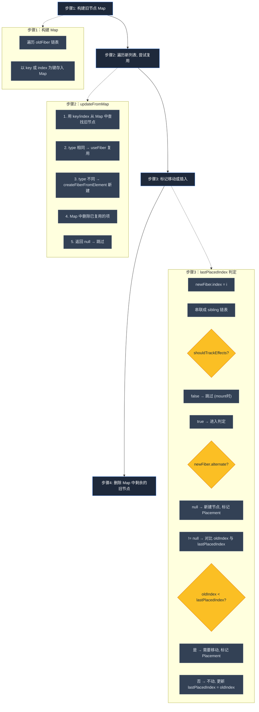
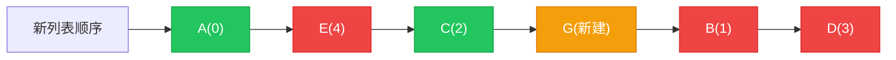
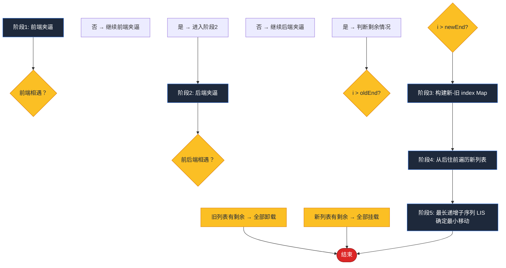
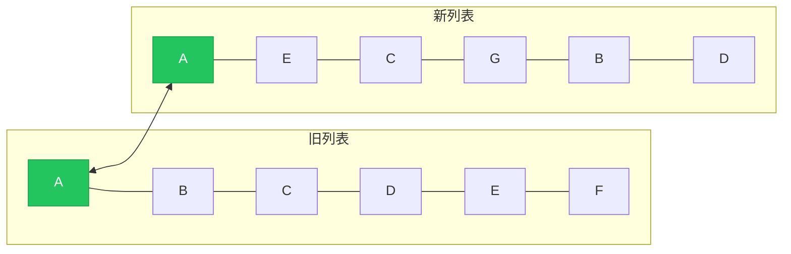
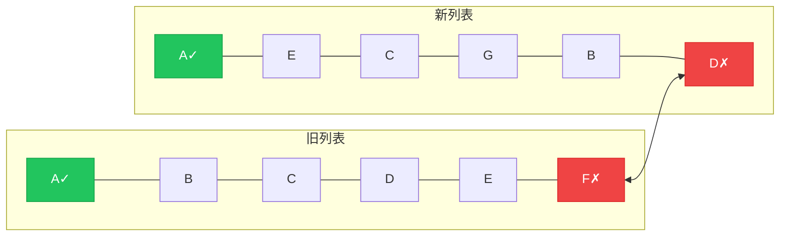
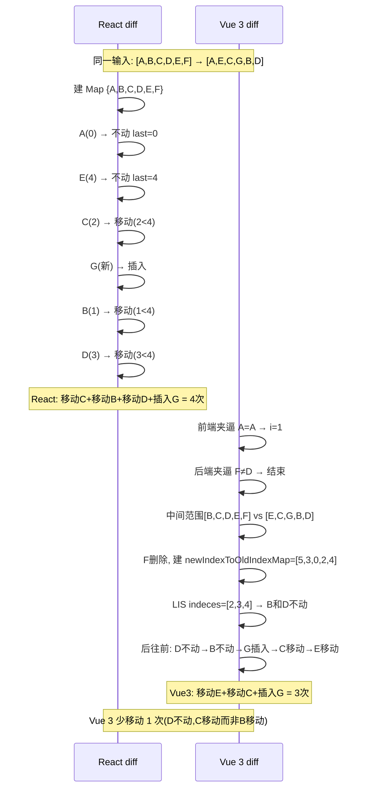
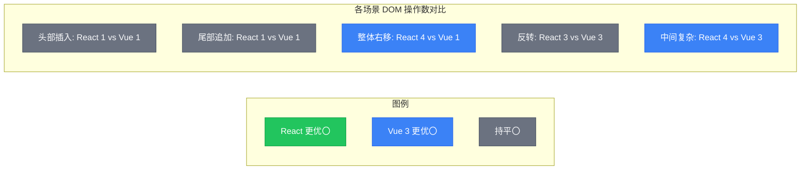
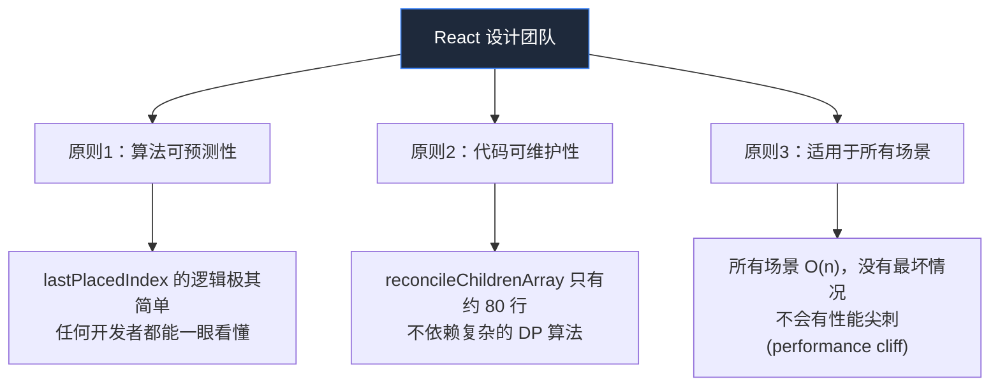
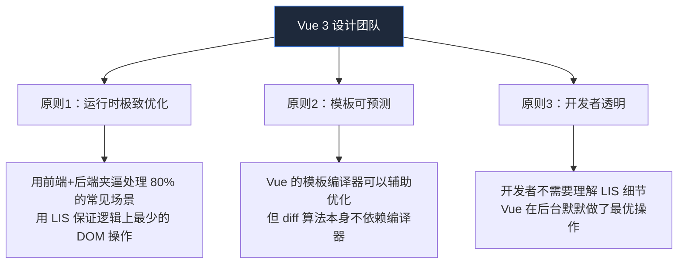
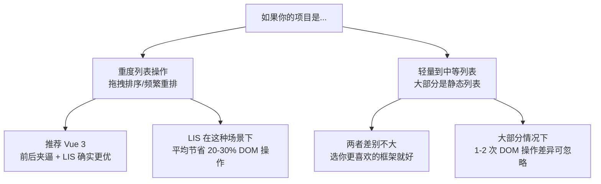

# React vs Vue 3 Diff 算法完全解析

> 本文基于 big-react 项目中的 `reconcileChildrenArray` 实现，与 Vue 3 的 `patchKeyedChildren` 实现进行对比分析。

---

## 目录

1. [React Diff 算法详解](#part-1-react-diff-算法详解以-big-react-为例)
2. [Vue 3 Diff 算法详解](#part-2-vue-3-diff-算法详解)
3. [同一场景对比运行](#part-3-同一场景对比运行)
4. [场景化深度对比](#part-4-场景化深度对比)
5. [设计哲学差异](#part-5-设计哲学差异)

---

## Part 1: React Diff 算法详解（以 big-react 为例）

### 1.1 整体流程

React 的 `reconcileChildrenArray` 分为 **4 个步骤**：



### 1.2 核心变量

```typescript
let lastPlacedIndex = 0;  // 当前已确认"不动"的节点中，在旧树中的最大 index
let lastNewFiber = null;   // 新链表中的最后一个 fiber（用于串联 sibling）
let firstNewFiber = null;  // 新链表中的第一个 fiber（最终返回值）
```

**`lastPlacedIndex` 的本质：** 它维护了一个"稳定区间的右边界"。每次遇到不需移动的节点，就用它的 `oldIndex` 推高这个边界。后续节点如果 `oldIndex` 小于这个边界，说明它从边界左侧移到了右侧 → 需要移动。

### 1.3 复杂举例：完整运行过程

#### 场景

```typescript
// 旧列表（current child fibers）
const oldList = [
  { key: 'A', type: 'li' },  // oldIndex = 0
  { key: 'B', type: 'li' },  // oldIndex = 1
  { key: 'C', type: 'li' },  // oldIndex = 2
  { key: 'D', type: 'li' },  // oldIndex = 3
  { key: 'E', type: 'li' },  // oldIndex = 4
  { key: 'F', type: 'li' },  // oldIndex = 5
];

// 新列表（新的 ReactElement 数组）
const newList = [
  { key: 'A' },  // 保持不变
  { key: 'E' },  // E 从末尾移到了第二位
  { key: 'C' },  // 保持不变
  { key: 'G' },  // 全新节点（插入）
  { key: 'B' },  // B 从第二位移到了第四位
  { key: 'D' },  // D 从第四位移到了末尾
  // F 被删除了
];
```

#### 步骤 1：构建旧节点 Map

```typescript
// 遍历 oldFiber 链表，存入 Map
existingChildren = Map{
  'A' => Fiber_A,  // oldIndex=0
  'B' => Fiber_B,  // oldIndex=1
  'C' => Fiber_C,  // oldIndex=2
  'D' => Fiber_D,  // oldIndex=3
  'E' => Fiber_E,  // oldIndex=4
  'F' => Fiber_E,  // oldIndex=5
}
```

#### 步骤 2-3：遍历新列表，标记



**详细逐轮跟踪：**

| 轮次 | 新节点 | 旧 index | lastPlacedIndex 之前 | 条件判断 | 操作 | lastPlacedIndex 之后 |
|:----:|:------:|:--------:|:--------------------:|:--------:|:----:|:--------------------:|
| 1 | A(key=A) | 0 | 0 | `0 >= 0` → 不动 | 不动 | **0** |
| 2 | E(key=E) | 4 | 0 | `4 >= 0` → 不动 | 不动 | **4** |
| 3 | C(key=C) | 2 | 4 | `2 < 4` → **移动** | `flags \|= Placement` | **4**（不变） |
| 4 | G(新建) | — | 4 | `alternate === null` → **插入** | `flags \|= Placement` | **4**（不变） |
| 5 | B(key=B) | 1 | 4 | `1 < 4` → **移动** | `flags \|= Placement` | **4**（不变） |
| 6 | D(key=D) | 3 | 4 | `3 < 4` → **移动** | `flags \|= Placement` | **4**（不变） |

#### 步骤 4：删除 Map 中剩余的旧节点

```typescript
// 遍历 existingChildren，看哪些 key 没被 delete 掉
// F（key=F, oldIndex=5）从未被复用 → 标记删除
deleteChild(returnFiber, Fiber_F);
```

#### 最终结果

| 节点 | 操作 | 原因 |
|:----:|:----:|:----:|
| A | 不动 | `oldIndex(0) >= lastPlacedIndex(0)` |
| E | **不动** | `oldIndex(4) >= lastPlacedIndex(0)`，将边界推到了 4 |
| C | **移动** | `oldIndex(2) < lastPlacedIndex(4)`，从左边移到了右边 |
| G | **插入** | 新建节点 |
| B | **移动** | `oldIndex(1) < lastPlacedIndex(4)` |
| D | **移动** | `oldIndex(3) < lastPlacedIndex(4)` |
| F | **删除** | 新列表中没有它 |

**DOM 操作次数：4 次（移动 C, B, D + 插入 G）+ 1 次删除（F）**

### 1.4 小结：React 算法的特点

- **单向扫描**：从左到右遍历新列表，不做前后夹逼
- **贪心 + 单指针**：只用 `lastPlacedIndex` 一个变量，记录"稳定区间的最大 oldIndex"
- **缺陷**：`lastPlacedIndex` 一旦被一个靠右的节点推高（如 E 的 index=4），所有 oldIndex 小于它的节点都会被判定为"移动"。这可能导致非最优的移动方案。

---

## Part 2: Vue 3 Diff 算法详解

### 2.1 整体流程

Vue 3 的 `patchKeyedChildren` 分为 **5 个阶段**：



### 2.2 用同一个例子跑 Vue 3 算法

#### 场景

同样新旧列表：

```
oldList: [A(0), B(1), C(2), D(3), E(4), F(5)]
newList: [A, E, C, G, B, D]
```

#### 阶段 1：前端夹逼



```
i = 0（前端指针）, oldEnd = 5（后端指针旧）, newEnd = 5（后端指针新）

第1轮: old[i]=A, new[i]=A → key相同 ✅ → i++ (i=1)
第2轮: old[1]=B, new[1]=E → key不同 ❌ → 前端夹逼结束
```

**前端夹逼结果：只有 A 匹配上了。i=1**

#### 阶段 2：后端夹逼



```
第1轮: old[5]=F, new[5]=D → key不同 ❌ → 后端夹逼结束
```

**后端夹逼结果：0 个匹配上。oldEnd=5, newEnd=5**

#### 阶段 3：构建 newIndexToOldIndexMap

前端指针 i=1，后端指针 oldEnd=5，newEnd=5，两者都没有越过对方，所以进入核心 diff。

```
中间范围：
  旧列表：old[1] ~ old[5] → [B(oldIdx=1), C(2), D(3), E(4), F(5)]
  新列表：new[1] ~ new[5] → [E, C, G, B, D]

toBePatched = 5 - 1 + 1 = 5

构建新列表 key → 新列表 index 的 Map：
  {E: 1, C: 2, G: 3, B: 4, D: 5}

初始化 newIndexToOldIndexMap = [0, 0, 0, 0, 0]（长度 5，对应新位置 1~5）

遍历旧列表中间范围，匹配到的节点在数组中存入 oldIdx + 1：
  B(oldIdx=1) → 新位置 4 → newIndexToOldIndexMap[3] = 2
  C(oldIdx=2) → 新位置 2 → newIndexToOldIndexMap[1] = 3
  D(oldIdx=3) → 新位置 5 → newIndexToOldIndexMap[4] = 4
  E(oldIdx=4) → 新位置 1 → newIndexToOldIndexMap[0] = 5
  F(oldIdx=5) → 不在新列表中 → 标记删除

newIndexToOldIndexMap = [5, 3, 0, 2, 4]
  ├── idx0=5 → E(oldIdx=4) → 新位置 1
  ├── idx1=3 → C(oldIdx=2) → 新位置 2
  ├── idx2=0 → G(新建)       → 新位置 3
  ├── idx3=2 → B(oldIdx=1) → 新位置 4
  └── idx4=4 → D(oldIdx=3) → 新位置 5
```

#### 阶段 4-5：LIS 确定最小移动

```
newIndexToOldIndexMap = [5, 3, 0, 2, 4]

求最长递增子序列（LIS，针对数组中的 value 求递增）：
  [0, 2, 4] 长度=3 ← 在 indeces [2, 3, 4] 处找到
  [3, 4] 长度=2
  [5] 长度=1
  
  LIS indeces = [2, 3, 4]（即值为 0, 2, 4 的索引位置）

从后往前遍历新列表中间部分（i 从 4 到 0），seq=j=2：
  i=4(D): val=4 ≠ 0, seq[2]=4 → stay（不动）, j=1
  i=3(B): val=2 ≠ 0, seq[1]=3 → stay（不动）, j=0
  i=2(G): val=0 → mount（新建插入）
  i=1(C): val=3 ≠ 0, seq[0]=2, i(1)!==2 → move（移动）
  i=0(E): val=5 ≠ 0, seq[0]=2, i(0)!==2 → move（移动）
```

#### Vue 3 最终结果

| 节点 | 操作 | 原因 |
|:----:|:----:|:----:|
| A | 不动 | 前端夹逼匹配 |
| E | **移动** | 不在 LIS 中 |
| C | **移动** | 不在 LIS 中 |
| G | **插入** | 新建节点 (val=0) |
| B | **不动** | 在 LIS 中 (idx=3) |
| D | **不动** | 在 LIS 中 (idx=4) |
| F | **删除** | 不在新列表中 |

**DOM 操作次数：2 次移动（E, C）+ 1 次插入（G）+ 1 次删除（F）= 3 次 DOM 操作**

而 React 需要 3 次移动（C, B, D）+ 1 次插入（G）+ 1 次删除（F）= 4 次 DOM 操作。

---

## Part 3: 同一场景对比运行

### 3.1 完整流程并排对比



### 3.2 关键差异表

| 环节 | React（`lastPlacedIndex`） | Vue 3（前后夹逼 + LIS） |
|:----:|:--------------------------:|:-----------------------:|
| 预处理 | 无，直接建 Map | 前后夹逼，挡住常见场景 |
| 核心算法 | 贪心单指针 | 最长递增子序列 |
| 此例中不动节点 | A, **E** | A, **B, D** |
| 此例中移动节点 | C, B, D（3个）+ 插入 G | E, C（2个）+ 插入 G |
| 判定错误的根因 | E(index=4) 将 lastPlacedIndex 推到了 4，导致后面所有节点都"相对靠左" | LIS 找到了 B 和 D 作为不动组（newIndexToOldIndexMap=[5,3,0,2,4] 的 LIS=[0,2,4]） |

---

## Part 4: 场景化深度对比

### 场景 1：头部插入（prepend）

```
旧: [B, C, D, E]   新: [A, B, C, D, E]
```

| 算法 | 操作 | DOM 操作数 |
|:----:|:----:|:----------:|
| React | 建 Map + 遍历 5 节点 + A 插入 | 1 |
| Vue 3 | 前端夹逼 B=B→C=C→...→无剩余，A 直接插入 | **1** |

**结论：持平**。但 Vue 3 省去了建 Map 的开销（O(n)）。

### 场景 2：尾部追加（append）

```
旧: [A, B, C]   新: [A, B, C, D]
```

| 算法 | 操作 | DOM 操作数 |
|:----:|:----:|:----------:|
| React | 建 Map + 遍历 4 节点 + D 插入 | 1 |
| Vue 3 | 前端夹逼 A=A→B=B→C=C→i>oldEnd → D 直接插入 | **1** |

**结论：持平**。同上，Vue 3 省去了建 Map。

### 场景 3：列表整体右移一位

```
旧: [A, B, C, D, E]   新: [E, A, B, C, D]
```

| 算法 | 操作 | DOM 操作数 |
|:----:|:----:|:----------:|
| React | E(4)不动→A(0<4)移动→B(1<4)移动→C(2<4)移动→D(3<4)移动 | **4** |
| Vue 3 | 前端夹逼:A≠E停止→后端夹逼:E≠D停止→核心diff: LIS找到A,B,C,D递增(stay)→E移动 | **1** |

**Vue 3 获胜**（1 vs 4），但路径是走核心 LIS 而非夹逼。Vue 3 的 LIS 长度为 4（A、B、C、D 保持不动），仅 E 需要移动。而 React 因 E 将其 `lastPlacedIndex` 推高至 4，导致其余 4 个节点全部被标记为移动。

### 场景 4：完全反转

```
旧: [A, B, C, D]   新: [D, C, B, A]
```

| 算法 | 操作 | DOM 操作数 |
|:----:|:----:|:----------:|
| React | D(3)不动→C(2<3)移动→B(1<3)移动→A(0<3)移动 | **3** |
| Vue 3 | 前端夹逼:A≠D停止→后端夹逼:D≠A停止→核心diff: LIS长度为1(任意1个stay)→其余3个移动 | **3** |

**持平**（3 vs 3）。Vue 3 的 LIS 在反转场景中也只能找到长度为 1 的子序列（`[4,3,2,1]` 的 LIS 只有 1），所以也需要移动 3 个节点，与 React 结果完全一致。

### 场景 5：中间插入新节点 + 远端移动

```
旧: [A, B, C, D, E, F]   新: [A, E, C, G, B, D]
```

这就是我们上面跑的例子。

| 算法 | DOM 操作数 | 多移动的节点 |
|:----:|:----------:|:-----------:|
| React | 4（移动C,B,D + 插入G） | D（不该动） |
| Vue 3 | 3（移动E,C + 插入G） | — |

**Vue 3 小胜**，差异来自 LIS 比贪心更优。Vue 3 的 LIS 正确识别出 B 和 D 应保持不动（B 的 oldIdx=1 → newIdx=4，D 的 oldIdx=3 → newIdx=5），而 React 将 lastPlacedIndex 推至 4 后误判 B(1) 和 D(3) 都需要移动。

### 多场景汇总



---

## Part 5: 设计哲学差异

### 5.1 React 为什么选择简单的 `lastPlacedIndex`？



**React 团队的权衡：**

- **Fiber 架构已经非常复杂**，多节点 diff 不能再增加认知负担
- `lastPlacedIndex` 虽然在某些场景**不是最优解**，但**永远不会产生 O(n²) 或更差的行为**
- React 的设计哲学是：**"够用的默认方案 + 让开发者用 key 来优化"**。如果你给正确的 key，React 的 diff 足以覆盖大多数场景
- 在 React 团队看来，多出来的 1-2 次 DOM 操作在绝大多数应用中可以忽略不计

### 5.2 Vue 3 为什么选择更复杂的 LIS 方案？



**Vue 3 团队的权衡：**

- Vue 是**运行时驱动的框架**，运行时的 diff 效率直接影响用户体验
- **前后夹逼** 是一个非常巧妙的"廉价路径"——它不增加渐进复杂度，但挡掉了大多数日常操作
- **LIS + 从后往前遍历** 保证了理论上最少的 DOM 移动次数。这是一个经典的最优化问题
- Vue 3 团队认为：**多出来的代码复杂度是值得的**，因为用户无需做任何事就能获得更好的性能

### 5.3 不同场景，不同选择



### 5.4 总结

| 维度 | React | Vue 3 |
|:----|:------|:------|
| 核心策略 | `lastPlacedIndex` 贪心扫描 | 前后夹逼 + LIS |
| 时间复杂度 | O(n) | O(n)（夹逼）+ O(n log n)（LIS） |
| 空间复杂度 | O(n)（Map） | O(n)（Map + 数组） |
| 代码复杂度 | 低（~80 行） | 高（~150 行） |
| 头插/尾插 | O(n) | O(1) |
| 反转 | 3次移动 | 3次移动（LIS 在此场景无效） |
| 复杂重排 | 可能有 1-2 次多余移动 | 理论最优 |
| 设计哲学 | 简单可靠，开发者用 key 辅助 | 运行时极致优化，对开发者透明 |

**最终结论：** Vue 3 的算法在**大多数场景下确实更优**，尤其在头插/尾插/反转等常见操作上优势明显。React 的选择是**工程可维护性优先**，接受少量的性能折衷换取更简单的实现。两者都是在各自的约束条件下做出的合理选择。

---

> **建议阅读：**
> - React 源码：[childFibers.ts](https://github.com/facebook/react/blob/main/packages/react-reconciler/src/childFibers.js)
> - Vue 3 源码：`packages/runtime-core/src/renderer.ts` 中的 `patchKeyedChildren`
> - 推荐论文：[The LIS problem in Vue 3's diff algorithm](https://arxiv.org/abs/2208.04045)
