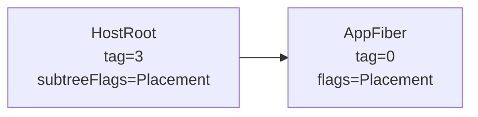
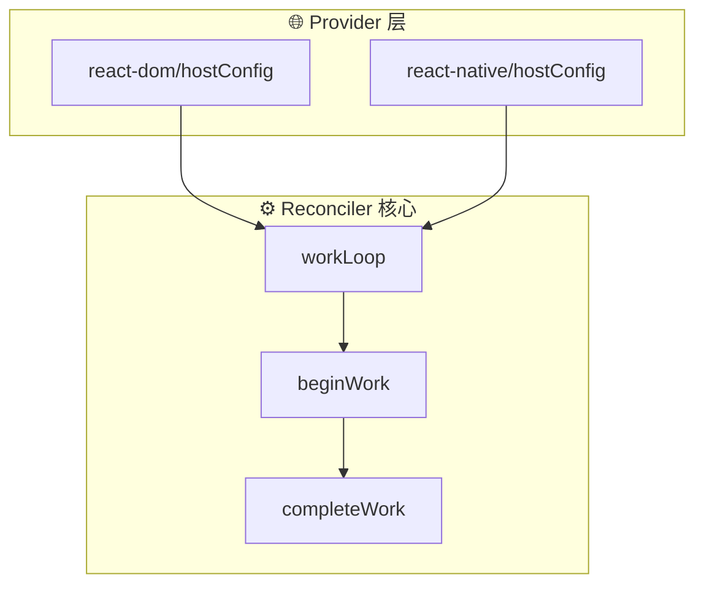
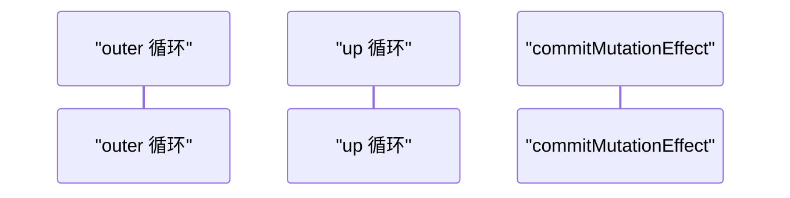
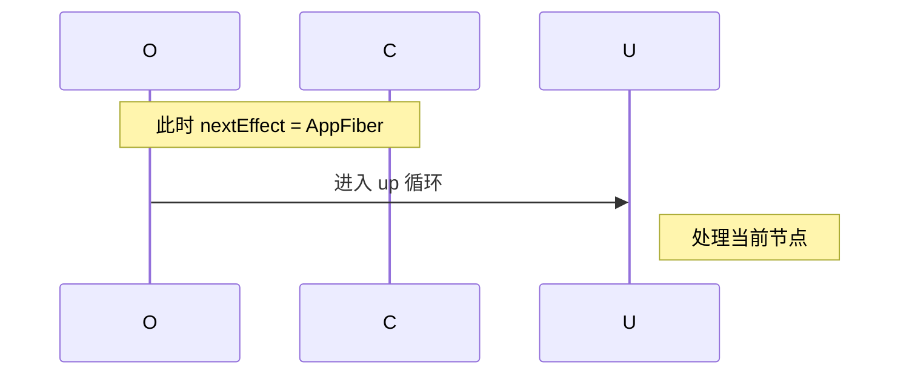
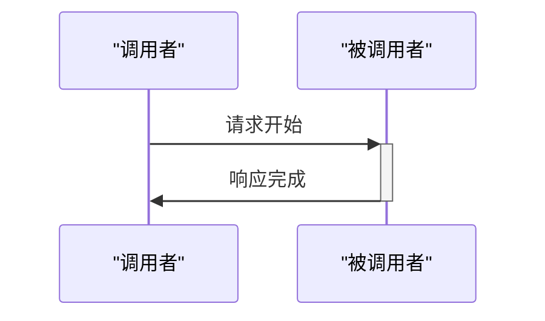
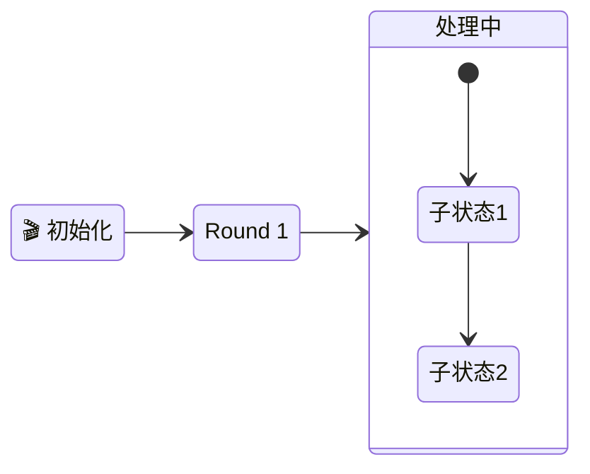
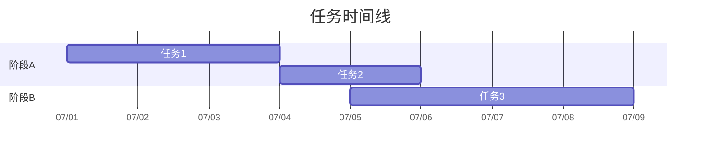
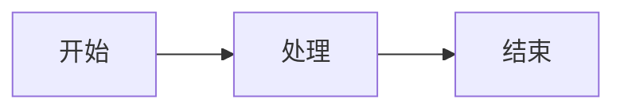
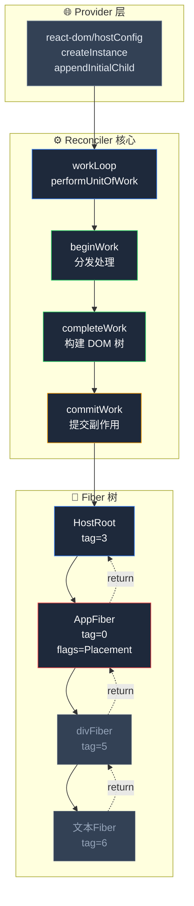

# Mermaid 图表全面规则参考

一份通用、可复用的 Mermaid 图表编写规范，覆盖语法安全与视觉效果。复制到任何项目中使用即可。

---

## 第一部分：语法安全规则（必须遵守）

### 核心原则

**节点文本中包含 Mermaid 特殊符号（`[`、`]`、`(`、`)`、`{`、`}`、`"`）时，必须用双引号 `""` 包裹节点文本。**

### 1.1 节点形状与易错符号对照

| 节点写法 | 形状 | 文本中不能出现的符号 | 正确写法 |
|---------|------|-------------------|---------|
| `id[text]` | 矩形 | `]` | `id["naiveDFS(HostRoot)"]` |
| `id(text)` | 圆角矩形 | `)` | `id("naiveDFS(HostRoot)")` |
| `id{text}` | 菱形 | `}` | `id{"naiveDFS(HostRoot)"}` |
| `id>text]` | 非对称 | `]` | `id>"naiveDFS(HostRoot)"]` |
| `id["text"]` | 矩形（安全模式） | `]`、`"` | `id["text with [brackets]"]` |

### 1.2 四条具体规则

**规则 1：节点文本含 `()`、`[]`、`{}` 时，一律用引号包裹**

- ❌ `R1[naiveDFS(HostRoot)]`
- ✅ `R1["naiveDFS(HostRoot)"]`

虽然 `()` 在外层 `[]` 内部通常不直接导致解析失败，但作为统一安全规范，一律加引号可避免复杂嵌套时出错。

**规则 2：节点文本含 `]` 时，必须用引号包裹**

- ❌ `A[something[inner]]` —— 解析器误认为第一个 `]` 就是结束符
- ✅ `A["something[inner]"]`

**规则 3：节点文本含 `"` 时，必须用引号包裹，内部改用单引号**

外层 `""` 用于标记节点文本的起止，内部绝对不能出现相同的 `"` 字符，否则解析器会提前结束节点文本，导致语法错误或渲染失败。内部需引用文字时一律改用**单引号 `'`**。

- ❌ `HOSTT["HostText (tag=6)<br/>"文本内容"` —— 内层 `"` 与外层 `"` 冲突
- ✅ `HOSTT["HostText (tag=6)<br/>'文本内容'"]` —— 内层改单引号

更多对比：

| ❌ 错误写法 | ✅ 正确写法 |
|------------|------------|
| `A["text with "quotes""]` | `A["text with 'quotes'"]` |
| `C2["需要向下找"顶级 DOM 节点""]` | `C2["需要向下找'顶级 DOM 节点'"]` |

**快速判断**：如果节点文本中出现了 `"`，而外层也是用 `""` 包裹的，解析器永远会优先匹配到第一个 `"` 作为结束符。所以**外层用 `""` 时，内部必须用 `'` 表示引号**。

**规则 4：数字开头的节点 ID 必须用引号包裹**

Mermaid 中节点 ID 不能以数字开头，否则解析器报错。

- ❌ `1[开始]` —— 解析错误
- ✅ `n1["开始"]` —— 加字母前缀，加引号

### 1.3 style 和 classDef 的颜色值规范

`style` 语句中的颜色值必须用带 `#` 的完整十六进制或具名颜色。

- ❌ `style A fill:#dc2626,stroke:#ef4444,color:white`
- ✅ `style A fill:#dc2626,stroke:#ef4444,color:#fff`
- ✅ `style A fill:#dc2626,stroke:#ef4444,color:#ffffff`

### 1.4 subgraph 标题加引号

- ❌ `subgraph 递归方案`
- ✅ `subgraph "递归方案"`

当标题包含特殊符号、空格、中文和英文混排时，加引号可以避免解析歧义。

### 1.5 特殊字符转义

Mermaid 中以下 HTML 实体字符需要转义：

| 字符 | 转义写法 | 场景 |
|------|---------|------|
| `<` | `&lt;` | 节点文本中的泛型，如 `Array&lt;string&gt;` |
| `>` | `&gt;` | 节点文本中的箭头或泛型 |
| `&` | `&amp;` | 节点文本中的 and 符号 |
| `→` | `&rarr;` | 节点文本中的箭头 |
| `↵` | 直接用 `\n` | 节点文本中的换行（用 `<br/>` 也可） |

- ✅ `type["Array&lt;string&gt;"]`
- ❌ `type["Array<string>"]` —— `<` 被解析器误认为是 HTML 标签

---

## 第二部分：效果优化规则（推荐遵守）

### 2.1 流程图（Flowchart）样式最佳实践

#### 2.1.1 颜色选择

使用深色背景 + 明亮前景色方案，保证可读性：


推荐颜色板：

| 目的 | Fill（背景） | Stroke（边框） | Text（文字） |
|------|-------------|---------------|-------------|
| 默认/中性 | `#334155` | `#64748b` | `#e2e8f0` |
| 强调（蓝色） | `#1e293b` | `#3b82f6` | `#fff` |
| 成功（绿色） | `#1e293b` | `#22c55e` | `#fff` |
| 警告/错误（红色） | `#1e293b` | `#ef4444` | `#fff` |
| 信息/紫色 | `#1e293b` | `#a855f7` | `#fff` |
| 完成/橙色 | `#1e293b` | `#f59e0b` | `#fff` |
| 禁用/次要 | `#334155` | `#475569` | `#94a3b8` |

#### 2.1.2 节点尺寸控制

Mermaid 中无法直接设置节点宽高，但可以通过在文本中加 `<br/>` 换行来间接控制：



#### 2.1.3 箭头使用规范

| 箭头写法 | 含义 | 示例 |
|---------|------|------|
| `-->` | 实线箭头（默认流向） | `A --> B` |
| `-.->` | 虚线箭头（返回/间接关系） | `B -.->|return| A` |
| `==>` | 粗箭头（强调/主要路径） | `A ==> B` |
| `--o` | 空心圆箭头（组合/聚合） | `A --o B` |
| `--x` | 叉箭头（失败/拒绝） | `A --x B` |

#### 2.1.4 子图（subgraph）分组



### 2.2 序列图（Sequence Diagram）样式

#### 2.2.1 参与者命名



#### 2.2.2 注释使用



#### 2.2.3 激活框（activation box）



`+` 表示激活，`-` 表示停用——能清楚显示调用栈深度。

### 2.3 状态图（State Diagram）样式



- `direction LR` 让状态图水平排列，适合较宽屏幕
- 内嵌 `state {}` 表示复合状态
- emoji 前缀提升识别度

### 2.4 甘特图（Gantt）样式



- `dateFormat` 和 `axisFormat` 必须显式指定，否则日期格式可能不兼容
- 用 `after` 关键词建立依赖关系

---

## 第三部分：通用命名规范

### 3.1 节点 ID 命名

```
格式：[类型前缀][序号][语义名]
```

| 前缀 | 含义 | 示例 |
|------|------|------|
| `HR` | HostRoot | `HR[HostRoot]` |
| `APP` | AppFiber | `APP[AppFiber]` |
| `DIV` | div | `DIV[divFiber]` |
| `SPAN` | span | `SPAN[spanFiber]` |
| `R1`~`R9` | 流程步骤 | `R1[第1步]` |
| `F1`~`F9` | 函数调用帧 | `F1[帧1: HostRoot]` |
| `n1`~`n9` | 通用节点 | `n1["开始"]` |
| `a1`~`a9` | 甘特图任务 | `a1, 2026-07-01, 3d` |

### 3.2 注释规范



注释行以 `%%` 开头，放在关键区域上方，帮助后续维护者理解图表意图。

---

## 第四部分：常见错误与排查

### 4.1 常见渲染失败原因

| 症状 | 原因 | 修复 |
|------|------|------|
| 图表空白 | 缺少 `flowchart`/`sequenceDiagram` 类型声明 | 在代码块首行加上类型 |
| 部分节点不显示 | 节点 ID 以数字开头 | 加字母前缀，如 `n1` |
| 箭头错位 | 箭头两端节点 ID 拼写不一致 | 检查 ID 大小写和拼写 |
| 颜色不生效 | `style` 语句缺少完整十六进制 | `color:white` → `color:#fff` |
| 文本乱码 | 含未转义的 `<`、`>` | 改为 `&lt;`、`&gt;` |
| subgraph 不渲染 | subgraph 标题含特殊符号未加引号 | `subgraph "标题"` |

### 4.2 快速判断公式

**"文本中的符号会不会让解析器提前匹配到结束符？"**

如果答案是"会"，就加 `""`。如果不确定，直接加上 `""` 永远是安全的。

---

## 第五部分：完整示例

### 一个综合应用所有规则的 Mermaid 流程图



---

## 快速备忘卡片

```text
┌─────────────────────────────────────────────────────┐
│           Mermaid 规则 · 一分钟速查                  │
├─────────────────────────────────────────────────────┤
│ 📐 语法安全                                          │
│   · [] 中有符号 → 加 ""                               │
│   · ID 不以数字开头                                   │
│   · style 颜色用 #fff 不用 white                     │
│   · 含 < > 用 &lt; &gt; 转义                        │
│   · subgraph 标题加 ""                               │
├─────────────────────────────────────────────────────┤
│ 🎨 效果优化                                          │
│   · fill:#1e293b + stroke:#彩色 + color:#fff         │
│   · 节点文本用 <br/> 换行                             │
│   · 关键路径用 ==> 粗箭头                             │
│   · 非重点用 -.-> 虚线                                │
│   · 序列图用 participant A as "名称"                  │
│   · 状态图用 direction LR 水平排列                    │
├─────────────────────────────────────────────────────┤
│ 📝 命名规范                                          │
│   · HR / APP / DIV 等前缀 + 语义名                   │
│   · %% 注释标记关键区域                               │
└─────────────────────────────────────────────────────┘
```
