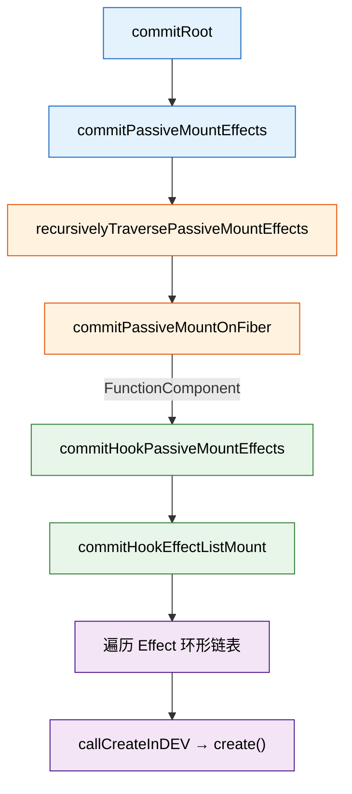

# React 18/19 useEffect 父子组件 create 执行顺序详解

> 基于 react-reconciler@0.33.0（React 18.3.1）官方源码分析

---

## 一、核心结论（一句话）

**子组件的 `useEffect create` 先于父组件执行；`destroy` 的执行顺序与 `create` 相同（也是子先父后）。**

但这不是简单的"子先父后"，其底层机制与 Fiber 树的遍历方式密切相关。

---

## 二、源码执行路径总览

### 2.1 关键函数调用链



### 2.2 核心源码位置

| 函数 | 文件 | 行号 | 职责 |
|------|------|------|------|
| `recursivelyTraversePassiveMountEffects` | `react-reconciler.development.js` | 12919 | DFS 遍历 Fiber 树 |
| `commitPassiveMountOnFiber` | 同上 | 12936 | 处理单个 Fiber 节点 |
| `commitHookPassiveMountEffects` | 同上 | 10945 | 包装函数 |
| `commitHookEffectListMount` | 同上 | 10848 | 遍历 Effect 链表，执行 create |
| `commitHookEffectListUnmount` | 同上 | 10908 | 遍历 Effect 链表，执行 destroy |

---

## 三、遍历机制：DFS 后序遍历

### 3.1 `recursivelyTraversePassiveMountEffects` 源码

```javascript
function recursivelyTraversePassiveMountEffects(
    root,
    parentFiber,
    committedLanes,
    committedTransitions,
    endTime
) {
    if (
        parentFiber.subtreeFlags & 10256 ||  // PassiveStatic | ChildDeletion
        (0 !== parentFiber.actualDuration && ...)
    )
        // 关键：先遍历 child，再遍历 sibling
        for (parentFiber = parentFiber.child; null !== parentFiber; ) {
            var nextSibling = parentFiber.sibling;
            commitPassiveMountOnFiber(
                root,
                parentFiber,
                committedLanes,
                committedTransitions,
                null !== nextSibling ? nextSibling.actualStartTime : endTime
            );
            parentFiber = nextSibling;
        }
    }
}
```

**遍历顺序：深度优先，先子后父，同级从左到右**

### 3.2 `commitPassiveMountOnFiber` 关键分支

```javascript
function commitPassiveMountOnFiber(finishedRoot, finishedWork, ...) {
    switch (finishedWork.tag) {
        case 0:   // FunctionComponent
        case 11:  // SimpleMemoComponent
        case 15:  // MemoComponent
            // ① 先递归处理子树
            recursivelyTraversePassiveMountEffects(
                finishedRoot,
                finishedWork,  // 传入当前 fiber，内部遍历其 child
                ...
            );
            // ② 再处理自身（执行 useEffect create）
            flags & 2048 &&  // PassiveEffect
                commitHookPassiveMountEffects(finishedWork, Passive | HasEffect);
            break;
        // ...
    }
}
```

**关键设计：先递归子树，再执行自身 → 子组件的 create 先于父组件**

---

## 四、Effect 链表执行机制

### 4.1 `commitHookEffectListMount` 源码

```javascript
function commitHookEffectListMount(flags, finishedWork) {
    var updateQueue = finishedWork.updateQueue,
        lastEffect = null !== updateQueue ? updateQueue.lastEffect : null;
    if (null !== lastEffect) {
        var firstEffect = lastEffect.next;  // 环形链表头部
        updateQueue = firstEffect;
        do {
            // 位运算过滤：只有 tag 包含所有 flags 位才执行
            if ((updateQueue.tag & flags) === flags) {
                lastEffect = runWithFiberInDEV(
                    finishedWork,
                    callCreateInDEV,
                    updateQueue
                );
                // create() 返回值赋给 lastEffect，保存到 inst.destroy
            }
            updateQueue = updateQueue.next;
        } while (updateQueue !== firstEffect);  // 回到头部结束
    }
}
```

### 4.2 `callCreateInDEV` 实现

```javascript
callCreate = {
    react_stack_bottom_frame: function (effect) {
        var create = effect.create;
        effect = effect.inst;           // inst = { destroy: undefined }
        create = create();              // 执行用户传入的 create()
        return (effect.destroy = create); // 返回值保存到 inst.destroy
    }
}
```

---

## 五、完整场景推演

### 场景 1：简单父子结构

```jsx
function Parent() {
    useEffect(() => { console.log('Parent create'); });
    return <Child />;
}

function Child() {
    useEffect(() => { console.log('Child create'); });
    return <div>child</div>;
}
```

**Fiber 树结构：**
```
HostRoot
  └── Parent (FunctionComponent)
        └── Child (FunctionComponent)
              └── div (HostComponent)
```

**执行顺序：**

| 步骤 | 操作 | 输出 |
|------|------|------|
| 1 | `recursivelyTraversePassiveMountEffects(root, HostRoot)` | - |
| 2 | 遍历 HostRoot.child → Parent | - |
| 3 | `commitPassiveMountOnFiber(Parent)` | - |
| 4 | Parent.tag = 0 → 递归 `recursivelyTraversePassiveMountEffects(root, Parent)` | - |
| 5 | 遍历 Parent.child → Child | - |
| 6 | `commitPassiveMountOnFiber(Child)` | - |
| 7 | Child.tag = 0 → 递归 `recursivelyTraversePassiveMountEffects(root, Child)` | - |
| 8 | 遍历 Child.child → div（HostComponent，tag=5） | - |
| 9 | `commitPassiveMountOnFiber(div)` → 无 case 匹配，直接返回 | - |
| 10 | 回到 Child，执行 `commitHookPassiveMountEffects(Child)` | **Child create** |
| 11 | 回到 Parent，执行 `commitHookPassiveMountEffects(Parent)` | **Parent create** |

**控制台输出：**
```
Child create
Parent create
```

---

### 场景 2：多层嵌套 + 兄弟节点

```jsx
function GrandParent() {
    useEffect(() => { console.log('GrandParent create'); });
    return (
        <div>
            <ParentA />
            <ParentB />
        </div>
    );
}

function ParentA() {
    useEffect(() => { console.log('ParentA create'); });
    return <ChildA />;
}

function ParentB() {
    useEffect(() => { console.log('ParentB create'); });
    return <ChildB />;
}

function ChildA() {
    useEffect(() => { console.log('ChildA create'); });
    return <span>A</span>;
}

function ChildB() {
    useEffect(() => { console.log('ChildB create'); });
    return <span>B</span>;
}
```

**Fiber 树结构：**
```
HostRoot
  └── GrandParent
        └── div
              ├── ParentA
              │     └── ChildA
              │           └── span
              └── ParentB
                    └── ChildB
                          └── span
```

**执行顺序：**

```
1. GrandParent → 递归子树
   2. div → 递归子树
      3. ParentA → 递归子树
         4. ChildA → 递归子树
            5. span → 返回
         6. 执行 ChildA create    ← 第一个输出
      7. 执行 ParentA create     ← 第二个输出
      8. ParentB → 递归子树
         9. ChildB → 递归子树
            10. span → 返回
        11. 执行 ChildB create    ← 第三个输出
     12. 执行 ParentB create     ← 第四个输出
  13. div 无 PassiveEffect，跳过
14. 执行 GrandParent create      ← 第五个输出
```

**控制台输出：**
```
ChildA create
ParentA create
ChildB create
ParentB create
GrandParent create
```

---

### 场景 3：更新时 deps 变化与不变混合

```jsx
function App() {
    const [count, setCount] = useState(0);
    const [text, setText] = useState('hello');

    useEffect(() => {
        console.log('App effect [count]', count);
    }, [count]);  // deps 变化时执行

    useEffect(() => {
        console.log('App effect [text]', text);
    }, [text]);   // deps 不变时跳过

    return <Child count={count} />;
}

function Child({ count }) {
    useEffect(() => {
        console.log('Child effect [count]', count);
    }, [count]);
    return <div>{count}</div>;
}
```

**初始渲染（mount）：**
```
Child effect [count] 0
App effect [count] 0
App effect [text] hello
```

**点击 `setCount(1)`（text 不变）：**

| 组件 | Effect | deps 变化 | tag | 执行 |
|------|--------|----------|-----|------|
| Child | effect [count] | [0]→[1] ✓ | Passive \| HasEffect | create + destroy |
| App | effect [count] | [0]→[1] ✓ | Passive \| HasEffect | create + destroy |
| App | effect [text] | [hello]→[hello] ✗ | Passive（无 HasEffect） | 跳过 |

**执行顺序：**
```
1. Child destroy（上一次的 cleanup）
2. Child create
3. App destroy [count]（上一次的 cleanup）
4. App create [count]
5. App effect [text] → tag 无 HasEffect，跳过
```

**控制台输出：**
```
Child destroy
Child effect [count] 1
App destroy
App effect [count] 1
```

---

### 场景 4：组件卸载时的 destroy 顺序

```jsx
function Parent() {
    useEffect(() => {
        console.log('Parent create');
        return () => console.log('Parent destroy');
    }, []);
    return <Child />;
}

function Child() {
    useEffect(() => {
        console.log('Child create');
        return () => console.log('Child destroy');
    }, []);
    return <div>child</div>;
}
```

**卸载流程（`recursivelyTraversePassiveUnmountEffects`）：**

```javascript
function recursivelyTraversePassiveUnmountEffects(parentFiber) {
    // ... 处理 deletions ...
    if (parentFiber.subtreeFlags & 10256)
        for (parentFiber = parentFiber.child; null !== parentFiber; )
            commitPassiveUnmountOnFiber(parentFiber),
            (parentFiber = parentFiber.sibling);
}

function commitPassiveUnmountOnFiber(finishedWork) {
    switch (finishedWork.tag) {
        case 0: // FunctionComponent
            recursivelyTraversePassiveUnmountEffects(finishedWork);  // 先递归子树
            finishedWork.flags & 2048 &&
                commitHookPassiveUnmountEffects(
                    finishedWork,
                    finishedWork.return,
                    Passive | HasEffect
                );  // 再执行自身 destroy
            break;
    }
}
```

**执行顺序：**
```
1. Parent → 递归子树
   2. Child → 递归子树
      3. div → 返回
   4. 执行 Child destroy    ← 先执行
5. 执行 Parent destroy     ← 后执行
```

**控制台输出：**
```
Child destroy
Parent destroy
```

---

## 六、destroy 执行的底层原理

### 6.1 `commitHookEffectListUnmount` 源码

```javascript
function commitHookEffectListUnmount(flags, finishedWork, nearestMountedAncestor) {
    var updateQueue = finishedWork.updateQueue,
        lastEffect = null !== updateQueue ? updateQueue.lastEffect : null;
    if (null !== lastEffect) {
        var firstEffect = lastEffect.next;
        updateQueue = firstEffect;
        do {
            if ((updateQueue.tag & flags) === flags) {  // 位运算过滤
                var inst = updateQueue.inst,
                    destroy = inst.destroy;
                void 0 !== destroy && (
                    (inst.destroy = void 0),  // 清空，防止重复执行
                    runWithFiberInDEV(
                        finishedWork,
                        callDestroyInDEV,
                        finishedWork,
                        nearestMountedAncestor,
                        destroy
                    )
                );
            }
            updateQueue = updateQueue.next;
        } while (updateQueue !== firstEffect);
    }
}
```

### 6.2 destroy 与 create 的顺序关系

**同一组件内：**
- 更新时：先执行 `destroy`（`commitHookPassiveUnmountEffects`），再执行 `create`（`commitHookPassiveMountEffects`）
- 源码顺序：`commitPassiveUnmountEffects` 在 `commitPassiveMountEffects` 之前调用

**跨组件：**
- `destroy` 顺序 = `create` 顺序 = DFS 后序遍历（子先父后）

---

## 七、关键源码索引

| 函数 | 行号 | 说明 |
|------|------|------|
| `recursivelyTraversePassiveMountEffects` | 12919 | Mount 阶段 DFS 遍历 |
| `commitPassiveMountOnFiber` | 12936 | Mount 阶段处理单个 Fiber |
| `recursivelyTraversePassiveUnmountEffects` | 13592 | Unmount 阶段 DFS 遍历 |
| `commitPassiveUnmountOnFiber` | 13624 | Unmount 阶段处理单个 Fiber |
| `commitHookEffectListMount` | 10848 | 执行 create |
| `commitHookEffectListUnmount` | 10908 | 执行 destroy |
| `callCreateInDEV` | 17685 | 调用 create()，保存返回值到 inst.destroy |
| `updateEffectImpl` | 6291 | update 时判断 deps 是否变化 |

---

## 八、总结表

| 场景 | create 顺序 | destroy 顺序 | 原因 |
|------|------------|-------------|------|
| 初始 mount | 子 → 父 | 无 destroy | DFS 后序遍历 |
| 更新（deps 变化） | 子 → 父 | 子 → 父（先 destroy 后 create） | 先 Unmount 遍历，再 Mount 遍历 |
| 更新（deps 不变） | 跳过 | 跳过 | tag 无 HasEffect，被过滤 |
| 组件卸载 | 无 create | 子 → 父 | DFS 后序遍历 |
| 兄弟组件 | 从左到右 | 从左到右 | sibling 指针顺序 |

---

*文档生成时间：2025-07-19*
*基于 react-reconciler@0.33.0（React 18.3.1）官方源码*
