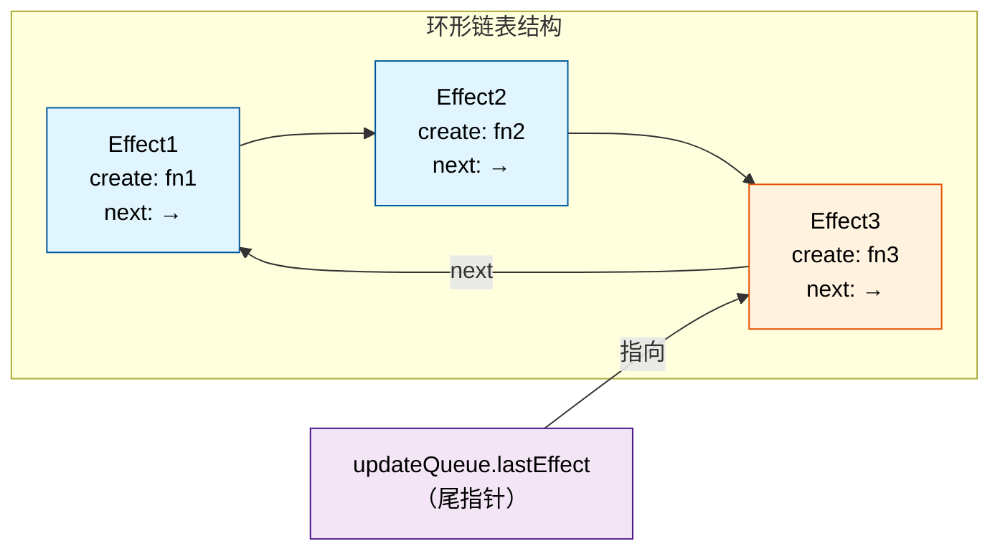
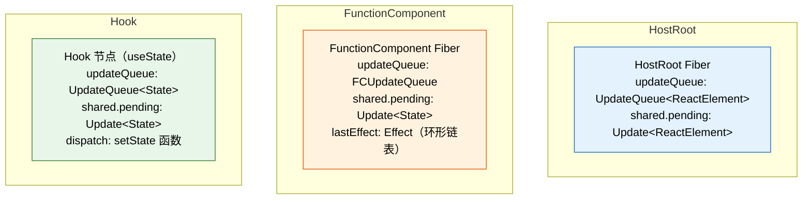
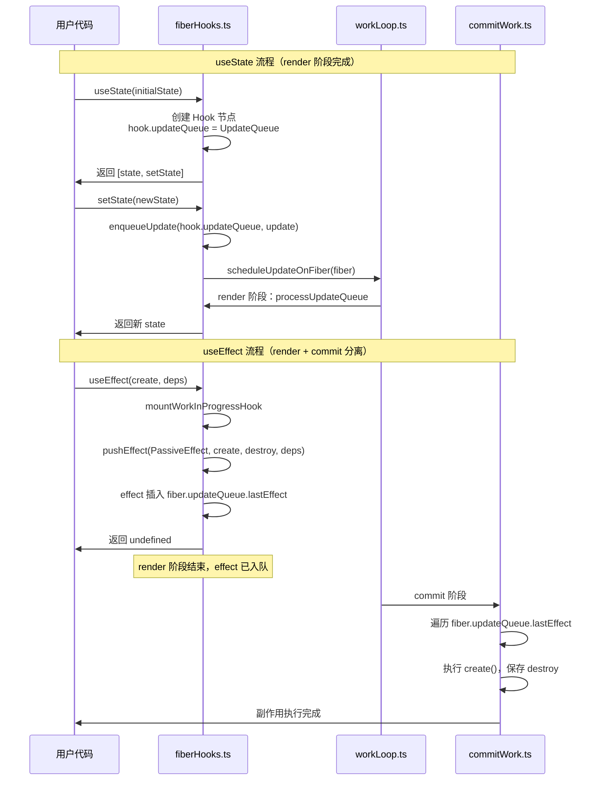
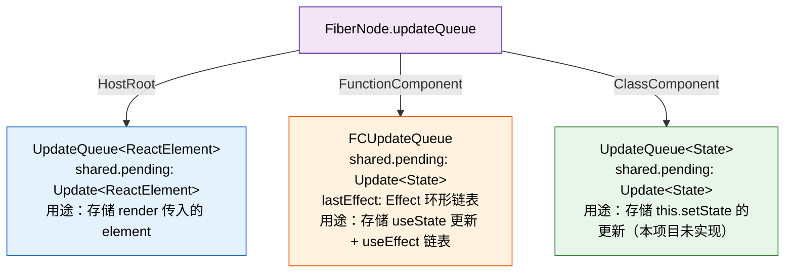

# useEffect 的存储设计：为什么保存在 fiber.updateQueue 上？

> 本文基于 Big-React 源码，深入剖析 `pushEffect` 的实现原理、`fiber.updateQueue` 的多重身份，以及 `useEffect` 与其他 Hook 的存储差异。

---

## 一、pushEffect 源码逐行解读

### 1.1 完整源码

```typescript
function pushEffect(
	hookFlags: Flags,
	create: EffectCallback | void,
	destroy: EffectCallback | void,
	deps: HookDeps
): Effect {
	// ① 创建 Effect 对象
	const effect: Effect = {
		tag: hookFlags,      // 副作用标记（如 PassiveEffect）
		create,              // 用户传入的回调：() => { ... }
		destroy,             // 清理函数（deps 变化时执行）
		deps,                // 依赖数组
		next: null           // 指向下一个 Effect，形成链表
	};

	// ② 获取当前正在渲染的函数组件 fiber
	const fiber = currentlyRenderingFiber as FiberNode;
	const updateQueue = fiber.updateQueue as FCUpdateQueue<any>;

	// ③ 如果 fiber 上还没有 updateQueue，先创建
	if (updateQueue === null) {
		const updateQueue = createFCUpdateQueue();
		fiber.updateQueue = updateQueue;
		effect.next = effect;           // 自环：指向自己
		updateQueue.lastEffect = effect; // lastEffect 指向唯一节点
	} else {
		// ④ 已有 updateQueue，将新 effect 插入环形链表
		const lastEffect = updateQueue.lastEffect;
		if (lastEffect === null) {
			// updateQueue 存在但还没有 effect（第一次调用 useEffect）
			effect.next = effect;
			updateQueue.lastEffect = effect;
		} else {
			// 已有 effect 链表，插入到尾部
			const firstEffect = lastEffect.next; // 保存头节点
			lastEffect.next = effect;            // 尾节点指向新 effect
			effect.next = firstEffect;           // 新 effect 指回头节点
			updateQueue.lastEffect = effect;     // 更新尾指针
		}
	}
	return effect;
}
```

### 1.2 核心设计：环形单向链表

`pushEffect` 维护的是一个 **环形单向链表**（Circular Singly Linked List），其结构特点：



**为什么用环形链表？**

| 特性 | 说明 |
|------|------|
| 快速定位头尾 | `lastEffect` 是尾，`lastEffect.next` 是头 |
| 尾插 O(1) | 不需要遍历，直接操作 `lastEffect.next` |
| 遍历方便 | 从头开始，`do...while` 回到头即结束 |

### 1.3 插入过程图解

假设组件中连续调用了两次 `useEffect`：

```typescript
useEffect(() => { console.log('A'); }, []);   // Effect_A
useEffect(() => { console.log('B'); }, []);   // Effect_B
```

**第一次调用 `pushEffect(Effect_A)`：**

```
fiber.updateQueue === null
  ↓
创建 FCUpdateQueue
  ↓
Effect_A.next = Effect_A  (自环)
lastEffect = Effect_A
  ↓
结果：  A ──→ A
        ↑_____|
       lastEffect
```

**第二次调用 `pushEffect(Effect_B)`：**

```
lastEffect = Effect_A
firstEffect = Effect_A.next = Effect_A
  ↓
Effect_A.next = Effect_B   (尾节点指向新节点)
Effect_B.next = Effect_A   (新节点指回头节点)
lastEffect = Effect_B      (更新尾指针)
  ↓
结果：  A ──→ B ──→ A
        ↑           |
        |___________|
       lastEffect = B
```

---

## 二、fiber.updateQueue 的多重身份

### 2.1 三种不同场景下的 updateQueue

`fiber.updateQueue` 并非单一用途，它在不同类型的 fiber 上承载完全不同的数据结构：



### 2.2 详细对比表

| 维度 | HostRoot 的 updateQueue | useState Hook 的 updateQueue | useEffect 的 updateQueue |
|------|------------------------|----------------------------|------------------------|
| **存储位置** | `fiber.updateQueue` | `hook.updateQueue` | `fiber.updateQueue` |
| **数据类型** | `UpdateQueue<ReactElement>` | `UpdateQueue<State>` | `FCUpdateQueue<State>` |
| **核心字段** | `shared.pending` | `shared.pending` + `dispatch` | `shared.pending` + `lastEffect` |
| **存储内容** | `Update<ReactElement>` | `Update<State>` | `Effect` 环形链表 |
| **消费时机** | `beginWork → updateHostRoot` | `renderWithHooks → updateState` | `commit 阶段` |
| **创建时机** | `createContainer` | `mountState` | `pushEffect`（首次调用 useEffect 时） |

### 2.3 代码层面的结构定义

```typescript
// ============ 基础 UpdateQueue ============
// updateQueue.ts
export interface UpdateQueue<State> {
	shared: {
		pending: Update<State> | null;   // 待处理的更新
	};
	dispatch: Dispatch<State> | null;  // 触发更新的函数
}

// ============ FCUpdateQueue（函数组件专用）============
// fiberHooks.ts
export interface FCUpdateQueue<State> extends UpdateQueue<State> {
	lastEffect: Effect | null;      // 指向 Effect 环形链表的尾部
	lastRenderedState: State;       // 上次渲染的 state
}

// ============ Effect 节点 ============
export interface Effect {
	tag: Flags;                     // 副作用标记（PassiveEffect 等）
	create: EffectCallback | void;  // useEffect 的第一个参数
	destroy: EffectCallback | void; // 清理函数
	deps: HookDeps;                 // 依赖数组
	next: Effect | null;            // 指向下一个 Effect
}
```

---

## 三、为什么 useEffect 要保存在 fiber.updateQueue 上？

### 3.1 设计原因分析

`useEffect` 与 `useState` 有本质区别，这决定了它们的存储位置不同：

| 特性 | useState | useEffect |
|------|----------|-----------|
| **数据归属** | 每个 Hook 独立拥有 state | 多个 useEffect 共享同一个 fiber |
| **触发时机** | render 阶段立即计算 | commit 阶段异步执行 |
| **数据结构** | 单个值（memoizedState） | 链表（多个 Effect） |
| **生命周期** | 跟随 Hook 节点 | 跟随组件实例（fiber） |

**核心原因：**

1. **组件级共享**：一个函数组件可以调用多次 `useEffect`，这些 Effect 需要统一管理，而不是分散在各个 Hook 节点中。

2. **commit 阶段统一处理**：`useEffect` 的回调在 commit 阶段执行，需要能够遍历组件的所有 Effect。保存在 `fiber.updateQueue` 上，commit 时可以直接通过 fiber 访问到完整的 Effect 链表。

3. **与 state 更新分离**：`useEffect` 不参与 render 阶段的 state 计算，它的"更新"（执行回调）发生在 commit 之后。将 Effect 链表与 `shared.pending` 分离，避免混淆。

### 3.2 流程对比图



### 3.3 真实代码中的消费场景

在 `commitWork.ts` 中，React 会遍历 `fiber.updateQueue.lastEffect` 来执行所有 `useEffect`：

```typescript
// 简化版 commit 阶段处理
function commitPassiveEffects(fiber: FiberNode) {
	const updateQueue = fiber.updateQueue as FCUpdateQueue<any>;
	const lastEffect = updateQueue.lastEffect;

	if (lastEffect !== null) {
		const firstEffect = lastEffect.next;
		let effect = firstEffect;

		do {
			// 执行 create，保存 destroy
			effect.destroy = effect.create();
			effect = effect.next;
		} while (effect !== firstEffect);
	}
}
```

---

## 四、fiber.updateQueue 还做过什么？

### 4.1 HostRoot：存储 ReactElement 更新

在 `createContainer` 和 `updateContainer` 中：

```typescript
// fiberReconciler.ts
export function createContainer(container: Container) {
	const hostRootFiber = new FiberNode(HostRoot, {}, null);
	const root = new FiberRootNode(container, hostRootFiber);
	hostRootFiber.updateQueue = createUpdateQueue();  // ← 创建 UpdateQueue
	return root;
}

export function updateContainer(element: ReactElementType, root: FiberRootNode) {
	const hostRootFiber = root.current;
	const lane = requestUpdateLane();
	const update = createUpdate<ReactElementType | null>(element, lane);
	enqueueUpdate(
		hostRootFiber.updateQueue as UpdateQueue<ReactElementType | null>,
		update
	);
	scheduleUpdateOnFiber(hostRootFiber, lane);
	return element;
}
```

在 `beginWork` 的 `updateHostRoot` 中消费：

```typescript
// beginWork.ts
function updateHostRoot(wip: FiberNode, renderLane: Lane) {
	const baseState = wip.memoizedState;
	const updateQueue = wip.updateQueue as UpdateQueue<Element>;
	const pending = updateQueue.shared.pending;

	updateQueue.shared.pending = null;
	const { memoizedState } = processUpdateQueue(baseState, pending, renderLane);
	wip.memoizedState = memoizedState;  // 得到 ReactElement

	const nextChildren = wip.memoizedState;
	reconcileChildren(wip, nextChildren);
	return wip.child;
}
```

### 4.2 三种用途汇总



---

## 五、关键设计总结

### 5.1 一句话回答你的问题

> **"pushEffect 是把 useEffect 的链表保存到了 fiber 的 updateQueue 上吗？"**

是的。`pushEffect` 将 `Effect` 节点插入到 `fiber.updateQueue.lastEffect` 维护的环形链表中。这个 `fiber` 就是当前正在渲染的函数组件的 fiber。

> **"它和之前的各个 hook 内部的 updateQueue 有什么相同点和区别？"**

| 对比项 | 相同点 | 区别 |
|--------|--------|------|
| 基础结构 | 都继承自 `UpdateQueue`，都有 `shared.pending` | `FCUpdateQueue` 多了 `lastEffect` |
| 存储位置 | 都是对象引用 | `useState` 存在 `hook.updateQueue`；`useEffect` 存在 `fiber.updateQueue` |
| 消费时机 | 都在 render 阶段被处理 | `useState` 在 `updateState` 中消费；`useEffect` 在 commit 阶段消费 |
| 数据内容 | 都是环形链表 | `useState` 存 `Update`；`useEffect` 存 `Effect` |

> **"为什么 useEffect 就要保存在 fiber 的 updateQueue 节点上？"**

因为 `useEffect` 是**组件级**的副作用，一个组件可以有多个 `useEffect`，它们需要统一管理、统一在 commit 阶段执行。保存在 `fiber` 上，commit 时可以直接通过 `fiber.updateQueue.lastEffect` 访问到完整的 Effect 链表。

> **"fiber 节点的 updateQueue 除了保存 useEffect 的链表还做过什么？"**

1. **HostRoot**：保存 `ReactElement` 的更新（`updateContainer` 入队，`updateHostRoot` 消费）
2. **FunctionComponent**：保存 `useState` 的更新（`shared.pending`）+ `useEffect` 的链表（`lastEffect`）

### 5.2 设计哲学

这种设计体现了 React 的 **"职责分离"** 原则：

- **`shared.pending`**：处理 **render 阶段** 的状态更新（同步、立即计算）
- **`lastEffect`**：处理 **commit 阶段** 的副作用执行（异步、延迟执行）

两者共享同一个 `updateQueue` 对象，但使用不同的字段，互不干扰。

---

## 六、参考代码索引

| 文件 | 关键内容 |
|------|---------|
| `packages/react-reconciler/src/fiberHooks.ts` | `pushEffect`、`mountEffect`、`FCUpdateQueue` |
| `packages/react-reconciler/src/updateQueue.ts` | `UpdateQueue`、`enqueueUpdate`、`processUpdateQueue` |
| `packages/react-reconciler/src/fiber.ts` | `FiberNode.updateQueue` 定义 |
| `packages/react-reconciler/src/fiberReconciler.ts` | `createContainer`、`updateContainer` |
| `packages/react-reconciler/src/beginWork.ts` | `updateHostRoot`、`updateFunctionComponent` |

---

*文档生成时间：2025-07-19*
*基于 Big-React 源码版本：workspace:*
