# useEffect 完整执行流程解析（基于 Big-React）

> 本文以一个最贴近面试场景的示例为线索，把 useEffect 从 **render 阶段构建 Effect 对象**、**completeWork 冒泡 flags**、**commit 阶段收集副作用**，到 **浏览器绘制后异步执行 create / destroy** 的全过程串起来。适合用来回答「useEffect 什么时候执行？依赖没变为什么不执行？cleanup 为什么先执行？卸载时怎么清理？」这类问题。

---

## 1. 贯穿全文的例子

```tsx
function Counter() {
	const [count, setCount] = useState(0);

	useEffect(() => {
		console.log('effect', count);
		return () => {
			console.log('cleanup', count);
		};
	}, [count]);

	return <div>{count}</div>;
}
```

下面的分析围绕三个场景展开：

1. **Mount**：`root.render(<Counter />)`，count 初始为 0。
2. **Update**：点击按钮 `setCount(1)`，count 从 0 变到 1。
3. **Unmount**：`<Counter />` 从父组件中消失。

---

## 2. 先认识四个核心结构

| 结构 | 文件位置 | 作用一句话 |
|---|---|---|
| `Effect` | [fiberHooks.ts](file:///d:/BaiduNetdiskDownload/B站卡颂从0实现React18/big-react/packages/react-reconciler/src/fiberHooks.ts#L44-L53) | 包装一个 useEffect：tag + create + destroy + deps + next |
| `FCUpdateQueue` | [fiberHooks.ts](file:///d:/BaiduNetdiskDownload/B站卡颂从0实现React18/big-react/packages/react-reconciler/src/fiberHooks.ts#L55-L58) | 函数组件专用队列，多一个 `lastEffect` 指向 Effect 环形链表尾部 |
| `PassiveEffect` / `PassiveMask` | [fiberFlags.ts](file:///d:/BaiduNetdiskDownload/B站卡颂从0实现React18/big-react/packages/react-reconciler/src/fiberFlags.ts#L25-L45) | 标记 fiber 及其子树含有 useEffect 副作用；`PassiveMask = PassiveEffect \| ChildDeletion` |
| `PendingPassiveEffects` | [fiber.ts](file:///d:/BaiduNetdiskDownload/B站卡颂从0实现React18/big-react/packages/react-reconciler/src/fiber.ts#L105-L110) | 挂在 `FiberRootNode` 上的两个数组：`unmount` 存卸载清理，`update` 存更新/挂载的 Effect |

还有 Effect 自己的 tag 位：

| 标记 | 文件位置 | 含义 |
|---|---|---|
| `Passive` | [hookEffectTags.ts](file:///d:/BaiduNetdiskDownload/B站卡颂从0实现React18/big-react/packages/react-reconciler/src/hookEffectTags.ts#L1-L2) | 表示这是一个 Passive Effect，也就是 useEffect |
| `HookHasEffect` | [hookEffectTags.ts](file:///d:/BaiduNetdiskDownload/B站卡颂从0实现React18/big-react/packages/react-reconciler/src/hookEffectTags.ts#L1-L2) | 表示本次更新这个 Effect **真的需要执行** create / destroy |

> 面试小技巧：deps 没变化时，React 不是不生成 Effect，而是生成一个 `tag = Passive`（没有 `HookHasEffect`）的 Effect；commit 阶段通过位运算过滤掉，跳过执行。

---

## 3. 阶段总览

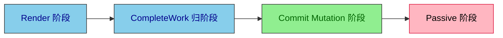

- **Render 阶段**：执行函数组件，调用 `mountEffect / updateEffect`，构建 / 复用 Effect 环形链表，决定 Effect 是否带 `HookHasEffect`。
- **CompleteWork 阶段**：自底向上冒泡 `flags` 和 `subtreeFlags`，让根节点知道子树里有 PassiveEffect。
- **Commit Mutation 阶段**：同步修改 DOM；遇到带 `PassiveEffect` 的函数组件 fiber，把 Effect 链表推入 `root.pendingPassiveEffects`。
- **Passive 阶段**：浏览器绘制后，异步执行所有 `destroy`，再执行所有 `create`。

---

## 4. Mount 全过程

### 4.1 触发渲染

用户调用 `root.render(<Counter />)` 后，进入 [performSyncWorkOnRoot](file:///d:/BaiduNetdiskDownload/B站卡颂从0实现React18/big-react/packages/react-reconciler/src/workLoop.ts#L127-L161)：

1. `prepareFreshStack(root, lane)` 创建 HostRoot 的 `workInProgress`。
2. `workLoop()` 进入 beginWork → completeWork 的「递 - 归」循环。

### 4.2 beginWork 执行到函数组件

HostRoot 的 beginWork 会消费 `<Counter />` 这个 ReactElement，然后进入函数组件的 beginWork：

```ts
function updateFunctionComponent(wip: FiberNode, renderLane: Lane) {
	const nextChildren = renderWithHooks(wip, renderLane);
	reconcileChildren(wip, nextChildren);
	return wip.child;
}
```

见 [beginWork.ts](file:///d:/BaiduNetdiskDownload/B站卡颂从0实现React18/big-react/packages/react-reconciler/src/beginWork.ts#L74-L78)。

### 4.3 renderWithHooks 切换 Dispatcher

[renderWithHooks](file:///d:/BaiduNetdiskDownload/B站卡颂从0实现React18/big-react/packages/react-reconciler/src/fiberHooks.ts#L76-L105) 做了三件关键的事：

1. 重置 `wip.memoizedState = null`、`wip.updateQueue = null`。
2. 因为 `wip.alternate === null`（首次渲染），把全局 Dispatcher 切到 `HookDispatcherOnMount`。
3. 执行 `Counter(props)`，函数体里遇到 `useEffect(...)`，实际走的是 `mountEffect`。

### 4.4 mountEffect 创建第一个 Effect

```ts
function mountEffect(create: EffectCallback | void, deps: HookDeps | void) {
	const hook = mountWorkInProgressHook();
	const nextDeps = deps === undefined ? null : deps;

	(currentlyRenderingFiber as FiberNode).flags |= PassiveEffect;
	hook.memoizedState = pushEffect(
		Passive | HookHasEffect,
		create,
		undefined,
		nextDeps
	);
}
```

见 [fiberHooks.ts](file:///d:/BaiduNetdiskDownload/B站卡颂从0实现React18/big-react/packages/react-reconciler/src/fiberHooks.ts#L121-L133)。

对例子来说：

- `hook.memoizedState` 就是这个 Effect 对象。
- `create` 是 `() => { console.log('effect', 0); return () => console.log('cleanup', 0); }`。
- `destroy = undefined`（还没有执行 create）。
- `deps = [0]`。
- `tag = Passive | HookHasEffect`，表示「本次需要执行」。
- **把函数组件 fiber 的 `flags` 或上了 `PassiveEffect`**，这是 commit 阶段能找到它的关键。

### 4.5 pushEffect 把 Effect 串成环形链表

一个函数组件里可能有多个 useEffect，`pushEffect` 把它们串成一个环形单向链表，尾巴用 `fiber.updateQueue.lastEffect` 保存。

```ts
function pushEffect(
	hookFlags: Flags,
	create: EffectCallback | void,
	destroy: EffectCallback | void,
	deps: HookDeps
): Effect {
	const effect: Effect = { tag: hookFlags, create, destroy, deps, next: null };
	const fiber = currentlyRenderingFiber as FiberNode;
	const updateQueue = fiber.updateQueue as FCUpdateQueue<any>;
	if (updateQueue === null) {
		const updateQueue = createFCUpdateQueue();
		fiber.updateQueue = updateQueue;
		effect.next = effect;
		updateQueue.lastEffect = effect;
	} else {
		const lastEffect = updateQueue.lastEffect;
		if (lastEffect === null) {
			effect.next = effect;
			updateQueue.lastEffect = effect;
		} else {
			const firstEffect = lastEffect.next;
			lastEffect.next = effect;
			effect.next = firstEffect;
			updateQueue.lastEffect = effect;
		}
	}
	return effect;
}
```

见 [fiberHooks.ts](file:///d:/BaiduNetdiskDownload/B站卡颂从0实现React18/big-react/packages/react-reconciler/src/fiberHooks.ts#L312-L346)。

单个 Effect 时结构很简单：

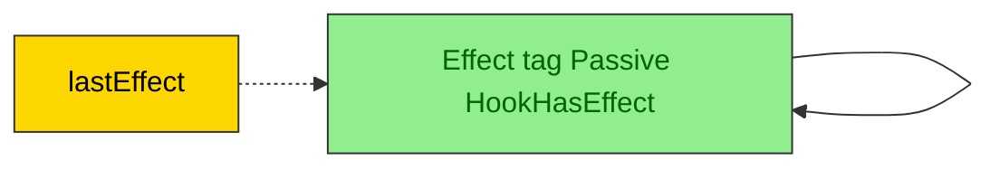

如果有多个 useEffect，则是 `A -> B -> C -> A`。

### 4.6 completeWork 冒泡 flags

函数组件的 [completeWork](file:///d:/BaiduNetdiskDownload/B站卡颂从0实现React18/big-react/packages/react-reconciler/src/completeWork.ts#L84-L86) 不创建 DOM，只调用 `bubbleProperties`：

```ts
function bubbleProperties(wip: FiberNode) {
	let subtreeFlags = NoFlags;
	let child = wip.child;
	while (child !== null) {
		subtreeFlags |= child.subtreeFlags;
		subtreeFlags |= child.flags;
		child.return = wip;
		child = child.sibling;
	}
	wip.subtreeFlags |= subtreeFlags;
}
```

见 [completeWork.ts](file:///d:/BaiduNetdiskDownload/B站卡颂从0实现React18/big-react/packages/react-reconciler/src/completeWork.ts#L142-L154)。

因为 Counter 函数组件 fiber 打了 `PassiveEffect`，所以它的父级、祖父级一直到 HostRoot 的 `subtreeFlags` 都会带上 `PassiveEffect`。`commitRoot` 一看根节点的 `subtreeFlags` 命中 `PassiveMask`，就知道本次需要调度 Passive 阶段。

### 4.7 commitRoot 调度 Passive 任务

```ts
if (
	(finishedWork.flags & PassiveMask) !== NoFlags ||
	(finishedWork.subtreeFlags & PassiveMask) !== NoFlags
) {
	if (!rootDoesHasPassiveEffects) {
		rootDoesHasPassiveEffects = true;
		scheduleCallback(NormalPriority, () => {
			flushPassiveEffects(root.pendingPassiveEffects);
			return;
		});
	}
}
```

见 [workLoop.ts](file:///d:/BaiduNetdiskDownload/B站卡颂从0实现React18/big-react/packages/react-reconciler/src/workLoop.ts#L192-L205)。

注意：**这一步只是「预约」Passive 任务，不会立即执行 useEffect 回调**。回调被 scheduler 以 `NormalPriority` 放进宏任务队列，等浏览器完成当前帧绘制后再执行。

### 4.8 commitMutationEffect 收集 Effect

在 commit 的 Mutation 子阶段，[commitMutationEffect](file:///d:/BaiduNetdiskDownload/B站卡颂从0实现React18/big-react/packages/react-reconciler/src/commitWork.ts#L88-L117) 遍历 finishedWork 树；对每个命中 `MutationMask | PassiveMask` 的 fiber 调用 [commitMutationEffectOnFiber](file:///d:/BaiduNetdiskDownload/B站卡颂从0实现React18/big-react/packages/react-reconciler/src/commitWork.ts#L170-L205)。

当命中 `PassiveEffect` 时：

```ts
if ((flags & PassiveEffect) !== NoFlags) {
	commitPassiveEffect(finishedWork, root, 'update');
	finishedWork.flags &= ~PassiveEffect;
}
```

[commitPassiveEffect](file:///d:/BaiduNetdiskDownload/B站卡颂从0实现React18/big-react/packages/react-reconciler/src/commitWork.ts#L232-L252) 只做一件事：把函数组件 fiber 的 `updateQueue.lastEffect` 推进 `root.pendingPassiveEffects.update`。

```ts
function commitPassiveEffect(
	fiber: FiberNode,
	root: FiberRootNode,
	type: keyof PendingPassiveEffects
) {
	if (
		fiber.tag !== FunctionComponent ||
		(type === 'update' && (fiber.flags & PassiveEffect) === NoFlags)
	) {
		return;
	}
	const updateQueue = fiber.updateQueue as FCUpdateQueue<any>;
	if (updateQueue !== null) {
		root.pendingPassiveEffects[type].push(updateQueue.lastEffect as Effect);
	}
}
```

### 4.9 浏览器绘制后 flushPassiveEffects 真正执行 create

等浏览器把 `<div>0</div>` 画到屏幕上之后，scheduler 取出任务，调用 [flushPassiveEffects](file:///d:/BaiduNetdiskDownload/B站卡颂从0实现React18/big-react/packages/react-reconciler/src/workLoop.ts#L286-L308)：

```ts
function flushPassiveEffects(pendingPassiveEffects: PendingPassiveEffects) {
	let didFlushPassiveEffect = false;

	// 1. 卸载清理
	pendingPassiveEffects.unmount.forEach((effect) => {
		didFlushPassiveEffect = true;
		commitHookEffectListUnmount(Passive, effect);
	});
	pendingPassiveEffects.unmount = [];

	// 2. 更新/挂载：先统一 destroy
	pendingPassiveEffects.update.forEach((effect) => {
		didFlushPassiveEffect = true;
		commitHookEffectListDestroy(Passive | HookHasEffect, effect);
	});

	// 3. 更新/挂载：再统一 create
	pendingPassiveEffects.update.forEach((effect) => {
		didFlushPassiveEffect = true;
		commitHookEffectListCreate(Passive | HookHasEffect, effect);
	});
	pendingPassiveEffects.update = [];

	flushSyncCallbacks();
	return didFlushPassiveEffect;
}
```

Mount 时 `unmount` 队列为空，`update` 队列里只有 Counter 的 Effect。因为 tag 带有 `HookHasEffect`：

- **destroy 阶段**：`effect.destroy` 是 `undefined`，`typeof destroy === 'function'` 为 false，跳过。
- **create 阶段**：[commitHookEffectListCreate](file:///d:/BaiduNetdiskDownload/B站卡颂从0实现React18/big-react/packages/react-reconciler/src/commitWork.ts#L460-L468) 执行 create，并把返回值赋给 `effect.destroy`：

```ts
export function commitHookEffectListCreate(flags: Flags, lastEffect: Effect) {
	commitHookEffectList(flags, lastEffect, (effect) => {
		const create = effect.create;
		if (typeof create === 'function') {
			effect.destroy = create();
		}
	});
}
```

所以第一次 mount：

```
console.log('effect', 0);     // 立即打印
// cleanup 0 被返回并保存到 effect.destroy
```

> 面试常考点：mount 时 cleanup 不会执行，只被保存起来，等 deps 变化或组件卸载时才执行。

### 4.10 Mount 阶段完整时序图

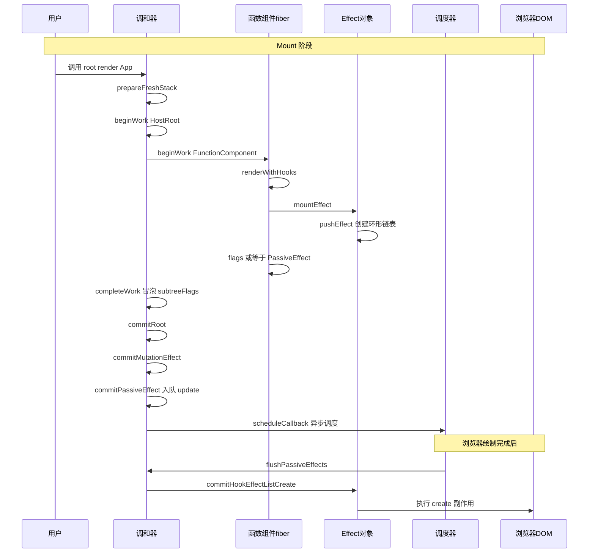

---

## 5. Update 全过程

### 5.1 再次触发渲染

用户点击按钮，调用 `setCount(1)`：

```ts
function dispatchSetState<State>(fiber, updateQueue, action) {
	const lane = requestUpdateLane();
	const update = createUpdate(action, lane);
	enqueueUpdate(updateQueue, update);
	scheduleUpdateOnFiber(fiber, lane);
}
```

进入 [performSyncWorkOnRoot](file:///d:/BaiduNetdiskDownload/B站卡颂从0实现React18/big-react/packages/react-reconciler/src/workLoop.ts#L127-L161)，重新走一遍 Render → CompleteWork → Commit。

### 5.2 renderWithHooks 这次走 update 分支

因为 `wip.alternate !== null`，Dispatcher 被切换为 `HookDispatcherOnUpdate`，useEffect 实际走的是 `updateEffect`。

### 5.3 updateEffect 对比 deps 并继承 destroy

```ts
function updateEffect(create: EffectCallback | void, deps: HookDeps | void) {
	const hook = updateWorkInProgressHook();
	const nextDeps = deps === undefined ? null : deps;
	let destroy: EffectCallback | void;

	if (currentHook !== null) {
		const prevEffect = currentHook.memoizedState as Effect;
		destroy = prevEffect.destroy;

		if (nextDeps !== null) {
			const prevDeps = prevEffect.deps;
			if (areHookInputsEqual(nextDeps, prevDeps)) {
				hook.memoizedState = pushEffect(Passive, create, destroy, nextDeps);
				return;
			}
		}

		(currentlyRenderingFiber as FiberNode).flags |= PassiveEffect;
		hook.memoizedState = pushEffect(
			Passive | HookHasEffect,
			create,
			destroy,
			nextDeps
		);
	}
}
```

见 [fiberHooks.ts](file:///d:/BaiduNetdiskDownload/B站卡颂从0实现React18/big-react/packages/react-reconciler/src/fiberHooks.ts#L181-L208)。

关键点拆解：

1. `updateWorkInProgressHook` 按顺序从旧 fiber（current）的 Hook 链表中取出对应 Hook。
2. 从 `currentHook.memoizedState` 拿到上次渲染保存的 `prevEffect`。
3. **`destroy = prevEffect.destroy`**：把上一次的 cleanup 函数继承下来。
4. 用 [areHookInputsEqual](file:///d:/BaiduNetdiskDownload/B站卡颂从0实现React18/big-react/packages/react-reconciler/src/fiberHooks.ts#L252-L263) 浅比较新 deps `[1]` 和旧 deps `[0]`。

```ts
function areHookInputsEqual(nextDeps: HookDeps, prevDeps: HookDeps) {
	if (prevDeps === null || nextDeps === null) {
		return false;
	}
	for (let i = 0; i < prevDeps.length && i < nextDeps.length; i++) {
		if (Object.is(prevDeps[i], nextDeps[i])) {
			continue;
		}
		return false;
	}
	return true;
}
```

对 `[1]` vs `[0]`，`Object.is(1, 0)` 为 false，返回 false，进入「deps 变化」分支。

### 5.4 deps 变化分支做了什么

- 给函数组件 fiber 再次打上 `PassiveEffect`。
- 调用 `pushEffect(Passive | HookHasEffect, create, destroy, [1])`。

此时的 `create` 是新的闭包：`() => { console.log('effect', 1); return () => console.log('cleanup', 1); }`。
此时的 `destroy` 是旧 cleanup：`() => console.log('cleanup', 0)`。

一个新的 Effect 对象被创建并加入环形链表，旧的 Effect 对象随旧 fiber 一起被丢弃，但 **cleanup 函数通过 `destroy` 字段被传递到新 Effect**。

### 5.5 deps 没变会怎样

如果第二次点击还是 `setCount(1)`，新 deps `[1]` 与旧 deps `[1]` 用 `Object.is` 比较完全相同，会进入这个分支：

```ts
hook.memoizedState = pushEffect(Passive, create, destroy, nextDeps);
return;
```

注意：

- `tag = Passive`，**没有 `HookHasEffect`**。
- 函数组件 fiber **不会被打上 `PassiveEffect`**。
- commit 阶段检测不到 PassiveEffect，不会入队，不会调度 flushPassiveEffects。
- 所以 useEffect 回调不会执行。

> 这就是「依赖没变 useEffect 不执行」的底层原因。

### 5.6 commit 阶段：先 destroy 再 create

因为 deps 变了，函数组件 fiber 有 `PassiveEffect`，和 Mount 一样被收集进 `pendingPassiveEffects.update`。

浏览器绘制后进入 [flushPassiveEffects](file:///d:/BaiduNetdiskDownload/B站卡颂从0实现React18/big-react/packages/react-reconciler/src/workLoop.ts#L286-L308)，执行顺序非常关键：

```ts
// 先统一 destroy
pendingPassiveEffects.update.forEach((effect) => {
	commitHookEffectListDestroy(Passive | HookHasEffect, effect);
});

// 再统一 create
pendingPassiveEffects.update.forEach((effect) => {
	commitHookEffectListCreate(Passive | HookHasEffect, effect);
});
```

[commitHookEffectListDestroy](file:///d:/BaiduNetdiskDownload/B站卡颂从0实现React18/big-react/packages/react-reconciler/src/commitWork.ts#L408-L415) 会执行上一次的 cleanup：

```ts
export function commitHookEffectListDestroy(flags: Flags, lastEffect: Effect) {
	commitHookEffectList(flags, lastEffect, (effect) => {
		const destroy = effect.destroy;
		if (typeof destroy === 'function') {
			destroy();
		}
	});
}
```

所以先打印 `cleanup 0`，然后 [commitHookEffectListCreate](file:///d:/BaiduNetdiskDownload/B站卡颂从0实现React18/big-react/packages/react-reconciler/src/commitWork.ts#L460-L468) 执行新的 create，打印 `effect 1`，并把 `() => console.log('cleanup', 1)` 保存到 `effect.destroy`。

> 面试常考点：同一个 useEffect 的 cleanup 和 create 之间，先清理旧副作用，再启动新副作用；父子组件之间也是先全部 cleanup，再全部 create。

### 5.7 Update 阶段完整时序图

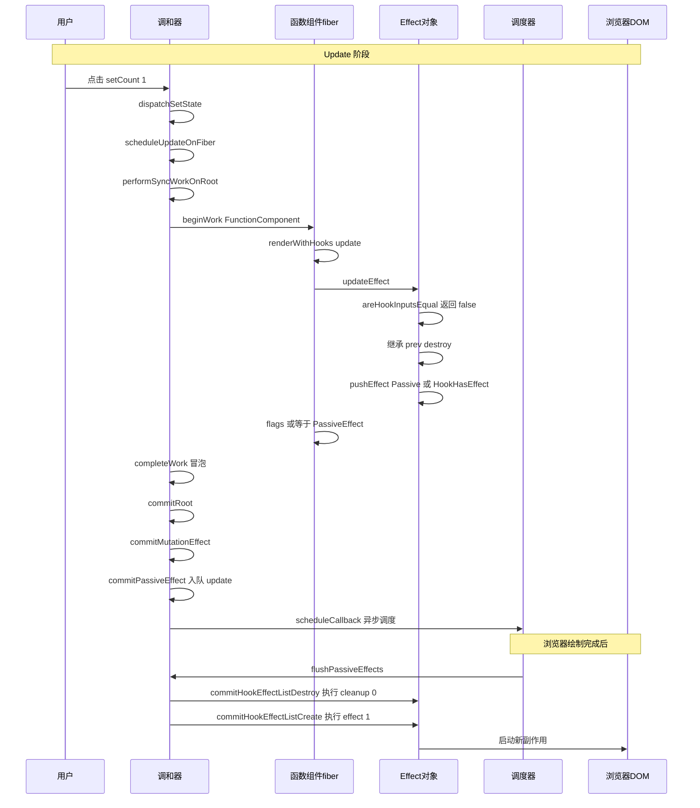

---

## 6. Unmount 全过程

### 6.1 父组件决定删除子树

假设父组件不再渲染 `<Counter />`，在 `reconcileChildFibers` 里旧 Counter fiber 会被标记为需要删除：

- 父 fiber 的 `flags |= ChildDeletion`
- 父 fiber 的 `deletions.push(oldCounterFiber)`

`ChildDeletion` 属于 `PassiveMask`，所以 [commitRoot](file:///d:/BaiduNetdiskDownload/B站卡颂从0实现React18/big-react/packages/react-reconciler/src/workLoop.ts#L170-L226) 同样会调度 Passive 任务。

### 6.2 commitMutationEffect 进入 commitDeletion

[commitMutationEffectOnFiber](file:///d:/BaiduNetdiskDownload/B站卡颂从0实现React18/big-react/packages/react-reconciler/src/commitWork.ts#L170-L205) 发现父 fiber 带有 `ChildDeletion`，遍历 `deletions` 数组，对每个子 fiber 调用 [commitDeletion](file:///d:/BaiduNetdiskDownload/B站卡颂从0实现React18/big-react/packages/react-reconciler/src/commitWork.ts#L617-L651)：

```ts
deletions.forEach((childToDelete) => {
	commitDeletion(childToDelete, root);
});
```

### 6.3 commitDeletion 收集 unmount Effect

`commitDeletion` 内部用 [commitNestedComponent](file:///d:/BaiduNetdiskDownload/B站卡颂从0实现React18/big-react/packages/react-reconciler/src/commitWork.ts#L689-L715) 深度优先遍历被删除的子树，对每个 fiber 执行卸载回调：

```ts
function commitDeletion(childToDelete: FiberNode, root: FiberRootNode) {
	commitNestedComponent(childToDelete, (unmountFiber) => {
		switch (unmountFiber.tag) {
			case HostComponent:
			case HostText:
				recordHostChildrenToDelete(...);
				return;
			case FunctionComponent:
				commitPassiveEffect(unmountFiber, root, 'unmount');
				return;
		}
	});
	// ...remove DOM
}
```

当遍历到函数组件 fiber 时，[commitPassiveEffect](file:///d:/BaiduNetdiskDownload/B站卡颂从0实现React18/big-react/packages/react-reconciler/src/commitWork.ts#L232-L252) 这次收到的 `type = 'unmount'`，会把 Effect 链表推进 `root.pendingPassiveEffects.unmount`。

### 6.4 flushPassiveEffects 执行 unmount 清理

浏览器绘制后，[flushPassiveEffects](file:///d:/BaiduNetdiskDownload/B站卡颂从0实现React18/big-react/packages/react-reconciler/src/workLoop.ts#L286-L308) 先处理 `unmount` 队列：

```ts
pendingPassiveEffects.unmount.forEach((effect) => {
	didFlushPassiveEffect = true;
	commitHookEffectListUnmount(Passive, effect);
});
```

[commitHookEffectListUnmount](file:///d:/BaiduNetdiskDownload/B站卡颂从0实现React18/big-react/packages/react-reconciler/src/commitWork.ts#L356-L365) 与 Destroy 的区别：

- 传入的 flags 是 `Passive`（不带 `HookHasEffect`），因为卸载时不关心 deps 是否变化，所有 useEffect 都要清理。
- 执行完 destroy 后，还会 `effect.tag &= ~HookHasEffect`，防止组件已卸载仍被误执行。

```ts
export function commitHookEffectListUnmount(flags: Flags, lastEffect: Effect) {
	commitHookEffectList(flags, lastEffect, (effect) => {
		const destroy = effect.destroy;
		if (typeof destroy === 'function') {
			destroy();
		}
		effect.tag &= ~HookHasEffect;
	});
}
```

对例子来说，会打印 `cleanup 1`（因为当前 `effect.destroy` 是引用 count=1 的 cleanup）。

### 6.5 Unmount 阶段完整时序图

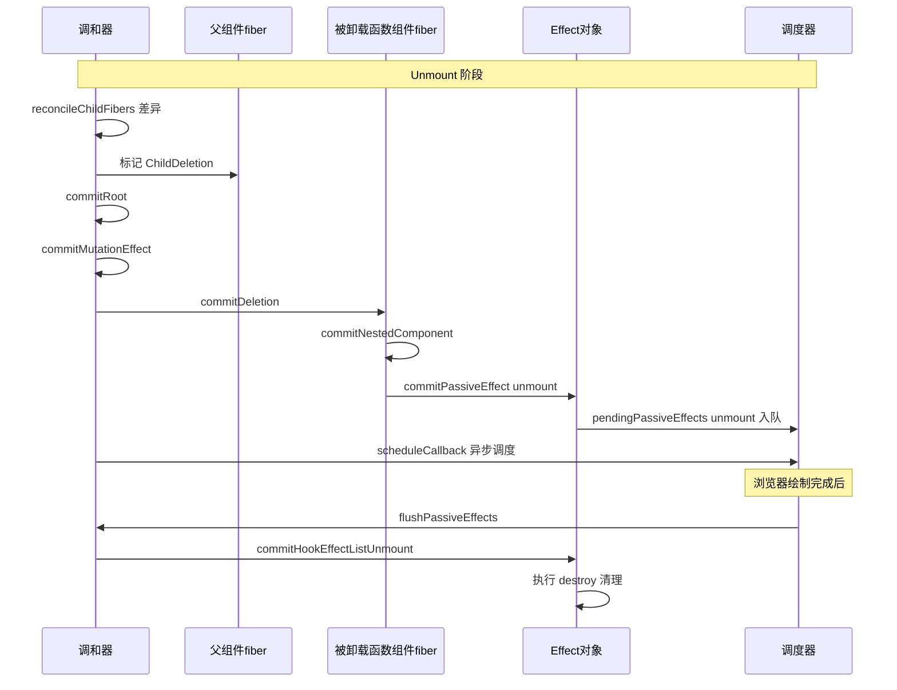

---

## 7. Effect 环形链表与过滤机制

[commitHookEffectList](file:///d:/BaiduNetdiskDownload/B站卡颂从0实现React18/big-react/packages/react-reconciler/src/commitWork.ts#L301-L314) 是遍历 Effect 链表的实际函数：

```ts
function commitHookEffectList(
	flags: Flags,
	lastEffect: Effect,
	callback: (effect: Effect) => void
) {
	let effect = lastEffect.next as Effect;
	do {
		if ((effect.tag & flags) === flags) {
			callback(effect);
		}
		effect = effect.next as Effect;
	} while (effect !== lastEffect.next);
}
```

它从 `lastEffect.next`（环头）开始遍历，对每个 Effect 做位运算：`(effect.tag & flags) === flags`。

假设组件有三个 useEffect：

```tsx
useEffect(() => {}, []);        // A，mount 时 tag = Passive | HookHasEffect
useEffect(() => {}, [count]);    // B，本次 deps 变了，tag = Passive | HookHasEffect
useEffect(() => {});            // C，无 deps，本次 deps 没变化，tag = Passive
```

环形链表：

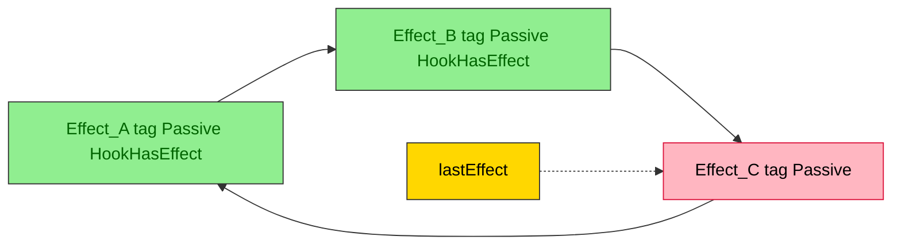

当调用 `commitHookEffectListCreate(Passive | HookHasEffect, lastEffect)` 时：

- A：`0b0011 & 0b0011 === 0b0011` ✅ 执行 create
- B：同上 ✅ 执行 create
- C：`0b0010 & 0b0011 = 0b0010` ❌ 不等于 0b0011，跳过

这就是 deps 没变化的 Effect 不会被执行的根本原因。

---

## 8. flushPassiveEffects 执行顺序再强调

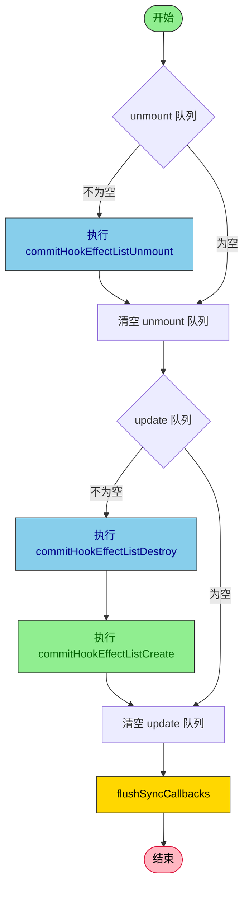

这个顺序是 React 保证副作用一致性的关键：

1. **先卸载**：被删除组件的 cleanup 先跑掉，避免和新组件抢资源。
2. **再统一 destroy**：所有需要重新执行的 Effect 的旧 cleanup 全部跑完。
3. **最后统一 create**：在干净的环境下启动新一轮副作用。

> 如果交错执行 `destroy → create → destroy → create`，后一个 destroy 可能把前一个 create 刚建立的状态清掉，导致副作用状态错乱。

---

## 9. 面试问答要点

### 9.1 useEffect 为什么是在 render 之后、绘制之后执行？

因为 useEffect 的回调收集发生在 commit Mutation 阶段之后，通过 `scheduleCallback(NormalPriority, ...)` 放到宏任务里，等浏览器完成当前帧绘制再执行。这样不会阻塞 DOM 提交和视觉呈现。

### 9.2 依赖没变时 useEffect 真的不执行吗？

Effect 对象还是会被创建并挂到 `fiber.updateQueue` 上，只是 `tag = Passive` 不带 `HookHasEffect`，fiber 也不打 `PassiveEffect`。commit 阶段过滤掉，所以 create / destroy 都不执行。

### 9.3 cleanup 为什么先执行？

在 [flushPassiveEffects](file:///d:/BaiduNetdiskDownload/B站卡颂从0实现React18/big-react/packages/react-reconciler/src/workLoop.ts#L286-L308) 中，update 队列要先经过 `commitHookEffectListDestroy` 再经过 `commitHookEffectListCreate`。这样保证旧副作用被清理后再启动新副作用。

### 9.4 为什么 deps 为空数组 `[]` 只在 mount 执行？

mount 时 deps 是 `[]`，pushEffect 的 deps 是 `[]`；之后每次 update，`prevDeps` 都是 `[]`，`nextDeps` 也是 `[]`，`areHookInputsEqual` 永远返回 true，所以不会带 `HookHasEffect`，不会执行。

### 9.5 没有 deps 数组为什么每次 render 都执行？

`deps === undefined` 时 `nextDeps = null`。在 `updateEffect` 中 `nextDeps !== null` 不成立，直接走「deps 变化」分支，每次都生成 `Passive | HookHasEffect`，每次都会执行。

### 9.6 组件卸载时 useEffect 怎么清理？

卸载时 [commitDeletion](file:///d:/BaiduNetdiskDownload/B站卡颂从0实现React18/big-react/packages/react-reconciler/src/commitWork.ts#L617-L651) 遍历子树，对函数组件 fiber 调用 `commitPassiveEffect(fiber, root, 'unmount')`，把 Effect 放进 `pendingPassiveEffects.unmount`，最后由 [commitHookEffectListUnmount](file:///d:/BaiduNetdiskDownload/B站卡颂从0实现React18/big-react/packages/react-reconciler/src/commitWork.ts#L356-L365) 执行所有 destroy。

---

## 10. 小结

| 阶段 | 关键函数 | 核心产出 |
|---|---|---|
| Render | `renderWithHooks` → `mountEffect / updateEffect` | Effect 环形链表、fiber `PassiveEffect` |
| CompleteWork | `bubbleProperties` | `subtreeFlags` 带上 `PassiveEffect` |
| Commit Mutation | `commitMutationEffectOnFiber` → `commitPassiveEffect` | 把 Effect 推入 `root.pendingPassiveEffects` |
| Passive | `flushPassiveEffects` → `commitHookEffectListDestroy / Create / Unmount` | 异步执行 cleanup 与 effect |

useEffect 的本质是：**render 阶段收集副作用，commit 阶段标记并收集，浏览器绘制后统一异步执行**。deps 比较、`HookHasEffect` 位标记、环形链表、以及「先 destroy 再 create」的执行顺序，共同构成了 React 副作用系统的核心机制。

---

## 11. 类组件生命周期完整解析（React 官方）

> 虽然 Big-React 目前只实现了函数组件，但面试中经常需要把类组件生命周期和 `useEffect` 做对比。下面按 React 16.3 之后官方推荐的「挂载 / 更新 / 卸载 / 错误处理」四个阶段，把类组件生命周期讲清楚。

### 11.1 生命周期三阶段总览

类组件的生命周期被 React 明确划分为三个阶段：

| 阶段 | 触发时机 | 包含的生命周期 |
|---|---|---|
| Mounting 挂载 | 组件首次被创建并插入到 DOM 中 | `constructor → static getDerivedStateFromProps → render → componentDidMount` |
| Updating 更新 | 组件因 props / state 变化而重新渲染 | `static getDerivedStateFromProps → shouldComponentUpdate → render → getSnapshotBeforeUpdate → componentDidUpdate` |
| Unmounting 卸载 | 组件从 DOM 中移除 | `componentWillUnmount` |
| Error Handling 错误处理 | 子组件渲染或生命周期抛错 | `static getDerivedStateFromError → componentDidCatch` |

> 旧的 `componentWillMount / componentWillReceiveProps / componentWillUpdate` 已被标记为 UNSAFE，不建议在新代码中使用，面试时可以一带而过。

### 11.2 Mounting 挂载阶段

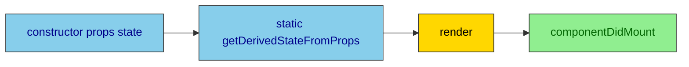

#### constructor

- 只会在挂载时调用一次。
- 适合做两件事：初始化 `this.state`、绑定事件处理函数的 `this`。
- 不要做：发起网络请求、订阅副作用、直接操作 DOM。

#### static getDerivedStateFromProps(nextProps, prevState)

- 在挂载和更新时都会调用，用于让 props 派生 state。
- 必须返回一个对象（用来更新 state）或 `null`（不更新）。
- 是静态方法，内部无法访问 `this`。
- 典型使用场景：根据 props 同步计算某个派生状态，例如受控组件把 props 映射到内部 state。

#### render

- 返回 JSX，描述当前组件要渲染的 UI。
- render 必须是纯函数：同样的 props + state 应该返回同样的 JSX，不要在这里做副作用。

#### componentDidMount

- 组件已经挂载到真实 DOM 后调用。
- 适合做：发起网络请求、订阅事件、操作 DOM、启动定时器。
- 这是类组件里**最常用的副作用入口**，和 `useEffect` 的语义最接近。

### 11.3 Updating 更新阶段

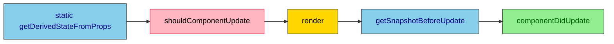

#### static getDerivedStateFromProps

- 和挂载阶段一样，根据新的 props 派生 state。

#### shouldComponentUpdate(nextProps, nextState)

- 返回 `true` 继续更新，返回 `false` 跳过本次更新。
- 用于性能优化，避免不必要的渲染。
- 可以和 `React.PureComponent` 或 `React.memo` 类比。

#### render

- 重新计算 JSX。

#### getSnapshotBeforeUpdate(prevProps, prevState)

- 在 render 输出提交到 DOM 之前调用。
- 可以读取当前 DOM 状态（如滚动位置），返回值会作为 `componentDidUpdate` 的第三个参数。

#### componentDidUpdate(prevProps, prevState, snapshot)

- DOM 已经更新完成后调用。
- 适合做：根据新的 props 重新请求数据、操作更新后的 DOM、对比前后状态做日志。
- 注意：在这里调用 `setState` 必须加条件判断，否则会死循环。

### 11.4 Unmounting 卸载阶段

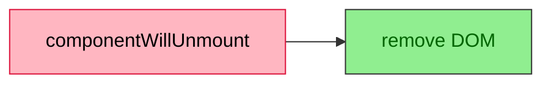

#### componentWillUnmount

- 组件从 DOM 中移除前调用。
- 适合做：取消网络请求、清除定时器、取消订阅、解绑事件监听。
- 和 `useEffect` 的 cleanup 函数语义完全一致。

### 11.5 Error Handling 错误处理阶段

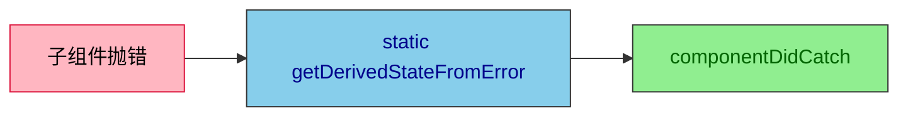

#### static getDerivedStateFromError(error)

- 子组件渲染或生命周期抛错时调用。
- 返回一个对象更新 state，用于渲染降级 UI。

#### componentDidCatch(error, info)

- 子组件抛错后调用，可以做日志上报、错误监控。

### 11.6 完整生命周期时序图

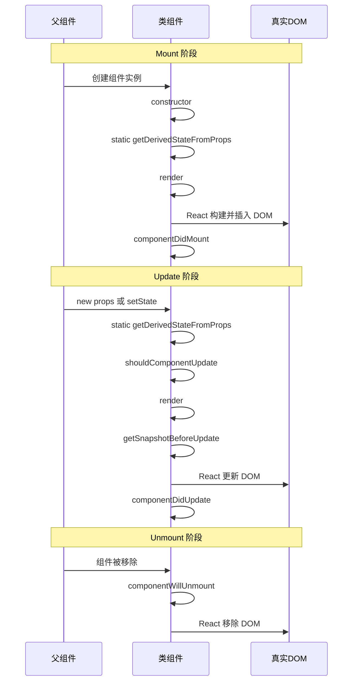

---

## 12. 类组件生命周期 vs useEffect 对比

### 12.1 核心对应关系

| 类组件生命周期 | 函数组件 Hook | 说明 |
|---|---|---|
| `constructor` | `useState` 的 initial state | 都只执行一次，用于初始化状态 |
| `static getDerivedStateFromProps` | `useEffect` 配合 deps | 用 props 派生 state，函数组件更推荐直接用 props 计算 |
| `shouldComponentUpdate` | `React.memo`、`useMemo`、`useCallback` | 控制重渲染 |
| `render` | 函数组件本身 | 都是根据 props / state 返回 JSX |
| `getSnapshotBeforeUpdate` | 无直接对应 | 需要时用 `useLayoutEffect` 读取 DOM，但语义不完全相同 |
| `componentDidMount` | `useEffect(() => {}, [])` | 都在 DOM 提交后执行副作用 |
| `componentDidUpdate` | `useEffect(() => {}, [deps])` | 都在更新后执行副作用，但 useEffect 会先执行 cleanup |
| `componentWillUnmount` | `useEffect(() => { return () => {} }, [])` | 清理副作用 |
| `componentDidCatch` | 无 | React 尚未为函数组件提供 Error Boundary 能力 |

### 12.2 执行时序对比

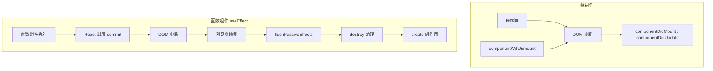

### 12.3 相似之处

1. **挂载时初始化副作用**
   - 类组件：`componentDidMount` 中发请求、订阅事件。
   - 函数组件：`useEffect(() => {...}, [])` 做同样的事。

2. **更新时响应变化**
   - 类组件：`componentDidUpdate(prevProps, prevState)` 中比较前后值，决定是否重新请求。
   - 函数组件：`useEffect(() => {...}, [deps])` 通过 deps 数组自动比较，决定是否执行。

3. **卸载时清理副作用**
   - 类组件：`componentWillUnmount` 中清理。
   - 函数组件：`useEffect` 返回的 cleanup 函数在卸载时执行。

4. **都不要阻塞渲染**
   - `componentDidMount / componentDidUpdate` 和 `useEffect` 都是在 DOM 提交之后执行，不会阻塞浏览器绘制。

### 12.4 不同之处

#### 1. 副作用拆分粒度不同

类组件把一个生命周期方法当成一个「大桶」：

```jsx
class Example extends React.Component {
	componentDidMount() {
		document.title = this.props.title;
		this.timer = setInterval(() => {}, 1000);
		this.subscription = someSource.subscribe(() => {});
	}

	componentWillUnmount() {
		clearInterval(this.timer);
		this.subscription.unsubscribe();
	}
}
```

不同副作用混在一起，逻辑耦合。

函数组件按逻辑拆分：

```tsx
function Example({ title }) {
	useEffect(() => {
		document.title = title;
	}, [title]);

	useEffect(() => {
		const timer = setInterval(() => {}, 1000);
		return () => clearInterval(timer);
	}, []);

	useEffect(() => {
		const subscription = someSource.subscribe(() => {});
		return () => subscription.unsubscribe();
	}, []);
}
```

每个 `useEffect` 只关心一个副作用，相关逻辑集中，可读性更高。

#### 2. cleanup 机制不同

类组件：

- `componentDidMount` 和 `componentWillUnmount` 是两个方法，共享实例变量（如 `this.timer`）。
- 更新时如果需要先清理再重建，要在 `componentDidUpdate` 里手动判断。

函数组件：

- cleanup 和 create 成对出现，天然靠近。
- 每次 deps 变化时，React 会自动先执行上一次的 cleanup，再执行新的 create。
- 不需要把状态挂到实例上，闭包自然捕获当前值。

#### 3. 执行时机不同

类组件：

- `componentDidMount / componentDidUpdate` 是同步在 commit 阶段执行，紧跟在 DOM 更新之后。

函数组件：

- `useEffect` 是异步调度，在浏览器绘制完成后才执行（Big-React 里通过 `scheduleCallback(NormalPriority, ...)` 实现）。
- 如果要同步读取 / 修改 DOM，需要用 `useLayoutEffect`，它在 DOM 提交后、浏览器绘制前同步执行。

#### 4. 依赖追踪方式不同

类组件：

- 生命周期方法里没有依赖数组。
- 需要在 `componentDidUpdate` 中手动比较 `prevProps.xxx !== this.props.xxx`。

```jsx
componentDidUpdate(prevProps) {
	if (prevProps.id !== this.props.id) {
		this.loadData(this.props.id);
	}
}
```

函数组件：

- `useEffect` 用 deps 数组声明依赖，React 自动比较。

```tsx
useEffect(() => {
	loadData(id);
}, [id]);
```

#### 5. this 与闭包

类组件：

- 依赖 `this.state`、`this.props`，需要小心 `this` 绑定问题。
- 生命周期方法访问的是「最新的实例属性」，而不是调用时捕获的值。

函数组件：

- 每次 render 都是一个新闭包，`useEffect` 的 create / cleanup 访问的是本次 render 时捕获的 props / state。
- 这也是为什么类组件里读 `this.props` 总是最新值，而函数组件里读到的可能是「过期闭包」。

### 12.5 面试一句话总结

> 类组件的生命周期是按组件生命阶段划分的一道道「时间门」；`useEffect` 则是按副作用逻辑划分的一组组「创建 - 清理」对，并通过依赖数组决定什么时候重新执行。两者都能处理副作用，但 useEffect 让副作用逻辑更内聚、依赖关系更声明式、执行时机更灵活。

---

## 13. 面试问答扩展

### 13.1 componentDidMount 和 useEffect 哪个先执行？

如果同一个组件里既有类组件的 `componentDidMount`，又有函数组件的 `useEffect`，它们不会同时存在（一个组件只能是类或函数）。

如果问的是父子组件：

- 类组件：`componentDidMount` 是自底向上执行，子组件先 mount，父组件后 mount。
- 函数组件：`useEffect` 也是自底向上执行，子组件 effect 先执行，父组件 effect 后执行。

所以整体执行顺序是一致的。

### 13.2 useEffect 能完全替代类组件生命周期吗？

大部分场景可以替代：

- `componentDidMount` → `useEffect(fn, [])`
- `componentDidUpdate` → `useEffect(fn, [deps])`
- `componentWillUnmount` → `useEffect 返回的 cleanup`

不能完全替代的：

- `getSnapshotBeforeUpdate`：函数组件没有直接对应 Hook，需要时用 `useLayoutEffect` 变通实现。
- `componentDidCatch / getDerivedStateFromError`：函数组件目前不能实现 Error Boundary。
- `shouldComponentUpdate`：函数组件用 `React.memo` + `useMemo` / `useCallback` 做类似优化。

### 13.3 useLayoutEffect 和 componentDidMount / componentDidUpdate 更像？

是的。`useLayoutEffect` 在 DOM 更新后、浏览器绘制前**同步执行**，执行时机和 `componentDidMount / componentDidUpdate` 更接近。`useEffect` 是在绘制后异步执行。

### 13.4 类组件更新时如何模拟 useEffect 的 cleanup？

需要在 `componentDidUpdate` 里手动比较前后 props / state，然后手动清理旧的副作用并启动新的副作用。

```jsx
componentDidUpdate(prevProps) {
	if (prevProps.id !== this.props.id) {
		// 先清理旧订阅
		this.subscription.unsubscribe();
		// 再建立新订阅
		this.subscription = source.subscribe(this.props.id);
	}
}
```

函数组件则自动完成：

```tsx
useEffect(() => {
	const subscription = source.subscribe(id);
	return () => subscription.unsubscribe();
}, [id]);
```

### 13.5 为什么函数组件能拿到过期闭包，类组件不会？

函数组件每次 render 都会重新执行整个函数，`useEffect` 的 create / cleanup 闭包捕获的是本次 render 的 props / state。

类组件的生命周期方法挂在原型上，访问 `this.props` 时拿到的是实例上最新的 props，不是调用时捕获的值。

```tsx
function Counter() {
	const [count, setCount] = useState(0);
	useEffect(() => {
		setTimeout(() => console.log(count), 3000);
	}, []);
	return <button onClick={() => setCount(c => c + 1)}>{count}</button>;
}
```

上面打印的永远是 0，因为 effect 只执行一次，闭包捕获了 mount 时的 count。

类组件版本：

```jsx
class Counter extends React.Component {
	componentDidMount() {
		setTimeout(() => console.log(this.props.count), 3000);
	}
}
```

上面打印的是最新的 `this.props.count`，因为 `this.props` 始终指向最新 props。

---

## 14. 小结

| 维度 | 类组件生命周期 | 函数组件 useEffect |
|---|---|---|
| 组织方式 | 按组件生命阶段 | 按副作用逻辑 |
| 副作用拆分 | 多个副作用集中在 didMount / didUpdate | 一个 useEffect 负责一个副作用 |
| cleanup | 在 willUnmount 中统一清理 | create 与 cleanup 成对出现，deps 变化自动清理 |
| 依赖比较 | 手动在 didUpdate 中比较 | deps 数组自动比较 |
| 执行时机 | didMount / didUpdate 同步执行 | useEffect 异步执行，useLayoutEffect 同步执行 |
| this / 闭包 | 访问 this.props / this.state | 访问捕获的闭包值，可能出现过期闭包 |

理解类组件生命周期和 `useEffect` 的异同，有助于在面试中讲清楚「为什么 React 要引入 Hooks」以及「Hooks 解决了类组件的哪些问题」。
