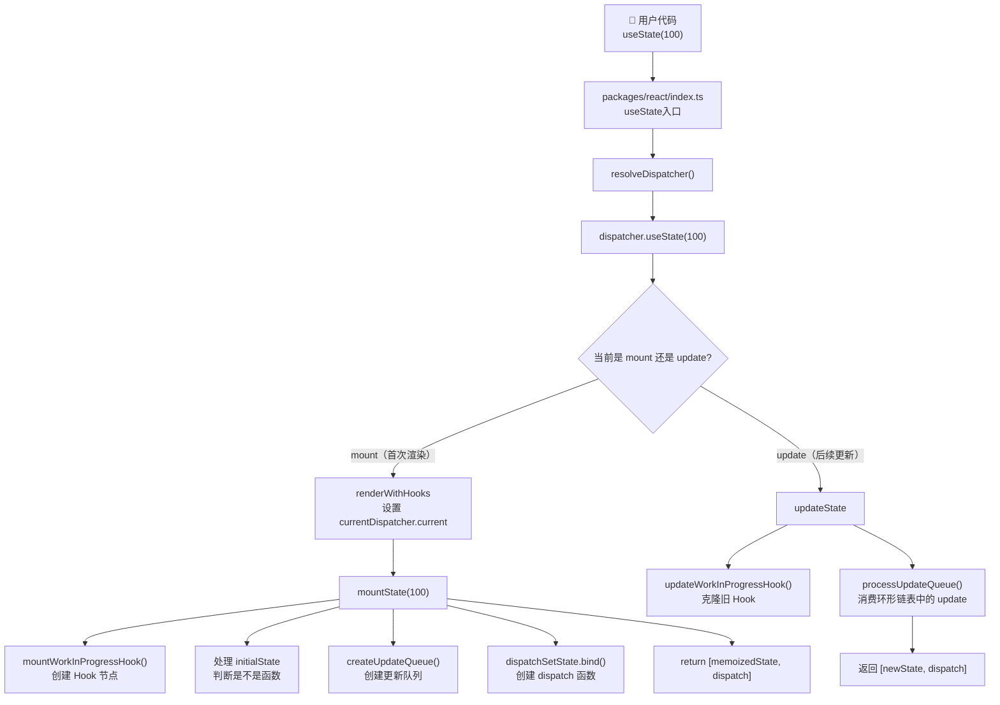
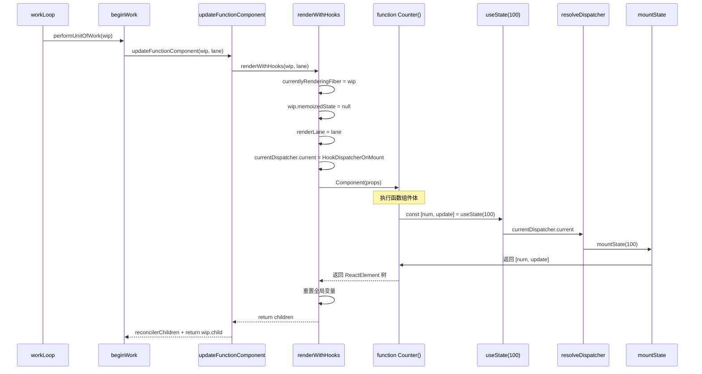
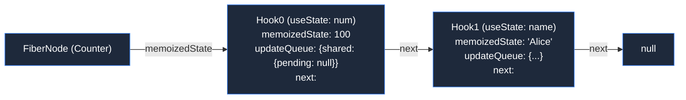
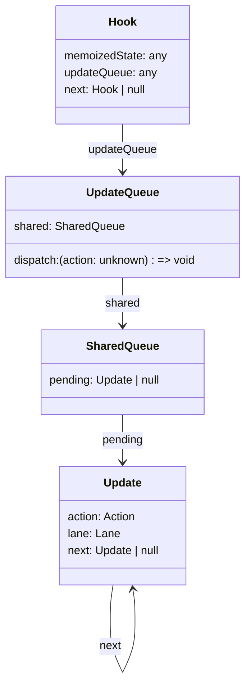
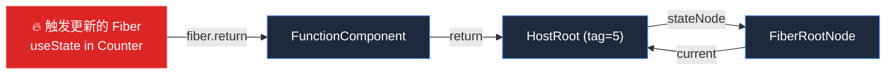
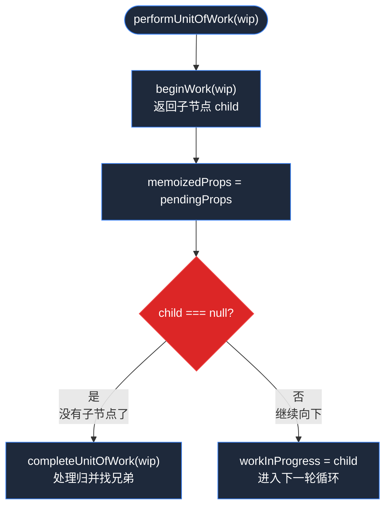
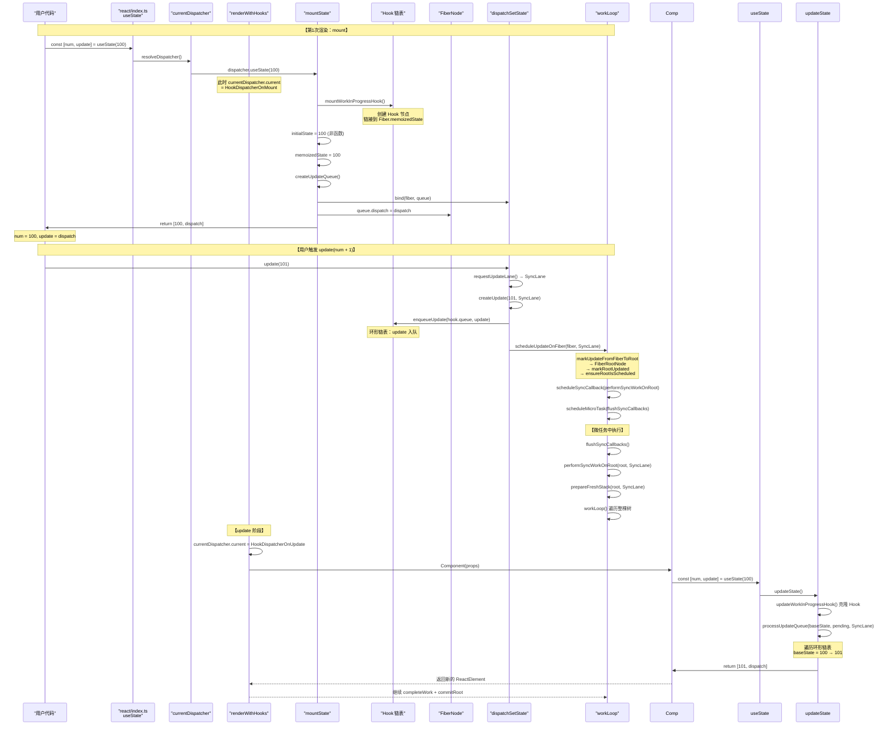
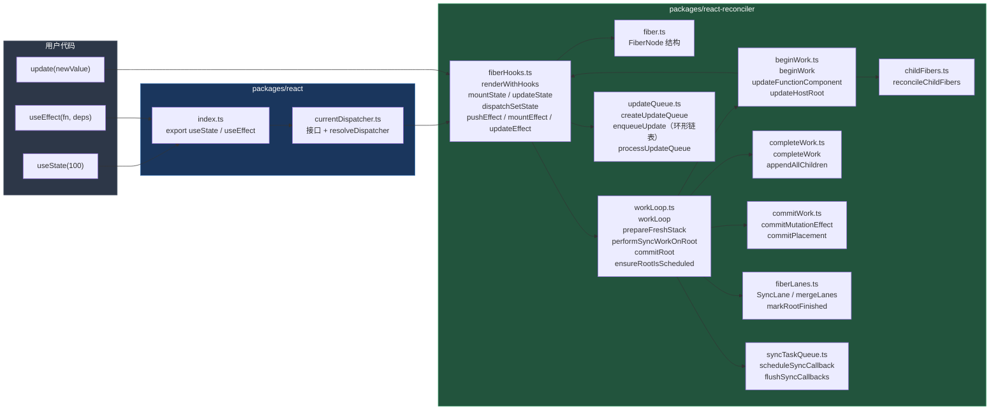

# useState 运作流程全解

> 结合 Big-React 源码一行行解释 `const [num, update] = useState<number>(100)` 从调用到渲染到 DOM 的完整链路。

---

## 一、总览：全链路流程图



---

## 二、入口层：`packages/react/index.ts`

```typescript
// packages/react/index.ts 第7~12行
export const useState: Dispatcher['useState'] = (initialState) => {
	debugger
	const dispatcher = resolveDispatcher();

	return dispatcher.useState(initialState);
};
```

**逐行解释：**

| 行号 | 代码 | 作用 |
|------|------|------|
| 7 | `export const useState: Dispatcher['useState']` | 从 `Dispatcher` 接口推导泛型类型，保证对外暴露的 `useState` 签名和内部一致 |
| 8 | `debugger` | 开发调试断点 |
| 9 | `const dispatcher = resolveDispatcher()` | 从全局单例 `currentDispatcher.current` 取出当前激活的 `Dispatcher` 对象 |
| 11 | `return dispatcher.useState(initialState)` | 调用真正干活的方法——mount 阶段是 `mountState`，update 阶段是 `updateState` |

### `resolveDispatcher` 做了什么？

```typescript
// packages/react/src/currentDispatcher.ts 第13~18行
export const resolveDispatcher = (): Dispatcher => {
	const dispatcher = currentDispatcher.current;
	if (dispatcher === null) {
		throw new Error('hook 只能在 函数组件中执行');
	}
	return dispatcher;
};
```

关键：**`currentDispatcher.current` 在 `renderWithHooks` 中被赋值**，如果在函数组件外调用 `useState`，这个值就是 `null`，直接抛错。

### `currentDispatcher` 全局单例

```typescript
// packages/react/src/currentDispatcher.ts 第3~11行
export interface Dispatcher {
	useState: <T>(initialState: (() => T) | T) => [T, Dispatch<T>];
	useEffect: (create: EffectCallback | void, deps: HookDeps | void) => void;
}

export type Dispatch<State> = (action: Action<State>) => void;

const currentDispatcher: { current: Dispatcher | null } = {
	current: null
};
```

`Dispatcher` 接口定了 `useState` 和 `useEffect` 的签名。`Dispatch<State>` 就是 `useState` 返回的第二个参数的类型。

---

## 三、第一次渲染开始时：`renderWithHooks`

组件首次渲染时，React reconciler 从 `beginWork` 进入 `updateFunctionComponent`，再调用 `renderWithHooks`。

```typescript
// packages/react-reconciler/src/fiberHooks.ts 第76~102行
export function renderWithHooks(wip: FiberNode, lane: Lane) {
	// ① 赋值，让 fiberHooks 知道当前在处理哪个 Fiber
	currentlyRenderingFiber = wip;
	// ② 清空 memoizedState，mount 时 hook 链表要重新构建
	wip.memoizedState = null;
	// ③ 记录本次 render 的 lane，供 processUpdateQueue 过滤 update
	renderLane = lane;
	// ④ 获取 alternate（即已渲染的 current 树）
	const current = wip.alternate;
	if (current !== null) {
		// ⑤ 更新 → 切换为 HookDispatcherOnUpdate
		currentDispatcher.current = HookDispatcherOnUpdate;
	} else {
		// ⑥ mount：设置当前 Dispatcher 为 HookDispatcherOnMount
		currentDispatcher.current = HookDispatcherOnMount;
	}

	// ⑦ 执行函数组件！所有 useState 都在这一行被调用
	const Component = wip.type;
	const props = wip.pendingProps;
	const children = Component(props);

	// ⑧ 重置，避免 hook 泄露到其他组件
	currentlyRenderingFiber = null;
	workInProgressHook = null;
	currentHook = null;
	renderLane = NoLane;
	return children;
}
```

**逐行解释：**

| 行号 | 代码 | 作用 |
|------|------|------|
| 78 | `currentlyRenderingFiber = wip` | 保存当前正在处理的 Fiber，后续 `mountState` / `updateState` 需要这个引用把 Hook 挂到 Fiber 上 |
| 79 | `wip.memoizedState = null` | **清空** `memoizedState`。每次 render 都重新构建 Hook 链表 |
| 80 | `renderLane = lane` | 记录本次 render 的优先级 lane，`processUpdateQueue` 只消费对应 lane 的 update |
| 82~84 | `if (current !== null) { ... }` | **update 分支**：有 alternate，说明是更新，切换 Dispatcher 为 `HookDispatcherOnUpdate` |
| 85~88 | `else { ... currentDispatcher.current = HookDispatcherOnMount }` | **mount 分支**：无 alternate，是首次渲染 |
| 91~94 | `const children = Component(props)` | **⭐ 关键**：执行函数组件，此时组件体内的所有 `useState` 调用都会触发 `mountState` 或 `updateState` |
| 97~100 | 重置四个全局变量 | 防止状态泄露到下一个组件 |

### 设置 Dispatcher

```typescript
// fiberHooks.ts 第104~111行
const HookDispatcherOnMount: Dispatcher = {
	useState: mountState,
	useEffect: mountEffect
};
const HookDispatcherOnUpdate: Dispatcher = {
	useState: updateState,
	useEffect: updateEffect
};
```

mount 阶段 `useState` 映射到 `mountState`，update 阶段映射到 `updateState`。

### 时序图：renderWithHooks 调用过程



---

## 四、核心实现：`mountState`

```typescript
// packages/react-reconciler/src/fiberHooks.ts 第410~429行
function mountState<State>(
	initialState: (() => State) | State
): [State, Dispatch<State>] {
	const hook = mountWorkInProgressHook();              // ① 创建 Hook 节点
	let memoizedState: State;
	if (initialState instanceof Function) {                // ② 处理 initialState
		memoizedState = initialState();
	} else {
		memoizedState = initialState;
	}
	const queue = createUpdateQueue<State>();              // ③ 创建更新队列
	hook.updateQueue = queue;
	hook.memoizedState = memoizedState;                    // ④ 保存到 Hook

	// ⑤ 创建 dispatch 函数（提前绑定 fiber 和 queue）
	const dispatch = dispatchSetState.bind(
		null,
		currentlyRenderingFiber,
		queue
	);
	queue.dispatch = dispatch;
	return [memoizedState, dispatch];                      // ⑥ 返回 [state, setState]
}
```

**逐行解释：**

| 行号 | 代码 | 作用 |
|------|------|------|
| 413 | `const hook = mountWorkInProgressHook()` | **创建 Hook 节点并链接到 Fiber 的 `memoizedState` 链表** |
| 414 | `let memoizedState: State` | 临时变量，用来存放最终确定的初始值 |
| 416~420 | `if (initialState instanceof Function) { ... } else { ... }` | 判断 `initialState` 是不是函数。用 `instanceof Function` 而不是 `typeof === 'function'`（跨 realm 更可靠） |
| 421 | `const queue = createUpdateQueue<State>()` | 创建 Hook 专属的更新队列 |
| 422 | `hook.updateQueue = queue` | 把队列挂到 Hook 上 |
| 423 | `hook.memoizedState = memoizedState` | **保存初始值到 Hook**，这是后续 update 时计算新 state 的 baseState |
| 426 | `const dispatch = dispatchSetState.bind(null, currentlyRenderingFiber, queue)` | **提前绑定 fiber 和 queue**，这样用户调用 `update(num)` 时就不需要再传 |
| 428 | `return [memoizedState, dispatch]` | 返回 `[当前值, 调度器]` |

### 4.1 `mountWorkInProgressHook` — 创建 Hook 链表

```typescript
// packages/react-reconciler/src/fiberHooks.ts 第528~544行
function mountWorkInProgressHook(): Hook {
	const hook: Hook = { memoizedState: null, updateQueue: null, next: null };
	if (workInProgressHook === null) {
		// 第一个 Hook：链接到 Fiber
		if (currentlyRenderingFiber === null) {
			throw new Error('请在函数组件内调用hook');
		} else {
			workInProgressHook = hook;
			currentlyRenderingFiber.memoizedState = workInProgressHook;
		}
	} else {
		// 后续 Hook：追加到链表尾部
		workInProgressHook.next = hook;
		workInProgressHook = hook;
	}

	return workInProgressHook;
}
```

**逐行解释：**

| 行号 | 代码 | 作用 |
|------|------|------|
| 529 | `const hook = { memoizedState: null, updateQueue: null, next: null }` | 创建 Hook 节点，`memoizedState` 存 state 值，`updateQueue` 存更新队列，`next` 指向下一个 Hook |
| 530 | `if (workInProgressHook === null)` | 判断是不是当前组件第一个 Hook |
| 531~535 | `currentlyRenderingFiber === null → throw` | 双重校验：如果真的在组件外调用，`currentlyRenderingFiber` 是 null |
| 534~535 | `workInProgressHook = hook; fiber.memoizedState = workInProgressHook` | 第一个 Hook：`Fiber.memoizedState` 指向第一个 Hook |
| 537~539 | `else { workInProgressHook.next = hook; workInProgressHook = hook }` | 后续 Hook：追加到链表尾部，`workInProgressHook` 后移 |

**图示：Hook 链表结构**



### 4.2 处理 initialState

```typescript
// fiberHooks.ts 第416~420行
let memoizedState: State;
if (initialState instanceof Function) {    // instanceof 判断可安全处理继承关系
	memoizedState = initialState();        // 传入函数时：initialState = () => 100
} else {
	memoizedState = initialState;         // 传入普通值时：initialState = 100
}
```

为什么用 `instanceof Function` 而不是 `typeof === 'function'`？
- 评论区写的是"这里不能使用 typeof"——这是因为 `typeof` 在某些跨 iframe/跨 realm 场景下不够可靠，`instanceof` 对继承链的处理更完整。

### 4.3 `createUpdateQueue` — 创建更新队列

```typescript
// packages/react-reconciler/src/updateQueue.ts 第44~51行
export const createUpdateQueue = <State>() => {
	return {
		shared: {
			pending: null
		},
		dispatch: null
	} as UpdateQueue<State>;
};
```

创建一个更新队列，`shared.pending` 用来存放待处理的更新。**当前版本是环形单向链表**，支持多个 update 按顺序入队。



### 4.4 创建 dispatch 函数

```typescript
// fiberHooks.ts 第426~427行
const dispatch = dispatchSetState.bind(
	null,
	currentlyRenderingFiber,    // 提前绑定 fiber（当前正在渲染的 Fiber）
	queue                        // 提前绑定 hook.updateQueue
);
queue.dispatch = dispatch;
```

**为什么要 bind？** 因为用户写 `update(num)` 时只需要传一个 `action` 参数。通过 `bind` 提前绑定了 `fiber` 和 `queue`，最终 `dispatch` 函数签名变成了 `(action)`。

### 4.5 最终返回

```typescript
return [memoizedState, dispatch];
```

- `memoizedState` = `100`（用户传入的初始值）
- `dispatch` = 绑定了 fiber 和 queue 的 `dispatchSetState` 函数

**用户代码 `const [num, update] = useState<number>(100)` 的结果：**
- `num` = `100`
- `update` = `dispatchSetState.bind(null, currentFiber, hookQueue)`

---

## 五、更新阶段：`updateState` + `updateWorkInProgressHook`

当组件第二次渲染时（由 `dispatchSetState` 触发），`renderWithHooks` 检测到 `wip.alternate !== null`，切换 Dispatcher 为 `HookDispatcherOnUpdate`，`useState` 实际调用 `updateState`。

### 5.1 `updateState` — 计算新状态

```typescript
// packages/react-reconciler/src/fiberHooks.ts 第381~399行
function updateState<State>(): [State, Dispatch<State>] {
	const hook = updateWorkInProgressHook();           // ① 克隆旧 Hook

	// ② 计算新的 State
	const queue = hook.updateQueue as UpdateQueue<State>;
	const pending = queue.shared.pending;
	queue.shared.pending = null;                       // ③ 清空 pending
	if (pending !== null) {
		const { memoizedState } = processUpdateQueue(
			hook.memoizedState as State,                // ④ baseState = 旧值
			pending,
			renderLane                                  // ⑤ 只消费当前 lane 的 update
		);
		hook.memoizedState = memoizedState;             // ⑥ 写入新值
	}

	return [hook.memoizedState, queue.dispatch as Dispatch<State>];
}
```

**逐行解释：**

| 行号 | 代码 | 作用 |
|------|------|------|
| 382 | `const hook = updateWorkInProgressHook()` | 从 current fiber 的 Hook 链表中克隆对应位置的 Hook 到 wip |
| 385 | `const queue = hook.updateQueue` | 取出更新队列 |
| 386 | `const pending = queue.shared.pending` | 获取环形链表的尾部（最新入队的 update） |
| 387 | `queue.shared.pending = null` | **消费前清空**，防止重复消费 |
| 388~395 | `if (pending !== null) { ... processUpdateQueue ... }` | 有 update 时计算新 state |
| 389~393 | `processUpdateQueue(hook.memoizedState, pending, renderLane)` | 以旧 state 为 base，按顺序应用所有 action |
| 398 | `return [hook.memoizedState, queue.dispatch]` | dispatch 复用 mount 时 bind 的那个 |

### 5.2 `updateWorkInProgressHook` — 克隆旧 Hook

```typescript
// packages/react-reconciler/src/fiberHooks.ts 第461~521行
function updateWorkInProgressHook(): Hook {
	let nextCurrentHook: Hook | null = null;

	// ① 确定要对比的旧 Hook
	if (currentHook === null) {
		// 第一个 Hook：从 current fiber 的 memoizedState 取
		const current = currentlyRenderingFiber?.alternate;
		if (current !== null) {
			nextCurrentHook = current?.memoizedState;
		} else {
			nextCurrentHook = null;  // 不可能发生
		}
	} else {
		// 后续 Hook：取 currentHook.next
		nextCurrentHook = currentHook.next;
	}

	// ② 边界检查：update 时 hook 数量不能比 mount 多
	if (nextCurrentHook === null) {
		throw new Error(
			`组件 ${currentlyRenderingFiber?.type.name} 本次执行时的Hook比上次执行时多`
		);
	}

	// ③ 移动指针
	currentHook = nextCurrentHook as Hook;

	// ④ 克隆 Hook（共享 memoizedState 和 updateQueue，但 next 重新链接）
	const newHook: Hook = {
		memoizedState: currentHook.memoizedState,
		updateQueue: currentHook.updateQueue,
		next: null
	};

	// ⑤ 链接到 wip 的 Hook 链表
	if (workInProgressHook === null) {
		workInProgressHook = newHook;
		currentlyRenderingFiber!.memoizedState = workInProgressHook;
	} else {
		workInProgressHook.next = newHook;
		workInProgressHook = newHook;
	}

	return workInProgressHook;
}
```

**核心逻辑：** 按顺序从旧 fiber 的 Hook 链表中取出对应位置的 Hook，**克隆**（不是复用）到 wip 的 Hook 链表中。`memoizedState` 和 `updateQueue` 是共享引用（所以 update 能拿到旧值和队列），但 `next` 指针重新链接。

**为什么克隆而不是复用？** 因为 wip 树和 current 树是双缓冲结构，不能直接修改 current 树的 Hook 链表。

**Hook 数量检查：** 如果 `nextCurrentHook === null`，说明 update 时调用了比 mount 更多的 Hook（比如把 Hook 写进了 if 分支），直接抛错。

### 5.3 `processUpdateQueue` — 消费环形链表

```typescript
// packages/react-reconciler/src/updateQueue.ts 第130~165行
export const processUpdateQueue = <State>(
	baseState: State,
	pendingUpdate: Update<State> | null,
	renderLane: Lane
): { memoizedState: State } => {
	const result = { memoizedState: baseState };

	if (pendingUpdate !== null) {
		// 环形链表：pendingUpdate 指向最晚入队的，pendingUpdate.next 指向最先入队的
		const first = pendingUpdate.next;
		let pending = pendingUpdate.next as Update<any>;

		do {
			const updateLane = pending?.lane;
			if (updateLane === renderLane) {
				const action = pending.action;
				if (action instanceof Function) {
					baseState = action(baseState);   // 函数式更新
				} else {
					baseState = action;            // 直接替换
				}
			}
			pending = pending?.next as Update<any>;
		} while (pending !== first);
	}

	result.memoizedState = baseState;
	return result;
};
```

**环形链表遍历：**
- `pending` 始终指向**最后一个**入队的 update（tail）
- `pending.next` 指向**第一个**入队的 update（head）
- 从 head 开始 `do...while` 遍历，直到回到 head，完成整个环的消费

**Lane 过滤：** 只有 `updateLane === renderLane` 的 update 才会被消费。当前代码中 `requestUpdateLane()` 始终返回 `SyncLane`，所以所有 update 都会被消费。

---

## 六、用户调用 `update(num)` 时：`dispatchSetState`

当用户执行 `update(num + 1)` 时触发：

```typescript
// packages/react-reconciler/src/fiberHooks.ts 第443~452行
function dispatchSetState<State>(
	fiber: FiberNode,
	updateQueue: UpdateQueue<State>,
	action: Action<State>
) {
	const lane = requestUpdateLane();              // ① 获取当前优先级（当前固定 SyncLane）
	const update = createUpdate(action, lane);     // ② 创建 Update 对象
	enqueueUpdate(updateQueue, update);            // ③ 入队到环形链表
	scheduleUpdateOnFiber(fiber, lane);            // ④ 调度更新
}
```

### 6.1 创建 Update

```typescript
// updateQueue.ts 第29~38行
export const createUpdate = <State>(
	action: Action<State>,
	lane: Lane
): Update<State> => {
	return {
		action,      // 新值 或 (prevState) => 新值
		lane,        // 优先级
		next: null   // 环形链表指针
	};
};
```

### 6.2 入队（环形单向链表）

```typescript
// updateQueue.ts 第105~121行
export const enqueueUpdate = <State>(
	updateQueue: UpdateQueue<State>,
	update: Update<State>
) => {
	const pending = updateQueue.shared.pending;
	if (pending === null) {
		update.next = update;              // 第一个 update：自环
	} else {
		update.next = pending.next;        // 新 update 指向 head
		pending.next = update;             // 旧 tail 指向新 update
	}
	updateQueue.shared.pending = update;   // pending 始终指向 tail（最新）
};
```

**入队过程举例（连续 3 次 setState）：**

```
步骤 ①：enqueueUpdate(update_a)
  pending = null → a.next = a（自环）
  shared.pending = a
  内存状态：a ──→ a

步骤 ②：enqueueUpdate(update_b)
  pending = a
  b.next = a.next（即 a）= a     →  b.next → a
  a.next = b                      →  a.next → b
  shared.pending = b
  内存状态：b → a → b

步骤 ③：enqueueUpdate(update_c)
  pending = b
  c.next = b.next（即 a）= a     →  c.next → a
  b.next = c                      →  b.next → c
  shared.pending = c
  内存状态：c → a → b → c
```

**遍历方式：** `first = pending.next`（拿到 head），`do { ... } while (cur !== first)` 回到 head 说明遍历完。

### 6.3 调度更新

```typescript
// workLoop.ts 第51~58行
export function scheduleUpdateOnFiber(fiber: FiberNode, lane: Lane) {
	const root = markUpdateFromFiberToRoot(fiber);  // 从当前 Fiber 一路找到 FiberRootNode
	markRootUpdated(root, lane);                     // 在 root.pendingLanes 上记录 lane
	ensureRootIsScheduled(root);                     // 进入调度流程
}
```

### 6.4 向上找根

```typescript
// workLoop.ts 第91~103行
export function markUpdateFromFiberToRoot(fiber: FiberNode) {
	let node = fiber;
	let parent = fiber.return;
	while (parent !== null) {
		node = parent;
		parent = parent.return;
	}
	// 一直找到 HostRoot（tag === HostRoot）
	if (node.tag === HostRoot) {
		return node.stateNode;   // HostRoot.stateNode → FiberRootNode
	}
	return null;
}
```



### 6.5 调度流程：`ensureRootIsScheduled`

```typescript
// workLoop.ts 第66~84行
export function ensureRootIsScheduled(root: FiberRootNode) {
	const updateLane = getHighestPriorityLane(root.pendingLanes);
	if (updateLane === NoLane) {
		return;  // 没有更新
	}

	if (updateLane === SyncLane) {
		// 同步优先级：用微任务调度，保证优先级
		scheduleSyncCallback(performSyncWorkOnRoot.bind(null, root, updateLane));
		scheduleMicroTask(flushSyncCallbacks);
	} else {
		// 其他优先级：宏任务调度（当前未实现）
	}
}
```

**关键设计：** 不是直接同步 render，而是：
1. 把 `performSyncWorkOnRoot` 包装成 callback 放入 `syncQueue`
2. 通过 `scheduleMicroTask` 在**微任务**中执行 `flushSyncCallbacks`
3. 这样同一宏任务中的多次 `setState` 会被合并到同一个微任务中批量处理

### 6.6 `performSyncWorkOnRoot` — 同步渲染入口

```typescript
// workLoop.ts 第116~150行
function performSyncWorkOnRoot(root: FiberRootNode, lane: Lane) {
	const nextLane = getHighestPriorityLane(root.pendingLanes);
	if (nextLane !== SyncLane) {
		ensureRootIsScheduled(root);  // 再调度一次
		return;
	}

	prepareFreshStack(root, lane);   // ① 创建 workInProgress 树

	do {
		try {
			workLoop();                // ② 同步执行工作循环
			break;
		} catch (error) {
			workInProgress = null;
		}
	} while (true);

	const finishedWork = root.current.alternate;  // ③ 拿到构建完成的树
	root.finishedWork = finishedWork;
	root.finishedLane = lane;
	commitRoot(root);                             // ④ 提交到 DOM
}
```

---

## 七、workLoop 与 performUnitOfWork

```typescript
// workLoop.ts 第222~226行
function workLoop() {
	while (workInProgress !== null) {       // 只要还有 Fiber 没处理完，就继续
		performUnitOfWork(workInProgress);
	}
}
```

```typescript
// workLoop.ts 第237~248行
function performUnitOfWork(fiber: FiberNode) {
	const next = beginWork(fiber, wipRootRenderLane);  // ① "递"：处理当前节点，返回子节点
	fiber.memoizedProps = fiber.pendingProps;           // ② props 已消费

	if (next === null) {
		completeUnitOfWork(fiber);           // ③ "归"：子节点处理完了，开始归
	} else {
		workInProgress = next;               // ④ 还有子节点，继续向下
	}
}
```



---

## 八、`beginWork` — 执行函数组件

```typescript
// beginWork.ts 第29~50行
export const beginWork = (wip: FiberNode, renderLane: Lane) => {
	switch (wip.tag) {
		case HostRoot:
			return updateHostRoot(wip, renderLane);
		case HostComponent:
			return updateHostComponent(wip);
		case HostText:
			return null;
		case FunctionComponent:
			return updateFunctionComponent(wip, renderLane);   // ⭐ 函数组件走这里
		case Fragment:
			return updateFragment(wip);
		// ...
	}
};
```

```typescript
// beginWork.ts 第74~78行
function updateFunctionComponent(wip: FiberNode, renderLane: Lane) {
	const nextChildren = renderWithHooks(wip, renderLane);  // ⭐ 调用 renderWithHooks
	reconcilerChildren(wip, nextChildren);                   // 将返回的 ReactElement 与旧 Fiber 对比
	return wip.child;
}
```

**这就是** 第3节 `renderWithHooks` 被调用的地方。

---

## 九、`completeWork` — 构建 DOM

```typescript
// completeWork.ts 第16~62行
export const completeWork = (wip: FiberNode) => {
	const newProps = wip.pendingProps;
	const current = wip.alternate;

	switch (wip.tag) {
		case HostComponent:
			if (current !== null && wip.stateNode) {
				// 更新 → TODO
			} else {
				// mount：创建真实 DOM 节点
				const instance = createInstance(wip.type);
				appendAllChildren(instance, wip);
				wip.stateNode = instance;
			}
			bubbleProperties(wip);    // 冒泡副作用标记
			return null;
		case HostText:
			const instance = createTextInstance(newProps.content);
			wip.stateNode = instance;
			bubbleProperties(wip);
			return null;
		case HostRoot:
		case FunctionComponent:
			bubbleProperties(wip);    // 函数组件不需要创建 DOM，只需冒泡 flags
			return null;
	}
};
```

---

## 十、`commitRoot` — 提交到真实 DOM

```typescript
// workLoop.ts 第159~215行
function commitRoot(root: FiberRootNode) {
	const finishedWork = root.finishedWork;
	if (finishedWork === null) return;

	root.finishedWork = null;
	root.finishedLane = NoLane;
	markRootFinished(root, lane);   // 清除已完成的 lane

	// 检查是否有 PassiveEffects（useEffect）
	const subtreeHasPassive = (finishedWork.subtreeFlags & PassiveMask) !== NoFlags;
	const rootHasPassive = (finishedWork.flags & PassiveMask) !== NoFlags;
	if (subtreeHasPassive || rootHasPassive) {
		if (!rootDoesHasPassiveEffects) {
			rootDoesHasPassiveEffects = true;
			scheduleCallback(NormalPriority, () => {
				// flushPassiveEffects(root.pendingPassiveEffects);
				return;
			});
		}
	}

	// 判断是否存在 Mutation 阶段需要执行的操作
	const subtreeHasEffect = (finishedWork.subtreeFlags & MutationMask) !== NoFlags;
	const rootHasEffect = finishedWork.flags & MutationMask;

	if (subtreeHasEffect || rootHasEffect) {
		commitMutationEffect(finishedWork);  // ⭐ 执行 DOM 操作
	}
	root.current = finishedWork;           // 双缓冲切换
	rootDoesHasPassiveEffects = false;
	ensureRootIsScheduled(root);           // 检查是否还有 pending 的更新
}
```

```typescript
// commitWork.ts 第8~34行
export const commitMutationEffect = (finishedWork: FiberNode) => {
	nextEffect = finishedWork;

	while (nextEffect !== null) {
		const child = nextEffect.child;
		if ((nextEffect.subtreeFlags & MutationMask) !== NoFlags && child !== null) {
			nextEffect = child;  // 向下钻
		} else {
			up: while (nextEffect !== null) {
				commitMutationEffectOnFiber(nextEffect);
				const sibling = nextEffect.sibling;
				if (sibling !== null) {
					nextEffect = sibling;
					break up;
				}
				nextEffect = nextEffect.return;
			}
		}
	}
};
```

```typescript
// commitWork.ts 第36~45行
const commitMutationEffectOnFiber = (finishedWork: FiberNode) => {
	const flags = finishedWork.flags;
	if ((flags & Placement) !== NoFlags) {
		commitPlacement(finishedWork);
		finishedWork.flags &= ~Placement;
	}
};
```

---

## 十一、完整全链路回顾

### 以 `const [num, update] = useState<number>(100)` 为例



### 文件调用关系总图



---

## 十二、关于"是否无论多深的组件 setState 都会遍历整个 fiber 树"

### 当前代码的答案：**是的，会遍历整棵树**

在当前 Big-React 的实现中，**任何深度的组件调用 `setState`，最终都会从 HostRoot 开始重新 render 整棵 fiber 树**。流程如下：

```
深层组件 setState
  → dispatchSetState(fiber, queue, action)
  → scheduleUpdateOnFiber(fiber, lane)
  → markUpdateFromFiberToRoot(fiber)  // 向上找到 HostRoot
  → ensureRootIsScheduled(root)
  → performSyncWorkOnRoot(root, lane)
  → prepareFreshStack(root)           // 从 root.current 创建 wip
  → workLoop()                        // 从 HostRoot 开始遍历整棵树
```

`markUpdateFromFiberToRoot` 无论 fiber 在多深的层级，都会一路 `fiber.return` 向上找到 `HostRoot`，然后 `prepareFreshStack` 从 `root.current`（即 HostRoot）开始构建新的 workInProgress 树。

### 那"阻止全局遍历"的代码在哪？

**当前代码中没有实现这个优化。** React 官方源码中有 `bailoutOnAlreadyFinishedWork` 机制：当 `beginWork` 处理到某个 fiber 时，如果发现该 fiber 及其子树没有需要处理的更新（`lanes` 不匹配），就会跳过（bailout）整棵子树的遍历，直接复用 current 树的子树。

在当前 Big-React 代码中：
- `beginWork` 的每个 case（`updateHostRoot`、`updateFunctionComponent`、`updateHostComponent`）都会**无条件**处理当前节点并返回 `wip.child`
- 没有检查 `wip.lanes` 或 `childLanes` 来判断是否可以跳过
- `workLoop` 会老老实实遍历每一个节点

这就是**为什么你找不到"阻止全局遍历"的代码——因为它还没被实现**。这是后续优化方向之一（对应 React 源码中的 `bailoutOnAlreadyFinishedWork` 和 `childLanes` 机制）。

---

## 十三、关键总结

| 概念 | 说明 |
|------|------|
| **Dispatcher 模式** | `useState` 不直接实现逻辑，通过 `currentDispatcher.current` 指向不同的实现（mount/update） |
| **Mount 阶段** | 创建 Hook 节点 → 存入 initialValue → 创建 updateQueue → bind dispatch → 返回 `[value, dispatch]` |
| **Update 阶段** | `updateWorkInProgressHook` 克隆旧 Hook → `processUpdateQueue` 消费环形链表 → 返回 `[newState, dispatch]` |
| **Hook 链表** | Fiber 的 `memoizedState` 指向第一个 Hook，Hook 之间通过 `next` 指针串成链表 |
| **dispatch** | `bind` 提前绑定了 `fiber` 和 `queue`，调用时创建 `Update`（带 lane）入队到环形链表，然后调度更新 |
| **Update 队列** | **环形单向链表**，`shared.pending` 始终指向最后一个入队的 update（tail），`pending.next` 指向第一个（head） |
| **Lane 优先级** | 当前只有 `SyncLane`，通过 `requestUpdateLane()` 获取；`processUpdateQueue` 只消费匹配 lane 的 update |
| **调度机制** | `ensureRootIsScheduled` → `scheduleSyncCallback` + `scheduleMicroTask` 在微任务中批量执行同步更新 |
| **渲染流程** | `beginWork`（递） → `completeWork`（归） → `commitRoot`（提交 DOM + 调度 PassiveEffects） |
| **useEffect** | `mountEffect` / `updateEffect` + Effect 环形链表 + deps 浅比较（`areHookInputsEqual`） |
| **核心文件** | `fiberHooks.ts`（状态管理）、`workLoop.ts`（调度）、`updateQueue.ts`（环形链表队列）、`fiberLanes.ts`（优先级） |
