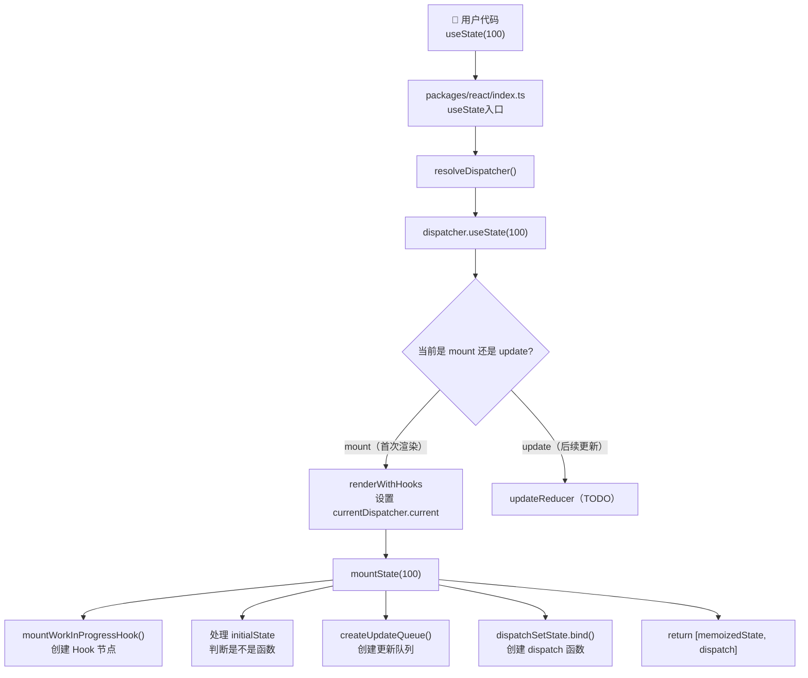
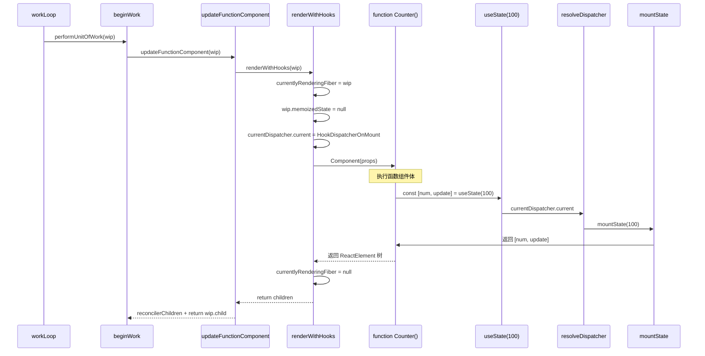
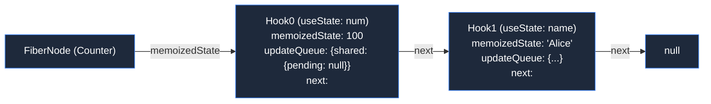
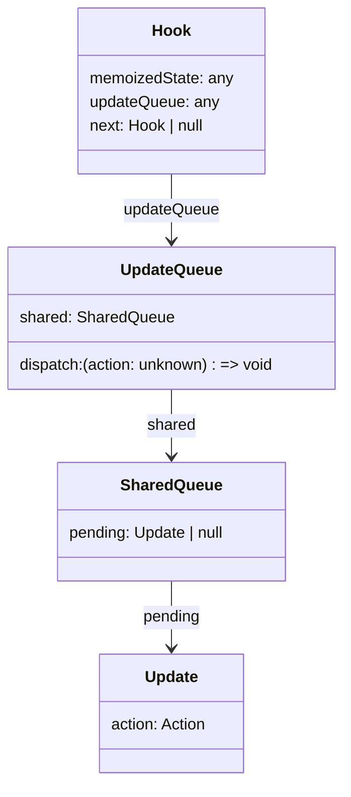
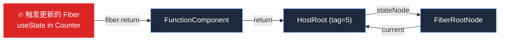
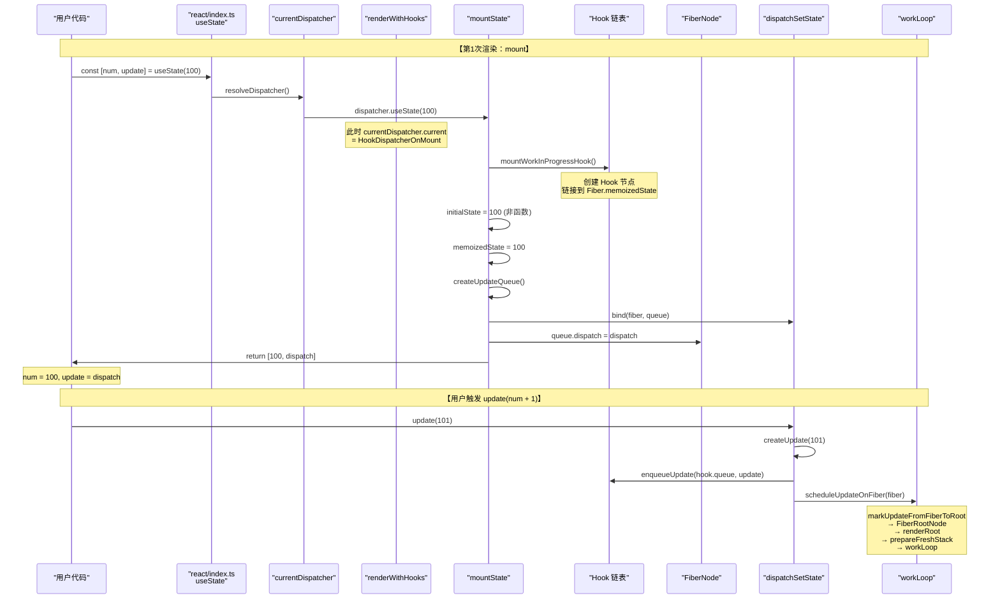
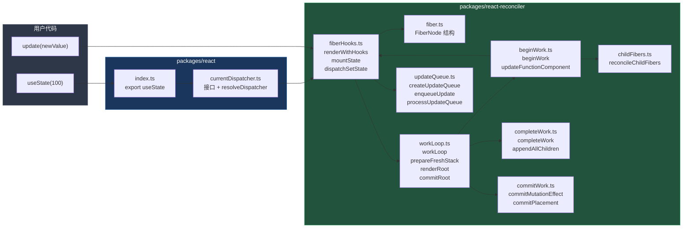

# useState 运作流程全解

> 结合 Big-React 源码一行行解释 `const [num, update] = useState<number>(100)` 从调用到渲染到 DOM 的完整链路。

---

## 一、总览：全链路流程图



---

## 二、入口层：`packages/react/index.ts`

```typescript
// packages/react/index.ts 第7~12行
export const useState: Dispatcher['useState'] = (initialState) => {
	debugger
	const dispatcher = resolveDispatcher();

	return dispatcher.useState(initialState);
};
```

**逐行解释：**

| 行号 | 代码 | 作用 |
|------|------|------|
| 7 | `export const useState: Dispatcher['useState']` | 从 `Dispatcher` 接口推导泛型类型，保证对外暴露的 `useState` 签名和内部一致 |
| 8 | `debugger` | 开发调试断点 |
| 9 | `const dispatcher = resolveDispatcher()` | 从全局单例 `currentDispatcher.current` 取出当前激活的 `Dispatcher` 对象 |
| 11 | `return dispatcher.useState(initialState)` | 调用真正干活的方法——mount 阶段是 `mountState`，update 阶段是 `updateReducer` |

### `resolveDispatcher` 做了什么？

```typescript
// packages/react/src/currentDispatcher.ts 第13~18行
export const resolveDispatcher = (): Dispatcher => {
	const dispatcher = currentDispatcher.current;
	if (dispatcher === null) {
		throw new Error('hook 只能在 函数组件中执行');
	}
	return dispatcher;
};
```

关键：**`currentDispatcher.current` 在 `renderWithHooks` 中被赋值**，如果在函数组件外调用 `useState`，这个值就是 `null`，直接抛错。

### `currentDispatcher` 全局单例

```typescript
// packages/react/src/currentDispatcher.ts 第3~11行
export interface Dispatcher {
	useState: <T>(initialState: (() => T) | T) => [T, Dispatch<T>];
}

export type Dispatch<State> = (action: Action<State>) => void;

const currentDispatcher: { current: Dispatcher | null } = {
	current: null
};
```

`Dispatcher` 接口定了 `useState` 的签名。`Dispatch<State>` 就是 `useState` 返回的第二个参数的类型。

---

## 三、第一次渲染开始时：`renderWithHooks`

组件首次渲染时，React reconciler 从 `beginWork` 进入 `updateFunctionComponent`，再调用 `renderWithHooks`。

```typescript
// packages/react-reconciler/src/fiberHooks.ts 第28~48行
export function renderWithHooks(wip: FiberNode) {
	// ① 赋值，让 fiberHooks 知道当前在处理哪个 Fiber
	currentlyRenderingFiber = wip;
	// ② 清空 memoizedState，mount 时 hook 链表要重新构建
	wip.memoizedState = null;
	// ③ 获取 alternate（即已渲染的 current 树）
	const current = wip.alternate;
	if (current !== null) {
		// 更新 → 后续实现 updateReducer
	} else {
		// ④ mount：设置当前 Dispatcher 为 HookDispatcherOnMount
		currentDispatcher.current = HookDispatcherOnMount;
	}

	// ⑤ 执行函数组件！所有 useState 都在这一行被调用
	const Component = wip.type;
	const props = wip.pendingProps;
	const children = Component(props);

	// ⑥ 重置，避免 hook 泄露到其他组件
	currentlyRenderingFiber = null;
	return children;
}
```

**逐行解释：**

| 行号 | 代码 | 作用 |
|------|------|------|
| 30 | `currentlyRenderingFiber = wip` | 保存当前正在处理的 Fiber，后续 `mountState` 需要这个引用把 Hook 挂到 Fiber 上 |
| 31 | `wip.memoizedState = null` | **清空** `memoizedState`。mount 时重新构建 Hook 链表 |
| 33 | `const current = wip.alternate` | 获取旧树的对应 Fiber |
| 34~36 | `if (current !== null) { ... }` | **update 分支**（暂未实现） |
| 37~39 | `else { ... currentDispatcher.current = HookDispatcherOnMount }` | **mount 分支**：把全局 Dispatcher 切换为 `HookDispatcherOnMount` |
| 42~43 | `const children = Component(props)` | **⭐ 关键**：执行函数组件，此时组件体内的所有 `useState` 调用都会触发 `mountState` |
| 47 | `currentlyRenderingFiber = null` | 组件渲染结束后清空，防止在其他地方错误访问 |

### 设置 Dispatcher

```typescript
// fiberHooks.ts 第50~52行
const HookDispatcherOnMount: Dispatcher = {
	useState: mountState
};
```

mount 阶段 `useState` 直接映射到 `mountState`。

### 时序图：renderWithHooks 调用过程



---

## 四、核心实现：`mountState`

```typescript
// packages/react-reconciler/src/fiberHooks.ts 第54~72行
function mountState<State>(
	initialState: (() => State) | State
): [State, Dispatch<State>] {
	const hook = mountWorkInProgressHook();              // ① 创建 Hook 节点
	let memoizedState: State;
	if (initialState instanceof Function) {                // ② 处理 initialState
		memoizedState = initialState();
	} else {
		memoizedState = initialState;
	}
	const queue = createUpdateQueue<State>();              // ③ 创建更新队列
	hook.updateQueue = queue;

	const dispatch = dispatchSetState.bind(                // ④ 创建 dispatch 函数
		null,
		currentlyRenderingFiber,
		queue
	);
	queue.dispatch = dispatch;
	return [memoizedState, dispatch];                      // ⑤ 返回 [state, setState]
}
```

**逐行解释：**

| 行号 | 代码 | 作用 |
|------|------|------|
| 54~56 | `function mountState<State>(initialState: (() => State) | State): [State, Dispatch<State>]` | 泛型函数。`initialState` 可以是值，也可以是返回值的工厂函数 |
| **57** | **`const hook = mountWorkInProgressHook()`** | **创建 Hook 节点并链接到 Fiber 的 `memoizedState` 链表** |
| 58 | `let memoizedState: State` | 临时变量，用来存放最终确定的初始值 |
| **59~63** | **`if (initialState instanceof Function) { ... } else { ... }`** | 判断 `initialState` 是不是函数。**注意**：这里用 `instanceof Function` 而不是 `typeof === 'function'` |
| 65 | `const queue = createUpdateQueue<State>()` | 创建 Hook 专属的更新队列 |
| 66 | `hook.updateQueue = queue` | 把队列挂到 Hook 上 |
| **68~70** | **`const dispatch = dispatchSetState.bind(null, currentlyRenderingFiber, queue)`** | **提前绑定 fiber 和 queue**，这样用户调用 `update(num)` 时就不需要再传 |
| 71 | `return [memoizedState, dispatch]` | 返回 `[当前值, 调度器]` |

### 4.1 `mountWorkInProgressHook` — 创建 Hook 链表

```typescript
// packages/react-reconciler/src/fiberHooks.ts 第84~101行
function mountWorkInProgressHook(): Hook {
	debugger;
	const hook: Hook = { memoizedState: null, updateQueue: null, next: null };
	if (workInProgressHook === null) {
		// 第一个 Hook：链接到 Fiber
		if (currentlyRenderingFiber === null) {
			throw new Error('请在函数组件内调用hook');
		} else {
			workInProgressHook = hook;
			currentlyRenderingFiber.memoizedState = workInProgressHook;
		}
	} else {
		// 后续 Hook：追加到链表尾部
		workInProgressHook.next = hook;
		workInProgressHook = hook;
	}

	return workInProgressHook;
}
```

**逐行解释：**

| 行号 | 代码 | 作用 |
|------|------|------|
| 86 | `const hook = { memoizedState: null, updateQueue: null, next: null }` | 创建 Hook 节点，`memoizedState` 存 state 值，`updateQueue` 存更新队列，`next` 指向下一个 Hook |
| 87 | `if (workInProgressHook === null)` | 判断是不是当前组件第一个 Hook |
| 88~92 | `currentlyRenderingFiber === null → throw` | 双重校验：如果真的在组件外调用，`currentlyRenderingFiber` 是 null |
| 91~92 | `workInProgressHook = hook; fiber.memoizedState = workInProgressHook` | 第一个 Hook：`Fiber.memoizedState` 指向第一个 Hook |
| 94~96 | `else { workInProgressHook.next = hook; workInProgressHook = hook }` | 后续 Hook：追加到链表尾部，`workInProgressHook` 后移 |

**图示：Hook 链表结构**



### 4.2 处理 initialState

```typescript
// fiberHooks.ts 第58~63行
let memoizedState: State;
if (initialState instanceof Function) {    // instanceof 判断可安全处理继承关系
	memoizedState = initialState();        // 传入函数时：initialState = () => 100
} else {
	memoizedState = initialState;         // 传入普通值时：initialState = 100
}
```

为什么用 `instanceof Function` 而不是 `typeof === 'function'`？
- 评论区写的是"这里不能使用 typeof"——这是因为 `typeof` 在某些跨 iframe/跨 realm 场景下不够可靠，`instanceof` 对继承链的处理更完整。

### 4.3 `createUpdateQueue` — 创建更新队列

```typescript
// packages/react-reconciler/src/updateQueue.ts 第20~26行
export const createUpdateQueue = <State>() => {
	return {
		shared: {
			pending: null
		}
	} as UpdateQueue<State>;
};
```

创建一个简单的更新队列，`shared.pending` 用来存放待处理的更新。当前版本是简化版，**一次只能存一个 pending update**。



### 4.4 创建 dispatch 函数

```typescript
// fiberHooks.ts 第68~70行
const dispatch = dispatchSetState.bind(
	null,
	currentlyRenderingFiber,    // 提前绑定 fiber（当前正在渲染的 Fiber）
	queue                        // 提前绑定 hook.updateQueue
);
queue.dispatch = dispatch;
```

**为什么要 bind？** 因为用户写 `update(num)` 时只需要传一个 `action` 参数。通过 `bind` 提前绑定了 `fiber` 和 `queue`，最终 `dispatch` 函数签名变成了 `(action)`。

### 4.5 最终返回

```typescript
return [memoizedState, dispatch];
```

- `memoizedState` = `100`（用户传入的初始值）
- `dispatch` = 绑定了 fiber 和 queue 的 `dispatchSetState` 函数

**用户代码 `const [num, update] = useState<number>(100)` 的结果：**
- `num` = `100`
- `update` = `dispatchSetState.bind(null, currentFiber, hookQueue)`

---

## 五、用户调用 `update(num)` 时：`dispatchSetState`

当用户执行 `update(num + 1)` 时触发：

```typescript
// packages/react-reconciler/src/fiberHooks.ts 第74~82行
function dispatchSetState<State>(
	fiber: FiberNode,
	updateQueue: UpdateQueue<State>,
	action: Action<State>
) {
	const update = createUpdate(action);   // ① 创建 Update 对象
	enqueueUpdate(updateQueue, update);    // ② 入队到 hook 的 updateQueue
	scheduleUpdateOnFiber(fiber);          // ③ 调度 Fiber 更新
}
```

### 5.1 创建 Update

```typescript
// updateQueue.ts 第14~18行
export const createUpdate = <State>(action: Action<State>): Update<State> => {
	return {
		action      // { action: num + 1 }
	};
};
```

### 5.2 入队

```typescript
// updateQueue.ts 第28~33行
export const enqueueUpdate = <State>(
	updateQueue: UpdateQueue<State>,
	update: Update<State>
) => {
	updateQueue.shared.pending = update;   // ⚠️ 简化版：只保留最后一个 update
};
```

### 5.3 调度更新

```typescript
// workLoop.ts 第31~36行
export function scheduleUpdateOnFiber(fiber: FiberNode) {
	const root = markUpdateFromFiberToRoot(fiber);  // 从当前 Fiber 一路找到 FiberRootNode
	renderRoot(root as FiberRootNode);               // 从根开始重新渲染
}
```

### 5.4 向上找根

```typescript
// workLoop.ts 第43~55行
export function markUpdateFromFiberToRoot(fiber: FiberNode) {
	let node = fiber;
	let parent = fiber.return;
	while (parent !== null) {
		node = parent;
		parent = parent.return;
	}
	// 一直找到 HostRoot（tag === HostRoot）
	if (node.tag === HostRoot) {
		return node.stateNode;   // HostRoot.stateNode → FiberRootNode
	}
	return null;
}
```



### 5.5 `renderRoot` — 重新渲染

```typescript
// workLoop.ts 第57~77行
function renderRoot(root: FiberRootNode) {
	prepareFreshStack(root);               // ① 创建 workInProgress 树

	do {
		try {
			workLoop();                     // ② 同步执行工作循环
			break;
		} catch (error) {
			if (__DEV__) {
				console.warn('workLoop发生错误', error);
			}
			workInProgress = null;
		}
	} while (true);

	const finishedWork = root.current.alternate;  // ③ 拿到构建完成的树
	root.finishedWork = finishedWork;
	commitRoot(root);                              // ④ 提交到 DOM
}
```

---

## 六、workLoop 与 performUnitOfWork

```typescript
// workLoop.ts 第104~108行
function workLoop() {
	while (workInProgress !== null) {       // 只要还有 Fiber 没处理完，就继续
		performUnitOfWork(workInProgress);
	}
}
```

```typescript
// workLoop.ts 第114~125行
function performUnitOfWork(fiber: FiberNode) {
	const next = beginWork(fiber);          // ① "递"：处理当前节点，返回子节点
	fiber.memoizedProps = fiber.pendingProps; // ② props 已消费

	if (next === null) {
		completeUnitOfWork(fiber);           // ③ "归"：子节点处理完了，开始归
	} else {
		workInProgress = next;               // ④ 还有子节点，继续向下
	}
}
```


---

## 七、`beginWork` — 执行函数组件

```typescript
// beginWork.ts 第19~39行
export const beginWork = (wip: FiberNode) => {
	switch (wip.tag) {
		case HostRoot:
			return updateHostRoot(wip);
		case HostComponent:
			return updateHostComponent(wip);
		case HostText:
			return null;
		case FunctionComponent:
			return updateFunctionComponent(wip);   // ⭐ 函数组件走这里
		// ...
	}
};
```

```typescript
// beginWork.ts 第41~45行
function updateFunctionComponent(wip: FiberNode) {
	const nextChildren = renderWithHooks(wip);  // ⭐ 调用 renderWithHooks
	reconcilerChildren(wip, nextChildren);       // 将返回的 ReactElement 与旧 Fiber 对比
	return wip.child;
}
```

**这就是** 第3节 `renderWithHooks` 被调用的地方。

---

## 八、`completeWork` — 构建 DOM

```typescript
// completeWork.ts 第16~62行
export const completeWork = (wip: FiberNode) => {
	const newProps = wip.pendingProps;
	const current = wip.alternate;

	switch (wip.tag) {
		case HostComponent:
			if (current !== null && wip.stateNode) {
				// 更新 → TODO
			} else {
				// mount：创建真实 DOM 节点
				const instance = createInstance(wip.type);  // 如 document.createElement('div')
				appendAllChildren(instance, wip);           // 把子节点 DOM 插进来
				wip.stateNode = instance;                    // fiber.stateNode 指向真实 DOM
			}
			bubbleProperties(wip);    // 冒泡副作用标记
			return null;
		case HostText:
			// 创建文本节点
			const instance = createTextInstance(newProps.content);
			wip.stateNode = instance;
			bubbleProperties(wip);
			return null;
		case HostRoot:
		case FunctionComponent:
			bubbleProperties(wip);    // 函数组件不需要创建 DOM，只需冒泡 flags
			return null;
	}
};
```

---

## 九、`commitRoot` — 提交到真实 DOM

```typescript
// workLoop.ts 第79~102行
function commitRoot(root: FiberRootNode) {
	const finishedWork = root.finishedWork;
	if (finishedWork === null) return;

	root.finishedWork = null;

	const subtreeHasEffect =
		(finishedWork.subtreeFlags & MutationMask) !== NoFlags;
	const rootHasEffect = finishedWork.flags & MutationMask;

	if (subtreeHasEffect || rootHasEffect) {
		commitMutationEffect(finishedWork);  // ⭐ 执行 DOM 操作
	}
}
```

```typescript
// commitWork.ts 第8~34行
export const commitMutationEffect = (finishedWork: FiberNode) => {
	nextEffect = finishedWork;

	while (nextEffect !== null) {
		const child = nextEffect.child;
		// 有子节点且子节点有副作用 → 向下钻
		if ((nextEffect.subtreeFlags & MutationMask) !== NoFlags && child !== null) {
			nextEffect = child;
		} else {
			// 到了叶子节点或没有子节点副作用
			up: while (nextEffect !== null) {
				commitMutationEffectOnFiber(nextEffect);  // 检查并执行当前节点
				const sibling = nextEffect.sibling;
				if (sibling !== null) {
					nextEffect = sibling;
					break up;
				}
				nextEffect = nextEffect.return;  // 没有兄弟就向上
			}
		}
	}
};
```

```typescript
// commitWork.ts 第36~45行
const commitMutationEffectOnFiber = (finishedWork: FiberNode) => {
	const flags = finishedWork.flags;
	if ((flags & Placement) !== NoFlags) {
		commitPlacement(finishedWork);   // 执行插入 DOM 操作
		finishedWork.flags &= ~Placement; // 移除标记
	}
};
```

---

## 十、完整全链路回顾

### 以 `const [num, update] = useState<number>(100)` 为例



### 文件调用关系总图



---

## 十一、关键总结

| 概念 | 说明 |
|------|------|
| **Dispatcher 模式** | `useState` 不直接实现逻辑，通过 `currentDispatcher.current` 指向不同的实现（mount/update） |
| **Mount 阶段** | 创建 Hook 节点 → 存入 initialValue → 创建 updateQueue → bind dispatch → 返回 `[value, dispatch]` |
| **Hook 链表** | Fiber 的 `memoizedState` 指向第一个 Hook，Hook 之间通过 `next` 指针串成链表 |
| **dispatch** | `bind` 提前绑定了 `fiber` 和 `queue`，调用时创建 `Update` 入队，然后从当前 Fiber 一直找到根节点触发重渲染 |
| **Update 队列** | 当前是简化版，`shared.pending` 只保存最后一个 update |
| **渲染流程** | `beginWork`（递） → `completeWork`（归） → `commitRoot`（提交 DOM） |
| **核心文件** | `fiberHooks.ts`（状态管理）、`workLoop.ts`（调度）、`updateQueue.ts`（队列） |
