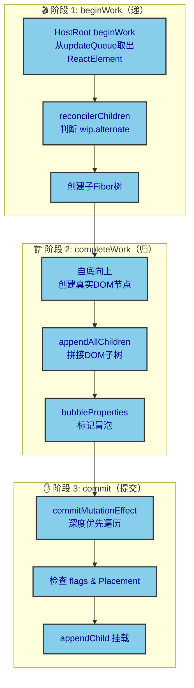
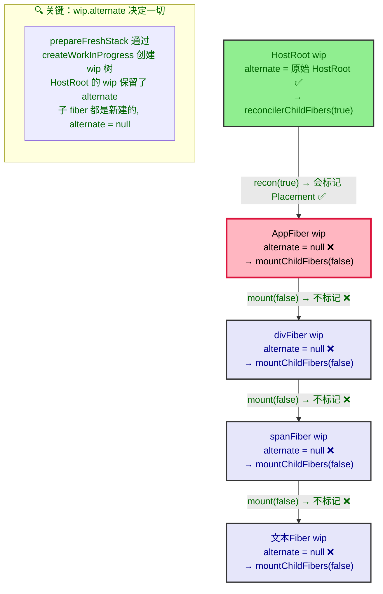
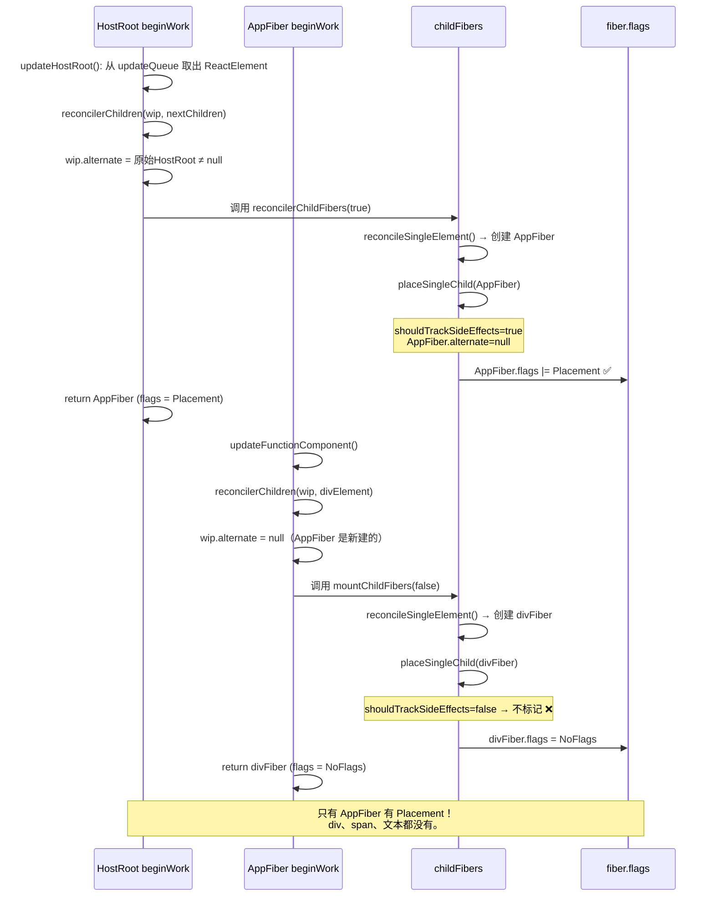
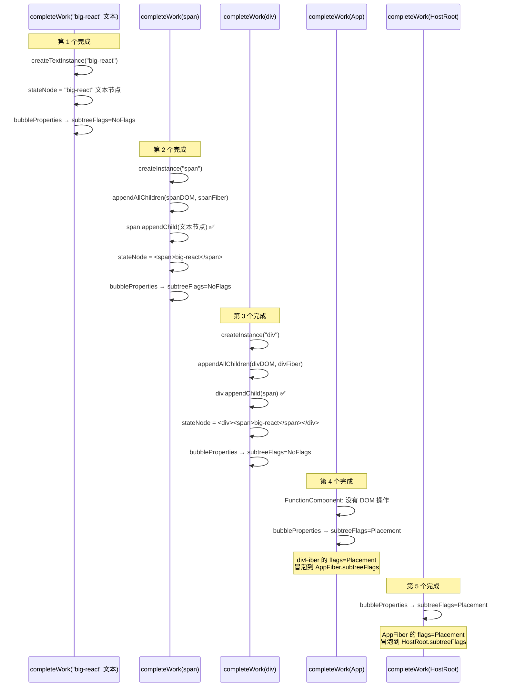
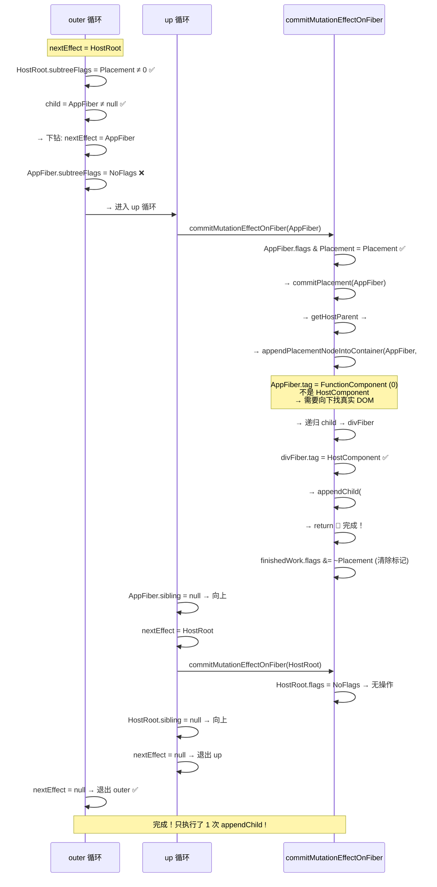
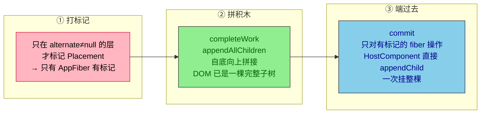
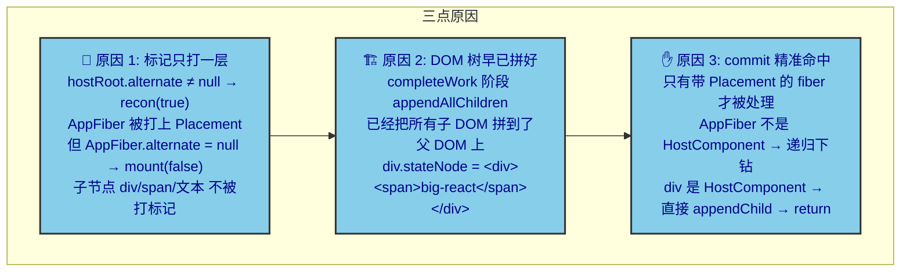

# 为什么 mount 时只执行一次 Placement？

## 一个具体的例子

我们的 Demo 代码：

```jsx
import React from 'react';
import ReactDOM from 'react-dom';

function App({ children }) {
  return <div>{children}</div>;
}

const jsx = <App><div><span>big-react</span></div></App>;

ReactDOM.createRoot(document.getElementById('root')).render(jsx);
```

这段代码会生成如下 fiber 树（5 层深度）：

```
🔴 HostRoot (虚拟根节点, tag=3)
  └─ 🟢 AppFiber (函数组件, tag=0)
       └─ 🔵 divFiber (HostComponent, tag=5)
            └─ 🔵 spanFiber (HostComponent, tag=5)
                 └─ ⚪ "big-react" (HostText, tag=6)
```

---

## 第一部分：整个流程的总览



---

## 第二部分：阶段 1 —— beginWork，谁被打上了 Placement？

### 2.1 核心判断函数

这是整个机制最关键的地方——[beginWork.ts:53](file:///d:/BaiduNetdiskDownload/B%E7%AB%99%E5%8D%A1%E9%A2%82%E4%BB%8E0%E5%AE%9E%E7%8E%B0React18/big-react/packages/react-reconciler/src/beginWork.ts#L53) 的 `reconcilerChildren`：

```typescript
function reconcilerChildren(wip: FiberNode, children?: ReactElementType) {
  const current = wip.alternate;      // ← 决定命运的一行

  if (current !== null) {
    // ✅ wip.alternate 不为 null → 这是"更新"流程
    // 用 reconcilerChildFibers(true) → 会调用 placeSingleChild → 会标记 Placement
    wip.child = reconcilerChildFibers(wip, current.child, children);
  } else {
    // ❌ wip.alternate 为 null → 这是"挂载"流程（新增节点）
    // 用 mountChildFibers(false) → placeSingleChild 中 shouldTrackSideEffects=false → 不标记
    wip.child = mountChildFibers(wip, null, children);
  }
}
```

[childFibers.ts:32](file:///d:/BaiduNetdiskDownload/B%E7%AB%99%E5%8D%A1%E9%A2%82%E4%BB%8E0%E5%AE%9E%E7%8E%B0React18/big-react/packages/react-reconciler/src/childFibers.ts#L32) 的 `placeSingleChild`：

```typescript
function placeSingleChild(fiber: FiberNode) {
  // shouldTrackSideEffects === true → 是 reconcilerChildFibers
  // shouldTrackSideEffects === false → 是 mountChildFibers
  if (shouldTrackSideEffects && fiber.alternate === null) {
    fiber.flags |= Placement;   // 标记 Placement
  }
  return fiber;
}
```

### 2.2 为什么只有 AppFiber 有 Placement？

`createWorkInProgress` 创建 wip 树时，HostRoot 的 wip 的 `alternate` 指向原始 HostRoot（不为 null）；HostRoot 的儿子 AppFiber 是**新建**的，`alternate` 为 null。



### 2.3 完整执行路径



---

## 第三部分：阶段 2 —— completeWork，DOM 树在内存中拼接

### 3.1 appendAllChildren 的拼接过程

[completeWork.ts:71](file:///d:/BaiduNetdiskDownload/B%E7%AB%99%E5%8D%A1%E9%A2%82%E4%BB%8E0%E5%AE%9E%E7%8E%B0React18/big-react/packages/react-reconciler/src/completeWork.ts#L71) 的 `appendAllChildren` **自底向上**遍历子 fiber 树，把所有 HostComponent 和 HostText 节点的 DOM 拼接到父节点上：



**第 3 阶段结束时，内存中的 DOM 树：**

```
<div id="root"></div>   ← 页面上的真实 #root，空的

内存中（离屏）：
<div>                   ← divFiber.stateNode（完整子树！）
  <span>                ← spanFiber.stateNode
    "big-react"          ← 文本Fiber.stateNode
  </span>
</div>
```

**div 的 `stateNode` 已经是一棵完整的 DOM 子树了。**

### 3.2 bubbleProperties 的作用

[completeWork.ts:96](file:///d:/BaiduNetdiskDownload/B%E7%AB%99%E5%8D%A1%E9%A2%82%E4%BB%8E0%E5%AE%9E%E7%8E%B0React18/big-react/packages/react-reconciler/src/completeWork.ts#L96) 的 `bubbleProperties`：

```typescript
function bubbleProperties(wip: FiberNode) {
  let subtreeFlags = NoFlags;
  let child = wip.child;

  while (child !== null) {
    subtreeFlags |= child.subtreeFlags;  // 子树自己的 flags
    subtreeFlags |= child.flags;         // 子节点自身的 flags
    child = child.sibling;
  }
  wip.subtreeFlags |= subtreeFlags;      // 冒泡到父级
}
```

```
冒泡过程：
  文本Fiber:       flags=NoFlags,  subtreeFlags=NoFlags
  → spanFiber:     flags=NoFlags,  subtreeFlags=NoFlags | NoFlags = NoFlags
  → divFiber:      flags=NoFlags,  subtreeFlags=NoFlags | NoFlags = NoFlags
  → AppFiber:      flags=Placement, subtreeFlags=NoFlags | NoFlags = NoFlags
                             ↑ 自身的 Placement
  → HostRoot:      flags=NoFlags,  subtreeFlags=Placement | NoFlags = Placement
                                    ↑ AppFiberPlacement 冒泡上来了
```

**`subtreeFlags` 告诉 commit："你的子树里有需要处理的标记。"**

---

## 第四部分：阶段 3 —— commit，只执行 1 次 appendChild

### 4.1 commitRoot 的入口判断

[workLoop.ts:79](file:///d:/BaiduNetdiskDownload/B%E7%AB%99%E5%8D%A1%E9%A2%82%E4%BB%8E0%E5%AE%9E%E7%8E%B0React18/big-react/packages/react-reconciler/src/workLoop.ts#L79) 的 `commitRoot`：

```typescript
function commitRoot(root: FiberRootNode) {
  const finishedWork = root.finishedWork; // HostRoot (wip 树的根)

  const subtreeHasEffect =
    (finishedWork.subtreeFlags & MutationMask) !== NoFlags;
  const rootHasEffect = finishedWork.flags & MutationMask;

  if (subtreeHasEffect || rootHasEffect) {
    commitMutationEffect(finishedWork);   // 进入 commit 遍历
  }
}
```

因为 `HostRoot.subtreeFlags = Placement`，所以 `subtreeHasEffect = true`，进入 commit。

### 4.2 commitMutationEffect 的遍历过程

[commitWork.ts:8](file:///d:/BaiduNetdiskDownload/B%E7%AB%99%E5%8D%A1%E9%A2%82%E4%BB%8E0%E5%AE%9E%E7%8E%B0React18/big-react/packages/react-reconciler/src/commitWork.ts#L8) 的 `commitMutationEffect`：



### 4.3 appendPlacementNodeIntoContainer 的关键逻辑

[commitWork.ts:90](file:///d:/BaiduNetdiskDownload/B%E7%AB%99%E5%8D%A1%E9%A2%82%E4%BB%8E0%E5%AE%9E%E7%8E%B0React18/big-react/packages/react-reconciler/src/commitWork.ts#L90) 的 `appendPlacementNodeIntoContainer`：

```typescript
function appendPlacementNodeIntoContainer(
  finishedWork: FiberNode,
  hostParent: Container
) {
  // ✅ 如果 finishedWork 本身就是 HostComponent 或 HostText
  //    直接拿它的 stateNode（已经是完整子树！）
  if (finishedWork.tag === HostComponent || finishedWork.tag === HostText) {
    appendChildToContainer(hostParent, finishedWork.stateNode);
    return;
  }

  // 如果不是（比如 FunctionComponent、HostRoot），
  // 才需要递归向下找真实 DOM 节点
  const child = finishedWork.child;
  if (child !== null) {
    appendPlacementNodeIntoContainer(child, hostParent);
    // ... 处理兄弟节点
  }
}
```

**关键理解：**

| 入参 | `tag` | 走哪个分支 | 效果 |
|------|-------|-----------|------|
| `AppFiber` | FunctionComponent (0) | else 分支 → 递归 | 下钻到 div |
| `divFiber` | HostComponent (5) | `if` 分支 → **直接 return** | `appendChild(#root, div.stateNode)` |

**为什么 div 直接 return 就够了？** 因为 div 的 `stateNode` 已经是 `<div><span>big-react</span></div>` —— 整棵子树在 completeWork 的 `appendAllChildren` 阶段就已经拼好了。

---

## 第五部分：核心机制总结

### 三个阶段的"搭积木"比喻



### 为什么只执行一次 Placement？



### 对比：如果有多个 Placement 会怎样？

如果每个节点都打了 Placement，commit 时会重复 append：

```
❌ 错误场景：

#root.appendChild(div)     ← div 下已有 span 和文本
#root.appendChild(span)    ← span 还在 div 里，又被 append 到 #root！
#root.appendChild(文本)     ← 文本节点也重复了！

结果 DOM：
<div id="root">
  <div><span>big-react</span></div>  ← 正确的
  <span>big-react</span>             ← 多余的！
  "big-react"                        ← 多余的！
</div>
```

**所以，只给最外层打 Placement 标记，是 React 性能优化的核心设计。**

---

## 附录：完整的事故报告

### fiber 树的完整标记情况

| 层级 | Fiber | `wip.alternate` | 使用的 reconciler | 自身 `flags` | `subtreeFlags` |
|------|-------|----------------|-------------------|-------------|---------------|
| 1 | HostRoot | **≠ null** (原始 HostRoot) | 无（不创建自己的子） | `NoFlags` | `Placement` |
| 2 | AppFiber | **= null** (新建) | `recon(true)` ← **会标记** | **`Placement`** | `NoFlags` |
| 3 | divFiber | **= null** (新建) | `mount(false)` ← **不标记** | `NoFlags` | `NoFlags` |
| 4 | spanFiber | **= null** (新建) | `mount(false)` | `NoFlags` | `NoFlags` |
| 5 | 文本Fiber | **= null** (新建) | `mount(false)` | `NoFlags` | `NoFlags` |

### 代码路径索引

| 关键函数 | 文件 | 行号 |
|---------|------|------|
| `reconcilerChildren` (选择器) | [beginWork.ts](file:///d:/BaiduNetdiskDownload/B%E7%AB%99%E5%8D%A1%E9%A2%82%E4%BB%8E0%E5%AE%9E%E7%8E%B0React18/big-react/packages/react-reconciler/src/beginWork.ts) | L53 |
| `placeSingleChild` (标记器) | [childFibers.ts](file:///d:/BaiduNetdiskDownload/B%E7%AB%99%E5%8D%A1%E9%A2%82%E4%BB%8E0%E5%AE%9E%E7%8E%B0React18/big-react/packages/react-reconciler/src/childFibers.ts) | L32 |
| `ChildReconciler` (工厂函数) | [childFibers.ts](file:///d:/BaiduNetdiskDownload/B%E7%AB%99%E5%8D%A1%E9%A2%82%E4%BB%8E0%E5%AE%9E%E7%8E%B0React18/big-react/packages/react-reconciler/src/childFibers.ts) | L13 |
| `appendAllChildren` (DOM 拼接) | [completeWork.ts](file:///d:/BaiduNetdiskDownload/B%E7%AB%99%E5%8D%A1%E9%A2%82%E4%BB%8E0%E5%AE%9E%E7%8E%B0React18/big-react/packages/react-reconciler/src/completeWork.ts) | L71 |
| `bubbleProperties` (标记冒泡) | [completeWork.ts](file:///d:/BaiduNetdiskDownload/B%E7%AB%99%E5%8D%A1%E9%A2%82%E4%BB%8E0%E5%AE%9E%E7%8E%B0React18/big-react/packages/react-reconciler/src/completeWork.ts) | L96 |
| `commitMutationEffect` (遍历) | [commitWork.ts](file:///d:/BaiduNetdiskDownload/B%E7%AB%99%E5%8D%A1%E9%A2%82%E4%BB%8E0%E5%AE%9E%E7%8E%B0React18/big-react/packages/react-reconciler/src/commitWork.ts) | L8 |
| `commitMutationEffectOnFiber` (处理) | [commitWork.ts](file:///d:/BaiduNetdiskDownload/B%E7%AB%99%E5%8D%A1%E9%A2%82%E4%BB%8E0%E5%AE%9E%E7%8E%B0React18/big-react/packages/react-reconciler/src/commitWork.ts) | L36 |
| `appendPlacementNodeIntoContainer` (提交) | [commitWork.ts](file:///d:/BaiduNetdiskDownload/B%E7%AB%99%E5%8D%A1%E9%A2%82%E4%BB%8E0%E5%AE%9E%E7%8E%B0React18/big-react/packages/react-reconciler/src/commitWork.ts) | L90 |
| `createWorkInProgress` (双缓冲) | [fiber.ts](file:///d:/BaiduNetdiskDownload/B%E7%AB%99%E5%8D%A1%E9%A2%82%E4%BB%8E0%E5%AE%9E%E7%8E%B0React18/big-react/packages/react-reconciler/src/fiber.ts) | L96 |
