# React 更新流程全景分析

## 前置知识：双缓冲机制

React 内部维护两棵 Fiber 树：

```
FiberRootNode
  ├── current ──→ 当前已渲染到屏幕上的 Fiber 树
  │                 （用户看到的内容）
  └── finishedWork → 下一帧要渲染的 Fiber 树
                      （wip 构建完成后暂存于此）
```

每次更新时，React 在 `current` 的 `alternate` 上构建 `workInProgress` 树。构建完成后，`root.current = finishedWork` 交换指针，新树变为 current。

---

## 更新流程图

```mermaid
flowchart TB
    subgraph Phase1["Phase 1：触发更新 (dispatchSetState)"]
        A1["用户调用 setNum(122)"] --> A2["dispatchSetState(fiber, queue, 122)"]
        A2 --> A3["createUpdate(122) → { action: 122 }"]
        A3 --> A4["enqueueUpdate(queue, update)<br/>queue.shared.pending = { action: 122 }"]
        A4 --> A5["scheduleUpdateOnFiber(fiber)<br/>从该 fiber 向上找到 FiberRootNode"]
    end

    subgraph Phase2["Phase 2：render 阶段 - beginWork（递）"]
        A5 --> B1["prepareFreshStack(root)<br/>→ createWorkInProgress(root.current)"]
        B1 --> B2["workLoop() → performUnitOfWork(wip)"]

        B2 --> B3["beginWork(HostRoot)"]
        B3 --> B4["updateHostRoot(wip)"]

        B4 --> B5_hook{"updateQueue.shared.pending<br/>=== null ?"}
        B5_hook -->|"HostRoot 本身没有更新<br/>pending 为 null"| B6_a["processUpdateQueue(null, null)<br/>memoizedState = null"]
        B5_hook -->|"有更新才处理"| B6_b["processUpdateQueue(null, update)<br/>得出新的 memoizedState"]

        B6_a --> B7["nextChildren = wip.memoizedState"]
        B7 --> B8["reconcilerChildren(wip, nextChildren)<br/>注意：<br/>这里 nextChildren 是 mount 时存下的<br/>ReactElement（即 App 的 element）"]

        B8 --> B9["HostRoot.wip.child = App Fiber<br/>(reconcileSingleElement，type相同→复用)"]
        B9 --> B10["返回 wip.child = App Fiber"]
    end

    subgraph Phase3["Phase 3：render 阶段 - FunctionComponent"]
        B10 --> C1["performUnitOfWork → 设置 workInProgress = App Fiber"]
        C1 --> C2["performUnitOfWork 第一行：<br/>beginWork(App)"]
        C2 --> C3["updateFunctionComponent(App)"]
        C3 --> C4["renderWithHooks(App)"]

        C4 --> C5{"wip.alternate !== null ?"}
        C5 -->|"是，更新"| C6["设置 HookDispatcherOnUpdate"]
        C5 -->|"否，首次 mount"| C7["设置 HookDispatcherOnMount"]

        C6 --> C8["执行 App(props)"]
        C8 --> C9["调用 useState()"]

        C9 --> C10{"当前 dispatcher 是？"}
        C10 -->|"HookDispatcherOnUpdate"| C11["updateState()"]
        C10 -->|"HookDispatcherOnMount"| C12["mountState()"]

        C11 --> C13["updateWorkInProgressHook()"]
        C13 --> C14["从 alternate.current 的 memoizedState<br/>找到旧的 hook 数据"]
        C14 --> C15["创建新 hook 副本：<br/>memoizedState = 旧 hook.memoizedState<br/>updateQueue = 旧 hook.updateQueue"]
        C15 --> C16["processUpdateQueue(hook.memoizedState, pending)"]
        C16 --> C17["pending = { action: 122 }<br/>action 不是函数 → memoizedState = 122"]
        C17 --> C18["hook.memoizedState = 122"]
        C18 --> C19["return [122, dispatch]"]
    end

    subgraph Phase4["Phase 4：render 阶段 - 继续向下调和"]
        C19 --> D1["reconcilerChildren(App, nextChildren)"]
        D1 --> D2["nextChildren = App 的返回值<br/>= 含有 div 的 ReactElement"]
        D2 --> D3["reconcileSingleElement → 复用 div fiber"]
        D3 --> D4["div Fiber.flags |= Placement ?<br/>否（alternate !== null，不是新插入）"]

        D4 --> D5["beginWork(div)<br/>→ updateHostComponent"]
        D5 --> D6["div 的 children 是文本 '122'"]
        D6 --> D7["reconcileSingleTextNode<br/>→ type 没变（都是 HostText）<br/>→ useFiber 复用<br/>但 props 变为 { content: 122 }"]
        D7 --> D8["beginWork(HostText) → return null<br/>走到叶子节点"]
    end

    subgraph Phase5["Phase 5：render 阶段 - completeWork（归）"]
        D8 --> E1["completeUnitOfWork(HostText)"]
        E1 --> E2["completeWork(HostText)"]
        E2 --> E3{"current !== null<br/>&& wip.stateNode ?"}
        E3 -->|"是，更新"| E4["oldText = current.memoizedProps.content<br/>newText = newProps.content"]
        E4 --> E5{"newText !== oldText ?"}
        E5 -->|"150 !== 122 → 是"| E6["markUpdate(wip)<br/>→ wip.flags |= Update"]
        E5 -->|"相同 → 不动"| E7["什么都不做"]

        E6 --> E8["bubbleProperties(wip)<br/>向上冒泡 subtreeFlags"]

        E8 --> E9["向上：HostText → div → App → HostRoot"]
        E9 --> E10["每级都执行 bubbleProperties<br/>把子节点的 flags 和 subtreeFlags<br/>冒泡到父级的 subtreeFlags"]
    end

    subgraph Phase6["Phase 6：commit 阶段"]
        E10 --> F1["renderRoot → commitRoot(root)"]
        F1 --> F2["finishedWork = root.current.alternate<br/>= 新构建的 WIP 树"]
        F2 --> F3{"subtreeHasEffect<br/>|| rootHasEffect ?"}
        F3 -->|"是，走到 mutation 阶段"| F4["commitMutationEffect(finishedWork)"]
        F4 --> F5["DFS 遍历 finishedWork 树<br/>检查每个 fiber 的 flags"]
        F5 --> F6["遇到 HostText → flags & Update<br/>→ commitUpdate(fiber)"]
        F6 --> F7["hostConfig.commitUpdate<br/>→ commitTextUpdate(stateNode, '122')<br/>→ textInstance.textContent = '122'"]
        F7 --> F8["屏幕上的数字从 150 变成 122 ✅"]
        F8 --> F9["root.current = finishedWork<br/>双缓冲指针交换"]
        F3 -->|"无 effect"| F10["root.current = finishedWork<br/>（纯指针交换，无 DOM 操作）"]
    end

    classDef phase fill:#E8F0FE,stroke:#4A6CF7,stroke-width:2px
    classDef action fill:#D4EDDA,stroke:#28A745,stroke-width:1px
    classDef decision fill:#FFF3CD,stroke:#FFC107,stroke-width:1px
    classDef result fill:#F8D7DA,stroke:#DC3545,stroke-width:1px

    class Phase1,Phase2,Phase3,Phase4,Phase5,Phase6 phase
```

以下是用例 `function App() { const [num, setNum] = useState(150); return <div>{num}</div>; }` 执行 `setNum(122)` 时的完整流程：



---

## 3. 关键节点详解

### 3.1 dispatchSetState → scheduleUpdateOnFiber

```typescript
function dispatchSetState<State>(
    fiber: FiberNode,
    updateQueue: UpdateQueue<State>,
    action: Action<State>
) {
    const update = createUpdate(action);     // { action: 122 }
    enqueueUpdate(updateQueue, update);       // queue.shared.pending = { action: 122 }
    scheduleUpdateOnFiber(fiber);            // 从当前 fiber 向上找 FiberRootNode
}
```

**关键点**：`dispatchSetState` 是用 `bind` 绑定了 `currentlyRenderingFiber` 和 `queue` 的。所以在组件外调用 `setNum(122)` 时，它仍然知道应该把 update 写到哪个 hook 的 updateQueue 上。

```typescript
// mountState 中的绑定
const dispatch = dispatchSetState.bind(null, currentlyRenderingFiber, queue);
```

### 3.2 scheduleUpdateOnFiber → renderRoot

```typescript
export function scheduleUpdateOnFiber(fiber: FiberNode) {
    const root = markUpdateFromFiberToRoot(fiber);  // 向上找到 FiberRootNode
    renderRoot(root as FiberRootNode);
}
```

```typescript
function renderRoot(root: FiberRootNode) {
    prepareFreshStack(root);               // 创建 wip 树
    workLoop();                             // 执行 beginWork + completeWork
    const finishedWork = root.current.alternate;
    root.finishedWork = finishedWork;
    commitRoot(root);                       // 提交到 DOM
}
```

### 3.3 prepareFreshStack — 双缓冲的起点

```typescript
function prepareFreshStack(fiber: FiberRootNode) {
    workInProgress = createWorkInProgress(
        fiber.current,           // 拿 current 树的根 fiber（HostRoot）
        fiber.current.pendingProps
    );
}
```

```typescript
export const createWorkInProgress = (
    current: FiberNode,
    pendingProps: Props
): FiberNode => {
    let wip = current.alternate;
    if (wip === null) {
        // 首次 mount → 创建新 fiber
        wip = new FiberNode(current.tag, pendingProps, current.key);
        wip.stateNode = current.stateNode;
        wip.alternate = current;
        current.alternate = wip;
    } else {
        // 更新 → 复用已有的 alternate，重置副作用标记
        wip.pendingProps = pendingProps;
        wip.flags = NoFlags;
        wip.subtreeFlags = NoFlags;
        wip.deletions = null;
    }
    // 从 current 复制数据
    wip.type = current.type;
    wip.updateQueue = current.updateQueue;     // ⚠️ 注意这里！
    wip.child = current.child;                 // ⚠️ 注意这里！
    wip.memoizedProps = current.memoizedProps;
    wip.memoizedState = current.memoizedState; // ⚠️ 注意这里！
    return wip;
};
```

**关键点**：`wip.child = current.child`。这使得 WIP 树在 beginWork 开始之前，就已经"继承"了 current 树的子结构。beginWork 会根据新的 ReactElement 在这个基础上进行 reconcile——复用、标记删除或新建。

### 3.4 updateHostRoot — 根节点的处理

```typescript
function updateHostRoot(wip: FiberNode) {
    const baseState = wip.memoizedState;              // 从 current 复制来的
    const updateQueue = wip.updateQueue as UpdateQueue<Element>;
    const pending = updateQueue.shared.pending;       // HostRoot 的 updateQueue

    updateQueue.shared.pending = null;                // 消费后清空
    const { memoizedState } = processUpdateQueue(baseState, pending);
    wip.memoizedState = memoizedState;                // 新状态

    const nextChildren = wip.memoizedState;            // HostRoot 的 memoizedState 就是 ReactElement
    reconcilerChildren(wip, nextChildren);              // 调和子节点
    return wip.child;
}
```

**关键点**：HostRoot 的 `memoizedState` 存储的是**根 ReactElement**（即 `<App/>`）。在 mount 阶段，`updateContainer` 把这个 element 写入了 HostRoot 的 updateQueue 并消费，最终存到 `memoizedState`。后续更新时，HostRoot 的 updateQueue 通常为 null，`memoizedState` 不变，所以 `nextChildren` 还是同一个 element 引用。

但 React 18 中，HostRoot 的 memoizedState 实际指向的是 fiber 树的第一个子节点对应的 element，这保证了在每次更新时 HostRoot 层都能拿到正确的 element 去调和子节点。

### 3.5 renderWithHooks — 函数组件的入口

```typescript
export function renderWithHooks(wip: FiberNode) {
    currentlyRenderingFiber = wip;
    wip.memoizedState = null;                          // 清空，准备重新构建 hook 链表
    const current = wip.alternate;

    if (current !== null) {
        // 更新：使用 HookDispatcherOnUpdate
        currentDispatcher.current = HookDispatcherOnUpdate;
    } else {
        // 首次挂载：使用 HookDispatcherOnMount
        currentDispatcher.current = HookDispatcherOnMount;
    }

    const Component = wip.type;
    const props = wip.pendingProps;
    const children = Component(props);                  // 执行 App()

    // 重置全局变量
    currentlyRenderingFiber = null;
    return children;
}
```

**关键点**：`wip.memoizedState = null` — 每次 render 前清空，然后在 hook 执行时重建 hook 链表。`memoizedState` 在 FunctionComponent 上存的是 hook 链表头。

### 3.6 updateWorkInProgressHook — hook 的复用

```typescript
function updateWorkInProgressHook(): Hook {
    let nextCurrentHook: Hook | null = null;

    if (currentHook === null) {
        // 第一个 hook：从 alternate 上取
        const current = currentlyRenderingFiber?.alternate;
        nextCurrentHook = current?.memoizedState;       // 取 old hook 链表的头
    } else {
        // 后续 hook：从当前 hook 的 next 取
        nextCurrentHook = currentHook.next;
    }

    if (nextCurrentHook === null) {
        throw new Error(`组件 ${currentlyRenderingFiber?.type.name} 本次执行时的Hook比上次执行时多`);
    }

    currentHook = nextCurrentHook;                       // 推进 currentHook 指针

    const newHook: Hook = {
        memoizedState: currentHook.memoizedState,        // 复制旧值
        updateQueue: currentHook.updateQueue,            // 复制更新队列（含 pending）
        next: null
    };

    // 把 newHook 挂到 wip fiber 的 memoizedState 上
    if (workInProgressHook === null) {
        workInProgressHook = newHook;
        currentlyRenderingFiber!.memoizedState = workInProgressHook;
    } else {
        workInProgressHook.next = newHook;
        workInProgressHook = newHook;
    }

    return workInProgressHook;
}
```

**关键点**：这段代码里最关键的一行是 `updateQueue: currentHook.updateQueue`。**旧 hook 和 新 hook 共享了同一个 updateQueue 对象**。所以在 `dispatchSetState` 中写入 `queue.shared.pending` 时，旧 hook 的 updateQueue 也被写入了。而这里创建的新 hook 又引用了同一个 updateQueue，所以新 hook 能读到 `{ action: 122 }`。

```
旧 hook（在 alternate fiber 上）
  └── updateQueue ──→ { shared: { pending: { action: 122 } } }
                          ↑
setNum(122) 写到这里     ↑
                          ↑
新 hook（在 wip fiber 上）
  └── updateQueue ──→ 指向同一个对象！
```

### 3.7 updateState — 消费更新

```typescript
function updateState<State>(): [State, Dispatch<State>] {
    const hook = updateWorkInProgressHook();
    const queue = hook.updateQueue as UpdateQueue<State>;
    const pending = queue.shared.pending;        // 读到 { action: 122 }

    if (pending !== null) {
        const { memoizedState } = processUpdateQueue(hook.memoizedState, pending);
        hook.memoizedState = memoizedState;      // 变为 122
    }

    return [hook.memoizedState, queue.dispatch as Dispatch<State>];
}
```

```typescript
export const processUpdateQueue = <State>(
    baseState: State,
    pendingUpdate: Update<State> | null
): { memoizedState: State } => {
    const result = { memoizedState: baseState };
    if (pendingUpdate !== null) {
        const action = pendingUpdate.action;
        if (action instanceof Function) {
            result.memoizedState = action(baseState);  // 函数形式：setNum(n => n+1)
        } else {
            result.memoizedState = action;               // 直接值：setNum(122)
        }
    }
    return result;
};
```

### 3.8 completeWork — 标记 Update flag

```typescript
case HostText:
    if (current !== null && wip.stateNode) {
        const oldText = current.memoizedProps.content;     // 150
        const newText = newProps.content;                   // 122
        if (newText !== oldText) {
            markUpdate(wip);                                // wip.flags |= Update
        }
    }
```

**关键点**：在 `beginWork` 阶段，HostText 被 `reconcileSingleTextNode` 复用时，`useFiber` 把新的 `{ content: 122 }` 赋给了 `pendingProps`。到 `completeWork` 时，对比 `current.memoizedProps.content`（旧值 150）和 `newProps.content`（新值 122），发现不同 → 标记 `Update` flag。

### 3.9 bubbleProperties — 向上冒泡 flags

```typescript
function bubbleProperties(wip: FiberNode) {
    let subtreeFlags = NoFlags;
    let child = wip.child;

    while (child !== null) {
        subtreeFlags |= child.subtreeFlags;
        subtreeFlags |= child.flags;
        child.return = wip;
        child = child.sibling;
    }
    wip.subtreeFlags |= subtreeFlags;
}
```

**关键点**：`bubbleProperties` 确保父 fiber 知道"我的子树的某个地方有副作用"。这样在 commit 阶段 DFS 遍历时，如果某个节点的 `subtreeFlags` 为 NoFlags，就可以跳过整个子树，不用深入。

```
HostText.flags = Update
        ↓ bubbleProperties
div.subtreeFlags  |= Update
        ↓ bubbleProperties
App.subtreeFlags  |= Update
        ↓ bubbleProperties
HostRoot.subtreeFlags  |= Update
```

### 3.10 commitMutationEffect — 副作用提交

```typescript
export const commitMutationEffect = (finishedWork: FiberNode) => {
    nextEffect = finishedWork;
    while (nextEffect !== null) {
        const child = nextEffect.child;
        // 有子节点且子树有副作用 → 向下钻
        if ((nextEffect.subtreeFlags & MutationMask) !== NoFlags && child !== null) {
            nextEffect = child;
        } else {
            // 叶子节点或 subtreeFlags 为 NoFlags → 处理当前节点后向上
            up: while (nextEffect !== null) {
                commitMutationEffectOnFiber(nextEffect);
                const sibling = nextEffect.sibling;
                if (sibling !== null) {
                    nextEffect = sibling;
                    break up;
                }
                nextEffect = nextEffect.return;
            }
        }
    }
};
```

遍历顺序 (DFS Pre-order)：
```
HostRoot → App → div → HostText(Update!) → div → App → HostRoot
                                                 ↑ 回溯时处理
```

在 `HostText` fiber 上检查到 `flags & Update`，调用 `commitUpdate`：

```typescript
// hostConfig.ts
export function commitUpdate(fiber: FiberNode) {
    switch (fiber.tag) {
        case HostText:
            const text = fiber.memoizedProps?.content;  // 122
            commitTextUpdate(fiber.stateNode, text);    // DOM 操作
    }
}
// → textInstance.textContent = '122'
```

### 3.11 root.current = finishedWork — 双缓冲交换

```typescript
function commitRoot(root: FiberRootNode) {
    ...
    if (subtreeHasEffect || rootHasEffect) {
        commitMutationEffect(finishedWork);
        root.current = finishedWork;      // ← 关键！指针交换
    } else {
        root.current = finishedWork;      // ← 即使没副作用也要交换
    }
}
```

**为什么必须加这一行？**

没有这行时，第二次更新的流程会崩溃：

```
第一次渲染后（缺 root.current = finishedWork）：
FiberRootNode
  └── current → 原始 HostRoot（memoizedState = null, child = null）
                      └── alternate → 第一次构建的树（含 App）

第二次更新 prepareFreshStack：
  createWorkInProgress(原始 HostRoot, ...)
  wip.memoizedState = 原始 HostRoot.memoizedState = null  ← ❌
  wip.child = 原始 HostRoot.child = null                  ← ❌

updateHostRoot：
  nextChildren = null
  reconcilerChildren(wip, null) → 返回 null
  App 函数组件永远不会被执行
  setNum(122) 的更新被吞掉
```

加上后：

```
第二次渲染后（有 root.current = finishedWork）：
FiberRootNode
  └── current → 第一次构建的树（含 App）
                      └── alternate → 原始 HostRoot
                                      现在原始 HostRoot 变成了 alternate

第三次更新 prepareFreshStack：
  createWorkInProgress(第一次构建的树, ...)
  wip.memoizedState = 第一次构建的树.memoizedState = <App/>  ← ✅
  wip.child = 第一次构建的树.child = App Fiber                ← ✅
```

---

## 4. 内存数据流全景

```
用户调用 setNum(122)
    │
    ▼
dispatchSetState(App_Fiber, queue, 122)
    │  queue === mountState 中创建的 UpdateQueue
    │  queue 被旧 hook 和新 hook 共享引用
    ▼
App_Fiber.hook.updateQueue.shared.pending = { action: 122 }
    │
    ▼  (通过 markUpdateFromFiberToRoot)
scheduleUpdateOnFiber → renderRoot → prepareFreshStack
    │
    ▼
workLoop:
    beginWork(HostRoot):
        nextChildren = HostRoot.memoizedState = <App/>
        reconcilerChildren → 复用 App Fiber
    │
    ▼
    beginWork(App):
        renderWithHooks(App):
            currentDispatcher.current = HookDispatcherOnUpdate
            App() → useState()
                → updateState()
                → updateWorkInProgressHook()
                    → 从 alternate 的 hook 复制
                    → queue.shared.pending = { action: 122 } ✅
                → processUpdateQueue(150, { action: 122 })
                → memoizedState = 122
                → return [122, dispatch]
    │
    ▼
    beginWork(div):
        reconcilerChildren → 复用 HostText, props = { content: 122 }
    │
    ▼
    beginWork(HostText) → null (叶子节点)
    │
    ▼
    completeWork(HostText):
        oldText = 150, newText = 122
        wip.flags |= Update
    │
    ▼
    bubbleProperties 冒泡 flags 到父节点
    │
    ▼
commitRoot:
    commitMutationEffect → DFS 找到 HostText
    → commitUpdate → DOM: textContent = '122'
    → root.current = finishedWork ✅
    │
    ▼
屏幕上 150 → 122  ✅
```

---

## 5. 常见 Bug 对照表

| 症状 | 根本原因 | 缺少的代码 |
|------|---------|-----------|
| 更新后页面不变，日志打印 "未实现的reconcile类型 null" | `root.current = finishedWork` 缺失 → prepareFreshStack 从原始 HostRoot 复制了 null 的 child/memoizedState | `root.current = finishedWork` |
| `setNum(122)` 后页面值变为 useState 的初始值（如 150） | `currentDispatcher.current` 未切换到 `HookDispatcherOnUpdate` → useState 走了 mountState，创建新 hook 忽略 updateQueue | `currentDispatcher.current = HookDispatcherOnUpdate` |
| 更新时抛错 "本次执行时的Hook比上次执行时多" | `wip.memoizedState = null` 清空了 hook 链表 → updateWorkInProgressHook 找不到对应的旧 hook | 检查 `renderWithHooks` 逻辑（清空是正常的，问题在更新时 hook 数量不一致） |
