# reconcilerChildren 深度讲解 —— 从 ReactElement 到 Fiber 树的完整映射

## 前置知识速览

### Fiber 节点 5 种核心类型

| tag 常量 | 数值 | 含义 | 有无 `stateNode`（真实 DOM） |
|----------|------|------|-----------------------------|
| `HostRoot` | 3 | Fiber 树的虚拟根节点 | ⚠️ 指向 `FiberRootNode`（非 DOM） |
| `HostComponent` | 5 | 原生 DOM 元素（`<div>`、`<span>` 等） | ✅ 有 |
| `HostText` | 6 | 文本节点 | ✅ 有 |
| `FunctionComponent` | 0 | 函数组件（`function App(){}`） | ❌ 无 |
| `Fragment` | 7 | `<></>` | ❌ 无 |

### 三个核心问题

```
┌─────────────────────────────────────────────────────────────────────┐
│                                                                      │
│  reconcilerChildren(wip, children) 到底在做什么？                     │
│                                                                      │
│  1. children 参数从哪来？（不同层级来源不同）                           │
│  2. 它拿什么跟什么对比？                                              │
│  3. 创建的 Fiber 怎么跟 ReactElement 一一对应？                        │
│                                                                      │
└─────────────────────────────────────────────────────────────────────┘
```

---

## 一、使用的例子

```tsx
function App() {
	return (
		<div id="app">
			<Header />
			<p>content</p>
		</div>
	);
}

function Header() {
	return <h1 className="title">Hello</h1>;
}

// 入口
const element = <App />;
const root = createRoot(document.getElementById('root'));
root.render(element);
```

---

## 二、JSX 编译后的 ReactElement 树

```typescript
// <App /> 编译后：
const AppElement = {
	$$typeof: Symbol.for('react.element'),  // REACT_ELEMENT_TYPE
	type: App,           // ← 函数本身！不是字符串
	props: {},
	key: null
};

// App() 执行后返回 <div id="app"><Header/><p>content</p></div>：
const divElement = {
	$$typeof: REACT_ELEMENT_TYPE,
	type: 'div',
	props: {
		id: 'app',
		children: [
			HeaderElement,   // ← type: Header 函数
			pElement         // ← type: 'p'
		]
	},
	key: null
};

// Header() 执行后返回 <h1 className="title">Hello</h1>：
const h1Element = {
	$$typeof: REACT_ELEMENT_TYPE,
	type: 'h1',
	props: {
		className: 'title',
		children: 'Hello'
	},
	key: null
};

// 完整的树形结构（关键：每个 ReactElement 嵌套在父级的 props.children 中）：
```

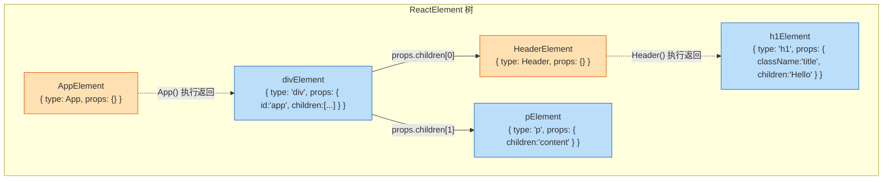

---

## 三、`reconcilerChildren` 的核心逻辑

```typescript
// beginWork.ts 中的 reconcilerChildren

function reconcilerChildren(wip: FiberNode, children?: ReactElementType) {
	const current = wip.alternate;  // wip 在 current 树中的对应节点
	if (current !== null) {
		// update 阶段：对比旧子 Fiber 和新 ReactElement
		wip.child = reconcilerChildFibers(wip, current.child, children);
	} else {
		// mount 阶段：直接根据 ReactElement 新建子 Fiber
		wip.child = mountChildFibers(wip, null, children);
	}
}
```

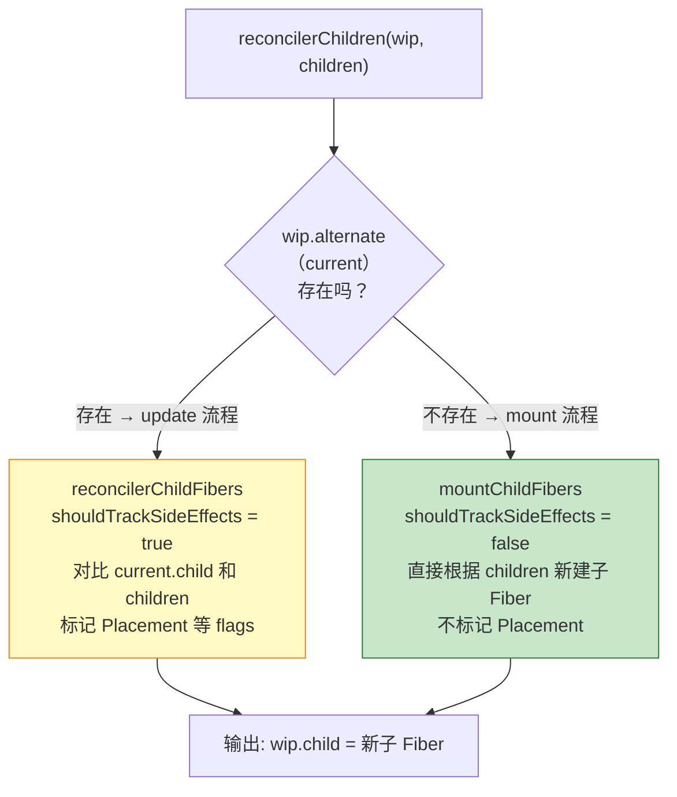

**关键疑问：为什么 mount 分支不标记 Placement？**

因为首屏渲染时整棵树都是新的。如果每个节点都标记 Placement，commit 阶段就要对每个 DOM 节点单独执行一次 `appendChild`。但更高效的做法是：

1. completeWork 阶段自底向上构建 DOM 树（子节点已经 append 到父节点上）
2. commit 阶段只需要把**根容器**下面第一个有 DOM 的节点插入一次

这样 O(n) 的 DOM 操作就降到了 O(1)。

---

## 四、逐层走完全流程

### 第 0 层：`createContainer` + `updateContainer`（预备）

```typescript
// createRoot(document.getElementById('root'))
createContainer(container)
→ hostRootFiber = new FiberNode(HostRoot, {}, null)
→ FiberRootNode { container: div#root, current: hostRootFiber, finishedWork: null }
→ hostRootFiber.updateQueue = { shared: { pending: null } }

// root.render(<App />)
updateContainer(AppElement, root)
→ hostRootFiber = root.current
→ createUpdate(AppElement) → { action: AppElement }
→ enqueueUpdate → hostRootFiber.updateQueue.shared.pending = { action: AppElement }
→ scheduleUpdateOnFiber(hostRootFiber)
```

此时内存状态：

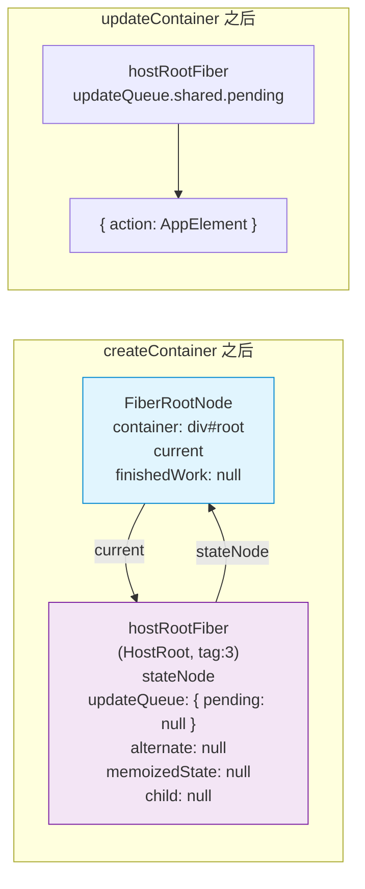

---

### 第 0 层：`prepareFreshStack` → `createWorkInProgress`

```typescript
prepareFreshStack(root)
→ createWorkInProgress(hostRootFiber, hostRootFiber.pendingProps)
→ hostRootFiber.alternate === null → 新建 wipHostRoot
→ wipHostRoot.alternate = hostRootFiber
→ hostRootFiber.alternate = wipHostRoot
→ workInProgress = wipHostRoot
```

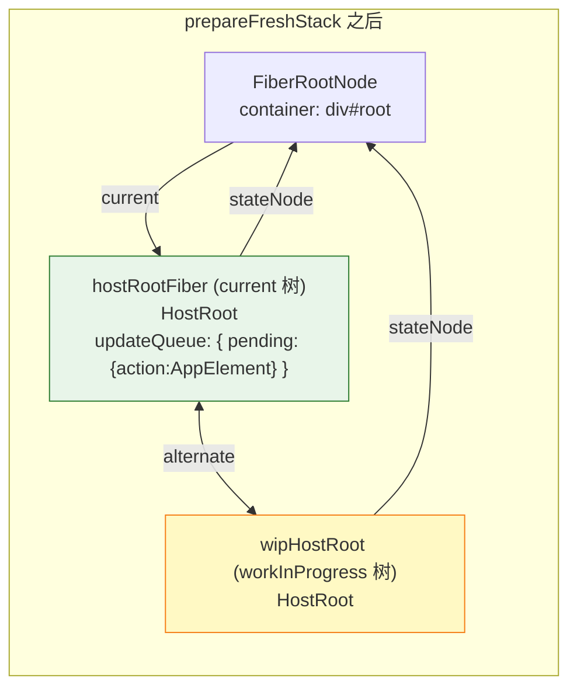

---

### 第 0 层（Root）：`updateHostRoot`

```
performUnitOfWork(wipHostRoot)
→ beginWork(wipHostRoot) → case HostRoot → updateHostRoot(wipHostRoot)
```

**`updateHostRoot` 内部：**

```typescript
function updateHostRoot(wip: FiberNode) {
	// Step 1: 从 updateQueue 取出 ReactElement
	const baseState = wip.memoizedState;                 // null
	const pending = wip.updateQueue.shared.pending;      // { action: AppElement }
	wip.updateQueue.shared.pending = null;                // 清空
	const { memoizedState } = processUpdateQueue(baseState, pending);
	// processUpdateQueue 返回 { memoizedState: AppElement }
	wip.memoizedState = memoizedState;                   // 现在 = AppElement

	// Step 2: children = memoizedState（对 HostRoot 来说，memoizedState 就是 ReactElement）
	const nextChildren = wip.memoizedState;              // = AppElement

	// Step 3: 调和子节点
	reconcilerChildren(wip, nextChildren);
	// 参数: wip = wipHostRoot, children = AppElement

	return wip.child;                                    // = appFiber
}
```

**`reconcilerChildren(wipHostRoot, AppElement)` 内部：**

```
wip = wipHostRoot
children = AppElement = { $$typeof: REACT_ELEMENT_TYPE, type: App, props: {} }

current = wip.alternate = hostRootFiber
current.child = null  (hostRootFiber 从未设置过 child)

current !== null → 走 reconcilerChildFibers (update 分支/带副作用追踪)
→ reconcilerChildFibers(returnFiber=wipHostRoot, currentFiber=null, newChild=AppElement)

  AppElement.$$typeof === REACT_ELEMENT_TYPE → true
  → reconcileSingleElement(wipHostRoot, null, AppElement)
    → createFiberFromElement(AppElement)
      → type = App (function)
      → fiberTag = FunctionComponent(0)
      → fiber = new FiberNode(0, {}, null)
      → fiber.type = App
    → fiber.return = wipHostRoot
  → placeSingleChild(fiber)
    → shouldTrackSideEffects = true
    → fiber.alternate === null (新建的)
    → fiber.flags |= Placement
  → 返回 appFiber

wipHostRoot.child = appFiber
```

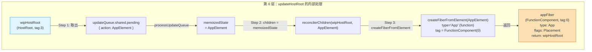

**第 0 层结果：**

```
wipHostRoot (HostRoot, tag:3)
├── memoizedState: AppElement   ← 从 updateQueue 取出的
├── child: appFiber
├── flags: NoFlags
└── return: null

appFiber (FunctionComponent, tag:0)
├── type: App (函数)
├── pendingProps: {}
├── stateNode: null          ← 函数组件没有真实 DOM
├── flags: Placement
├── alternate: null
└── return: wipHostRoot
```

---

### 第 1 层：`updateFunctionComponent(App)`

```
workInProgress = appFiber
performUnitOfWork(appFiber)
→ beginWork(appFiber) → 在真实 React 中 → case FunctionComponent → updateFunctionComponent(appFiber)
```

**`updateFunctionComponent` 的核心逻辑（真实源码）：**

```typescript
function updateFunctionComponent(wip: FiberNode) {
	const Component = wip.type;      // Component = App 函数本身
	const nextChildren = Component(wip.pendingProps);
	// 执行 App({})
	//   return <div id="app"><Header/><p>content</p></div>
	//   → 返回 divElement
	//   → { type: "div", props: { id:"app", children: [HeaderElement, pElement] } }

	reconcilerChildren(wip, nextChildren);
	// 参数: wip = appFiber, children = divElement

	return wip.child;
}
```

**`reconcilerChildren(appFiber, divElement)` 内部：**

```
wip = appFiber
children = divElement = { $$typeof: REACT_ELEMENT_TYPE, type: "div", props: { id:"app", children:[...] } }

current = wip.alternate = null (appFiber 是 createFiberFromElement 新建的，没设 alternate)

current === null → 走 mountChildFibers (mount 分支/无副作用追踪)
→ mountChildFibers(returnFiber=appFiber, currentFiber=null, newChild=divElement)

  divElement.$$typeof === REACT_ELEMENT_TYPE → true
  → reconcileSingleElement(appFiber, null, divElement)
    → createFiberFromElement(divElement)
      → type = "div" (string)
      → fiberTag = HostComponent(5)
      → fiber = new FiberNode(5, { id:"app", children:[HeaderElement, pElement] }, null)
      → fiber.type = "div"
    → fiber.return = appFiber
  → placeSingleChild(fiber)
    → shouldTrackSideEffects = false (mountChildFibers 的标记)
    → 不标记 Placement!
  → 返回 divFiber

appFiber.child = divFiber
```

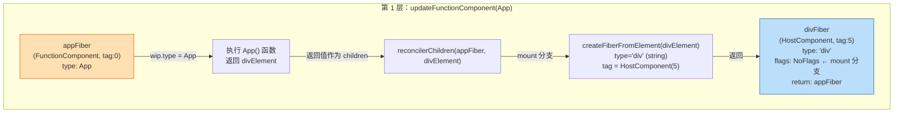

**关键对比：第 1 层和第 0 层 children 来源不同**

```
第 0 层 (HostRoot):   children = wip.memoizedState          ← 从 updateQueue 计算得来
第 1 层 (FunctionComponent): children = wip.type(props)      ← 执行函数返回值
```

**第 1 层结果：** 注意 `divFiber.flags = NoFlags`，没有标记 Placement。

```
wipHostRoot
└── child: appFiber (FunctionComponent, 无DOM)
            └── child: divFiber (HostComponent, type:"div")
                        ├── pendingProps: { id:"app", children: [HeaderElement, pElement] }
                        ├── flags: NoFlags  ← mount 分支没标记
                        ├── alternate: null
                        └── return: appFiber
```

---

### 第 2 层：`updateHostComponent(div)`（处理多子节点）

```
workInProgress = divFiber
performUnitOfWork(divFiber)
→ beginWork(divFiber) → case HostComponent → updateHostComponent(divFiber)
```

```typescript
function updateHostComponent(wip: FiberNode) {
	const nextProps = wip.pendingProps;
	// divFiber.pendingProps = { id: "app", children: [HeaderElement, pElement] }

	const nextChildren = nextProps.children;
	// nextChildren = [HeaderElement, pElement]  ← 数组！

	reconcilerChildren(wip, nextChildren);
	// 参数: wip = divFiber, children = [HeaderElement, pElement]
}
```

这里 children 是一个**数组**（两个子元素）。在真实 React 中，会走 `reconcileSingleElement` 之外的另一个分支 `reconcileChildrenArray`，为数组中的每个元素创建 Fiber，并用 `sibling` 指针串联。

```typescript
// 真实 React 中的逻辑（简化）

function reconcileChildrenArray(returnFiber, currentFiber, newChildrenArray) {
	// 遍历数组，为每个子元素创建 Fiber
	let firstFiber = null;
	let prevFiber = null;
	for (let i = 0; i < newChildrenArray.length; i++) {
		const child = newChildrenArray[i];
		let newFiber = null;

		if (typeof child === 'object' && child.$$typeof === REACT_ELEMENT_TYPE) {
			newFiber = createFiberFromElement(child);
			newFiber.return = returnFiber;
			newFiber.index = i;
		}

		if (prevFiber === null) {
			firstFiber = newFiber;     // 第一个孩子设为 firstChild
		} else {
			prevFiber.sibling = newFiber;  // 后续孩子通过 sibling 串联
		}
		prevFiber = newFiber;
	}
	return firstFiber;
}
```

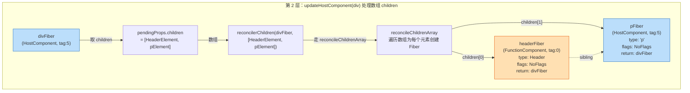

**第 2 层结果：**

```
divFiber (HostComponent, type:"div")
├── child: headerFiber (FunctionComponent, tag:0, type: Header)
│           ├── stateNode: null
│           ├── flags: NoFlags
│           └── return: divFiber
│
└── headerFiber.sibling: pFiber (HostComponent, tag:5, type: "p")
                        ├── pendingProps: { children: "content" }
                        ├── flags: NoFlags
                        └── return: divFiber
```

---

### 第 3 层：`updateFunctionComponent(Header)`

```
workInProgress = headerFiber
performUnitOfWork(headerFiber)
→ beginWork(headerFiber) → case FunctionComponent → updateFunctionComponent(headerFiber)
```

```typescript
function updateFunctionComponent(wip: FiberNode) {
	const Component = wip.type;       // Component = Header 函数
	const nextChildren = Component(wip.pendingProps);
	// 执行 Header({})
	//   return <h1 className="title">Hello</h1>
	//   → 返回 h1Element
	//   → { type: "h1", props: { className: "title", children: "Hello" } }

	reconcilerChildren(wip, nextChildren);
	// reconcilerChildren(headerFiber, h1Element)
}
```

结果：

```
headerFiber (FunctionComponent, 无DOM)
└── child: h1Fiber (HostComponent, tag:5, type: "h1")
            ├── pendingProps: { className: "title", children: "Hello" }
            ├── flags: NoFlags (mount 分支)
            └── return: headerFiber
```

---

### 第 4 层：`updateHostComponent(h1)` → `updateHostComponent(p)`

**处理 h1Fiber：**

```
h1Fiber.pendingProps = { className: "title", children: "Hello" }
→ nextChildren = "Hello"
→ reconcilerChildren(h1Fiber, "Hello") → mount 分支
→ reconcileSingleTextNode
→ textFiber = new FiberNode(HostText, { content: "Hello" }, null)
→ textFiber.return = h1Fiber
→ h1Fiber.child = textFiber
→ h1Fiber.flags = NoFlags (mount 分支)
```

**处理 pFiber：**

```
pFiber.pendingProps = { children: "content" }
→ nextChildren = "content"
→ reconcilerChildren(pFiber, "content")
→ textFiber2 = new FiberNode(HostText, { content: "content" }, null)
→ textFiber2.return = pFiber
→ pFiber.child = textFiber2
```

---

### 第 5 层：HostText → 终止

```
beginWork(textFiber) → case HostText → return null
beginWork(textFiber2) → case HostText → return null
```

"递"结束。此时 workInProgress 树构建完毕。

---

## 五、完整的 Fiber 树（workInProgress 树）

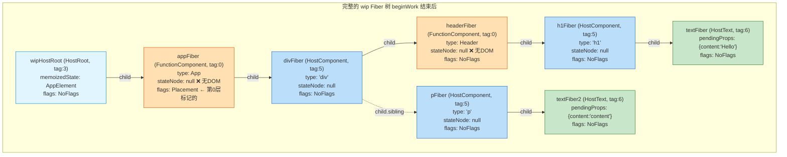

---

## 六、三棵树对比：ReactElement 树 vs Fiber 树 vs DOM 树

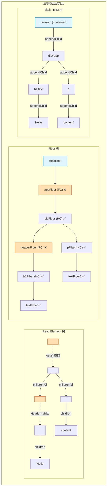

**核心发现：Fiber 树比 ReactElement 树多了一层（HostRoot），比 DOM 树多了两层（两个 FunctionComponent）。**

**三棵树层级数量对比：**
- ReactElement 树：4 层（`<App>` → `<div>` → `<Header>/<p>` → `<h1>/'Hello'/'content'`）
- Fiber 树：6 层（HostRoot → App → div → Header → h1 → text / div → p → text）
- DOM 树：3 层（div#root → div#app → h1/p → 'Hello'/'content'）

---

## 七、`children` 的来源差异一图总结

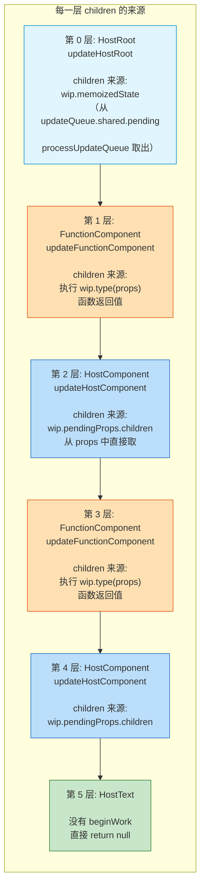

### 三种来源对比：

| 层级 | 对应函数 | `children` 参数来源 | 代码片段 |
|------|---------|-------------------|----------|
| **HostRoot** | `updateHostRoot` | `wip.memoizedState`（从 updateQueue 计算出的 ReactElement） | `const nextChildren = wip.memoizedState;` |
| **FunctionComponent** | `updateFunctionComponent` | `wip.type(pendingProps)` 执行函数的返回值 | `const nextChildren = Component(wip.pendingProps);` |
| **HostComponent** | `updateHostComponent` | `wip.pendingProps.children` | `const nextChildren = nextProps.children;` |
| **HostText** | 无 | 没有 beginWork，不调用 reconcilerChildren | `return null;` |

---

## 八、`reconcilerChildren` 的本质 —— 一句话总结

```
reconcilerChildren(wip, X) 的意思是：

  "wip 这个父 Fiber，它的子节点应该长成 X 这个样子。
   我来根据 X 创建（或对比更新）对应的子 Fiber，挂在 wip.child 上。"
```

**`X` 的在不同层级的真实值：**

```
第 0 层 (HostRoot):     X = AppElement         ← 从 updateQueue 取出
第 1 层 (App FC):      X = divElement          ← 执行 App() 返回
第 2 层 (div HC):      X = [HeaderElement, pElement]  ← 从 pendingProps.children 取出
第 3 层 (Header FC):   X = h1Element           ← 执行 Header() 返回
第 4 层 (h1 HC):       X = "Hello"             ← 从 pendingProps.children 取出
第 5 层 (p HC):        X = "content"           ← 从 pendingProps.children 取出
```

**`wip.alternate`（current）在不同层级的真实值：**

```
第 0 层 (wipHostRoot):   alternate = hostRootFiber (存在！因为 createWorkInProgress 设置了)
第 1 层 (appFiber):      alternate = null (createFiberFromElement 新建，没设 alternate)
第 2 层 (divFiber):      alternate = null (同上)
第 3 层 (headerFiber):   alternate = null (同上)
... 以此类推，mount 阶段所有从 createFiberFromElement 新建的 Fiber，alternate 都是 null
```

**这就是为什么只有第 0 层走了 `reconcilerChildFibers`（update 分支），其余所有层都走了 `mountChildFibers`（mount 分支）。**

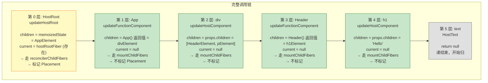

---

## 九、疑问解答

### Q1: 那"对比"到底体现在哪里？

当前代码中，`reconcilerChildFibers` 的"对比"是**简化的**：

```typescript
function reconcilerChildFibers(returnFiber, currentFiber, newChild) {
	// currentFiber = 旧树中的"旧子 Fiber"
	// newChild = 新的 ReactElement

	// 当前简易实现：直接根据 newChild 创建新 Fiber
	// 没有复用/移动/删除的逻辑
	// 真正的 diff 算法（reconcileSingleElement、reconcileChildrenArray）在这里
	// 会判断 currentFiber 和 newChild 是否可以复用（通过 key、type 等）
}
```

在完整 React 中，"对比"发生在：
- **`reconcileSingleElement`**：检查 `currentFiber` 的 `key` 和 `type` 是否与新的 ReactElement 匹配
  - 匹配 → 复用 currentFiber（`useFiber(currentFiber, newProps)`），**不新建**
  - 不匹配 → `createFiberFromElement(element)`，**新建**，同时标记 `currentFiber` 为 `ChildDeletion`
- **`reconcileChildrenArray`**：通过 key 匹配新旧 children 数组，决定复用、移动、删除

### Q2: 为什么第 0 层要单独走 update 分支，其他层走 mount 分支？

因为 `createWorkInProgress` **只对 HostRoot 设置了 alternate**，其他所有通过 `createFiberFromElement` 新建的 Fiber 都没有 alternate：

```typescript
// 只有 prepareFreshStack 调用了 createWorkInProgress，设置了 HostRoot 的 alternate
workInProgress = createWorkInProgress(fiber.current, fiber.current.pendingProps);

// 其他所有子 Fiber 都是 createFiberFromElement 创建的
// createFiberFromElement 里从头到尾没有设置过 alternate
export function createFiberFromElement(element: ReactElementType) {
	const fiber = new FiberNode(fiberTag, props, key);
	fiber.type = type;
	// 没有设置 fiber.alternate = 某东西
	return fiber;
}
```

这其实是当前代码的简化。在完整 React 中，如果是从 current 树复用已有的 wip（update 阶段），那么 `createWorkInProgress` 会复用旧的 Fiber 节点并设置 alternate；如果是第一次创建（首屏渲染过程中继续下探），则 alternate 仍为 null。

### Q3: FunctionComponent 在 completeWork 和 commit 阶段做了什么？

```typescript
// completeWork 阶段
function completeWork(wip: FiberNode) {
	switch (wip.tag) {
		case FunctionComponent:
			// ★★★ 什么也不做！★★★
			bubbleProperties(wip);  // 只是把子树的 flags 往上冒泡
			return null;
		// HostComponent: 创建 DOM，append 子节点
		// HostText: 创建文本节点
	}
}
```

```typescript
// commit 阶段
function appendPlacementNodeIntoContainer(finishedWork, hostParent) {
	if (finishedWork.tag === HostComponent || finishedWork.tag === HostText) {
		// Case 1: 有 DOM → 直接插入
		appendChildToContainer(finishedWork.stateNode, hostParent);
		return; ← 不处理 sibling，由上层 Case 2 处理
	}
	// Case 2: 无 DOM（FunctionComponent 等）→ 向下找到有 DOM 的节点
	const child = finishedWork.child;
	if (child !== null) {
		appendPlacementNodeIntoContainer(child, hostParent);
		let sibling = child.sibling;
		while (sibling !== null) {  ← 在这里处理所有 sibling！
			appendPlacementNodeIntoContainer(sibling, hostParent);
			sibling = sibling.sibling;
		}
	}
}
```

### Q4: Fiber 树和 DOM 树的层级为什么不一样？

因为 **FunctionComponent** 在 Fiber 树中占一个层级（有完整的 return/child/sibling 指针），但在 DOM 树中**不存在**：

```
Fiber 树层级:    DOM 树层级:
HostRoot
  appFiler (FC)  ← 被压缩掉
    divFiber      ← div#app
      headerFiber (FC) ← 被压缩掉
        h1Fiber   ← h1.title
          textFiber ← "Hello"
      pFiber      ← p
        textFiber ← "content"
```

FunctionComponent 在 Fiber 树中的角色就是**管道/中转站**：
1. beginWork 中：执行函数，把返回值 ReactElement 变成子 Fiber
2. completeWork 中：`bubbleProperties` 冒泡 flags，不创建 DOM
3. commit 中：Case 2 递归跳过自己，继续向下找到有 DOM 的节点

---

## 十、完整流程图总结

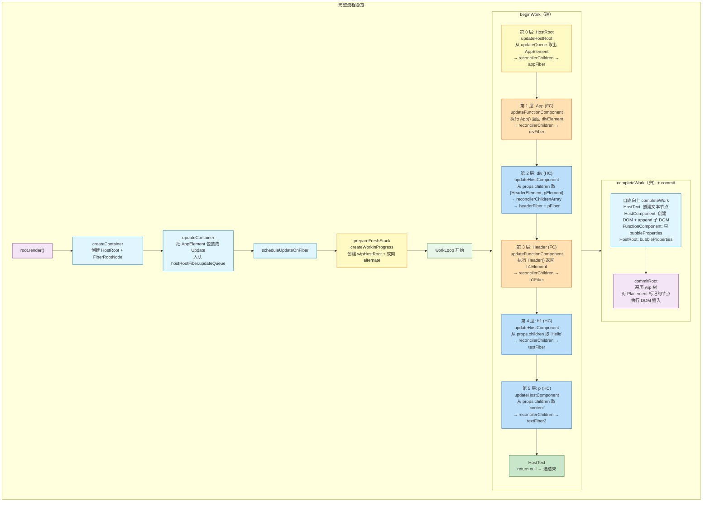

---

## 附录：关键源码索引

| 文件 | 关键函数/类 | 作用 |
|------|------------|------|
| [fiber.ts](file:///d:/BaiduNetdiskDownload/B%E7%AB%99%E5%8D%A1%E9%A2%82%E4%BB%8E0%E5%AE%9E%E7%8E%B0React18/big-react/packages/react-reconciler/src/fiber.ts) | `FiberNode`, `FiberRootNode`, `createWorkInProgress`, `createFiberFromElement` | Fiber 核心类和工厂函数 |
| [fiberReconciler.ts](file:///d:/BaiduNetdiskDownload/B%E7%AB%99%E5%8D%A1%E9%A2%82%E4%BB%8E0%E5%AE%9E%E7%8E%B0React18/big-react/packages/react-reconciler/src/fiberReconciler.ts) | `createContainer`, `updateContainer` | 创建容器和触发更新 |
| [beginWork.ts](file:///d:/BaiduNetdiskDownload/B%E7%AB%99%E5%8D%A1%E9%A2%82%E4%BB%8E0%E5%AE%9E%E7%8E%B0React18/big-react/packages/react-reconciler/src/beginWork.ts) | `beginWork`, `updateHostRoot`, `updateHostComponent`, `reconcilerChildren` | 递阶段的处理函数 |
| [childFibers.ts](file:///d:/BaiduNetdiskDownload/B%E7%AB%99%E5%8D%A1%E9%A2%82%E4%BB%8E0%E5%AE%9E%E7%8E%B0React18/big-react/packages/react-reconciler/src/childFibers.ts) | `ChildReconciler`, `reconcilerChildFibers`, `mountChildFibers` | 子 Fiber 的创建/对比逻辑 |
| [updateQueue.ts](file:///d:/BaiduNetdiskDownload/B%E7%AB%99%E5%8D%A1%E9%A2%82%E4%BB%8E0%E5%AE%9E%E7%8E%B0React18/big-react/packages/react-reconciler/src/updateQueue.ts) | `Update`, `UpdateQueue`, `processUpdateQueue` | 更新队列的定义和消费 |
| [workLoop.ts](file:///d:/BaiduNetdiskDownload/B%E7%AB%99%E5%8D%A1%E9%A2%82%E4%BB%8E0%E5%AE%9E%E7%8E%B0React18/big-react/packages/react-reconciler/src/workLoop.ts) | `workLoop`, `performUnitOfWork`, `completeUnitOfWork` | 工作循环调度 |
| [completeWork.ts](file:///d:/BaiduNetdiskDownload/B%E7%AB%99%E5%8D%A1%E9%A2%82%E4%BB%8E0%E5%AE%9E%E7%8E%B0React18/big-react/packages/react-reconciler/src/completeWork.ts) | `completeWork`, `appendAllChildren`, `bubbleProperties` | 归阶段的处理 |
| [commitWork.ts](file:///d:/BaiduNetdiskDownload/B%E7%AB%99%E5%8D%A1%E9%A2%82%E4%BB%8E0%E5%AE%9E%E7%8E%B0React18/big-react/packages/react-reconciler/src/commitWork.ts) | `commitRoot`, `commitPlacement`, `appendPlacementNodeIntoContainer` | commit 阶段的 DOM 操作 |
| [workTags.ts](file:///d:/BaiduNetdiskDownload/B%E7%AB%99%E5%8D%A1%E9%A2%82%E4%BB%8E0%E5%AE%9E%E7%8E%B0React18/big-react/packages/react-reconciler/src/workTags.ts) | `WorkTag` 类型和常量 | Fiber 节点的类型定义 |
| [fiberFlags.ts](file:///d:/BaiduNetdiskDownload/B%E7%AB%99%E5%8D%A1%E9%A2%82%E4%BB%8E0%E5%AE%9E%E7%8E%B0React18/big-react/packages/react-reconciler/src/fiberFlags.ts) | `Flags` | 副作用标记定义 |
