# commitMutationEffect 深度解析：用 Mermaid 可视化每一行代码

## 一个生动的例子

```jsx
function App() {
  return (
    <div>
      <span>big-react</span>
    </div>
  );
}
```

等价于：

```js
App() → <div><span>big-react</span></div>
```

生成 5 个 fiber 节点：**HostRoot → App → div → span → 文本**

---

## Part 1: fiber 树的"体检报告" — 谁被打上了 Placement 标记？

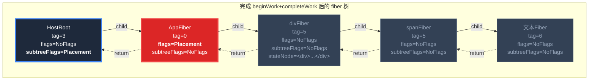

**关键观察**：只有 **AppFiber** (tag=0) 有 `flags = Placement`。其他 fiber 都没有。

为什么？

| 层级 | `wip.alternate` | 使用的 reconciler | 结果 |
|------|----------------|-------------------|------|
| HostRoot | **≠ null** (指向原始 HostRoot) | `reconcilerChildFibers(true)` | AppFiber 被打上 Placement ✅ |
| AppFiber | **= null** (新建，无 current) | `mountChildFibers(false)` | divFiber **无** ❌ |
| divFiber | **= null** | `mountChildFibers(false)` | spanFiber **无** ❌ |
| spanFiber | **= null** | `mountChildFibers(false)` | 文本Fiber **无** ❌ |

---

## Part 2: 逐行模拟执行 — 用时间线证明没有死循环

### 2.1 先看代码的"游戏规则"

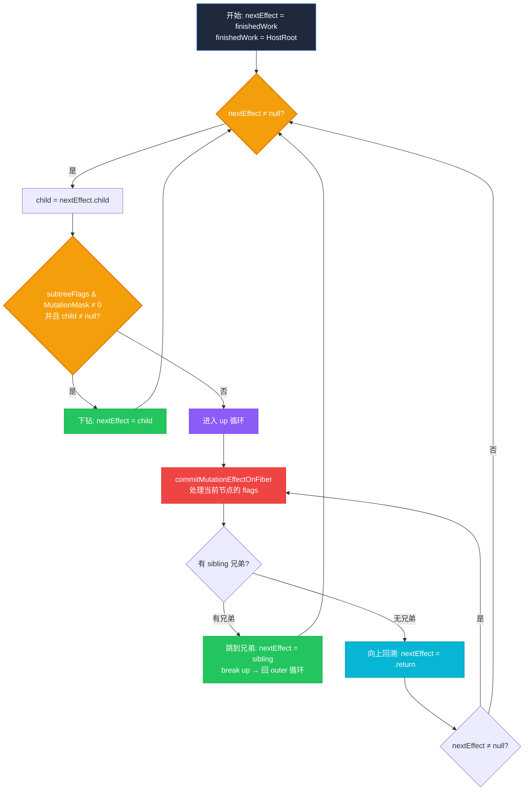

### 2.2 开始执行：用序列图看清每一步

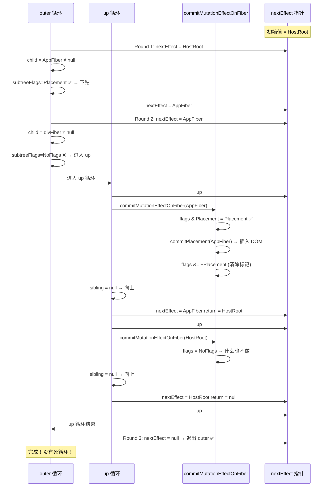

### 2.3 同一过程用状态机看

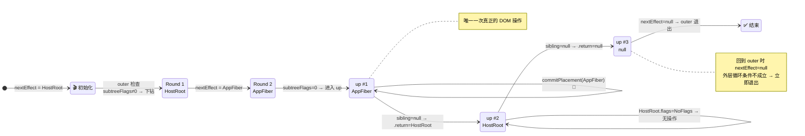

---

## Part 3: 为什么不会死循环？— 用"打地鼠"来理解

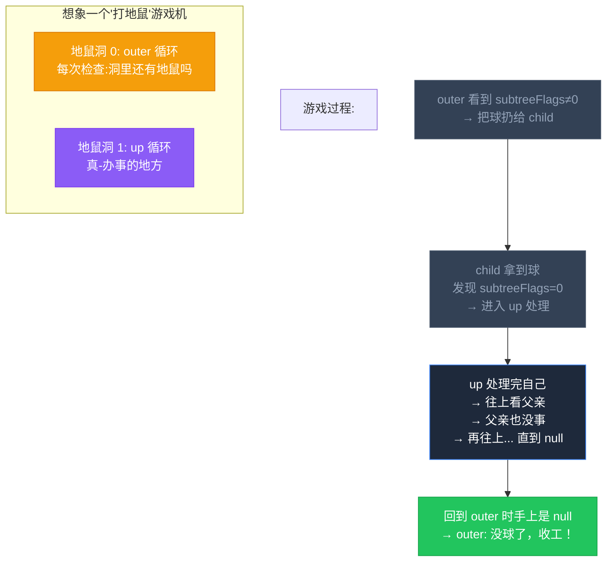

**关键理解**：

```
outer 的职责很轻 —— 只负责 "向下钻"
up 的职责很重 —— "所有 dirty work 都在 up 里完成，一口气处理到根"

outer 的逻辑：看 subtreeFlags → 非零就下钻
up   的逻辑：处理当前 → 有兄弟跳兄弟 → 没兄弟一直 pop 到 null

如果 up 因为兄弟跳出了（break up），outer 拿到的 nextEffect 
  是兄弟节点 → 继续下钻（没问题）
如果 up 没有兄弟，就 .return 一路 pop 到 null
  → outer 拿到 null → 退出（不会重复下钻！）
```

### 为什么不会回到 HostRoot 重新下钻？

这是最容易误解的地方。让我们精确追踪：

```
up 循环中：
  up 第 1 次: nextEffect = AppFiber → 处理 AppFiber
             sibling = null → nextEffect = AppFiber.return = HostRoot

  up 第 2 次: nextEffect = HostRoot（← 仍然在 up 循环内部！）
             处理 HostRoot
             sibling = null → nextEffect = HostRoot.return = null

  up 第 3 次: nextEffect = null → 退出 up 循环
```

**HostRoot 是在 up 循环内部被处理的**，所以当 up 循环结束时，nextEffect 已经是 null 了。outer 不会再"重新看到" HostRoot。

---

## Part 4: 更复杂的例子 — 有兄弟节点时

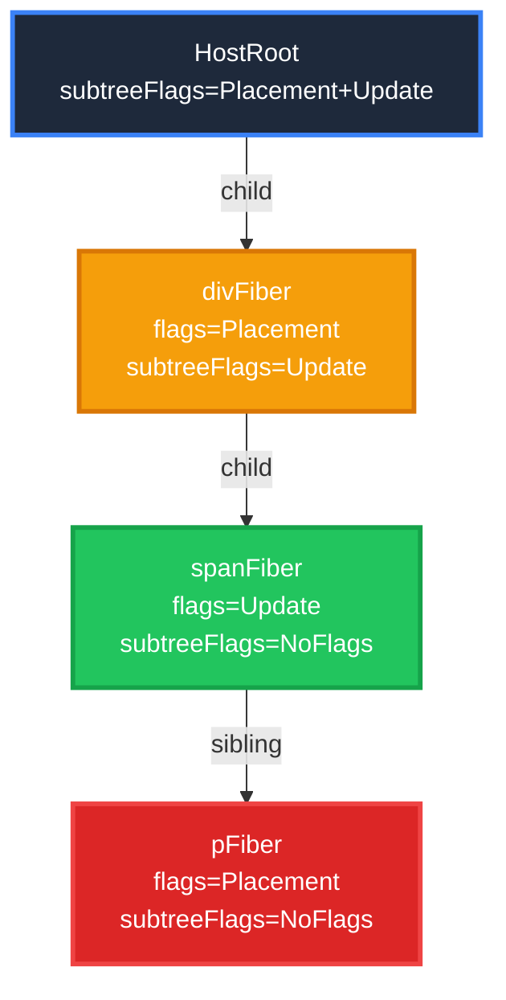

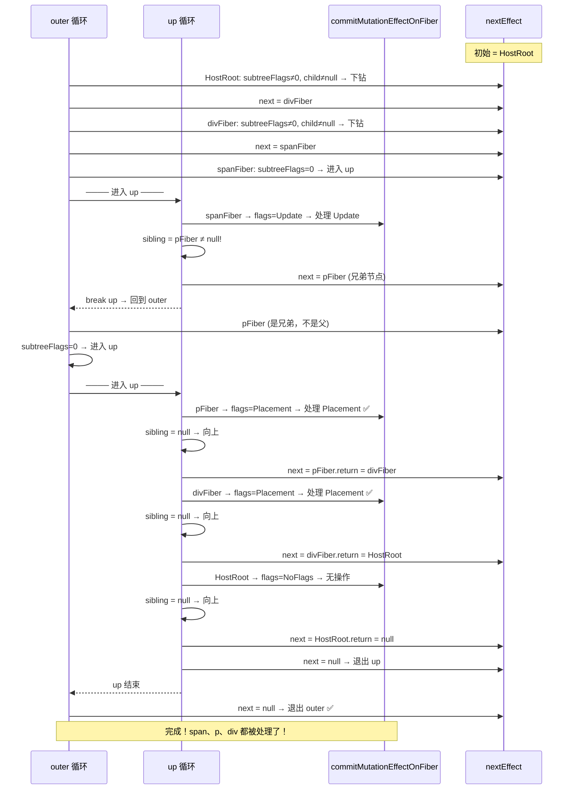

关键点：`break up` 后 nextEffect 指向的是 **兄弟节点 pFiber**，不是父节点。outer 继续下钻时是正常流程。

---

## Part 5: 为什么 commitMutationEffect 要设计成"迭代DFS"而不是递归

### 用流程图直观对比两种方案

```mermaid
flowchart TB
    subgraph left["递归方案 naiveDFS — React 15"]
        R1["naiveDFS(HostRoot)"] --> R2["naiveDFS(FunctionComponent)"]
        R2 --> R3["naiveDFS(div)"]
        R3 --> R4["naiveDFS(span)"]
        R4 --> R5["commitMutationEffectOnFiber(span)"]
        R4 --> R6["naiveDFS(p)"]
        R6 --> R7["commitMutationEffectOnFiber(p)"]
        R3 --> R8["commitMutationEffectOnFiber(div)"]
        R2 --> R9["commitMutationEffectOnFiber(Func)"]
    end

    subgraph right["迭代方案 commitMutationEffect — React 18"]
        I1[outer: nextEffect = HostRoot] --> I2{条件判断}
        I2 -->|下钻| I3[nextEffect = child]
        I3 --> I2
        I2 -->|进入 up| I4[up 循环处理]
        I4 --> I5[commitMutationEffectOnFiber<br/>处理当前]
        I5 --> I6{有兄弟?}
        I6 -->|是| I7[跳到兄弟]
        I7 --> I2
        I6 -->|否| I8[.return 向上]
        I8 --> I4
    end

    style R1 fill:#dc2626,stroke:#ef4444,color:white
    style R2 fill:#dc2626,stroke:#ef4444,color:white
    style R3 fill:#dc2626,stroke:#ef4444,color:white
    style R4 fill:#dc2626,stroke:#ef4444,color:white
    style R5 fill:#22c55e,stroke:#16a34a,color:white
    style R6 fill:#dc2626,stroke:#ef4444,color:white
    style R7 fill:#22c55e,stroke:#16a34a,color:white
    style R8 fill:#f59e0b,stroke:#d97706,color:white
    style R9 fill:#f59e0b,stroke:#d97706,color:white

    style I1 fill:#1e293b,stroke:#3b82f6,color:white
    style I2 fill:#f59e0b,stroke:#d97706,color:white
    style I3 fill:#22c55e,stroke:#16a34a,color:white
    style I4 fill:#8b5cf6,stroke:#7c3aed,color:white
    style I5 fill:#22c55e,stroke:#16a34a,color:white
    style I6 fill:#f59e0b,stroke:#d97706,color:white
    style I7 fill:#22c55e,stroke:#16a34a,color:white
    style I8 fill:#06b6d4,stroke:#0891b2,color:white
```

### 调用栈深度对比

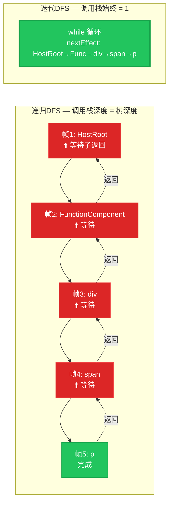

### 最坏情况对比：1000 层嵌套

```mermaid
gantt
    title 调用栈深度对比（1000 层嵌套）
    dateFormat X
    axisFormat %s

    section 递归方案
    栈帧 1 ~ 500   :a1, 0, 500
    栈帧 501 ~ 1000 :a2, 500, 500
    完全执行完毕后逐层返回 :a3, 1000, 500

    section 迭代方案
    while 循环始终只有 1 帧 :b1, 0, 1500
```

| 方案 | 1000 层嵌套时调用栈 | 风险 | 暂停能力 |
|------|-------------------|------|---------|
| 递归 DFS | 1000 层 | ⚠️ 栈溢出 | ❌ 不能暂停 |
| 迭代 DFS | **1 层** | ✅ 安全 | ✅ 可以 `requestIdleCallback` 分片执行 |

---

## Part 6: 核心优势 — 为并发模式铺路

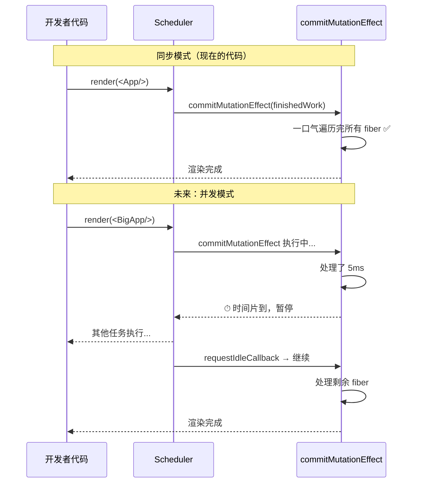

**关键区别**：`nextEffect` 是**模块级全局变量**，它的值在函数调用之间是保留的。这意味着：

```typescript
let nextEffect = null; // ← 外部变量

export const commitMutationEffect = (finishedWork) => {
    nextEffect = finishedWork;
    while (nextEffect !== null) {
        // 处理一个节点后...
        if (时间到) {
            requestIdleCallback(commitMutationEffect); // 下次继续
            return; // ← 现在退出，但 nextEffect 的值保留了进度！
        }
    }
};
```

而递归版本做不到这一点——递归调用栈在函数退出时就全部销毁了，无法"记住"进度。

---

## 一句话记住全部

```
    outer ── 只看路标（subtreeFlags），不做实际工作
    up    ── 做实际工作，一口气干到根
    nextEffect ── 一个指针，走完整个树只用 1 层调用栈
    不会死循环 ── 因为 up 回到 outer 时 nextEffect 已经是 null
    为什么存在 ── 为并发模式保留暂停点，同时防止栈溢出
```
