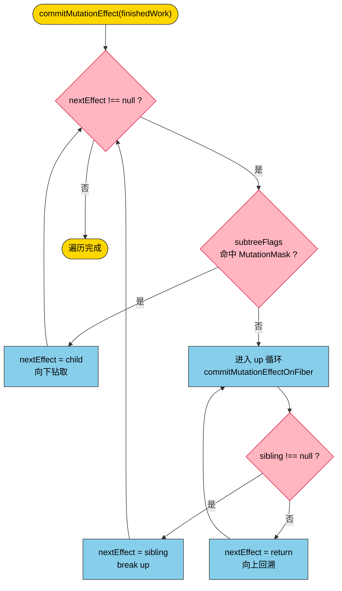
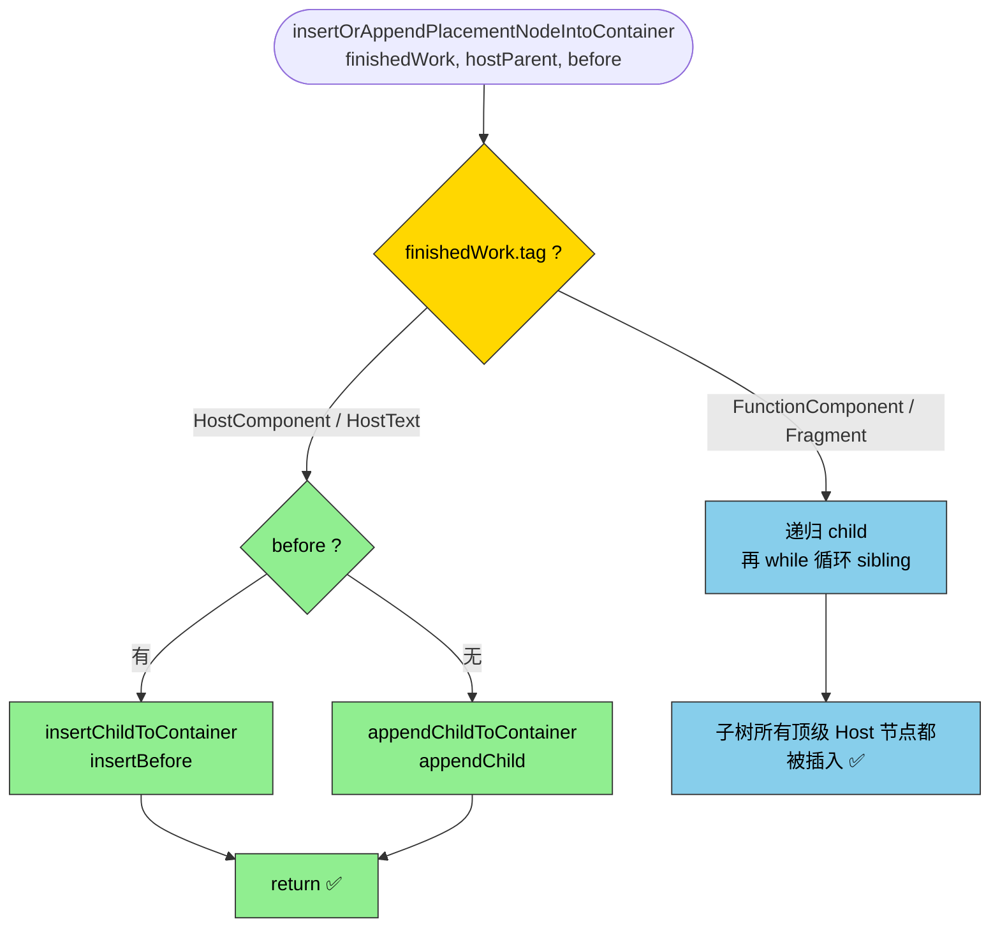

# commitWork.ts 深度解析

> 本文基于 `packages/react-reconciler/src/commitWork.ts` 当前实现，配合源码中按"五段式"规范补齐的 JSDoc 阅读。
>
> commit 阶段的 Mutation 子阶段做三件事：**Placement（插入/移动）**、**Update（属性更新）**、**ChildDeletion（删除子树）**。所有操作都通过 fiber 上的 `flags` 位掩码驱动。

---

## 1. 整体架构：一次 DFS 遍历，分派三种副作用



### 关键设计：`subtreeFlags` 剪枝

render 阶段 `completeWork` 会把子树的 `flags` 冒泡到父节点的 `subtreeFlags`。commit 遍历时：

- 当前 fiber `subtreeFlags & MutationMask === NoFlags` → **整棵子树跳过**，不递归
- 否则向下钻

这使得 commit 阶段的成本只和"有副作用的路径"长度成正比，和树的大小无关。

---

## 2. commitMutationEffectOnFiber：副作用分派中心

源码核心（简化）：

```typescript
const flags = finishedWork.flags;
if ((flags & Placement) !== NoFlags)       { commitPlacement(...);  flags &= ~Placement; }
if ((flags & Update) !== NoFlags)          { commitUpdate(...);     flags &= ~Update; }
if ((flags & ChildDeletion) !== NoFlags)   { deletions.forEach(commitDeletion); flags &= ~ChildDeletion; }
```

| flag | 处理函数 | 典型场景 |
|------|---------|---------|
| `Placement` (0b0001) | `commitPlacement` | 新节点 mount、diff 后位置移动 |
| `Update` (0b0010) | `commitUpdate` (hostConfig) | HostText 文本变化、HostComponent props 变化 |
| `ChildDeletion` (0b0100) | `commitDeletion` × N | 父 fiber 的 deletions 数组中每个 childToDelete |

> 一个 fiber 可能同时命中多个 flag（例如既被移动又更新了 props），三个 if 相互独立。处理完后用 `&= ~X` 立即清除，防止 commit 阶段向上回溯时重复执行。

---

## 3. commitPlacement：找到父 DOM + 参考兄弟 + 插入

执行链：

```
commitPlacement(finishedWork)
  ├─ getHostParent(finishedWork)              → Container
  ├─ getHostSibling(finishedWork)             → Instance | null
  └─ insertOrAppendPlacementNodeIntoContainer(finishedWork, hostParent, sibling)
```

### 3.1 getHostParent：向上找最近的真实 DOM 祖先

fiber 树里有 FunctionComponent / Fragment 这类"无 DOM"节点，所以 `fiber.return` 不一定是真实 DOM。`getHostParent` 沿 return 链向上跳，直到：

- 遇到 `HostComponent` → 返回 `parent.stateNode`
- 遇到 `HostRoot` → 返回 `FiberRootNode.container`
- 一路上都是非 Host → 继续向上

### 3.2 getHostSibling：三维查找稳定的兄弟 DOM

难点：**fiber 树的 sibling 顺序 ≠ DOM 树的兄弟顺序**。

- 兄弟可能是 FunctionComponent（无 DOM），真实 DOM 在它的 child 子树里
- 兄弟自身可能也是 Placement（也要被插入，不能当参考点）

查找策略：

| 步骤 | 动作 | 退出条件 |
|------|------|---------|
| 向右 | 取 `node.sibling` | 有 sibling → 进入向下 |
| 向上 | 无 sibling → `node = node.return` | 遇到 HostComponent/HostRoot 仍无 sibling → return null |
| 向下 | sibling 不是 Host → `node = node.child` | 遇到 HostComponent/HostText |
| 命中检查 | 候选 fiber `flags & Placement` | 有 → `continue findSibling` 跳过；无 → return stateNode |

### 3.3 insertOrAppendPlacementNodeIntoContainer：递归找顶级 DOM



**为什么 sibling 循环只在递归分支？**

如果 HostComponent 分支也处理 sibling，那么同一 sibling 会被处理两次——一次被自己的循环、一次被父层（非 Host 节点）的循环。

举例：

```
fiber 树：
  App (FunctionComponent)
    ├── divA (HostComponent)
    └── divB (HostComponent)

正确流程（sibling 循环只在 Case 2）：
  ① App → 递归 child = divA
  ② divA → HostComponent → appendChild(divA) → return（不管 sibling）
  ③ 回到 App 层 → while sibling → divB
  ④ divB → appendChild(divB)
  ✅ divA、divB 各插一次

错误流程（Case 1 也加 sibling 循环）：
  ①② 同上
  ②' divA 自己的 sibling 循环也会处理 divB → 第 1 次插入 divB
  ③ 回到 App 层 → while sibling → divB
  ④ 第 2 次插入 divB ❌
```

---

## 4. commitDeletion：删除子树的所有真实 DOM

执行链：

```
commitDeletion(childToDelete)
  ├─ rootChildrenToDelete: FiberNode[] = []
  ├─ commitNestedComponent(childToDelete, cb)        // DFS 遍历整棵子树
  │    └─ cb 对每个 HostComponent/HostText 调 recordHostChildrenToDelete
  ├─ getHostParent(childToDelete)                    // 找到父 DOM
  └─ rootChildrenToDelete.forEach(node => removeChild(node.stateNode, hostParent))
```

### 4.1 commitNestedComponent：迭代版 DFS

不依赖递归调用栈，通过指针操作完成深度优先遍历：

```
当前 node：
  ① 有 child → node = child（向下钻）
  ② node === root → 遍历完成
  ③ 无 sibling → 沿 return 向上，直到找到有 sibling 的祖先
  ④ 有 sibling → node = sibling（水平移动）
```

### 4.2 recordHostChildrenToDelete：只收集"顶层"Host 节点

关键约束：从父 DOM 中 `removeChild` 只能移除**直接子节点**。

- 如果 `childToDelete` 本身是 HostComponent → 直接 push 它一个就够（它的子树已经挂在它的 stateNode 下）
- 如果 `childToDelete` 是 Fragment / FunctionComponent → 需要收集它下面第一层 Host 节点

收集算法利用"sibling 链连通性"判断"是否同一层级"：

```
lastOne = childrenToDelete 末尾节点
从 lastOne.sibling 出发沿 sibling 链查找：
  能找到 unmountFiber → 是同一层级 → push
  找不到 → 是嵌套层级（在某个 FunctionComponent 内部）→ 跳过
```

#### 场景 A：childToDelete 是 HostComponent

```
fiber 树：
  ul (HostComponent) ← childToDelete
    └── Fragment
          ├── li#1
          ├── li#2
          └── li#3

收集过程：
  ① ul：childrenToDelete 为空 → push → [ul]
  ② li#1：lastOne = ul，ul.sibling = null → 找不到 → 跳过
  ③ 后续 li/text 同理跳过

rootChildrenToDelete = [ul]
最终：removeChild(<ul>, parent) ✅
```

#### 场景 B：childToDelete 是 Fragment

```
fiber 树：
  ul
    └── Fragment ← childToDelete
          ├── li#1
          ├── li#2
          └── li#3

收集过程：
  ① Fragment：tag=7 → default 不处理
  ② li#1：空 → push → [li#1]
  ③ li#2：lastOne=li#1，li#1.sibling=li#2 → 找到 → push → [li#1, li#2]
  ④ li#3：lastOne=li#2，li#2.sibling=li#3 → 找到 → push → [li#1, li#2, li#3]

rootChildrenToDelete = [li#1, li#2, li#3]
最终：
  removeChild(<li>1</li>, <ul>)
  removeChild(<li>2</li>, <ul>)
  removeChild(<li>3</li>, <ul>)  ✅
```

#### ⚠️ 已知限制：FunctionComponent 子节点嵌套的 Host 节点会被遗漏

```
fiber 树：
  div ← childToDelete
    ├── p#1 (HostComponent)
    ├── Child (FunctionComponent)
    │     └── span (HostText)       ← 不在 p#1 的 sibling 链上
    └── p#2 (HostComponent)

收集结果：[p#1, p#2]，span 被遗漏
```

这正是为什么 React 推荐 FunctionComponent 返回的多个兄弟节点用 Fragment 包裹——Fragment 在 fiber 树中会展开成 sibling 链，删除时能正确收集。

---

## 5. 三种副作用对比表

| 维度 | Placement | Update | ChildDeletion |
|------|-----------|--------|---------------|
| 触发 flag | `Placement` | `Update` | `ChildDeletion` |
| 副作用挂在 | 当前 fiber | 当前 fiber | **父 fiber**（deletions 数组） |
| 处理函数 | `commitPlacement` | hostConfig 的 `commitUpdate` | `commitDeletion` × N |
| 核心 DOM API | `insertBefore` / `appendChild` | `textContent = ...` 等 | `removeChild` |
| 关键辅助函数 | `getHostParent` + `getHostSibling` + `insertOrAppend...` | 无 | `commitNestedComponent` + `recordHostChildrenToDelete` |
| 典型场景 | mount、diff 后位置移动 | 文本/props 变化 | 条件渲染消失、diff 后子节点减少 |

---

## 6. 一句话总结

> commitWork.ts 把 render 阶段收集到的 flags 位掩码翻译成具体的 DOM 操作。
>
> - **Placement** 关心"往哪插"——通过 getHostParent / getHostSibling 跨 fiber 边界找到真实的父容器和参考兄弟。
> - **Update** 关心"改成什么"——直接调用宿主环境的更新函数。
> - **ChildDeletion** 关心"删哪些"——DFS 收集所有需要从父 DOM 移除的顶层 Host 节点，再一次性 removeChild。
>
> 所有遍历都靠 `subtreeFlags` 剪枝，所有 fiber 处理完立即用 `&= ~X` 清除标记，保证遍历成本只与"有副作用的路径"成正比、不重复执行。
