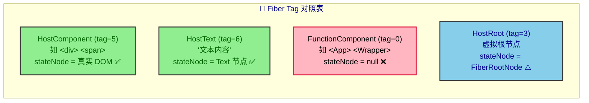
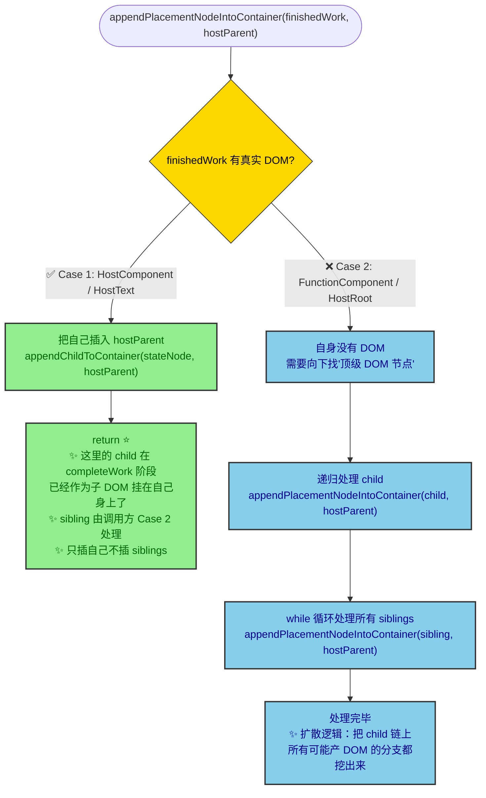
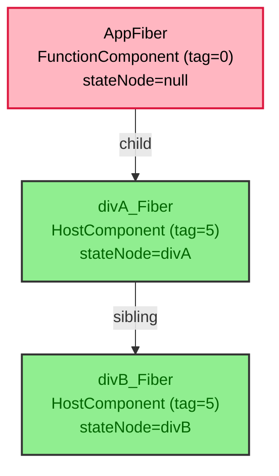
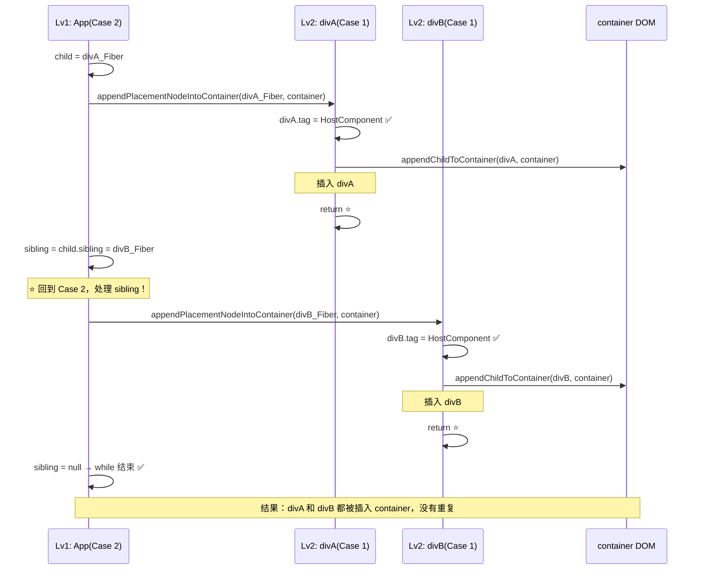
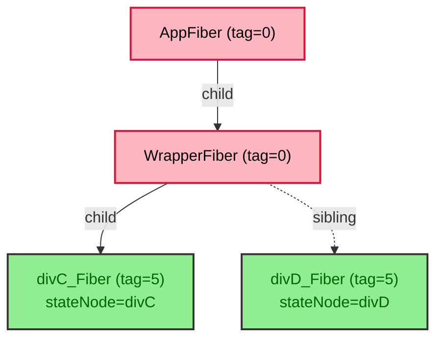
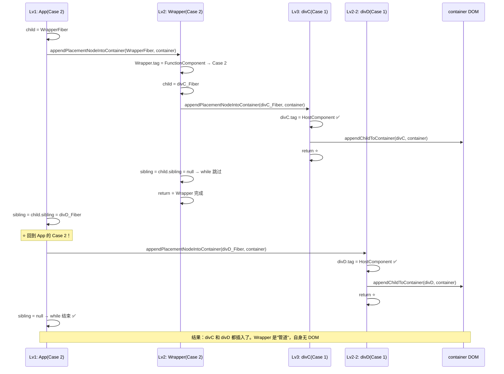
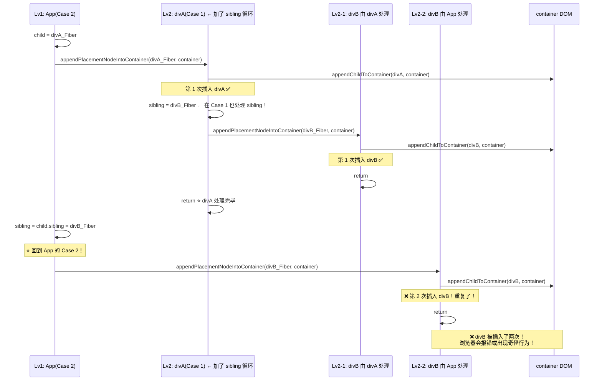
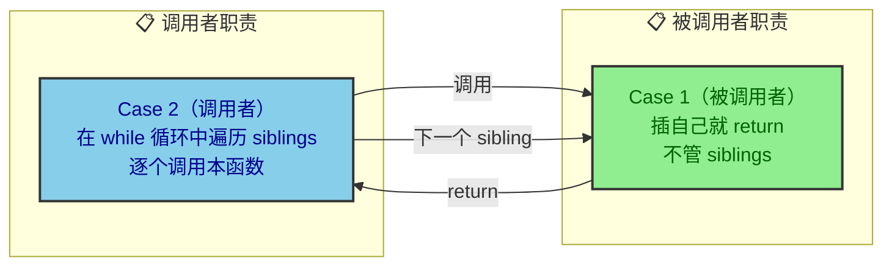
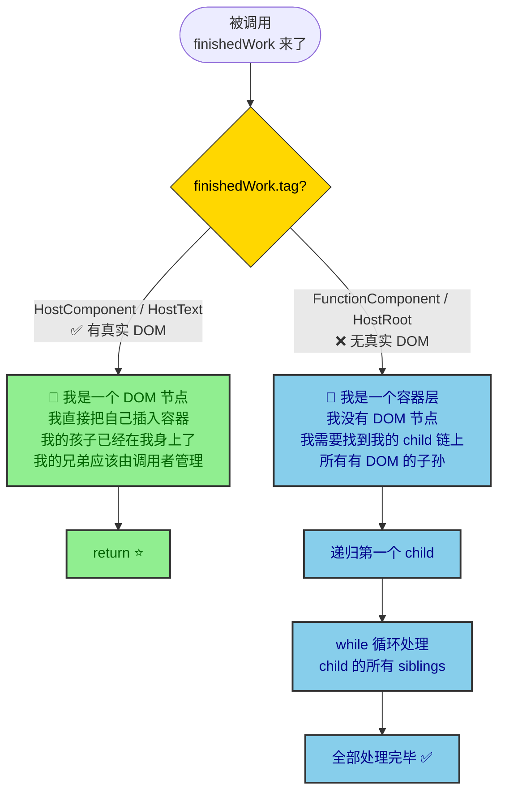

# appendPlacementNodeIntoContainer 深度解析：为什么 sibling 处理只在 Case 2

## 核心问题

```typescript
function appendPlacementNodeIntoContainer(
  finishedWork: FiberNode,
  hostParent: Container
) {
  // Case 1：当前是 HostComponent / HostText（有真实 DOM 节点）
  if (finishedWork.tag === HostComponent || finishedWork.tag === HostText) {
    appendChildToContainer(hostParent, finishedWork.stateNode);
    return; // ← ❓ 为什么不处理 siblings 就直接返回了？
  }
  // Case 2：当前不是 HostComponent / HostText（没有真实 DOM 节点）
  const child = finishedWork.child;
  if (child !== null) {
    appendPlacementNodeIntoContainer(child, hostParent);
    let sibling = child.sibling;
    while (sibling !== null) {          // ← ⚠️ 这里用 while 循环处理 siblings
      appendPlacementNodeIntoContainer(sibling, hostParent);
      sibling = sibling.sibling;
    }
  }
}
```

两个分支的处理方式**不对称**——Case 1 直接 return，Case 2 用 while 处理 siblings。为什么？

---

## 前置知识：Fiber 节点 ≠ DOM 节点



---

## 函数本质：递归找"顶级 DOM 节点"



---

## 示例 1：简单场景 —— FunctionComponent 包含两个 HostComponent

```jsx
<App>                 {/* FunctionComponent → 无 DOM */}
  <div>A</div>        {/* HostComponent → 有 DOM = divA */}
  <div>B</div>        {/* HostComponent → 有 DOM = divB */}
</App>
```

### Fiber 树结构



### 调用链追踪



---

## 示例 2：嵌套的 FunctionComponent（多层 Case 2 递归）

```jsx
<App>                 {/* FunctionComponent → 无 DOM */}
  <Wrapper>           {/* FunctionComponent → 无 DOM */}
    <div>C</div>      {/* HostComponent → 有 DOM = divC */}
  </Wrapper>
  <div>D</div>        {/* HostComponent → 有 DOM = divD */}
</App>
```

### Fiber 树结构



### 调用链追踪



---

## 如果再在 Case 1 加 sibling 循环会怎样？

假设我们这样写：

```typescript
// ❌ 错误的写法
if (finishedWork.tag === HostComponent || finishedWork.tag === HostText) {
  appendChildToContainer(finishedWork.stateNode, hostParent);
  // 如果这里再加 siblings 循环...
  let sibling = finishedWork.sibling;
  while (sibling !== null) {
    appendPlacementNodeIntoContainer(sibling, hostParent);
    sibling = sibling.sibling;
  }
  return;
}
```

对于示例 1 的 Fiber 树，追踪：



**divB 被插入了两次！** 这就是为什么 sibling 的处理必须只在 Case 2 进行。

---

## 函数设计哲学



| 角色 | 职责 | 为什么 |
|------|------|--------|
| **Case 1** (HostComponent/HostText) | **只插自己**，立即 return | 它的 child 已在 completeWork 阶段挂在自己 DOM 上；它的 sibling 由调用者（Case 2）管理，自己不能越权 |
| **Case 2** (非 host) | **扩散逻辑**——遍历 child 链上所有分支 | 自身无 DOM，必须通过递归把所有可能产 DOM 的子孙挖出来 |

---

## 一张图记住所有



---

## 一句话总结

| | Case 1 (HostComponent/HostText) | Case 2 (FunctionComponent 等) |
|---|---|---|
| 自身 DOM | ✅ 有 | ❌ 无 |
| 做什么 | 插自己，return | 向下递归找"顶级 DOM 节点" |
| sibling 处理 | ❌ 不管 | ✅ while 循环处理 child.sibling |
| 为什么这样设计 | sibling 由调用方管理，否则重复插入 | 自身无 DOM，必须遍历 child 链挖出所有 DOM |
