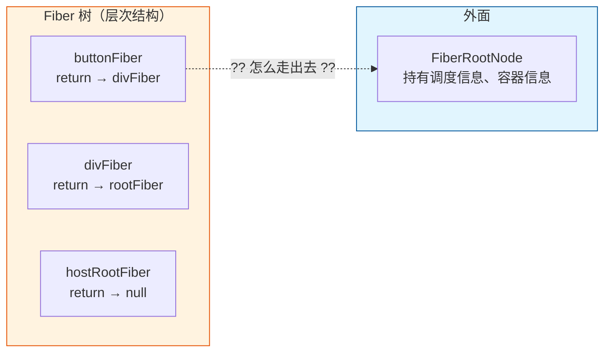
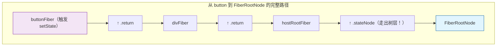
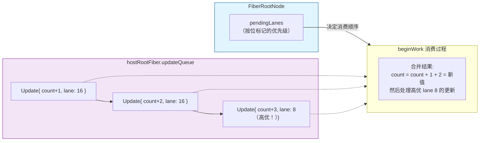
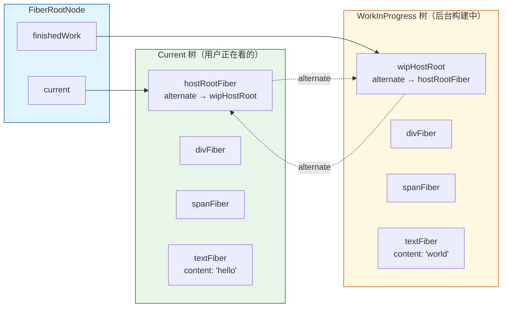
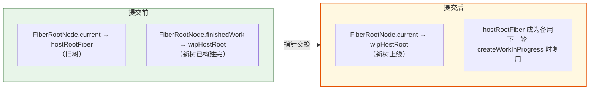
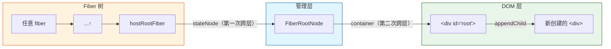
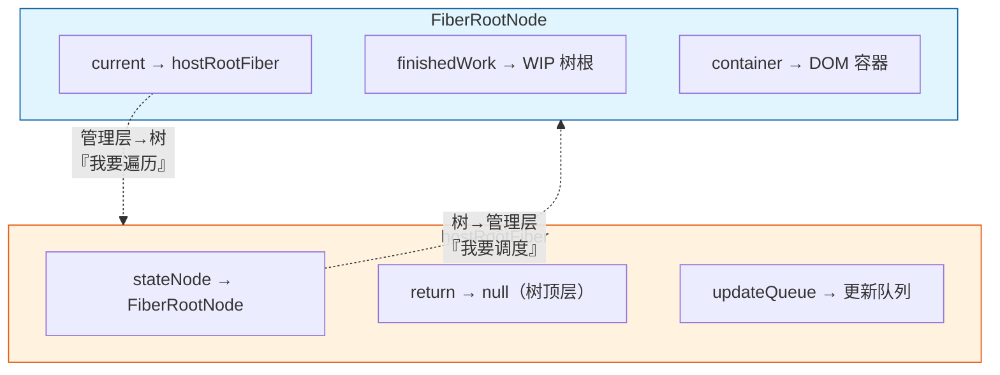
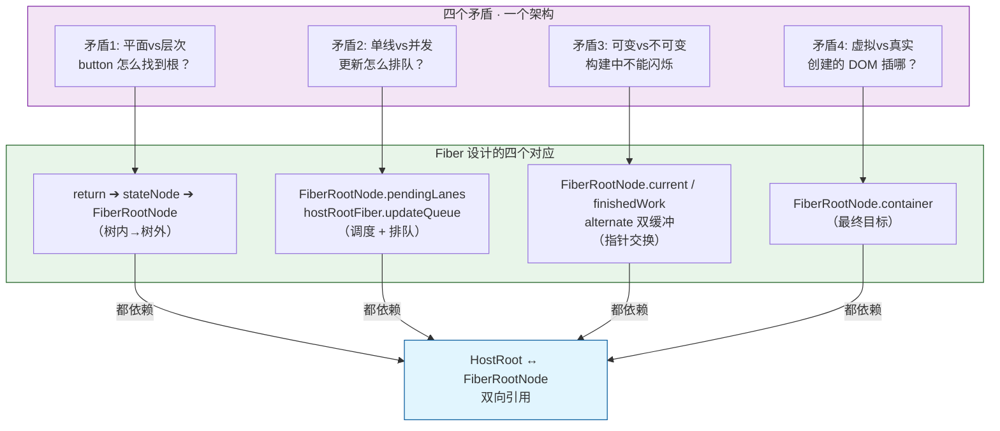
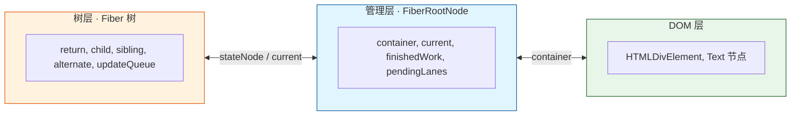

# Fiber 设计哲学：为什么 React 要这么设计？

## 写在前面

> **⚠️ 本文所有 Mermaid 图表中的方括号 `「」` 替代圆括号 `()` 以避免 Mermaid 解析错误。阅读时请把 `节点名「类型」` 理解为 `节点名(类型)`**
>
> **⚠️ 本文沿用之前的 Mermaid 规定：`\n` 做换行、`->` 替代 Unicode 箭头、不指向 subgraph 名。**

Fiber 架构中最让人困惑的不是"它做了什么"，而是"**它为什么非要这样做**"。

本文的目的：从一个极端简化的"反例"开始，逐步推导出 React 为什么选了现在的方案。**看完你会明白，每一个让你困惑的设计，背后都有一个你必须面对的问题。**

---

## 第一章：一个朴素的问题

假设你要自己写一个 UI 框架。你有：

1. **一棵虚拟 DOM 树**（描述 UI 长什么样）
2. **一个真实 DOM 容器**（`<div id="root">`）
3. **一套更新机制**（用户点了按钮，UI 要变）

最朴素的想法：把所有东西塞到一个对象里。

```typescript
// 反例：朴素但混乱的设计
class Root {
  container: HTMLElement;       // DOM 容器
  vdomTree: VNode;              // 虚拟 DOM 树根
  pendingUpdate: Update | null; // 待处理的更新
}
```

这有什么问题？

```typescript
// 问题 1：更新从深层触发，但根在顶层
function handleClick(buttonVNode: VNode) {
  // 我在按钮的点击事件里，怎么找到 Root？
  // buttonVNode.parent.parent...parent → Root？ ❌ 没有这个引用
  // 只能用全局变量 window.__root__
}

// 问题 2：更新过程中，用户又触发了一个更新
root.pendingUpdate = update1;
// 同时用户点了另一个按钮：
root.pendingUpdate = update2;  // ← 覆盖了 update1！

// 问题 3：渲染过程中，DOM 还没更新完，用户又点了按钮
// 当前树正在被修改，但用户期望看到的是旧树
// → 并发更新根本不可能
```

**这暴露了几个核心矛盾：**

| 矛盾 | 描述 |
|---|---|
| **平面 vs 层次** | 更新从深层触发，但根在顶层——需要双向可达 |
| **单线 vs 并发** | 更新过程中新更新来了——需要排队 + 优先级 |
| **可变 vs 不可变** | 渲染过程中需要同时持有"当前屏幕"和"下一帧"——双缓冲 |
| **虚拟 vs 真实** | 虚拟节点和真实 DOM 的对应关系——需要一个稳定的映射 |

Fiber 架构就是为**同时解决这四个矛盾**而设计的。我们一个一个看。

---

## 第二章：矛盾一——平面 vs 层次（双向可达）

### 问题

用户在 `<button>` 上点了 `setState`，React 内部调用了 `scheduleUpdateOnFiber(buttonFiber)`。这个函数需要**找到 FiberRootNode**（因为上面有调度状态）。

但 `buttonFiber` 在树深处，`FiberRootNode` 在树外面。



### 不优雅的解法

```typescript
// 解法 A：全局 Map
const fiberToRoot = new Map<FiberNode, FiberRootNode>();
// 每个 fiber 创建时都注册
// 问题：Map 引用阻止 GC，多 root 场景 key 冲突

// 解法 B：每个 fiber 存 root 引用
class FiberNode {
  root: FiberRootNode;  // ← 每个节点都存！
}
// 问题：几万个 fiber 存同一个指针，内存浪费

// 解法 C：FiberRootNode 继承 FiberNode
class FiberRootNode extends FiberNode {
  container: Container;
}
// 问题：根节点既是树节点又是管理器——职责混淆
// hostRootFiber.return.return... 会走到 FiberRootNode
// 但 FiberRootNode 有 child/sibling/return 吗？没有意义
```

### React 的实际解法

**`hostRootFiber.stateNode → FiberRootNode`**（树层→管理层）

```typescript
class FiberNode {
  stateNode: any;  // 对本 Fiber 来说"对应的实物"
  // HostRoot → FiberRootNode
  // HostComponent → 真实 DOM 节点
  // HostText → 文本节点
  // FunctionComponent → null
}
```

**为什么 `stateNode` 在不同 tag 下指向不同东西？**

因为"我需要走出去找谁"在不同场景下不一样：

| Fiber 类型 | 它的"实物" | 为什么是这个东西 |
|---|---|---|
| `HostRoot` | `FiberRootNode` | 它需要走出树层找到管理层 |
| `HostComponent` | 真实 DOM 节点 | 它需要操作 DOM（增删改查） |
| `HostText` | 文本节点 | 它代表一段文本 |
| `FunctionComponent` | `null` | 它不直接操作任何外部实物 |



**`stateNode` 的设计哲学：**

> **"Fiber 节点不关心外面的世界长什么样。它只在需要出去的时候，通过 stateNode 这扇门跨出去。"**

---

## 第三章：矛盾二——单线 vs 并发（更新入队）

### 问题

用户快速点了两次按钮：

```
setCount(c => c + 1)  // 第一次点击
setCount(c => c + 2)  // 第二次点击（还在上一次的渲染过程中）
```

这两次更新需要：**按顺序排队，但不阻塞。**

```typescript
// 朴素实现：覆盖
fiber.updateQueue = update2;  // ← update1 丢了！

// 更好：数组
fiber.updateQueue = [update1, update2];  // ← 太多了没优先级
```

### React 的解法

**UpdateQueue 作为单向链表，FiberRootNode 持有调度状态。**

```
FiberRootNode.pendingLanes → 确定优先级
                  ↓
hostRootFiber.updateQueue → Update① → Update② → Update③（链表）
                  ↓
beginWork 时消费 → 按优先级合并 → memoizedState
```



**但这里有个关键问题：** 更新是在 fiber 层面入队的（`scheduleUpdateOnFiber(buttonFiber)`），但**调度决策在 FiberRootNode 层面**。

所以 `scheduleUpdateOnFiber` 必须先找到 FiberRootNode，这就是为什么需要 `markUpdateFromFiberToRoot` 这个向上遍历。

```typescript
function scheduleUpdateOnFiber(fiber: FiberNode) {
  // 1. 先把更新入队到当前 fiber
  enqueueUpdate(fiber.updateQueue, update);
  
  // 2. 向上找到 FiberRootNode
  const root = markUpdateFromFiberToRoot(fiber);
  
  // 3. 在 FiberRootNode 上做调度决策
  //    （设置 pendingLanes、启动调度器等）
  root.pendingLanes |= updateLane;
  ensureRootIsScheduled(root);
}
```

**`markUpdateFromFiberToRoot` 的存在意义：**

> **"更新发生在具体节点上，但调度是全局决策。必须找到根节点才能做调度。"**

---

## 第四章：矛盾三——可变 vs 不可变（双缓冲）

### 问题

用户看到了 `<div><span>hello</span></div>`。然后用户点了按钮，新 UI 是 `<div><span>world</span></div>`。

在构建新 UI 的过程中，**用户不应该看到"一半新一半旧"的闪烁画面**。

### 不优雅的解法

```typescript
// 解法 A：原地修改
divFiber.child.textFiber.memoizedProps = { content: 'world' };
// 立刻修改——用户看到闪烁，且如果渲染到一半出错，
// 页面处于"部分更新"的损坏状态

// 解法 B：克隆整棵树
const newTree = cloneDeep(oldTree);
// 性能灾难——每次更新都克隆全部
```

### React 的解法

**双缓冲 + alternate 指针。**

两个关键设计：

1. **`FiberRootNode.current → 当前屏幕上的树根`**
2. **`alternate` 连接两棵树的对应节点**



**核心操作——提交时刻的指针交换：**

```typescript
// 提交阶段
function commitRoot(root: FiberRootNode) {
  // 1. 取出构建好的 WIP 树
  const finishedWork = root.finishedWork;
  
  // 2. 遍历它，执行 DOM 操作
  //    ...
  
  // 3. 交换指针——这就是"提交"的本质
  root.current = finishedWork;
  
  // 旧树通过 alternate 仍然可达，成为下一轮 WIP 的备用
}
```

**为什么 `FiberRootNode` 要持有 `current`？**

因为没有 `current`，就无法完成指针交换。而指针交换是**双缓冲的核心操作**——它把 WIP 树"瞬间"变成 Current 树。



**那 `finishedWork` 为什么也要在 FiberRootNode 上？**

因为 workLoop 和 commit 是**不同时间执行**的：

```typescript
// 第一阶段：render（可能在多个空闲帧中执行）
workLoop();  // 构建 WIP 树
root.finishedWork = workInProgress;  // 暂存

// ... 可能在下一帧 ...

// 第二阶段：commit（必须在下一帧一次性执行）
commitRoot(root);  // 从 root.finishedWork 取出构建好的树
```

如果 `finishedWork` 不在 FiberRootNode 上，render 阶段和 commit 阶段就无法正确传递构建好的树。

---

## 第五章：矛盾四——虚拟 vs 真实（DOM 操作）

### 问题

`beginWork` 创建了 `divFiber`（虚拟节点），`completeWork` 需要创建真实的 `HTMLDivElement`。但**这个真实的 DOM 节点要插到哪？**

### 不优雅的解法

```typescript
// 解法：每个 completeWork 都往上找容器
function completeWork(fiber: FiberNode) {
  // 创建真实 DOM
  const dom = document.createElement(fiber.type);
  
  // 往上找到根
  let node = fiber;
  while (node.return) node = node.return;
  
  // 通过根找到容器
  // ...但怎么从 hostRootFiber 找到 container？
}
```

### React 的解法

**`FiberRootNode.container` 作为最终目标。**

完整路径链：

```
任意 fiber →
  .return.return... ↑
  → hostRootFiber（tag === HostRoot）
  → hostRootFiber.stateNode → FiberRootNode
  → FiberRootNode.container → <div id="root">
```



**这段路径恰好利用了前面所有设计的组合：**

| 步骤 | 使用的设计 | 解决了什么问题 |
|---|---|---|
| fiber → hostRootFiber | `return` 指针 | 树内向上遍历 |
| hostRootFiber → FiberRootNode | `stateNode` 指针 | 从树层跨到管理层 |
| FiberRootNode → container | `container` 字段 | 从管理层跨到 DOM 层 |

**这三步加起来，就构成了一条从任意 fiber 直通 DOM 容器的路径。不需要全局变量，不需要额外存储，只靠指针链就完成了三层之间的通信。**

---

## 第六章：为什么这些设计必须组合在一起？

现在我们可以回答最初的问题了——**为什么 HostRoot 的 `stateNode` 要指向 FiberRootNode，而 FiberRootNode 的 `current` 要指向 HostRoot？**

因为它们各自解决了一个方向的问题：



**把四个矛盾放在一张图里看：**



**四个矛盾，四个解法，都依赖于同一个双向引用。**

---

## 第七章：学完后的心智模型

你可以在脑海里建立这样一个三层模型：



**每条链的走向和含义：**

| 走向 | 代码 | 语义 |
|---|---|---|
| 树层⟶管理层 | `hostRootFiber.stateNode` | "我是树的根，我的管理者是你" |
| 管理层⟶树层 | `FiberRootNode.current` | "我是管理者，当前显示的树是你" |
| 管理层⟶DOM 层 | `FiberRootNode.container` | "我要操作的真实 DOM 容器是你" |
| 树层内⬆ | `fiber.return` | "我的工作完成了，回到父节点" |
| 树层内⬇ | `fiber.child` | "我的子节点在这，继续遍历" |
| 树层内⮕ | `fiber.sibling` | "我的兄弟节点在这，处理下一个" |
| 树层内↔ | `fiber.alternate` | "你是另一棵树里的我" |

**整个 Fiber 架构就是这三层 + 七条链。** 每条链解决一个具体问题，所有链组合在一起，构成了一个完整、高效的 UI 更新框架。

---

## 写在最后

下次当你看到 `root.current` 和 `hostRootFiber.stateNode` 互相指时，不要把它当成"一个奇怪的循环引用"。把它理解成：

> **这是树层和管理层之间的一条双向高速公路。树层通过它找到管理者做调度和提交，管理层通过它找到树根做遍历和 diff。少了任何一段，更新流程就断了。**
>
> **一扇门不够，需要两扇门——一个进去，一个出来。这就是为什么要双向。**

这份文档对应的代码在 `packages/react-reconciler/src/fiber.ts` 和 `fiberReconciler.ts` 中。建议配合 `fiber-references-explained.md` 一起阅读——那篇讲"怎么工作的"，这篇讲"为什么这样设计"。
