# Fiber 引用关系深度解析：从 `createContainer` 到渲染完成

## 写在前面

这篇文章的目标是**完全消除你对 Fiber 引用关系的困惑**。我们会：

1. 一行一行地看代码，**每创建一行对象就把当时的引用图画出来**
2. 用一个具体的例子（`<div><span>hello</span></div>`）走通整个流程
3. **用 Mermaid 图表** 让指针关系一目了然
4. 最终让你能清楚地回答：*谁指向谁？为什么这么指？在什么阶段这个指针起作用？*

> **⚠️ 本文所有 Mermaid 图表中的方括号 `「」` 替代圆括号 `()` 以避免 Mermaid 解析错误。阅读时请把 `节点名「类型」` 理解为 `节点名(类型)`**
>
> **⚠️ Mermaid 图表编写铁律（LLM 高频踩坑记录，以后不再犯）：**
> 1. **换行用 `\n` 不用 `<br/>`**：flowchart 节点标签 `["..."]` 内的换行必须用 `\n` 转义序列，`<br/>` 仅 sequenceDiagram 的 `Note over` 中可用
> 2. **HTML 实体分号不能省**：`&gt;` `&lt;` `&amp;` 等必须带末尾分号，`&gt` 会被解析器当成非法 token
> 3. **箭头不能指向 subgraph**：`node --> subgraphName` 是非法语法，必须指向 subgraph **内部的节点**（如 `current3`）
> 4. **管道标签 `|` 只出现一次**：`-->|"标签"| node` 是正确的，`-->|"标签"--> node` 多了一个 `-->` 会报错
> 5. **节点标签内避免括号 `()`**：用 `「」` 替代，防止被误解析为节点形状语法

---

## 一、两个核心类：FiberNode 和 FiberRootNode

### 1.1 FiberNode —— 工作单元

```typescript
export class FiberNode {
  tag: WorkTag;          // 节点类型: HostRoot(3) | HostComponent(5) | HostText(6) ...
  pendingProps: Props;   // 待处理的属性
  memoizedProps: Props;  // 已处理的属性
  memoizedState: any;    // 已处理的状态（对HostRoot来说，这里存的就是 ReactElement 树）
  stateNode: any;        // 对应真实 DOM 节点 OR 对本 Fiber 来说"我就是根节点"的 FiberRootNode
  type: any;             // DOM 标签名 or 函数组件本身
  updateQueue: unknown;  // 更新队列

  // --- 树结构指针（三兄弟）---
  return: FiberNode | null;   // 指向父节点
  sibling: FiberNode | null;  // 指向下一个兄弟节点
  child: FiberNode | null;    // 指向第一个子节点
  index: number;              // 在父节点子节点列表中的索引

  // --- 双缓冲机制指针 ---
  alternate: FiberNode | null; // 指向对应的另一棵树的节点

  flags: Flags; // 副作用标记
}
```

**关键理解：** `FiberNode` 通过 `return / child / sibling` 三根指针构成一棵**树**（不是二叉树，而是"子节点链"结构）。另外通过 `alternate` 连接两棵树。

### 1.2 FiberRootNode —— 根节点挂载点

```typescript
export class FiberRootNode {
  container: Container;           // 真实 DOM 容器 (document.getElementById('root'))
  current: FiberNode;             // 指向当前在屏幕上显示的 Fiber 树根节点
  finishedWork: FiberNode | null; // 指向刚刚构建完成、等待提交的 Fiber 树根节点
}
```

---

## 二、`createContainer` 到底干了什么？

```typescript
export function createContainer(container: Container) {
  // 第 1 步：new 一个 HostRoot 类型的 FiberNode
  const hostRootFiber = new FiberNode(HostRoot, {}, null);
  // 第 2 步：new 一个 FiberRootNode，将 hostRootFiber 传进去
  const root = new FiberRootNode(container, hostRootFiber);
  // 第 3 步：给 hostRootFiber 初始化一个 updateQueue
  hostRootFiber.updateQueue = createUpdateQueue();
  return root;
}
```

### 第 1 步：`new FiberNode(HostRoot, {}, null)`

此时，内存中创建了一个 `FiberNode` 对象（我们叫它 `hostRootFiber`）：

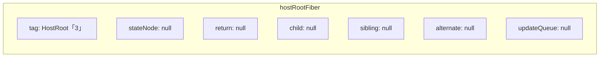

**所有属性都是默认值。** 注意 `stateNode` 为 `null`——此时还不知道谁是这个 fiber 的"状态节点"。

### 第 2 步：`new FiberRootNode(container, hostRootFiber)`

这是**最关键的一步**，因为 `FiberRootNode` 构造函数内部做了**双向引用**：

```typescript
constructor(container: Container, hostRootFiber: FiberNode) {
  this.container = container;         // A
  this.current = hostRootFiber;       // B ← FiberRootNode 指向 hostRootFiber
  hostRootFiber.stateNode = this;     // C ← hostRootFiber 反向指向 FiberRootNode
  this.finishedWork = null;           // D
}
```

执行完这一步后的引用关系：

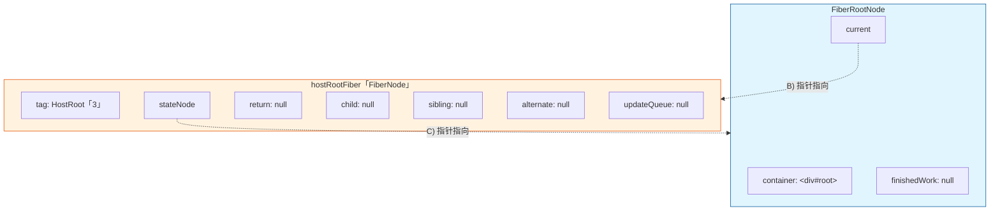

**看懂了吗？** 这个时候有这么几层引用：

| 引用路径 | 含义 |
|---|---|
| `fiberRoot.current → hostRootFiber` | FiberRootNode 知道"当前显示的 Fiber 树根是 hostRootFiber" |
| `hostRootFiber.stateNode → fiberRoot` | FiberNode 知道"我直属的根容器是 fiberRoot" |

> 注意：`hostRootFiber.return` 依然是 `null`。因为 HostRoot 是**最顶层的 Fiber**，它没有父 Fiber。

### 第 3 步：`hostRootFiber.updateQueue = createUpdateQueue()`

```typescript
export const createUpdateQueue = <State>() => {
  return {
    shared: {
      pending: null   // 待处理的更新
    }
  } as UpdateQueue<State>;
};
```

给 `hostRootFiber.updateQueue` 挂上一个队列对象。最终：

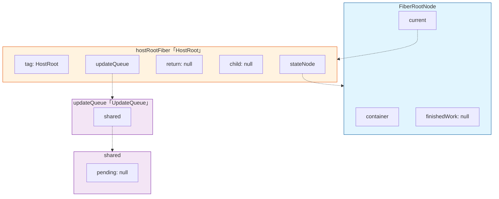

### 完整引用关系总结（createContainer 之后）

```
FiberRootNode (root)
  .container          = <div id="root">
  .current ──────────→ hostRootFiber (FiberNode, tag=HostRoot)
  .finishedWork       = null

hostRootFiber
  .tag                = HostRoot (3)
  .stateNode ────────→ FiberRootNode     ← 反向指针！
  .return             = null             ← 根节点没有父级
  .child              = null
  .sibling            = null
  .alternate          = null             ← 还没有第二棵树
  .updateQueue ──────→ { shared: { pending: null } }
```

**提问：** 现在调用 `createContainer` 返回的 `root`，通过它能找到一切吗？

**答：** 可以——`root.current` 是 `hostRootFiber`，而 `hostRootFiber.stateNode` 又是 `root`。这是一个**双向可达**的闭环。

---

## 三、"HostRoot Fiber 到底对应什么？"—— `stateNode` 双重语义深度解析

如果你刚才看明白了两件事：
1. `hostRootFiber.stateNode → FiberRootNode`
2. `FiberRootNode.container → <div id="root">`

那你肯定会问一个很自然的问题：**HostRoot Fiber 跟我写的 JSX 之间是什么关系？**

### 3.1 同一个字段 `stateNode`，三个完全不同的含义

关键代码就在这：

```typescript
// fiber.ts
export class FiberNode {
  stateNode: any;   // "我对应的实物"——但实物是什么，看 tag 决定
}
```

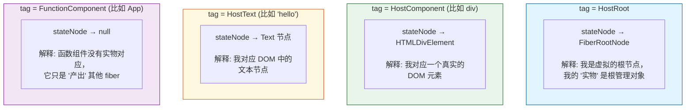

用表格对比更清晰：

| Fiber tag | `stateNode` 指向 | 语义 | 是否来自 JSX 中的标签 |
|---|---|---|---|
| `HostRoot` | `FiberRootNode` | "我是整棵树的根，我的实物是根容器管理器" | ❌ 不是。是 `createContainer` 手动 new 出来的 |
| `HostComponent` | 真实 DOM 元素，如 `HTMLDivElement` | "我是 DOM 节点在工作单元中的映射" | ✅ 是。来自 `<div>`, `<span>` 等 |
| `HostText` | `Text` 节点 | "我是文本内容在工作单元中的映射" | ✅ 是。来自 `"hello"` 这类字符串 |
| `FunctionComponent` | `null` | "我是函数组件，我本身不产生 DOM，只产生子 fiber" | ✅ 是。来自 `<App />` 等 |

### 3.2 HostRoot Fiber：一个"不存在于 JSX 中"的根节点

到现在位置，我们只调用了 `new FiberNode(HostRoot, {}, null)`。并没有任何 ReactElement 说"我是 HostRoot"。但整个 Fiber 树需要一个**统一的入口**让遍历算法启动。

看一张完整的分层图：

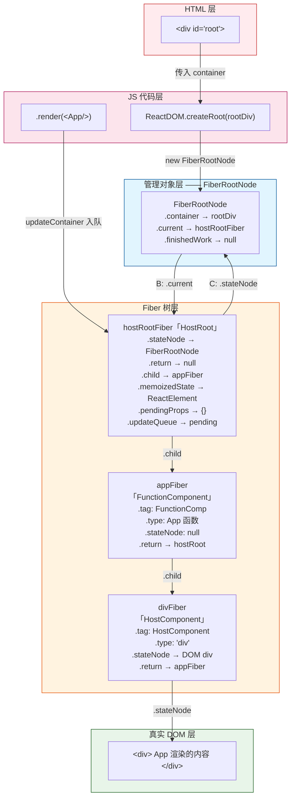

### 3.3 关键追问：HostRoot Fiber 跟 ReactElement 到底有什么关系？

**答：完全不直接对应。**

把你写的代码和执行时发生的事放一起对比：

```typescript
// 你写的代码
const root = ReactDOM.createRoot(
  document.getElementById('root')   // ← 这是 FiberRootNode.container
);

root.render(
  <App />   // ← 这是一个 ReactElement，不是 HostRoot Fiber
);

// React 内部执行时：
// 1. createContainer(container) → new FiberNode(HostRoot, {}, null) ← 没有 ReactElement 参与
// 2. updateContainer(<App />, root) → 把 <App /> 作为 Update 入队到 hostRootFiber.updateQueue
// 3. beginWork(wipHostRoot) → 消费 Update → 把 <App /> 存入 memoizedState
// 4. reconcilerChildren(wipHostRoot, <App />) → 创建 appFiber
//    此时：wipHostRoot.child = appFiber
//          appFiber.return = wipHostRoot
```


**所以 HostRoot Fiber：**
- ❌ 不对应 `<div>`、`<span>` 这样的 JSX 标签
- ❌ 不对应 `<App />` 这样的组件调用
- ❌ 不对应 `<React.Fragment>` 这样的语法糖
- ✅ 对应的是 **FiberRootNode**（通过 `stateNode`）
- ✅ 存在的意义是：**给 beginWork 一个起点，给 updateQueue 一个挂载点，给整个树一个根**

### 3.4 从任意 Fiber 走到真实 DOM 容器的完整路径

这是 `stateNode` 双重语义最有用的场景——**从树中任何一个节点出发，找到它所属的 DOM 容器**。

官方 React 中，`markUpdateFromFiberToRoot` 已经走了一半（向上找到 HostRoot，通过 `stateNode` 拿到 FiberRootNode）。如果要继续走到 container：

```typescript
// 从任意 fiber 出发，找到所属的根 DOM 容器
function getRootContainer(fiber: FiberNode): Container | null {
	let node = fiber;
	let parent = fiber.return;

	// 1. 沿着 return 向上走到顶
	while (parent !== null) {
		node = parent;
		parent = parent.return;
	}

	// 2. 顶部节点必须是 HostRoot
	if (node.tag === HostRoot) {
		// 3. stateNode → FiberRootNode（双重语义之一）
		const fiberRoot = node.stateNode as FiberRootNode;
		// 4. FiberRootNode → container（双重语义之二）
		return fiberRoot.container;
	}
	return null;
}
```

完整路径链：

```
任意 fiber →
  .return.return... ↑ （沿着树往上爬）
  → hostRootFiber （tag === HostRoot）
  → hostRootFiber.stateNode → FiberRootNode （第一次语义切换：Fiber → 管理器）
  → FiberRootNode.container → <div id="root"> （第二次语义切换：管理器 → DOM）
```

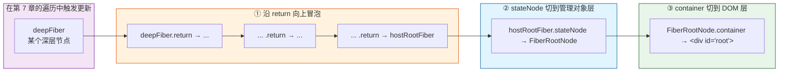

### 3.5 `stateNode` 双重语义的终极本质

> **`stateNode` = "我这个 Fiber 节点所持有/管理的那个对外实物"**

| Fiber 角色 | 它的"对外实物" | 为什么是这个东西 |
|---|---|---|
| `HostRoot` | `FiberRootNode` | 因为它需要管理整个应用的根容器，但它自己不渲染任何 DOM |
| `HostComponent` | 真实 DOM 元素 | 因为它最终要操作 DOM（增删改查） |
| `HostText` | 真实 Text 节点 | 因为它代表一段文本 DOM |
| `FunctionComponent` | `null` | 因为它不操作任何外部实物，它的产出是子 fiber |

所以当你看到 `hostRootFiber.stateNode = fiberRoot` 时，正确的理解是：

> **"我是 hostRootFiber，我对应的实物是 FiberRootNode。FiberRootNode 又知道 container 在哪。你通过我，就可以找到整个应用的根 DOM 容器。"**

而不是：

> **"我是 hostRootFiber，我的 stateNode 被我用来指回 FiberRootNode……emmm 这是一个奇怪的循环引用"**

后者会让你困惑——前者会让你豁然开朗。

---

## 四、`updateContainer` —— 第一次触发更新

```typescript
export function updateContainer(element: ReactElementType, root: FiberRootNode) {
  // 4.1 拿到当前树的根 Fiber
  const hostRootFiber = root.current;  // ← 就是上面那个 hostRootFiber

  // 4.2 创建一个 Update 对象
  const update = createUpdate<ReactElementType | null>(element);
  // { action: <div><span>hello</span></div> }

  // 4.3 把 Update 入队
  enqueueUpdate(hostRootFiber.updateQueue, update);
  // hostRootFiber.updateQueue.shared.pending = update;

  // 4.4 调度更新
  scheduleUpdateOnFiber(hostRootFiber);
}
```

调用 `enqueueUpdate` 之后，`updateQueue` 变成了这样：

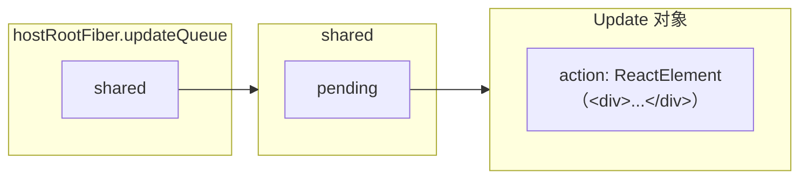

---

## 五、`scheduleUpdateOnFiber` —— 从 fiber 到 root 的冒泡

这是**另一个关键点**：React 的更新不是从触发点开始的，而是**先找到根节点，再从根节点开始向下遍历**。

```typescript
export function scheduleUpdateOnFiber(fiber: FiberNode) {
  // 从触发更新的 fiber 往上找，找到 FiberRootNode
  const root = markUpdateFromFiberToRoot(fiber);
  renderRoot(root as FiberRootNode);
}
```

### `markUpdateFromFiberToRoot` —— 向上遍历找根

```typescript
export function markUpdateFromFiberToRoot(fiber: FiberNode) {
  let node = fiber;
  let parent = fiber.return;
  while (parent !== null) {
    node = parent;
    parent = parent.return;
  }
  // node 现在是顶层 Fiber（没有 return）
  if (node.tag === HostRoot) {
    return node.stateNode;   // ← stateNode 指向 FiberRootNode！
  }
  return null;
}
```

在我们当前的场景中，`hostRootFiber.return === null`，所以 `while` 循环一次都不走，直接 `node` 就是 `hostRootFiber`，然后通过 `node.stateNode` 拿到 `FiberRootNode`。

> **"为什么要绕这一圈？"** 因为 `scheduleUpdateOnFiber` 可以被任何 Fiber 调用（比如某个 `button` 的点击事件触发了 `setState`）。这时候需要沿着 `return` 指针一路向上走到 `HostRoot`，再通过 `stateNode` 拿到 `FiberRootNode`。

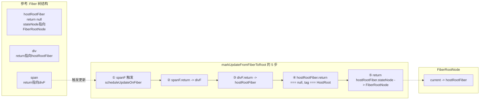

---

## 六、`renderRoot` —— 双缓冲机制的诞生

```typescript
function renderRoot(root: FiberRootNode) {
  prepareFreshStack(root);
  do {
    try {
      workLoop();
      break;
    } catch (error) { /* ... */ }
  } while (true);
}
```

### `prepareFreshStack` —— 创建 workInProgress 树

```typescript
function prepareFreshStack(fiber: FiberRootNode) {
  workInProgress = createWorkInProgress(
    fiber.current,         // ← 当前树的根: hostRootFiber
    fiber.current.pendingProps  // ← 当前树的 pendingProps
  );
}
```

这里调用了 `createWorkInProgress`——**双缓冲机制的核心**：

```typescript
export const createWorkInProgress = (
  current: FiberNode,
  pendingProps: Props
): FiberNode => {
  let wip = current.alternate;  // 看看有没有已经存在的备选节点

  if (wip === null) {
    // --- MOUNT（首次渲染） ---
    wip = new FiberNode(current.tag, pendingProps, current.key);
    wip.stateNode = current.stateNode;  // 共享 stateNode（指向FiberRootNode）
    wip.alternate = current;            // wip 指向 current
    current.alternate = wip;            // current 指向 wip
    // ↑ 互相指向！
  } else {
    // --- UPDATE（不是首次渲染，有已有的 alternate） ---
    wip.pendingProps = pendingProps;
    wip.flags = NoFlags;
  }

  wip.type = current.type;
  wip.updateQueue = current.updateQueue;  // 共享 updateQueue！
  wip.child = current.child;              // 复制 child 引用
  wip.memoizedProps = current.memoizedProps;
  wip.memoizedState = current.memoizedState;

  return wip;
};
```

执行 `createWorkInProgress(hostRootFiber, {})` 之后（首次渲染），引用关系变成了这样：

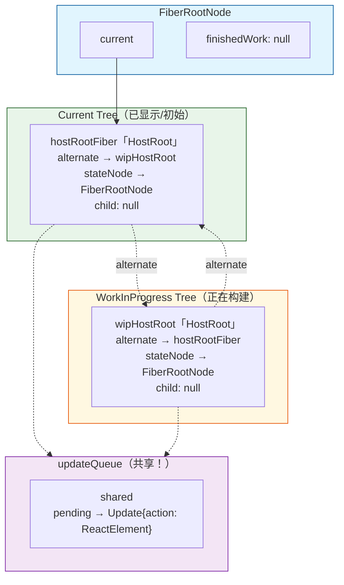

**这就是经典的"双缓冲"（Double Buffering）：**

| 概念 | 对应对象 | 作用 |
|---|---|---|
| **current 树** | `hostRootFiber` 为根的树 | 当前**已经渲染到屏幕上**的树 |
| **workInProgress 树** | `wipHostRoot` 为根的树 | 正在**构建中**的下一帧树 |
| **`alternate`** | 双向指针 | 连接 `current` 和 `wip` 中**对应的同一节点** |

**两个重要的共享：**
1. **`stateNode` 共享**：`hostRootFiber.stateNode` 和 `wipHostRoot.stateNode` 指向**同一个** `FiberRootNode`
2. **`updateQueue` 共享**：`hostRootFiber.updateQueue` 和 `wipHostRoot.updateQueue` 指向**同一个** `UpdateQueue`

这就是双缓冲的妙处：**workInProgress 开始时几乎是 current 的浅拷贝**，然后 workLoop 通过 `beginWork` 不断"派生"出新的子节点，逐步替换掉 `child` 指针，最终构建出一棵全新的子树。

---

## 七、`workLoop` —— 完整的渲染遍历

### 7.1 整体流程

```typescript
function workLoop() {
  while (workInProgress !== null) {
    performUnitOfWork(workInProgress);
  }
}

function performUnitOfWork(fiber: FiberNode) {
  // 1. beginWork：处理当前节点，生成子节点
  const next = beginWork(fiber);
  fiber.memoizedProps = fiber.pendingProps;

  if (next === null) {
    // 没有子节点 → 进入 complete 阶段
    completeUnitOfWork(fiber);
  } else {
    // 有子节点 → 继续向下走
    workInProgress = next;
  }
}
```

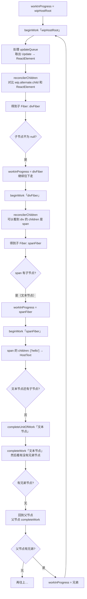

### 7.2 逐步走一遍

假设我们要渲染：
```jsx
<div><span>hello</span></div>
```

#### 第一步：beginWork(wipHostRoot)

`beginWork` 中 `wip.tag === HostRoot`，走 `updateHostRoot`：

```typescript
function updateHostRoot(wip: FiberNode) {
  // 从 updateQueue 取出 pending
  const baseState = wip.memoizedState;          // null（首次渲染）
  const updateQueue = wip.updateQueue;
  const pending = updateQueue.shared.pending;   // Update{action: ReactElement<div>}

  // 消费 updateQueue
  updateQueue.shared.pending = null;
  const { memoizedState } = processUpdateQueue(baseState, pending);
  // memoizedState = <div><span>hello</span></div>

  wip.memoizedState = memoizedState;  // ← 把 ReactElement 存到 memoizedState！

  const nextChildren = wip.memoizedState;  // ReactElement(<div>)
  reconcilerChildren(wip, nextChildren);   // 根据 ReactElement 创建子 Fiber

  return wip.child;  // 返回新创建的子 Fiber（divFiber）
}
```

`reconcilerChildren` 内部：

```typescript
function reconcilerChildren(wip: FiberNode, children?: ReactElementType) {
  const current = wip.alternate; // hostRootFiber（current 树）
  // 首次渲染：current 没有 child，所以 mountChildFibers 会创建新 fiber
  wip.child = mountChildFibers(wip, current?.child, children);
  // mountChildFibers 内部：new FiberNode(HostComponent, props, key)
  // 并设置 fiber.return = wip
}
```

**此时引用关系：**

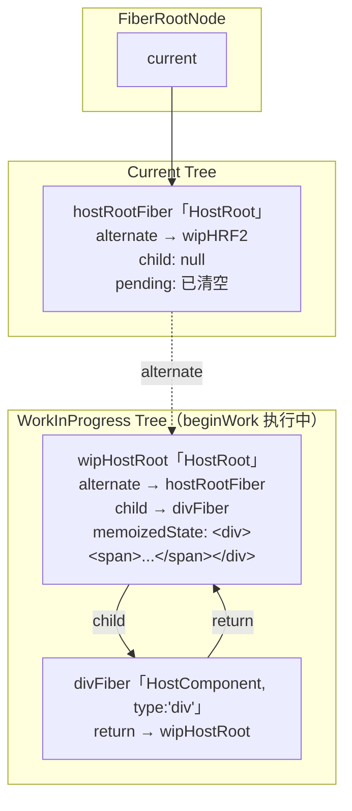

#### 第二步：beginWork(divFiber)

`wip = divFiber`，`divFiber.tag === HostComponent`，走 `updateHostComponent`：

```typescript
function updateHostComponent(wip: FiberNode) {
  const nextProps = wip.pendingProps;  // div 的 props
  const nextChildren = nextProps.children;  // [ReactElement(<span>...)]
  reconcilerChildren(wip, nextChildren);   // 创建 spanFiber
}
```

创建 `spanFiber`，设置 `spanFiber.return = divFiber`：

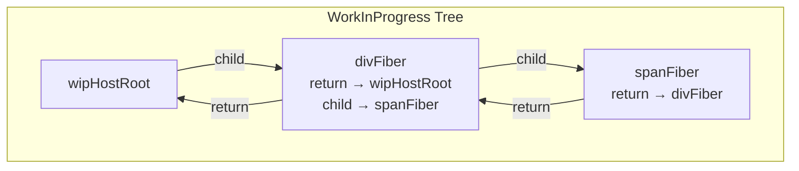

#### 第三步：beginWork(spanFiber)

同理，`spanFiber.children` 是文本节点 `"hello"`，需要创建 `HostText` 类型的 Fiber：

```
spanFiber.child = textFiber
textFiber.return = spanFiber
```

#### 第四步：beginWork(textFiber)

`textFiber.tag === HostText`，`beginWork` 返回 `null`——**没有子节点了，开始向上 complete**。

### 7.3 `completeUnitOfWork` —— 向上归并

```typescript
function completeUnitOfWork(fiber: FiberNode) {
  let node: FiberNode | null = fiber;
  do {
    completeWork(node);        // 执行当前节点的 complete（创建 DOM 节点等）
    const sibling = node.sibling;
    if (sibling !== null) {
      workInProgress = sibling;  // 有兄弟 → 处理兄弟
      return;
    }
    // 没有兄弟 → 回到父节点
    node = node.return;
  } while (node !== null);
}
```

**遍历流程（用"递/归"来理解）：**

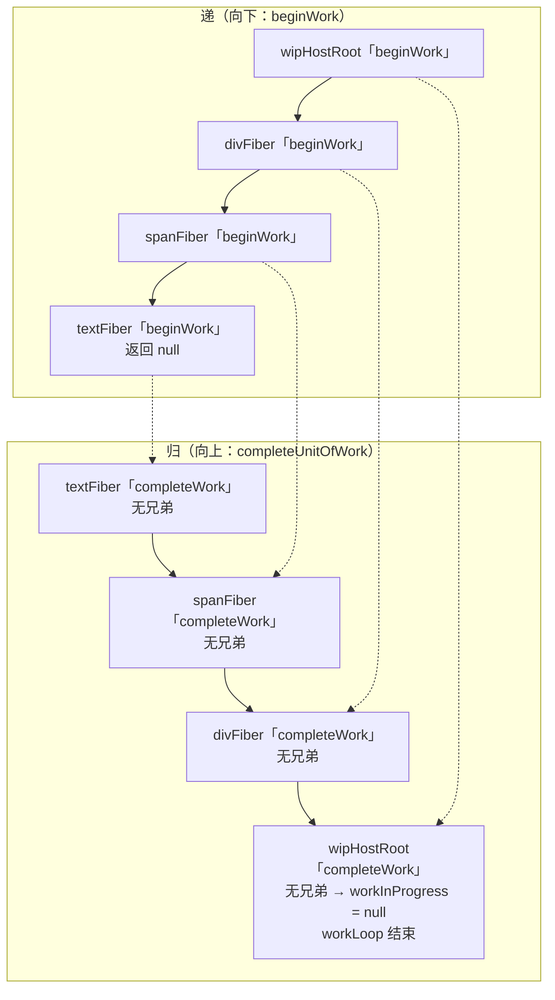

**最终 workInProgress 树构建完成：**

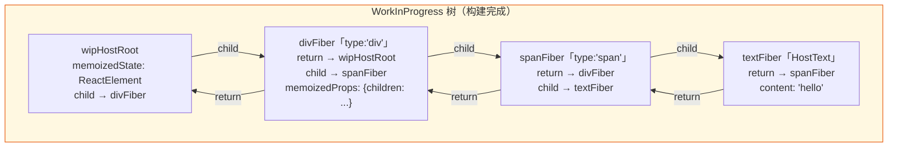

---

## 八、提交（Commit）—— 两棵树交换角色

workLoop 结束后，`root.finishedWork` 需要被设置为 wip 树的根。然后提交阶段会把 DOM 操作刷入浏览器，最后**交换 current 指针**：

```
// 伪代码 — 提交阶段的核心逻辑
root.finishedWork = wipHostRoot;   // 保存构建完成的树
// ... 执行 DOM 操作（基于 flags）...
root.current = wipHostRoot;        // 交换指针：wip 树变成新的 current 树
```

交换之后：

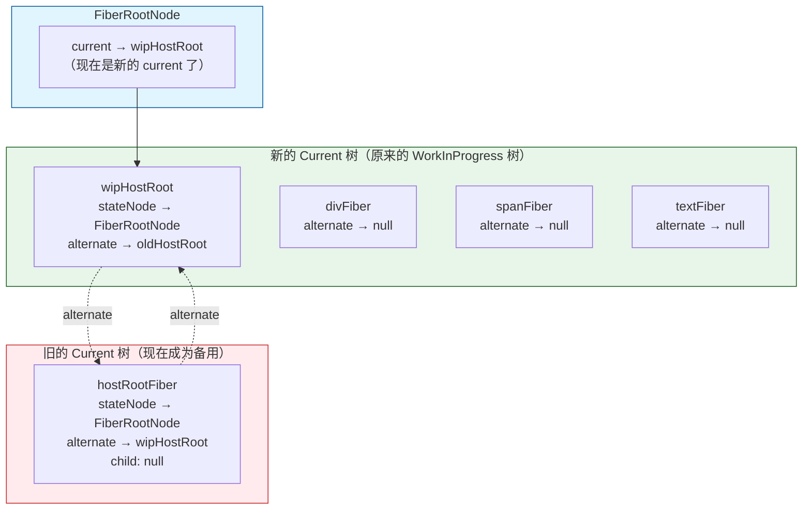

**关键理解：** 
- 旧的 `hostRootFiber` 的 `child` 可能是 `null`（因为 `createContainer` 之后它没 `child`）
- 但是没关系，下一次更新时，`createWorkInProgress` 会从新的 current（即 `wipHostRoot`）的 `alternate` 拿到老的 `hostRootFiber`，然后复用。

---

## 九、第二次更新：alternate 复用的完整过程

假设现在用户交互触发了重新渲染。再次进入 `scheduleUpdateOnFiber`：

```typescript
function prepareFreshStack(fiber: FiberRootNode) {
  workInProgress = createWorkInProgress(
    fiber.current,  // ← 现在是 wipHostRoot（上次提交后已经成为 current）
    fiber.current.pendingProps
  );
}
```

`createWorkInProgress` 再次执行，但这次 **`current.alternate !== null`**：

```typescript
export const createWorkInProgress = (current: FiberNode, pendingProps: Props) => {
  let wip = current.alternate; // ← 不再是 null！指向 hostRootFiber

  if (wip === null) {
    // MOUNT 分支 —— 不走
  } else {
    // UPDATE 分支
    wip.pendingProps = pendingProps;
    wip.flags = NoFlags;           // 重置副作用
  }

  wip.type = current.type;
  wip.updateQueue = current.updateQueue;  // 共享
  wip.child = current.child;              // 从 current 复制 child
  wip.memoizedProps = current.memoizedProps;
  wip.memoizedState = current.memoizedState;

  return wip;
};
```

**两棵树的角色互换了！** 上一次的备用树变成了这次的工作树：

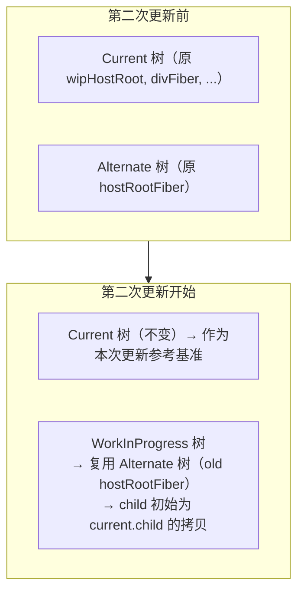

**"双缓冲"的好处就在这里体现：**
1. 不需要每次 GC 一堆新对象——直接**复用**已有的 alternate fiber
2. **current 树保持稳定**——用户在屏幕上看到的内容不会闪烁
3. WorkInProgress 树全部构建完成后，**一次指针交换**完成切换

---

## 十、核心概念一图总结

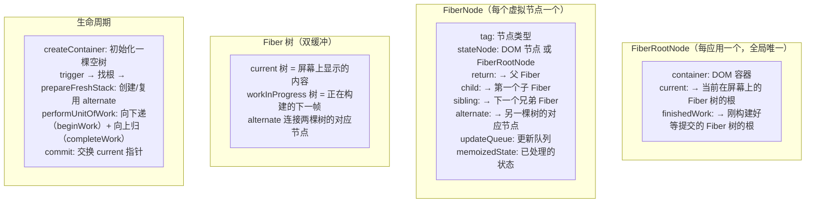

---

## 十一、FAQ：你可能还困惑的问题

### Q1: 为什么 FiberNode 要有 `return` 而不是 `parent`？

**答：** 因为 Fiber 的工作流是**从下往上追溯**的——子 Fiber 完成工作后需要知道"谁是我爸爸"才能回去通知父节点。`return` 这个命名更强调"这个工作完成后要回到哪里"的语义。在 React 源码中，确实叫 `return` 而不叫 `parent`。

### Q2: 为什么要有 `alternate` 这个双向指针？

**答：** 因为 React 需要在 render 阶段**同时持有两棵树的引用**：
- **从 current 到 wip**：`createWorkInProgress` 创建/复用 wip 时需要知道当前节点的对应关系
- **从 wip 到 current**：`beginWork` 的 `reconcilerChildren` 中需要用 `wip.alternate` 拿到 `current` 的同级节点来做 **diff**

```typescript
// childFibers.ts 中
const current = wip.alternate;  // 通过 alternate 找到 current 的对应节点
reconcilerChildFibers(wip, current?.child, children);
//                       ↑      ↑
//                  wip的子    current对应的子（用作比较基准）
```

### Q3: 为什么 `createContainer` 返回的是 `FiberRootNode` 而不是 `hostRootFiber`？

**答：** 因为外部使用者（比如 `react-dom` 的 `createRoot`）需要：
1. **容器信息**（`container`）—— 知道操作哪个 DOM 节点
2. **current 树指针**（`.current`）—— 能拿到整个 Fiber 树
3. **finishedWork** —— 提交阶段要用

这些全是 `FiberRootNode` 的属性。如果返回 `hostRootFiber`，外部还要想办法拿到 `FiberRootNode`。返回 `FiberRootNode` 后，通过 `.current` 就能拿到树的根。

### Q4: 为什么 `hostRootFiber.updateQueue` 和 `wipHostRoot.updateQueue` 是同一个对象？

**答：** 因为更新队列里的 Update 应该**只被消费一次**。如果两棵树各自有一个 updateQueue，那更新就可能被处理两次或者漏掉。共享同一个 `updateQueue`，在 `beginWork` 消费（将 `pending` 置为 `null`）后，另一棵树自然就消费不到了——这是一个设计上的"排他锁"。

---

## 写在最后

整个 Fiber 引用体系的**核心设计哲学**可以概括为：

```
1. FiberNode 三指针（return/child/sibling）→ 形成可遍历的树
2. FiberRootNode.current → 持有一棵树的入口
3. alternate 双向指针 → 实现"双缓冲"
4. stateNode 双重含义 → DOM 节点 OR FiberRootNode
5. FiberRootNode 作为"枢纽" → 连接外部（DOM）和内部（Fiber 树）
```

当你下次看到 `root.current` 的时候，心里应该浮现出这样一幅画面：

> **"root.current 是一棵 Fiber 树的大门，推开这扇门，通过 child/sibling/return 三根指针可以走到树的所有角落。树上的每个节点都有一个叫 alternate 的镜子，镜子里映着另一棵树里的『另一个我』。"**

希望这份文档能让你彻底告别 Fiber 引用关系的困惑。
