# React 更新队列原理

这份笔记解释官方 React 18 中 `updateQueue` 的核心运作方式，并对照当前仓库的
`updateQueue.ts`。这里重点看 `HostRoot` / `ClassComponent` 这一类挂在
`FiberNode.updateQueue` 上的更新队列；`useState` / `useReducer` 的 Hook 队列
结构很像，但队列挂在 Hook 对象上，再由函数组件 Fiber 的 `memoizedState` 串起来。

## 当前仓库的简化版

当前 `packages/react-reconciler/src/updateQueue.ts` 的模型非常小：

```ts
export interface Update<State> {
	action: Action<State>;
}

export interface UpdateQueue<State> {
	shared: {
		pending: Update<State> | null;
	};
}
```

也就是说，现在一个 `FiberNode` 上的 `updateQueue` 最多只保存一个
`pending update`。`updateContainer(element, root)` 会把 `element` 包装成
`Update`，塞进 `hostRootFiber.updateQueue.shared.pending`，然后调度根节点更新。

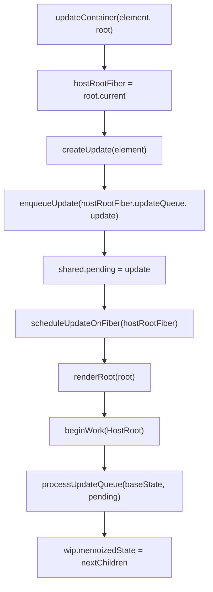

这个实现抓住了主线：**更新不是立刻修改 DOM，而是先进入 Fiber 的更新队列；render
阶段再根据队列计算新的 `memoizedState`，然后继续 reconciliation。**

但官方 React 需要支持并发渲染、优先级、render 中断、恢复、跳过低优先级更新等场景，
所以结构会复杂很多。

## 官方队列的数据结构

官方 React 18 的 `Update` 不只有 `action`，还会记录优先级和副作用信息：

```ts
type Update = {
	eventTime: number;
	lane: Lane;
	tag: UpdateState | ReplaceState | ForceUpdate | CaptureUpdate;
	payload: any;
	callback: (() => mixed) | null;
	next: Update | null;
};
```

`UpdateQueue` 也不只是 `shared.pending`：

```ts
type UpdateQueue<State> = {
	baseState: State;
	firstBaseUpdate: Update | null;
	lastBaseUpdate: Update | null;
	shared: {
		pending: Update | null;
		interleaved: Update | null;
		lanes: Lanes;
	};
	effects: Array<Update> | null;
};
```

字段可以这样理解：

- `baseState`：从哪个 state 开始重新计算。
- `firstBaseUpdate` / `lastBaseUpdate`：上一次 render 后仍需要保留的线性队列。
- `shared.pending`：新触发、还没合并进 base queue 的更新，使用环状链表。
- `shared.lanes`：这个队列里还剩哪些优先级相关的更新。
- `effects`：class update 的 callback 等提交阶段要执行的副作用。

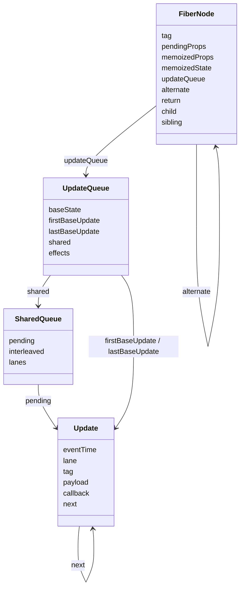

## 为什么队列和 Fiber 要成对出现

Fiber 本身是双缓存结构：

- `current`：当前屏幕已经提交的 Fiber 树。
- `workInProgress`：本次 render 正在构建的新 Fiber 树。
- 两者通过 `alternate` 互相指向。

更新队列也跟着双缓存。官方注释里明确说明：`current queue` 表示屏幕可见状态，
`workInProgress queue` 可以在提交前被异步处理。如果一次 render 被中断或废弃，
React 可以丢掉 `workInProgress`，再从 `current` 克隆一份重新开始。

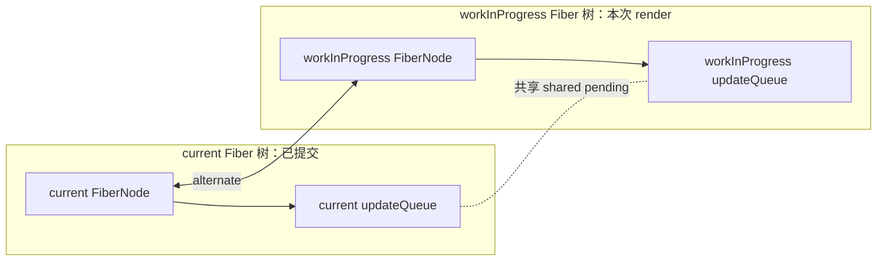

关键原因是：**不能丢更新，也不能重复应用已提交更新。**

如果只把更新加到 `workInProgress queue`，本次 render 被中断后，这个更新可能随着
`workInProgress` 一起丢失。如果只加到 `current queue`，一个已经在处理中的
`workInProgress` 提交时又可能覆盖掉它。官方做法是让队列共享持久化链表结构，并在合适
阶段同步到 current / workInProgress 两边。

## 入队：pending 是环状链表

官方 React 的新更新通常先进入 `shared.pending`。这里不是普通数组，而是环状单链表。
`shared.pending` 指向最后一个 update，最后一个 update 的 `next` 指向第一个 update。

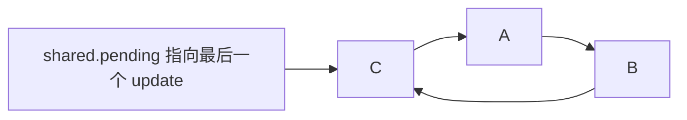

为什么指向最后一个？因为这样可以用 O(1) 时间同时拿到队尾和队头：

- 队尾：`pending`
- 队头：`pending.next`

插入一个新 update `D` 时，只需要改两个指针：

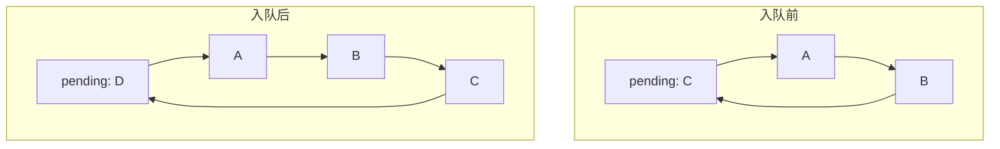

等到 render 阶段真正处理队列时，React 会把这段环状 `pending queue` 拆开，转成线性
链表，然后追加到 `base queue` 后面。

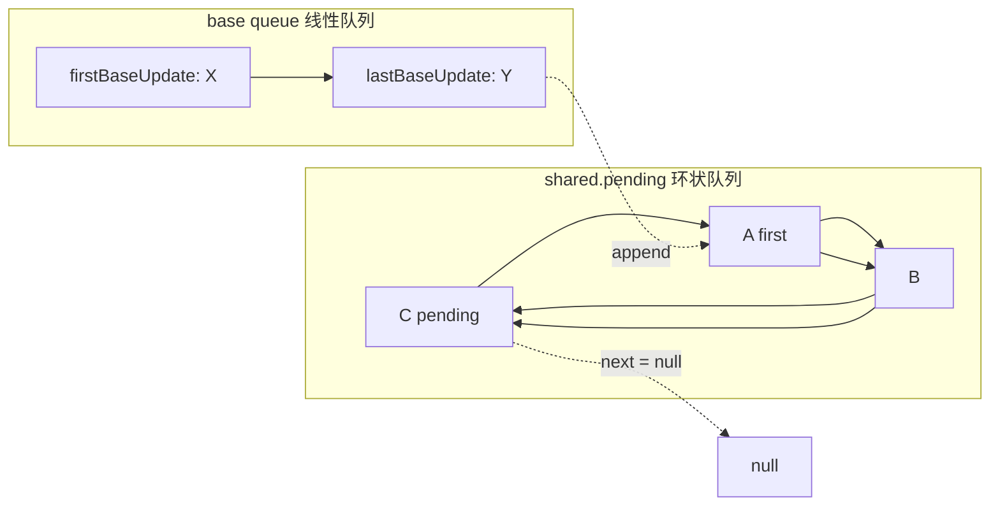

## 消费：render 阶段计算 memoizedState

`processUpdateQueue` 的核心任务是：

1. 取出 `shared.pending`。
2. 把环状 pending queue 拆成线性链表。
3. 接到 `firstBaseUpdate` / `lastBaseUpdate` 后面。
4. 从 `baseState` 开始，按插入顺序依次计算新 state。
5. 把结果写回 `workInProgress.memoizedState`。
6. 把还没处理完的更新留在新的 base queue 中。

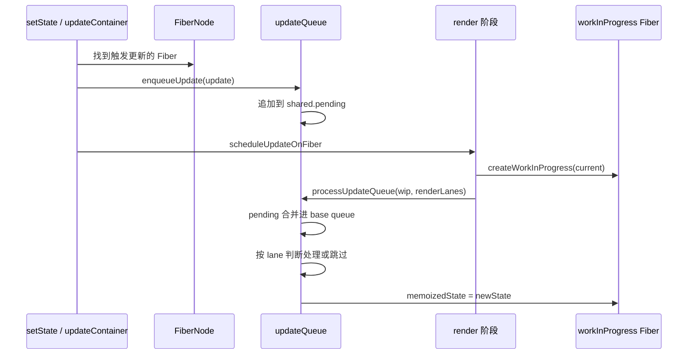

在当前仓库里，这一段对应：

- `FiberNode.updateQueue`：保存该 Fiber 的更新队列。
- `createWorkInProgress`：创建或复用 `alternate`，并把 `current.updateQueue` 复制到
  `wip.updateQueue`。
- `beginWork(HostRoot)`：读取 `wip.updateQueue.shared.pending`。
- `processUpdateQueue(baseState, pending)`：根据 action 算出新的 `memoizedState`。

## 优先级：lane 决定这次 render 能不能处理

官方 React 18 用 `Lane` 表示更新优先级。可以把它理解成一组 bitmask：

- 点击输入这类同步交互，通常是高优先级。
- `startTransition` 产生的更新，通常是较低优先级。
- 本次 render 会带着一个 `renderLanes`，表示“这次我能处理哪些优先级”。

处理队列时，React 不会按优先级重新排序。更新始终保持**插入顺序**。区别在于：

- 当前 update 的 `lane` 包含在 `renderLanes` 中：处理它。
- 当前 update 的 `lane` 不包含在 `renderLanes` 中：跳过它，保留到下次。

最重要的细节是：**一旦跳过了某个低优先级 update，它后面的 update 即使优先级足够，
也要被克隆并留在 base queue 中。** 高优先级 update 可以先算一次，但后续还要在低优先级
render 中基于被跳过的 update 重新计算一次，这叫 rebase。

## rebase 示例

下面这个例子直接对照官方 `processUpdateQueue` 的执行方式。为了简化，假设：

- `baseState = ""`
- 队列按插入顺序是 `A1 -> B2 -> C1 -> D2`
- 数字表示优先级，`1` 比 `2` 高
- 每个 update 的效果是把自己的字母追加到 state

官方源码里的主循环可以简化成这样：

```ts
let newState = queue.baseState;
let newBaseState = null;
let newFirstBaseUpdate = null;
let newLastBaseUpdate = null;

let update = firstBaseUpdate;
while (update !== null) {
	const updateLane = update.lane;
	const shouldSkipUpdate = !isSubsetOfLanes(renderLanes, updateLane);

	if (shouldSkipUpdate) {
		const clone = {
			lane: updateLane,
			tag: update.tag,
			payload: update.payload,
			callback: update.callback,
			next: null
		};

		if (newLastBaseUpdate === null) {
			newFirstBaseUpdate = newLastBaseUpdate = clone;
			newBaseState = newState;
		} else {
			newLastBaseUpdate = newLastBaseUpdate.next = clone;
		}
	} else {
		if (newLastBaseUpdate !== null) {
			const clone = {
				lane: NoLane,
				tag: update.tag,
				payload: update.payload,
				callback: update.callback,
				next: null
			};
			newLastBaseUpdate = newLastBaseUpdate.next = clone;
		}

		newState = getStateFromUpdate(update, newState);

		if (update.callback !== null && update.lane !== NoLane) {
			// 收集到 queue.effects，commit 阶段执行。
		}
	}

	update = update.next;
}
```

这段代码里有两个判断非常关键：

- `shouldSkipUpdate` 为 `true`：当前 update 的 `lane` 不属于本次
  `renderLanes`，所以不能处理，只能 clone 到新的 base queue。
- `newLastBaseUpdate !== null`：说明前面已经跳过过 update。此时即使当前 update
  可以处理，也要 clone 一份放进新的 base queue，后续 render 会重新走它。

第一次 render 只处理优先级 `1`，也就是 `renderLanes = 1`：

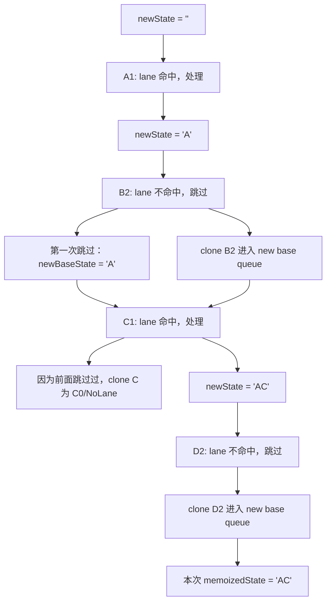

第一次 render 结束后，关键结果是：

```txt
memoizedState = "AC"
baseState = "A"
baseQueue = B2 -> C0 -> D2
```

这里最容易误解的是 `C1`。它明明已经在本次 render 里处理过，为什么还要进入
`baseQueue`？

原因是 `B2` 被跳过了。React 必须保证最终 state 等价于按插入顺序执行
`A -> B -> C -> D`。如果下次只执行 `B -> D`，最终会得到 `"ABD"`，丢掉 `C` 的效果。
所以 `C` 要被 clone 到 `baseQueue`，等待之后基于 `B` 之后的 state 再算一次。

源码里这个 clone 的 `lane` 会被设为 `NoLane`。含义是：**这个 update 已经在某次
高优先级 render 中贡献过可见结果；把它留在 base queue 只是为了 rebase 时保持顺序。**
`NoLane` 等价于 `0`，它会通过 `isSubsetOfLanes(renderLanes, updateLane)` 检查，所以后续
render 不会再因为优先级不足跳过它。同时，提交 callback 时源码会额外判断
`update.lane !== NoLane`，避免已经提交过的 callback 被重复收集。

第二次 render 处理优先级 `2`：

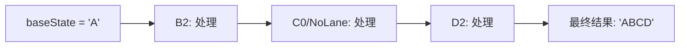

第二次 render 不是从第一次的 `memoizedState = "AC"` 接着算，而是从
`baseState = "A"` 开始，重新消费 `baseQueue = B2 -> C0 -> D2`：

```txt
"A" -> B2 -> "AB"
"AB" -> C0 -> "ABC"
"ABC" -> D2 -> "ABCD"
```

这就是 rebase：**把低优先级更新补回来时，不是在旧 UI 结果上打补丁，而是从稳定的
`baseState` 出发，按原始插入顺序重放被保留的 base queue。** 这样中间界面可以先显示
高优先级结果 `"AC"`，最终结果仍然严格符合 `A -> B -> C -> D` 的顺序。

## HostRoot 的更新是什么

在这个仓库里，`HostRoot` 的 `memoizedState` 保存的是根节点要渲染的
`ReactElement`：

```ts
updateContainer(<App />, root);
```

可以理解为给 `HostRoot` 这个 Fiber 触发了一次更新：

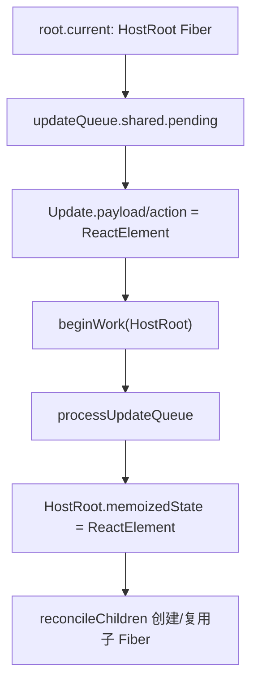

对于 class component，`payload` 可能是 partial state 或 updater function。对于
`HostRoot`，`payload` 更像是“下一棵 ReactElement 树”。

## Hook 队列与 FiberNode 的关系

函数组件的 Hook 更新不是直接挂在 `fiber.updateQueue` 上，而是挂在每个 Hook 对象上：

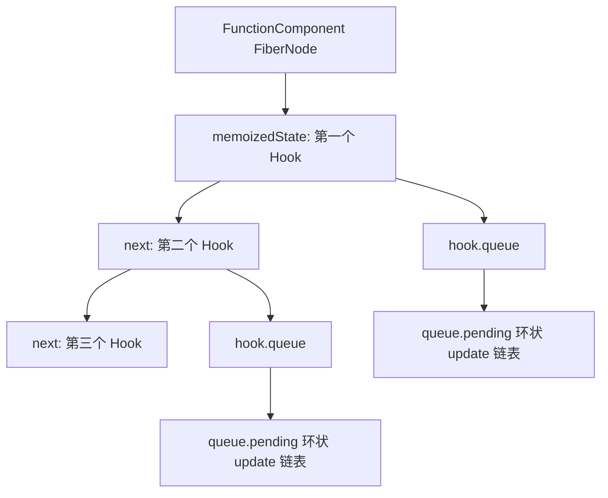

不过思想是同一套：

- dispatch 时创建 update。
- update 进入 Hook 的 `queue.pending` 环状链表。
- 调度对应的函数组件 Fiber。
- render 函数组件时按 Hook 顺序取出队列，计算新的 Hook state。

所以学习这个仓库的 `updateQueue.ts` 时，优先抓住 `FiberNode.updateQueue` 这条线；等
Hooks 实现后，再把“队列挂载点”从 Fiber 扩展到 Hook。

## 和当前仓库的差距

当前实现已经有了官方机制的骨架：

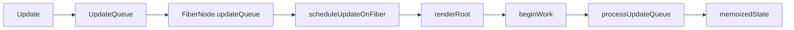

但还缺少官方 React 的关键能力：

- 队列还不是链表，只能保存一个 `pending update`。
- `pending` 还不是环状链表。
- 没有 `baseState` / `firstBaseUpdate` / `lastBaseUpdate`。
- 没有 `lane`，所以无法跳过低优先级更新。
- 没有 rebase，无法处理“先高优先级显示，再低优先级补全”的场景。
- `current` 和 `workInProgress` 队列还没有完整的双缓存克隆逻辑。
- 没有 commit 阶段的 callback / effects 处理。

## 一句话总结

官方 React 的更新队列不是“存一个新 state”，而是“把每次更新作为有优先级的 update 节点
挂到对应 Fiber 或 Hook 的队列上”。render 阶段从 `baseState` 开始按插入顺序消费队列，
用 `lane` 决定本次处理还是跳过；被跳过的更新和它后面的更新会保留下来，等待后续 render
进行 rebase。这样 React 才能在并发、中断、恢复和不同优先级交错的情况下，既不丢更新，
也保持最终结果确定。

## 参考源码

- [React 18.2.0 `ReactFiberClassUpdateQueue.old.js`](https://github.com/facebook/react/blob/v18.2.0/packages/react-reconciler/src/ReactFiberClassUpdateQueue.old.js)
- [React 18.2.0 `ReactFiberHooks.old.js`](https://github.com/facebook/react/blob/v18.2.0/packages/react-reconciler/src/ReactFiberHooks.old.js)
- [React 18.2.0 `ReactFiberConcurrentUpdates.old.js`](https://github.com/facebook/react/blob/v18.2.0/packages/react-reconciler/src/ReactFiberConcurrentUpdates.old.js)
