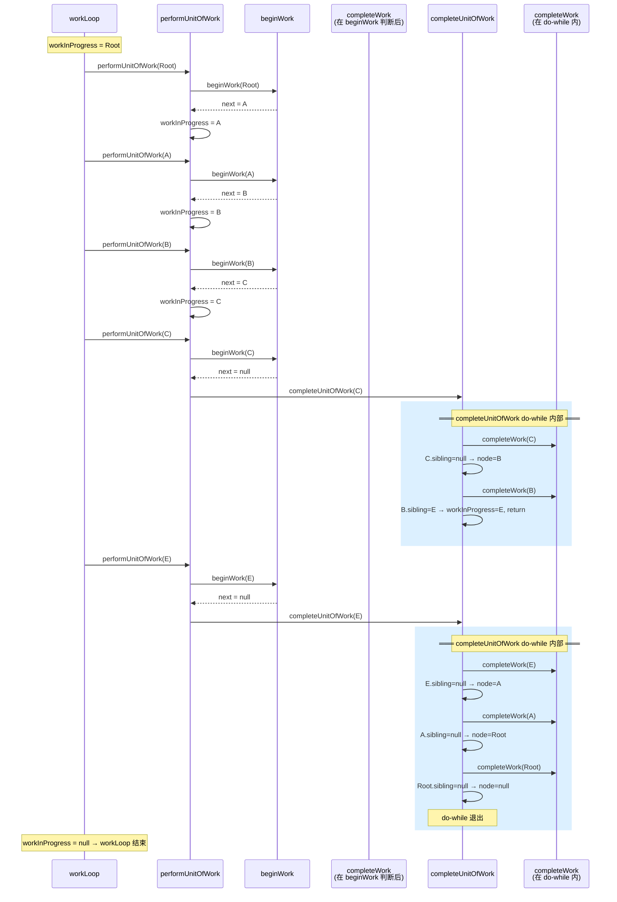

# workLoop 执行流详解

## 核心疑问：`completeUnitOfWork` 里 `node = node.return` 会不会导致死循环？

```text
直觉上的危险路径：
  completeUnitOfWork ↓
    node = node.return  ← 回到父节点
    workInProgress = node
  ─────────────────────────── 控制权回到 workLoop
  workLoop 看到 workInProgress ≠ null
    → performUnitOfWork(父节点)
    → beginWork(父节点) 又产出子节点
    → 死循环 🔄
```

**答案：不会。** 原因只有一句话——

> `node = node.return` 之后**控制权没有离开 `completeUnitOfWork` 的 do-while 循环**，
> 下一行是继续调用 `completeWork(node)`，**不会经过 `workLoop`**。

`completeUnitOfWork` 的 do-while **只有两种出口**：
1. 找到一个有兄弟的节点 → `workInProgress = sibling; return;`
2. 回溯到 `node = null` → do-while 自然退出，`workInProgress = null`

**父节点永远不会被重新传回 `performUnitOfWork`。**

---

## 执行轨迹逐轮追踪

以这棵 fiber 树为例：

```
        HostRoot ← sibling=null
            │
            A ← sibling=E
           / \
          B   E ← sibling=null
         / \
        C   D ← sibling=null (叶子)
```

### 第 1~3 轮：向下深入（beginWork）

```
workLoop 第 1 次: performUnitOfWork(Root)
                   beginWork(Root) → next = A
                   workInProgress = A

workLoop 第 2 次: performUnitOfWork(A)
                   beginWork(A) → next = B
                   workInProgress = B

workLoop 第 3 次: performUnitOfWork(B)
                   beginWork(B) → next = C
                   workInProgress = C

workLoop 第 4 次: performUnitOfWork(C)
                   beginWork(C) → next = null (叶子!)
                   进入 completeUnitOfWork(C)
```

### 第 4 轮内部：`completeUnitOfWork(C)`

```text
┌─ do-while 第 1 次 ──────────────────────────┐
│  completeWork(C)   ✅                        │
│  C.sibling = null  → 没有兄弟, 向上回溯      │
│  node = C.return = B                         │
│  workInProgress = B                          │
│  └── node ≠ null → 继续 do-while             │
├─ do-while 第 2 次 ──────────────────────────┤
│  completeWork(B)   ✅                        │
│  B.sibling = E          → 有兄弟!            │
│  workInProgress = E                          │
│  return 🏃  ←── 回到 workLoop               │
└──────────────────────────────────────────────┘
```

关键点：`workInProgress = E`，E 是一个**全新的、未曾 beginWork 的节点**，不是 B。

### 第 5 轮：`performUnitOfWork(E)`

```text
workLoop 第 5 次: performUnitOfWork(E)
                   beginWork(E) → next = null
                   进入 completeUnitOfWork(E)
```

### 第 5 轮内部：`completeUnitOfWork(E)`

```text
┌─ do-while 第 1 次 ──────────────────────────┐
│  completeWork(E)   ✅                        │
│  E.sibling = null  → 向上回溯                │
│  node = E.return = A                         │
│  workInProgress = A                          │
├─ do-while 第 2 次 ──────────────────────────┤
│  completeWork(A)   ✅                        │
│  A.sibling = null  → 向上回溯                │
│  node = A.return = Root                      │
│  workInProgress = Root                       │
├─ do-while 第 3 次 ──────────────────────────┤
│  completeWork(Root) ✅                       │
│  Root.sibling = null → 向上回溯              │
│  node = null                                 │
│  workInProgress = null                       │
│  node = null → do-while 退出                 │
└──────────────────────────────────────────────┘
```

### 第 6 轮：`workLoop` 结束

```text
workLoop: while (workInProgress !== null) → false
```

---

## 时序图：看清谁在调用谁



---

## 每个 fiber 的函数调用次数

| Fiber | `beginWork` 调用次数 | `completeWork` 调用次数 |
|-------|---------------------|------------------------|
| Root | 1 | 1 |
| A | 1 | 1 |
| B | 1 | 1 |
| C | 1 | 1 |
| D | 1 | 1 |
| E | 1 | 1 |

**每个 fiber 恰好一次 `beginWork`、恰好一次 `completeWork`。无重复，无遗漏。**

---

## 结论

| 你的直觉 | 实际情况 |
|---------|---------|
| `node = node.return` 后父节点又回 workLoop | ❌ 它还在 do-while 里，下一行是再调 `completeWork(父节点)`，不经过 `performUnitOfWork` |
| 父节点的 `beginWork` 会被重复调用 | ❌ 每个 fiber 的 `beginWork` 恰好一次（从 workLoop 进入），`completeWork` 恰好一次（从 completeUnitOfWork 进入） |
| 死循环 | ❌ do-while 只有两种出口：找到兄弟 `return`，或 `node=null` 自然退出，两者都让 `workInProgress` 指向下一个正确目标 |
| **本质是什么？** | DFS（深度优先遍历）的**后序变体**：先递（beginWork）到叶子，再归（completeWork）回去，用 sibling 指针连接兄弟子树 |
| React 真实源码也是这样吗？ | **是的。** 这个模式来自 React 18 的 `ReactFiberWorkLoop.js`，Fiber 架构的核心创新就是用链表代替递归栈帧以实现可中断遍历 |
