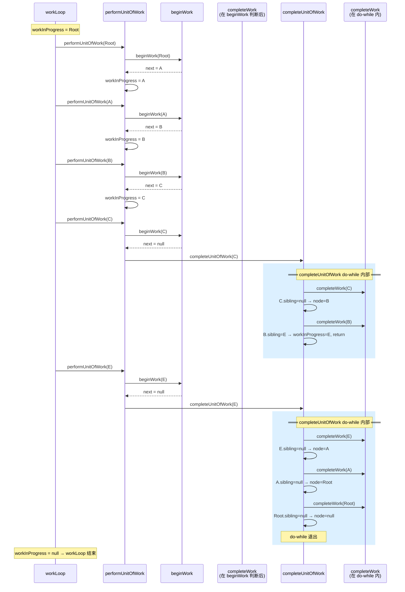
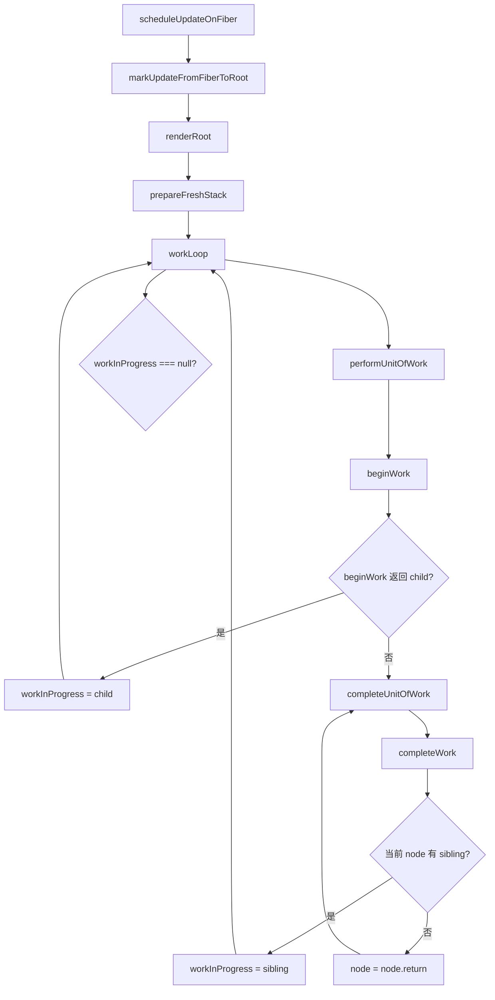
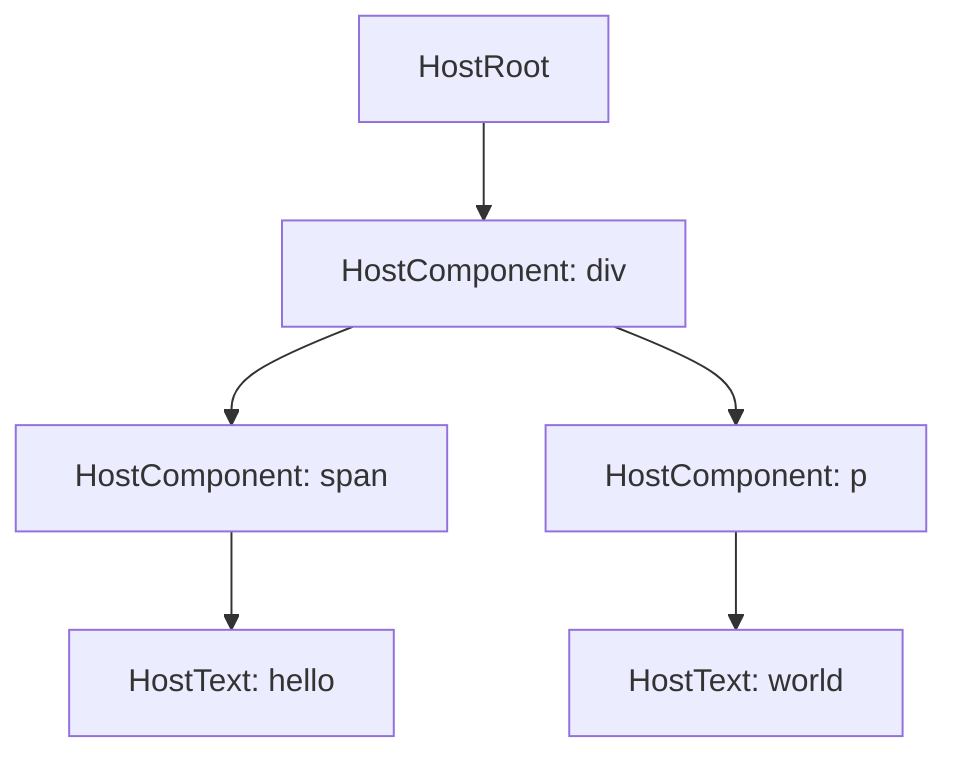
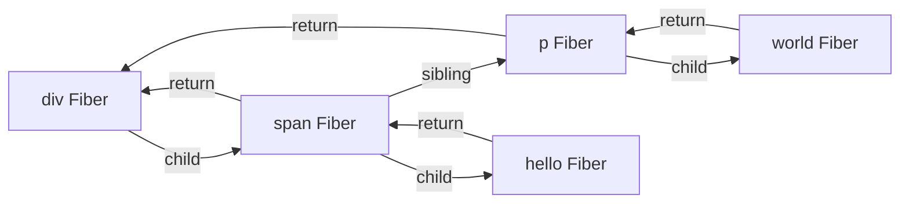
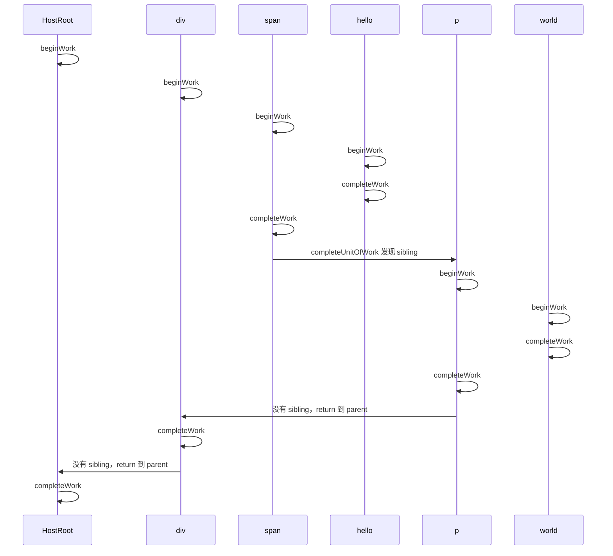
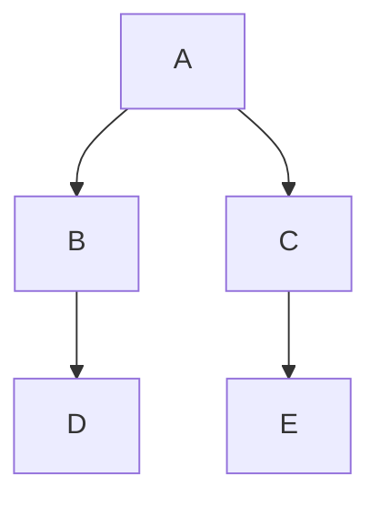

# workLoop 执行流详解

## 核心疑问：`completeUnitOfWork` 里 `node = node.return` 会不会导致死循环？

```text
直觉上的危险路径：
  completeUnitOfWork ↓
    node = node.return  ← 回到父节点
    workInProgress = node
  ─────────────────────────── 控制权回到 workLoop
  workLoop 看到 workInProgress ≠ null
    → performUnitOfWork(父节点)
    → beginWork(父节点) 又产出子节点
    → 死循环 🔄
```

**答案：不会。** 原因只有一句话——

> `node = node.return` 之后**控制权没有离开 `completeUnitOfWork` 的 do-while 循环**，
> 下一行是继续调用 `completeWork(node)`，**不会经过 `workLoop`**。

`completeUnitOfWork` 的 do-while **只有两种出口**：
1. 找到一个有兄弟的节点 → `workInProgress = sibling; return;`
2. 回溯到 `node = null` → do-while 自然退出，`workInProgress = null`

**父节点永远不会被重新传回 `performUnitOfWork`。**

---

## 执行轨迹逐轮追踪

以这棵 fiber 树为例：

```
        HostRoot ← sibling=null
            │
            A ← sibling=E
           / \
          B   E ← sibling=null
         / \
        C   D ← sibling=null (叶子)
```

### 第 1~3 轮：向下深入（beginWork）

```
workLoop 第 1 次: performUnitOfWork(Root)
                   beginWork(Root) → next = A
                   workInProgress = A

workLoop 第 2 次: performUnitOfWork(A)
                   beginWork(A) → next = B
                   workInProgress = B

workLoop 第 3 次: performUnitOfWork(B)
                   beginWork(B) → next = C
                   workInProgress = C

workLoop 第 4 次: performUnitOfWork(C)
                   beginWork(C) → next = null (叶子!)
                   进入 completeUnitOfWork(C)
```

### 第 4 轮内部：`completeUnitOfWork(C)`

```text
┌─ do-while 第 1 次 ──────────────────────────┐
│  completeWork(C)   ✅                        │
│  C.sibling = null  → 没有兄弟, 向上回溯      │
│  node = C.return = B                         │
│  workInProgress = B                          │
│  └── node ≠ null → 继续 do-while             │
├─ do-while 第 2 次 ──────────────────────────┤
│  completeWork(B)   ✅                        │
│  B.sibling = E          → 有兄弟!            │
│  workInProgress = E                          │
│  return 🏃  ←── 回到 workLoop               │
└──────────────────────────────────────────────┘
```

关键点：`workInProgress = E`，E 是一个**全新的、未曾 beginWork 的节点**，不是 B。

### 第 5 轮：`performUnitOfWork(E)`

```text
workLoop 第 5 次: performUnitOfWork(E)
                   beginWork(E) → next = null
                   进入 completeUnitOfWork(E)
```

### 第 5 轮内部：`completeUnitOfWork(E)`

```text
┌─ do-while 第 1 次 ──────────────────────────┐
│  completeWork(E)   ✅                        │
│  E.sibling = null  → 向上回溯                │
│  node = E.return = A                         │
│  workInProgress = A                          │
├─ do-while 第 2 次 ──────────────────────────┤
│  completeWork(A)   ✅                        │
│  A.sibling = null  → 向上回溯                │
│  node = A.return = Root                      │
│  workInProgress = Root                       │
├─ do-while 第 3 次 ──────────────────────────┤
│  completeWork(Root) ✅                       │
│  Root.sibling = null → 向上回溯              │
│  node = null                                 │
│  workInProgress = null                       │
│  node = null → do-while 退出                 │
└──────────────────────────────────────────────┘
```

### 第 6 轮：`workLoop` 结束

```text
workLoop: while (workInProgress !== null) → false
```

---

## 时序图：看清谁在调用谁



---

## 每个 fiber 的函数调用次数

| Fiber | `beginWork` 调用次数 | `completeWork` 调用次数 |
|-------|---------------------|------------------------|
| Root | 1 | 1 |
| A | 1 | 1 |
| B | 1 | 1 |
| C | 1 | 1 |
| D | 1 | 1 |
| E | 1 | 1 |

**每个 fiber 恰好一次 `beginWork`、恰好一次 `completeWork`。无重复，无遗漏。**

---

## 补充：beginWork 和 completeWork 是不是交替运行？

结论：**是的，看起来确实会交替出现。**

但它不是随机交替，而是 Fiber 的深度优先遍历规则决定的：

```text
沿着 child 一路 beginWork 到底。
到底以后 completeWork。
如果当前节点有 sibling，就去 beginWork sibling。
如果没有 sibling，就继续向 return 回退并 completeWork parent。
```

也就是说，它不是：

```text
全部 beginWork 完
再全部 completeWork
```

而是：

```text
向下时 beginWork
向上时 completeWork
回到某个节点发现有 sibling
再转头向下 beginWork sibling
```

### 总流程图



这张图里最关键的分工是：

```text
beginWork:
	负责处理当前 Fiber，并返回它的 child。

completeUnitOfWork:
	负责 complete 当前 Fiber，并决定接下来去 sibling 还是 return。
```

所以：

```text
beginWork 不处理 sibling。
sibling 是 completeUnitOfWork 处理的。
```

### 为什么 beginWork 里看不到 sibling？

看 `performUnitOfWork`：

```ts
function performUnitOfWork(fiber: FiberNode) {
	const next = beginWork(fiber);
	fiber.memoizedProps = fiber.pendingProps;

	if (next === null) {
		completeUnitOfWork(fiber);
	} else {
		workInProgress = next as FiberNode | null;
	}
}
```

这里的逻辑是：

```text
1. 先对当前 fiber 执行 beginWork。

2. 如果 beginWork 返回 child：
	说明还有更深的节点要处理。
	让 workInProgress 指向 child。

3. 如果 beginWork 返回 null：
	说明这条分支已经到底。
	开始 completeUnitOfWork 当前 fiber。
```

`beginWork` 的返回值只代表 child。

它不负责告诉 `workLoop` sibling 是谁。

再看 `beginWork.ts`：

```ts
export const beginWork = (wip: FiberNode) => {
	switch (wip.tag) {
		case HostRoot:
			return updateHostRoot(wip);
		case HostComponent:
			return updateHostComponent(wip);
		case HostText:
			return null;
		default:
			if (__DEV__) {
				console.warn('beginWork 未实现的类型 ', wip.tag);
			}
			break;
	}
	return wip.child;
};
```

它的职责是：

```text
根据当前 Fiber 的 tag，计算它的子 Fiber。
然后返回第一个 child。
```

比如 `HostRoot` 最后会：

```ts
return wip.child;
```

当前 `HostComponent` 的实现是：

```ts
function updateHostComponent(wip: FiberNode) {
	const nextProps = wip.pendingProps;
	const nextChildren = nextProps.children;
	reconcilerChildren(wip, nextChildren);
}
```

这段代码当前没有显式 `return wip.child`。从完整 Fiber 算法的设计意图看，`HostComponent` 这里通常也应该返回 `wip.child`，这样才能继续向下处理它的子 Fiber：

```ts
function updateHostComponent(wip: FiberNode) {
	const nextProps = wip.pendingProps;
	const nextChildren = nextProps.children;
	reconcilerChildren(wip, nextChildren);
	return wip.child;
}
```

因此读当前代码时要分清：

```text
workLoop 的结构已经是 Fiber DFS 的骨架。
HostComponent 的 beginWork 当前还差 return wip.child 这一类细节。
```

### sibling 在 completeUnitOfWork 里处理

处理 sibling 的地方是这里：

```ts
function completeUnitOfWork(fiber: FiberNode) {
	let node: FiberNode | null = fiber;

	do {
		completeWork(node);

		const sibling = node.sibling;
		if (sibling !== null) {
			workInProgress = sibling;
			return;
		}

		node = node.return;
		workInProgress = node;
	} while (node !== null);
}
```

它做的事情是：

```text
1. completeWork 当前 node。

2. 如果当前 node 有 sibling：
	说明当前 node 这棵子树已经完成。
	接下来该处理右兄弟了。
	于是 workInProgress = sibling。
	然后 return，回到外层 workLoop。

3. 如果当前 node 没有 sibling：
	说明这一层没有右兄弟。
	向上回到 parent，也就是 node.return。
	继续 complete parent。
```

所以 sibling 不是在 `beginWork` 中处理的。

sibling 是在当前节点完成以后处理的。

原因是深度优先遍历要求：

```text
必须先完成当前节点的整棵子树，才轮到它的 sibling。
```

### 例子：span 完成后才轮到 p

用这个概念例子：

```tsx
<div>
	<span>hello</span>
	<p>world</p>
</div>
```

注意：当前 `childFibers.ts` 还没有实现数组 children，所以这个例子用于解释 `workLoop` 的完整遍历意图。等多节点 reconcile 实现后，这个例子会真实形成 sibling 链。

Fiber 树概念上是：



但 Fiber 的真实指针结构不是“数组 children”，而是：

```text
父节点.child 指向第一个子节点
第一个子节点.sibling 指向下一个兄弟节点
子节点.return 指向父节点
```

也就是：



完整执行顺序是：

```text
beginWork(HostRoot)
beginWork(div)
beginWork(span)
beginWork(hello)

completeWork(hello)
completeWork(span)

发现 span 有 sibling: p
workInProgress = p
return 到 workLoop

beginWork(p)
beginWork(world)

completeWork(world)
completeWork(p)

p 没有 sibling
回到 div
completeWork(div)

div 没有 sibling
回到 HostRoot
completeWork(HostRoot)
```

所以实际顺序是：

```text
begin
begin
begin
begin
complete
complete
begin
begin
complete
complete
complete
complete
```

这就是你看到“beginWork 和 completeWork 好像交替运行”的原因。

它确实不是全部 begin 完再全部 complete。

### 时序图：看清交替过程



关键转折点是：

```text
completeWork(span)
发现 span.sibling 是 p
workInProgress = p
回到 workLoop
于是下一次 performUnitOfWork(p)
也就是 beginWork(p)
```

### 为什么不能在 beginWork 里直接处理 sibling？

因为 `beginWork` 的语义是“处理当前节点，向下进入 child”。

如果 `beginWork` 直接处理 sibling，会破坏深度优先遍历。

假设树是：



深度优先的正确顺序是：

```text
begin A
begin B
begin D
complete D
complete B
begin C
begin E
complete E
complete C
complete A
```

注意：

```text
C 是 B 的 sibling。
但必须等 B 的整棵子树 complete 后，才能 begin C。
```

如果 `beginWork(B)` 的时候就去处理 `C`，那 `D` 还没处理，遍历顺序就错了。

所以职责必须分开：

```text
beginWork:
	只负责 child。

completeUnitOfWork:
	当前子树完成后，才负责 sibling。
```

### 和 appendAllChildren 的关系

`appendAllChildren` 内部也有类似的“下探、找 sibling、回 return”的遍历代码：

```ts
while (node.sibling === null) {
	if (node.return === null || node.return === wip) {
		return;
	}
	node = node?.return;
}
node.sibling.return = node.return;
node = node.sibling;
```

这和 `workLoop` 的大方向是一致的：都在沿 Fiber 指针做深度优先遍历。

区别是：

```text
workLoop:
	遍历每一个 Fiber，并执行 beginWork / completeWork。

appendAllChildren:
	只在某个 HostComponent 的子树里找可 append 的 HostComponent / HostText。
	遇到没有 DOM 的 Fiber 才继续下探。
```

所以它们像，但目的不同。

---

## 结论

| 你的直觉 | 实际情况 |
|---------|---------|
| `node = node.return` 后父节点又回 workLoop | ❌ 它还在 do-while 里，下一行是再调 `completeWork(父节点)`，不经过 `performUnitOfWork` |
| 父节点的 `beginWork` 会被重复调用 | ❌ 每个 fiber 的 `beginWork` 恰好一次（从 workLoop 进入），`completeWork` 恰好一次（从 completeUnitOfWork 进入） |
| 死循环 | ❌ do-while 只有两种出口：找到兄弟 `return`，或 `node=null` 自然退出，两者都让 `workInProgress` 指向下一个正确目标 |
| **本质是什么？** | DFS（深度优先遍历）的**后序变体**：先递（beginWork）到叶子，再归（completeWork）回去，用 sibling 指针连接兄弟子树 |
| React 真实源码也是这样吗？ | **是的。** 这个模式来自 React 18 的 `ReactFiberWorkLoop.js`，Fiber 架构的核心创新就是用链表代替递归栈帧以实现可中断遍历 |
