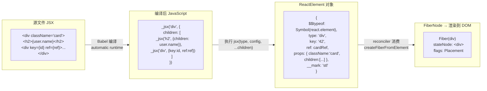
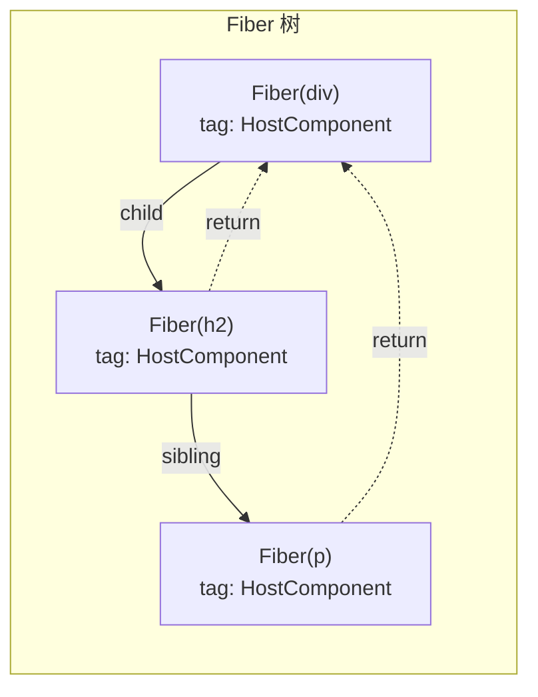
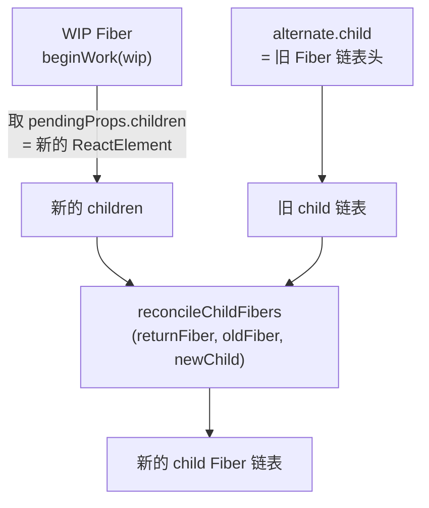
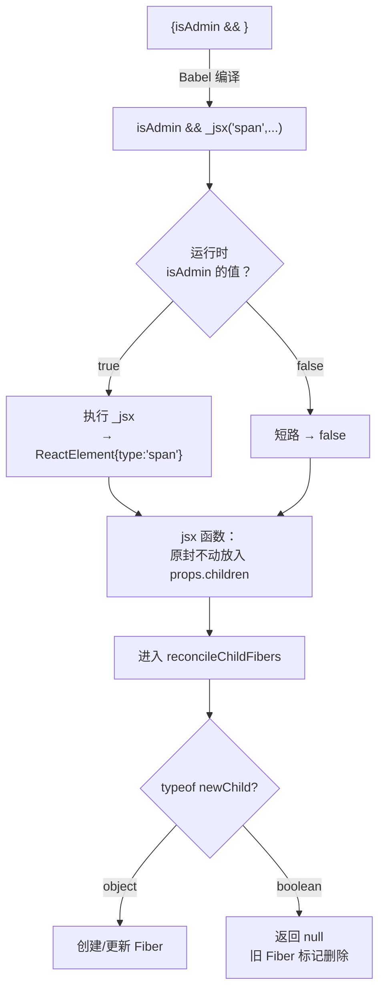
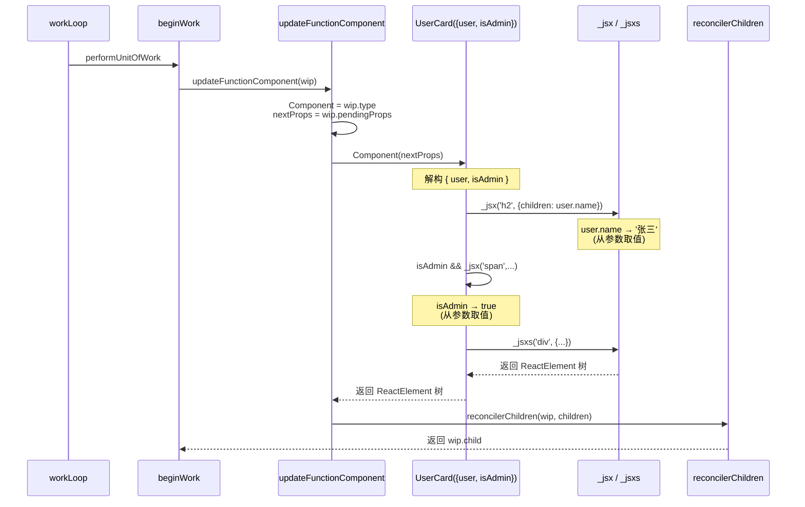
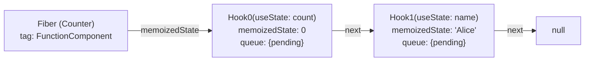
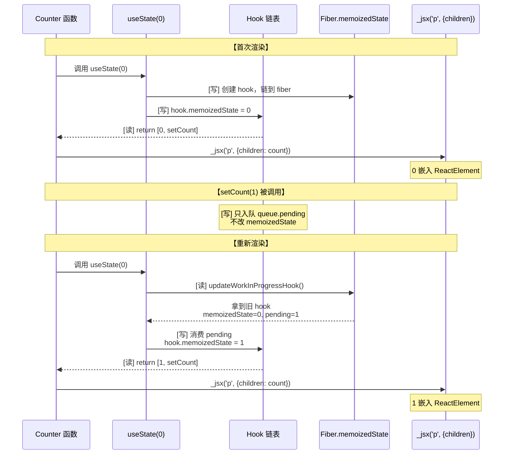
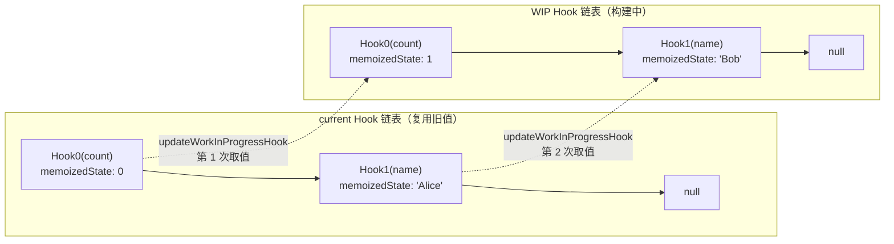

# Babel + `jsx` 函数逐步解析

## 配置背景

项目使用 `@babel/plugin-transform-react-jsx`，在 React 17+ 的 automatic runtime 模式下，JSX 会被编译成调用 `jsx`（生产）或 `jsxDEV`（开发）函数。

`packages/react/index.ts` 将 `jsxDEV` 暴露为 `createElement`。

---

## 原始 JSX 代码（复杂示例）

```tsx
function UserCard({ user, isAdmin }) {
  return (
    <div className="card" id={`card-${user.id}`}>
      <h2 className="title">
        {user.name}
        {isAdmin && <span className="badge">Admin</span>}
      </h2>
      <div className="body" key={user.id} ref={cardRef}>
        <p>{user.bio}</p>
        {user.tags.map(tag => (
          <span key={tag} className="tag">{tag}</span>
        ))}
      </div>
      <footer>
        <a href={`/profile/${user.id}`}>View Profile</a>
        {isAdmin && <button onClick={handleDelete}>Delete</button>}
      </footer>
    </div>
  );
}
```

---

## 第 1 步：Babel 编译 JSX → `jsx()` 调用

在 **automatic runtime** 下，Babel 将上述 JSX 编译为：

```js
import { jsx as _jsx, jsxs as _jsxs } from 'react/jsx-runtime';

function UserCard({ user, isAdmin }) {
  return _jsxs('div', {
    className: 'card',
    id: `card-${user.id}`,
    children: [
      _jsxs('h2', {
        className: 'title',
        children: [
          user.name,
          isAdmin && _jsx('span', {
            className: 'badge',
            children: 'Admin'
          })
        ]
      }),
      _jsx('div', {
        className: 'body',
        key: user.id,
        ref: cardRef,
        children: [
          _jsx('p', { children: user.bio }),
          user.tags.map(tag =>
            _jsx('span', {
              key: tag,
              className: 'tag',
              children: tag
            })
          )
        ]
      }),
      _jsxs('footer', {
        children: [
          _jsx('a', {
            href: `/profile/${user.id}`,
            children: 'View Profile'
          }),
          isAdmin && _jsx('button', {
            onClick: handleDelete,
            children: 'Delete'
          })
        ]
      })
    ]
  });
}
```

> 自动 runtime 会根据子元素数量决定用 `jsx`（单个子元素）还是 `jsxs`（多个子元素）。这里统一看作调用 `jsx` 函数。

---

## 第 2 步：`jsx()` 函数逐步追踪

### 2.1 最外层：`_jsxs('div', { ... })`

入口：`jsx('div', config, ...children)`

| 阶段 | 代码 | 结果 |
|------|------|------|
| 入口参数 | `type = 'div'`, `config = { className: 'card', id: 'card-42' }`, `maybeChildren = [ [...子元素数组] ]` | |
| 提取 key | `config` 中没有 `key` | `key = null` |
| 提取 ref | `config` 中没有 `ref` | `ref = null` |
| 遍历 config | 复制 `className`、`id` 到 `props` | `props = { className: 'card', id: 'card-42' }` |
| 处理 children | `maybeChildren.length === 1` | `props.children = 子元素数组`（扁平化为一个属性） |
| 返回 | `ReactElement('div', null, null, props)` | ✅ 完成 |

### 2.2 带 key 和 ref 的内层：`_jsx('div', { key, ref, ... })`

入口：`jsx('div', config)`

| 阶段 | 代码 | 结果 |
|------|------|------|
| 入口参数 | `type = 'div'`, `config = { className: 'body', key: user.id, ref: cardRef, children: [...] }` | |
| 提取 key | `config.key = user.id`（假设为 42）| `key = '42'`（字符串化） |
| 提取 ref | `config.ref = cardRef` | `ref = cardRef` |
| 遍历 config | 跳过 `key` 和 `ref`，复制 `className` | `props = { className: 'body', children: [...] }` |
| 处理 children | config 里已有 `children`，无需从 `maybeChildren` 获取 | 保留 `config.children` |
| 返回 | `ReactElement('div', '42', cardRef, props)` | ✅ 完成 |

### 2.3 条件渲染：`isAdmin && <span className="badge">Admin</span>`

编译为：`isAdmin && _jsx('span', { className: 'badge', children: 'Admin' })`

| 阶段 | 结果 |
|------|------|
| `isAdmin = true` | 执行 `jsx`，返回完整的 ReactElement |
| `isAdmin = false` | 表达式值为 `false`，作为布尔值留在父节点的 `children` 数组中 |
| `jsx` 内部 | `type = 'span'`, 无 `key`, 无 `ref`, `props = { className: 'badge', children: 'Admin' }` |
| 返回 | `ReactElement('span', null, null, props)` |

### 2.4 `Array.map` 中的 JSX：`{user.tags.map(tag => <span key={tag} className="tag">{tag}</span>)}`

编译为：`user.tags.map(tag => _jsx('span', { key: tag, className: 'tag', children: tag }))`

注意：`key` 作为 `config` 属性传入（自动 runtime 处理方式）。

| 阶段 | 结果 |
|------|------|
| `map` 执行 | 对每个 tag 调用 `_jsx`，生成一个 ReactElement 数组 |
| `key = 'frontend'` | 从 `config.key` 提取，`key = '' + 'frontend'` |
| 返回 | `ReactElement('span', 'frontend', null, { className: 'tag', children: 'frontend' })` |

---

## 第 3 步：最终生成的 ReactElement 树

假设 `user = { id: 42, name: '张三', bio: '张三的简介', tags: ['frontend', 'react'] }`、`isAdmin = true`，最终结构：

```json
{
  "$$typeof": Symbol(react.element),
  "type": "div",
  "key": null,
  "ref": null,
  "props": {
    "className": "card",
    "id": "card-42",
    "children": [
      {
        "$$typeof": Symbol(react.element),
        "type": "h2",
        "key": null,
        "ref": null,
        "props": {
          "className": "title",
          "children": [
            "张三",
            {
              "$$typeof": Symbol(react.element),
              "type": "span",
              "key": null,
              "ref": null,
              "props": {
                "className": "badge",
                "children": "Admin"
              },
              "__mark": "stl"
            }
          ]
        },
        "__mark": "stl"
      },
      {
        "$$typeof": Symbol(react.element),
        "type": "div",
        "key": "42",
        "ref": { "current": null },
        "props": {
          "className": "body",
          "children": [
            {
              "$$typeof": Symbol(react.element),
              "type": "p",
              "key": null,
              "ref": null,
              "props": { "children": "张三的简介" },
              "__mark": "stl"
            },
            [
              {
                "$$typeof": Symbol(react.element),
                "type": "span",
                "key": "frontend",
                "ref": null,
                "props": { "className": "tag", "children": "frontend" },
                "__mark": "stl"
              },
              {
                "$$typeof": Symbol(react.element),
                "type": "span",
                "key": "react",
                "ref": null,
                "props": { "className": "tag", "children": "react" },
                "__mark": "stl"
              }
            ]
          ]
        },
        "__mark": "stl"
      },
      {
        "$$typeof": Symbol(react.element),
        "type": "footer",
        "key": null,
        "ref": null,
        "props": {
          "children": [
            {
              "$$typeof": Symbol(react.element),
              "type": "a",
              "key": null,
              "ref": null,
              "props": { "href": "/profile/42", "children": "View Profile" },
              "__mark": "stl"
            },
            {
              "$$typeof": Symbol(react.element),
              "type": "button",
              "key": null,
              "ref": null,
              "props": { "onClick": handleDelete, "children": "Delete" },
              "__mark": "stl"
            }
          ]
        },
        "__mark": "stl"
      }
    ]
  },
  "__mark": "stl"
}
```

---

## 关键观察

### 1. `key` 的处理时机

在 automatic runtime 中，`key` 只有一种来源：

```js
// key 作为 config 的属性传入
_jsx('div', { key: user.id, className: 'body' })
```

从 `config` 中提取 `key`：

```ts
if (prop === 'key') {
  if (val !== undefined) {
    key = '' + val;
  }
  continue;
}
```

> 注意 `jsx` 签名中的 rest 参数 `...maybeChildren` 只用于接收 children，**不**接收 key。

### 2. `ref` 必须在 config 中

```ts
if (prop === 'ref') {
  if (val !== undefined) {
    ref = val;
  }
  continue;
}
```

Babel 自动 runtime 会把 `ref` 编译到 `config` 对象中。

### 3. 条件渲染 (`&&`) 的行为

```js
isAdmin && _jsx('span', { className: 'badge', children: 'Admin' })
```

- `true`：表达式值为 `ReactElement` 对象
- `false`：表达式值为 `false`，作为布尔值留在父节点的 `props.children` 数组中，后续由 reconciler 在 `beginWork` 阶段忽略

### 4. `jsxDEV` 与 `jsx` 的区别

```ts
// jsx:        key 从 config 中提取，children 通过 ...maybeChildren rest 参数传入
// jsxDEV:     key 从第三个参数 maybeKey 直接传入
export const jsxDEV = (type: ElementType, config: any, maybeKey: any) => {
```

开发模式下 Babel 将 `key` 作为独立参数传入，方便做开发警告（如 `key` 合法性检查）。

---

## 数据流总览



**核心结论**：`jsx` 函数是一个纯数据转换器，将 Babel 编译后的扁平调用（`type + config + children`）转换为带 `$$typeof` 标记的结构化 ReactElement 对象。`key` 和 `ref` 作为特殊属性从 config 中分离到顶层，其余属性归入 `props`。

---

# ReactElement 与 React 运行时

## ReactElement 树 vs Fiber 树

### 核心区别

| 维度 | ReactElement 树 | Fiber 树 |
|------|----------------|----------|
| **本质** | 普通 JS 对象，由 `jsx()` 创建 | 类实例（`FiberNode`），由 reconciler 管理 |
| **生命周期** | **每次 render 重建**，不持久 | **持久存在**，跨 render 复用（通过 `alternate` 双缓冲） |
| **可变性** | **不可变**，创建后不修改 | **可变**，作为工作台不断修改 `pendingProps`、`flags`、`memoizedState` |
| **树结构** | 嵌套树：`type.props.children` 单向引用 | 三重指针链表：`return` / `child` / `sibling` |
| **子节点形式** | 数组、单个元素、布尔、null、字符串等混在一起 | **统一展平**为 `child → sibling` 单向链表 |
| **携带信息** | 仅描述 UI：`type` + `props` + `key` + `ref` | UI 描述 + **状态** + **副作用标记** + **调度上下文** + **DOM 引用** |
| **与 DOM 关系** | 间接（通过 Fiber 树中转） | 直接（`stateNode` 指向真实 DOM 节点） |

### 结构对比

**ReactElement 树** — 嵌套的 children 结构：

```json
{
  "type": "div",
  "props": {
    "children": [
      { "type": "h2", "props": { "children": "Hello" } },
      false,
      { "type": "p", "props": { "children": "World" } }
    ]
  }
}
```

**Fiber 树** — 展平的三重指针链表：



ReactElement 的 `children` 数组（包含 `false`）在 Fiber 层被**展平并过滤**：`false` / `null` / `undefined` / `true` 不会生成 Fiber 节点，数组本身也被拆散为 `child → sibling` 链表。

### Fiber 的额外能力

ReactElement 做不到的：

1. **双向行走**：`child` 向下、`return` 向上、`sibling` 横向
2. **持久化状态**：`memoizedState` 存 Hook 链表、`memoizedProps` 存上次 props
3. **副作用追踪**：`flags` 标记 Placement / Update / ChildDeletion 等操作
4. **双缓冲**：`current`（已渲染）与 `workInProgress`（构建中）通过 `alternate` 互指，支持中断恢复

---

## ReactElement 与旧 Fiber 的 Diff 过程

### 不是"树 vs 树"的整体对比

Diff 是**逐层局部**的，发生在每次 `beginWork` 调用中。每次只处理一个 WIP Fiber，对比：



### 匹配规则

1. 从 ReactElement 中提取 `key`
2. 用 `key` 去 `oldFiber` 链表中查找匹配
3. **匹配成功** → 复用旧 Fiber 的 `stateNode`（DOM 实例），更新其 `pendingProps`
4. **匹配失败** → 创建新的 Fiber，旧 Fiber 标记删除

### 为什么是逐层局部 diff？

React 假设：**跨层级的移动操作极少**（如把 `<div>` 里的子节点移到 `<span>`）。基于此假设，只在同一层级比较，复杂度从 O(n³) 降为 O(n)。

---

## Boolean（条件渲染）在 Fiber 层的处理

### 完整旅程

```tsx
<div>
  {isAdmin && <span className="badge">Admin</span>}
</div>
```

**编译后：**

```js
_jsx('div', {
  children: isAdmin && _jsx('span', { className: 'badge', children: 'Admin' })
})
```

**`isAdmin && _jsx(...)` 是纯 JS 表达式**，在执行 `_jsx('div', config)` 前已计算完毕：



`jsx` 函数不做任何过滤，`false` 原封不动进入 `props.children`。

**进入 reconcile 后：**

```ts
function reconcileChildFibers(returnFiber, currentFirstChild, newChild) {
  if (typeof newChild === 'object' && newChild !== null) {
    // 处理 ReactElement
  }
  if (typeof newChild === 'string' || typeof newChild === 'number') {
    // 处理文本节点
  }
  // false/null/undefined/true → 没有命中任何分支
  // → 返回 null，如果之前有子 Fiber 则标记删除（ChildDeletion）
  return null;
}
```

### 各种条件渲染的 reconcile 结果

| 源代码 | `children` 值 | reconcile 结果 |
|--------|--------------|---------------|
| `{isAdmin && <span/>}` (true) | `ReactElement` | 创建/更新 Fiber |
| `{isAdmin && <span/>}` (false) | `false` | 返回 null，旧 Fiber 标记删除 |
| `{isAdmin ? <A/> : <B/>}` | `ReactElement(A)` 或 `ReactElement(B)` | 按 key 匹配 |
| `{null}` / `{undefined}` / `{true}` | `null` / `undefined` / `true` | 同 false，不会产生 Fiber |
| `{arr.map(x => <Item/>)}` | `[ReactElement, ...]` 数组 | 按 key 逐一 reconcile |
| `{0}` | `0`（数字） | 创建 HostText Fiber，渲染为 "0" |
| `{''}` | `''`（字符串） | 创建 HostText Fiber，渲染为空白 |

---

## 函数组件如何被调用

### 关键认知

Babel 编译后的 `_jsx()` 调用写在函数组件体内。这些代码不是"静态模板"——它们**每次渲染都会重新执行**。

```ts
// 编译后
function UserCard({ user, isAdmin }) {
  return _jsxs('div', {
    children: [
      _jsx('h2', { children: user.name }),
      isAdmin && _jsx('span', { className: 'badge', children: 'Admin' })
    ]
  });
}
```

### 谁调用了这个函数？

不是用户代码直接调用，是 **React reconciler 在 `beginWork` 中主动调用的**：

```ts
function updateFunctionComponent(wip: FiberNode) {
  const Component = wip.type;           // Component = UserCard（函数引用）
  const nextProps = wip.pendingProps;   // 从 Fiber 上取 props

  // ★ 就是这行：React 调用你的函数组件！
  const nextChildren = Component(nextProps);
  //          ↑
  //     执行后得到 ReactElement 树

  reconcilerChildren(wip, nextChildren);
  return wip.child;
}
```

### 参数从哪来

一路追溯上去：

| 阶段 | 来源 |
|------|------|
| `updateFunctionComponent` 读 `wip.pendingProps` | 来自 `createWorkInProgress` 从 `current.pendingProps` 复制 |
| `createFiberFromElement` | 从 ReactElement 的 `props` 复制：`new FiberNode(tag, props, key)` |
| ReactElement 的 `props` | 由 `jsx()` 函数从 `config` 构建 |
| 用户代码 | `_jsx(UserCard, { user: ..., isAdmin: ... })` 中的第二参数 |
| **最终来源** | **用户在 JSX 中写的属性**：`<UserCard user={...} isAdmin={true} />` |

### 执行时的变量填充



---

## 内部状态（useState）的读写时机

### 核心问题

两个精确问题：
- **① 什么时候从 Hook 链读值？**
- **② 什么时候往 Hook 链写值？**

### 数据结构：Hook 链表

```ts
// 每个 Hook 节点
const hook = {
  memoizedState: null,      // ← state 的当前值
  queue: { pending: null }, // ← setState 入队的更新
  next: null,               // ← 指向下一个 Hook
};
```

Fiber 上的存储：



Fiber 的 `memoizedState` 存的是**Hook 链表的头指针**，不是单个值。

### 首次渲染（mount）：先写后读

```ts
function mountState(initialState) {
  // ─── [写] ① 创建 Hook 节点，写入 fiber ───
  const hook = {
    memoizedState: initialState,   // 0
    queue: { pending: null },
    next: null,
  };
  currentlyRenderingFiber.memoizedState = hook;  // 链到 fiber

  // ─── [读] ② 返回 memoizedState ───
  return [hook.memoizedState, dispatch];
  //       ↑
  //       count = 0
}
```

**时间线：** `useState(0)` 被调用 → 创建 hook 节点并挂到 fiber → 返回 `hook.memoizedState`（0）

### setCount 调用时：只入队，不改值

```ts
function dispatchAction(fiber, queue, action) {
  // 把 action 入队到 hook.queue.pending
  const update = { action, next: null };
  queue.pending = update;
  // hook.memoizedState ← 不改！
  
  scheduleUpdateOnFiber(fiber);
}
```

### 更新渲染（update）：先读旧值 → 消费更新 → 写新值 → 读新值

```ts
function updateReducer(reducer) {
  // ─── [读] ① 从 alternate 的 hook 链拿到旧 hook ───
  const hook = updateWorkInProgressHook();
  // 此时：
  //   hook.memoizedState = 0     （旧值）
  //   hook.queue.pending = Update { action: 1 }

  // ─── [写] ② 消费 pending，把新值写回 hook.memoizedState ───
  let newState = hook.memoizedState;            // 从旧值 0 开始
  newState = hook.queue.pending.action;         // 1
  hook.memoizedState = newState;                // ← 写回 hook！
  hook.queue.pending = null;

  // ─── [读] ③ 返回新值 ───
  return [hook.memoizedState, hook.queue.dispatch];
  //       ↑
  //       count = 1
}
```

### 精确答案一览

| | 什么时候读 Hook 链？ | 什么时候写 Hook 链？ |
|---|---|---|
| **首次渲染** | `useState(0)` → `mountState` → 返回前从 `hook.memoizedState` 读 | `useState(0)` → `mountState` → 一开始创建 hook 并链到 fiber |
| **更新渲染** | `useState(0)` → `updateReducer` → **第一步** `updateWorkInProgressHook()` 从 alternate 读旧 hook | `useState(0)` → `updateReducer` → **第二步** 消费 `queue.pending` 后写回 `hook.memoizedState` |
| **`setCount()` 调用时** | 不读 hook 链 | 只把 action 入队到 `hook.queue.pending`，**不改** `memoizedState` |

### 完整时间线



### 为什么 Hook 调用顺序必须恒定

`updateWorkInProgressHook` 通过同步遍历 `currentHook` 和 `workInProgressHook` 实现新旧 Hook 一一对应：



如果顺序变了，`useState` 的第二次调用会错误地匹配到前一次的第一个 Hook，导致状态混乱。这就是 React 报错 `Rendered fewer hooks than expected` 的原因。
