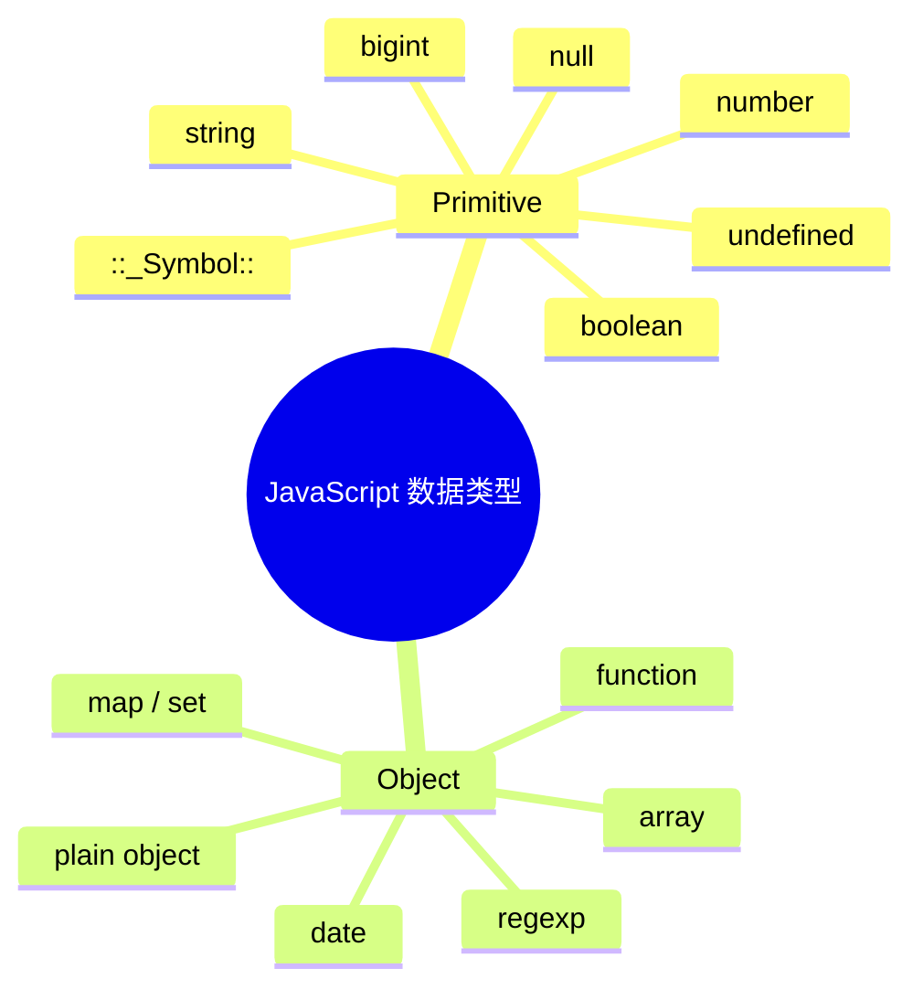
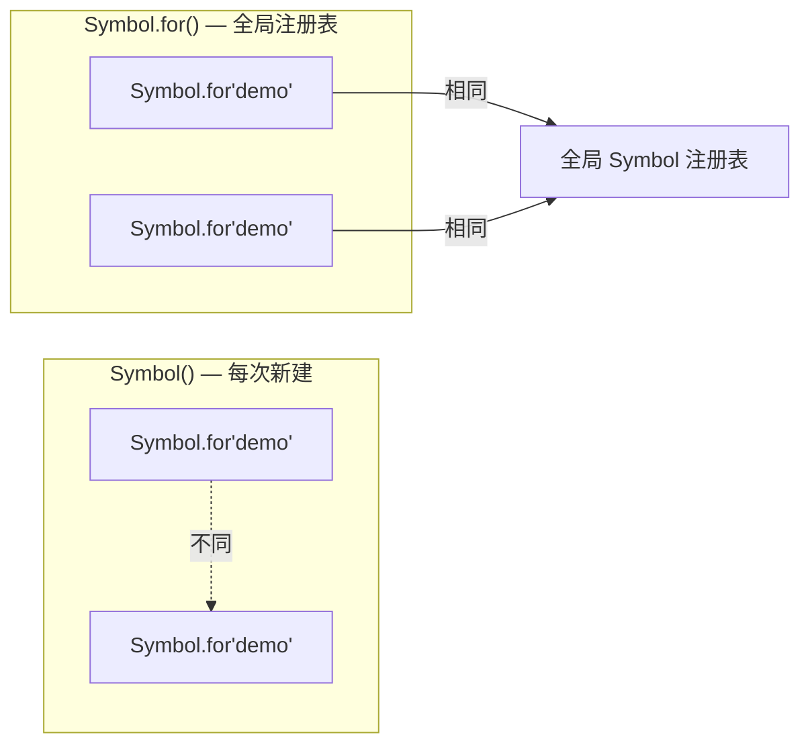
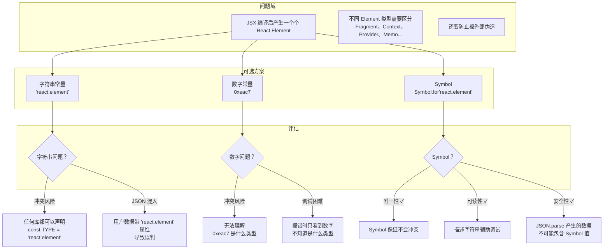
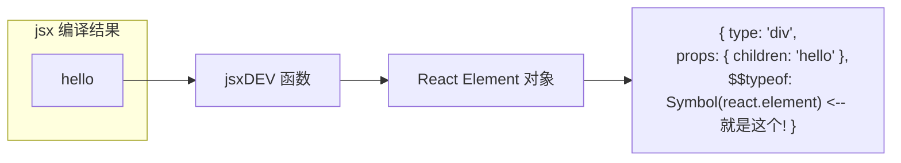
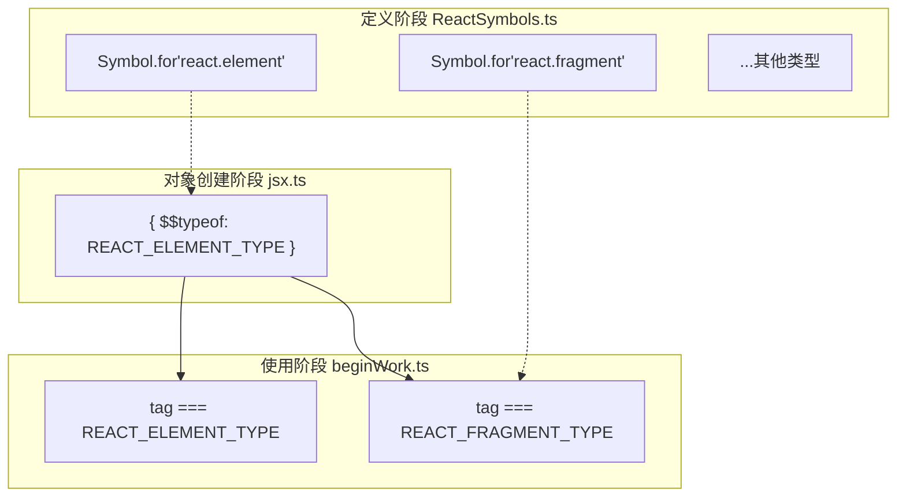
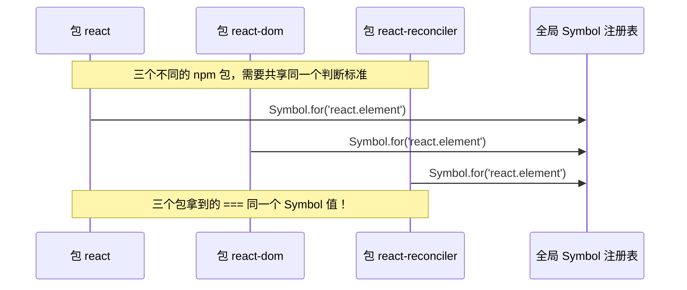
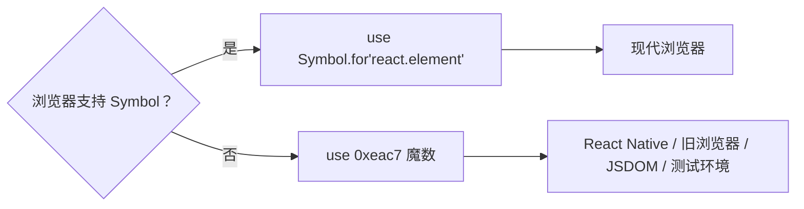

# ReactSymbols.ts 解读 —— JavaScript Symbol 深度讲解

> 本文档是 `ReactSymbols.ts` 的伴读文件，详细讲解 JavaScript `Symbol` 的核心知识，以及 React 为什么、如何利用 Symbol 构建内部类型系统。

---

## 目录

- [一、ReactSymbols.ts 原貌](#一reactsymbolsts-原貌)
- [二、什么是 Symbol？](#二什么是-symbol)
- [三、Symbol 的核心特性](#三symbol-的核心特性)
- [四、Symbol 的三种创建方式](#四symbol-的三种创建方式)
- [五、图解：React 为什么非要用 Symbol？](#五图解react-为什么非要用-symbol)
- [六、逐行解析 ReactSymbols.ts](#六逐行解析-reactsymbolsts)
- [七、为什么 React 用 `Symbol.for()` 而不是 `Symbol()`？](#七为什么-react-用-symbolfor-而不是-symbol)
- [八、Fallback 机制：当 Symbol 不可用时](#八fallback-机制当-symbol-不可用时)
- [九、魔数 0xeac7 的由来](#九魔数-0xeac7-的由来)
- [十、项目规范](#十项目规范)
- [十一、总结：你在向 React 学什么设计模式？](#十一总结你在向-react-学什么设计模式)

---

## 一、ReactSymbols.ts 原貌

```typescript
const supportSymbol = typeof Symbol === 'function' && Symbol.for;

export const REACT_ELEMENT_TYPE = supportSymbol
    ? Symbol.for('react.element')
    : 0xeac7;

export const REACT_FRAGMENT_TYPE = supportSymbol
    ? Symbol.for('react.fragment')
    : 0xeaca;

export const REACT_CONTEXT_TYPE = supportSymbol
    ? Symbol.for('react.context')
    : 0xeacc;

export const REACT_PROVIDER_TYPE = supportSymbol
    ? Symbol.for('react.provider')
    : 0xeac2;

export const REACT_SUSPENSE_TYPE = supportSymbol
    ? Symbol.for('react.suspense')
    : 0xead1;

export const REACT_LAZY_TYPE = supportSymbol
    ? Symbol.for('react.lazy')
    : 0xead4;

export const REACT_MEMO_TYPE = supportSymbol
    ? Symbol.for('react.memo')
    : 0xead3;
```

这段代码只有 **29 行**，却是整个 React 运行时类型判断的基石。

---

## 二、什么是 Symbol？

### 2.1 一句话定义

**Symbol** 是 ECMAScript 6 (ES2015) 引入的**第 7 种原始数据类型**（primitive type）。



> **Key insight:** 在 Symbol 出现之前，JavaScript 的原始类型只有 6 种。Symbol 是第一个（也是唯一一个）**专门为「唯一标识符」而生的原始类型**。

### 2.2 Symbol 的本质

```javascript
// 每次调用 Symbol() 都会创建一个独一无二的值
const sym1 = Symbol();
const sym2 = Symbol();

console.log(sym1 === sym2); // false —— 即使没有传任何参数
console.log(typeof sym1);   // "symbol"
```

从 **底层实现** 角度看：

| 特性 | 说明 |
|------|------|
| **唯一性** | 每次 `Symbol()` 调用都生成一个不重复的内部 ID（V8 中用唯一的 [[private_id]] 表示） |
| **不可变** | 像所有原始类型一样，Symbol 值本身不可变 |
| **不可隐式转换** | `String(sym)` 可以，但 `'' + sym` 抛 TypeError |
| **不作为属性被枚举** | `for...in` 和 `Object.keys()` 不返回 Symbol 键 |
| **不被 JSON 序列化** | `JSON.stringify` 会忽略 Symbol 属性 |

---

## 三、Symbol 的核心特性

### 特性 1：绝对的唯一性

```javascript
// 即使描述相同，值也不同
const a = Symbol('react.element');
const b = Symbol('react.element');
console.log(a === b); // false —— 描述只是标签，不影响唯一性
```

### 特性 2：隐藏性（非私有）

Symbol 键属性不会被常规手段遍历到，但可以通过 `Object.getOwnPropertySymbols()` 获取到。

```javascript
const obj = {
    [Symbol('secret')]: '你找不到我'
};
console.log(Object.keys(obj));              // [] —— 看不见
console.log(Object.getOwnPropertySymbols(obj)); // [ Symbol(secret) ] —— 找得到
```

> ⚠️ Symbol **不是** 真正的私有属性（那是 `#privateField` 的职责），它只是一种「非枚举」的约定性隐藏。

### 特性 3：可全局共享（Symbol.for）

```javascript
// Symbol.for() 在全局注册表中查找/创建
const x = Symbol.for('react.element');
const y = Symbol.for('react.element');
console.log(x === y); // true —— 同一个 Symbol
```

这与 `Symbol()` 完全不同：



### 特性 4：作为对象属性的唯一键

```javascript
const TYPE = Symbol('type');
const obj = {
    [TYPE]: 'button',
    type: 'submit'  // 不会冲突！
};
// 即使属性名都叫 'type'，Symbol 键和字符串键互不干扰
```

---

## 四、Symbol 的三种创建方式

| 方式 | API | 唯一性 | 用途场景 |
|------|-----|--------|----------|
| **匿名 Symbol** | `Symbol()` | 每次唯一 | 临时标识、内部常量 |
| **带描述的 Symbol** | `Symbol('desc')` | 每次唯一，描述仅供调试 | 调试友好的标识 |
| **全局 Symbol** | `Symbol.for('key')` | 同 key 则同一个 | **跨模块共享的标识** — 这正是 React 的场景 |

### 代码对比

```javascript
// 方式 1 ❌ 不适合 React 场景
Symbol()          // 完全匿名，调试困难
Symbol('element') // 调试友好，但每次调用值不同

// 方式 2 ✅ React 的选择
Symbol.for('react.element') // 全局唯一，跨文件/跨模块保证相同值
```

---

## 五、图解：React 为什么非要用 Symbol？

### 5.1 问题：React 需要什么？



### 5.2 具体场景对比

**场景：用户数据中恰好有同名字段**

```javascript
// 场景：后端返回的数据
const serverData = {
    type: 'div',
    $$typeof: 'react.element'  // ❌ 恶意或巧合，和 React 的标记冲突
};

// 如果用 Symbol
const serverDataSafe = {
    type: 'div',
    // 用户无法在 JSON 中构造 Symbol 值！
    [Symbol.for('react.element')]: undefined  // ❌ JSON.parse 只产生 string/number...
};
```

**关键结论：`JSON.parse` 无法产生 Symbol 值**。这意味着任何从网络传输来的数据都不可能误触 React 的内部类型标记。

---

## 六、逐行解析 ReactSymbols.ts

### 第 1 行：能力检测

```typescript
const supportSymbol = typeof Symbol === 'function' && Symbol.for;
```

这行做了两件事：
1. **检测 Symbol 是否可用**：`typeof Symbol === 'function'` — 如果浏览器不支持 ES6，Symbol 不存在
2. **检测 Symbol.for 是否可用**：`&& Symbol.for` — 确保全局注册表 API 可用

> 这是一个经典的**特性检测（feature detection）**模式，不等价于浏览器版本判断。

### 第 3-5 行：React Element 类型

```typescript
export const REACT_ELEMENT_TYPE = supportSymbol
    ? Symbol.for('react.element')
    : 0xeac7;
```

这就是**每个 React Element 上的 `$$typeof` 属性的值**。



### 第 7-9 行：Fragment 类型

```typescript
export const REACT_FRAGMENT_TYPE = supportSymbol
    ? Symbol.for('react.fragment')
    : 0xeaca;
```

当你写 `<></>` 或 `<React.Fragment>` 时，编译出的 type 就是 `Symbol.for('react.fragment')`。

### 第 11-13 行：Context 类型

```typescript
export const REACT_CONTEXT_TYPE = supportSymbol
    ? Symbol.for('react.context')
    : 0xeacc;
```

### 第 15-17 行：Provider 类型

```typescript
export const REACT_PROVIDER_TYPE = supportSymbol
    ? Symbol.for('react.provider')
    : 0xeac2;
```

### 第 19-21 行：Suspense 类型

```typescript
export const REACT_SUSPENSE_TYPE = supportSymbol
    ? Symbol.for('react.suspense')
    : 0xead1;
```

### 第 23-25 行：Lazy 类型

```typescript
export const REACT_LAZY_TYPE = supportSymbol
    ? Symbol.for('react.lazy')
    : 0xead4;
```

### 第 27-29 行：Memo 类型

```typescript
export const REACT_MEMO_TYPE = supportSymbol
    ? Symbol.for('react.memo')
    : 0xead3;
```

### 这些 Symbol 的完整生命周期



---

## 七、为什么 React 用 `Symbol.for()` 而不是 `Symbol()`？

这是理解 `ReactSymbols.ts` 设计**最关键的决策**。

### 对比

| 特性 | `Symbol()` | `Symbol.for('key')` |
|------|-----------|---------------------|
| 跨模块调用 | 每次不同值 | 同 key 返回同值 |
| 全局注册表 | 不写入 | 写入全局注册表 |
| 序列化后恢复 | 不可能 | 可以通过 `Symbol.keyFor()` 恢复 |
| 适合跨包共享？ | ❌ 每个包拿到不同值 | ✅ 全应用唯一 |

### React 面临的真实场景



**如果 React 用了 `Symbol()`**（无 for）：

```typescript
// 假设 React 错误地使用了 Symbol()
export const REACT_ELEMENT_TYPE = Symbol('react.element');

// 在 react 包中：REACT_ELEMENT_TYPE = Symbol#1
// 在 react-dom 包中：REACT_ELEMENT_TYPE = Symbol#2 （因为分别打包）
// react#1 !== react-dom#2！类型判断全面崩溃！
```

> ✅ `Symbol.for('react.element')` 保证了**即使 react、react-dom、react-reconciler 分别打包**，三个包的 `REACT_ELEMENT_TYPE` 仍然是同一个 Symbol。

---

## 八、Fallback 机制：当 Symbol 不可用时

### 为什么需要 Fallback？



React 需要支持老旧的浏览器（IE 11 等）以及某些 JS 环境（如 React Native 早期版本），这些环境不支持 ES6 的 Symbol。

### Fallback 策略

```typescript
// 当 Symbol 不支持时
export const REACT_ELEMENT_TYPE = 0xeac7;

// 之后在 beginWork 中判断
if (workInProgress.type === REACT_ELEMENT_TYPE) {
    // 0xeac7 和 Symbol 都可以正常工作，因为这里只是值比较
}
```

### 这种双模式设计的权衡

| 场景 | Symbol 模式 | 魔数模式 |
|------|------------|----------|
| 唯一性保证 | ✅ 绝对唯一 | ⚠️ 极低概率冲突 |
| 调试友好性 | ✅ 控制台显示 `Symbol(react.element)` | ❌ 看到 `0xeac7` 不知道是什么 |
| 安全性 | ✅ JSON 无法注入 | ❌ 字符串/数字可以碰撞 |
| 兼容性 | ❌ 需要 ES6 | ✅ 所有环境 |

---

## 九、魔数 0xeac7 的由来

React 为每种类型选择的魔数是有规律的：

| 导出常量 | 魔数 |
|----------|------|
| `REACT_ELEMENT_TYPE` | `0xeac7` |
| `REACT_PROVIDER_TYPE` | `0xeac2` |
| `REACT_CONTEXT_TYPE` | `0xeacc` |
| `REACT_FRAGMENT_TYPE` | `0xeaca` |
| `REACT_MEMO_TYPE` | `0xead3` |
| `REACT_LAZY_TYPE` | `0xead4` |
| `REACT_SUSPENSE_TYPE` | `0xead1` |

这些数字看起来随机，但仔细观察：

```
0xeac7 — el❓ment (element)
0xeac2 — prov❓der (provider)
0xeacc — cont❓xt (context)
0xeaca — fragm❓nt (fragment)
0xead3 — m❓mo (memo)
0xead4 — l❓zy (lazy)
0xead1 — susp❓nse (suspense)
```

它们是 **React 团队在十六进制空间中取的、与类型名发音相近的「谐音」魔数**。`0xeac7` 读起来像 "element" 的发音片段。

---

## 十、项目规范

> 本规范记录在 `ReactSymbols.ts` 中体现的设计模式和约定，作为本项目开发时的编码准则。

### 规范 1：内部类型必须用 Symbol 标记

当本项目中需要新增任何内部类型标识时，必须采用 `ReactSymbols.ts` 中的模式：

```typescript
// ✅ 正确：遵循 ReactSymbols 模式
export const REACT_MY_TYPE = supportSymbol
    ? Symbol.for('react.myType')
    : 0x????; // 选一个不与现有魔数冲突的十六进制数
```

**原因**：确保新增类型与 React 官方设计一致，同时为 Symbol 不兼容环境提供降级。

### 规范 2：使用 `Symbol.for()` 而非 `Symbol()`

- ✅ 使用 `Symbol.for('react.xxx')` — 全局注册表确保跨包唯一性
- ❌ 不使用 `Symbol('react.xxx')` — 会在多包场景下产生不同实例

### 规范 3：命名约定

- 常量名：`REACT_<类型>_TYPE`（全大写 + 下划线）
- Symbol 描述：`'react.<类型>'`（全小写，点分隔）
- 魔数：`0xeac7` 风格（0x + 4 位十六进制）

### 规范 4：能力检测先行

```typescript
// 必须放在文件顶部
const supportSymbol = typeof Symbol === 'function' && Symbol.for;
```

**原因**：这是 React 源码的实际模式。特性检测比 User-Agent 判断更可靠。

### 规范 5：不要用魔数直接暴露到外部 API

魔数 `0xeac7` 只是内部 fallback，**不应该**被外部代码依赖：

```typescript
// ❌ 不好
if (element.$$typeof === 0xeac7) { /* ... */ }

// ✅ 正确：始终使用导出的常量
import { REACT_ELEMENT_TYPE } from 'shared/ReactSymbols';
if (element.$$typeof === REACT_ELEMENT_TYPE) { /* ... */ }
```

---

## 十一、总结：你在向 React 学什么设计模式？

```
┌─────────────────────────────────────────────┐
│          React 的内部类型系统                  │
├─────────────────────────────────────────────┤
│                                             │
│  ┌──────────┐    ┌──────────────────┐       │
│  │  问题     │    │  解决方案          │       │
│  │          │    │                    │       │
│  │ 需要     │───▶│  Symbol.for()     │       │
│  │ 唯一     │    │  + 全局注册表      │       │
│  │ 且安全   │    │                    │       │
│  │ 的类型   │    │  + 魔数 fallback   │       │
│  │ 标识     │    │                    │       │
│  │          │    │  + 能力检测        │       │
│  │ 还要     │    │                    │       │
│  │ 兼容     │    │  = 优雅降级        │       │
│  │ 老环境   │    │    (Graceful       │       │
│  │          │    │     Degradation)   │       │
│  └──────────┘    └──────────────────┘       │
│                                             │
└─────────────────────────────────────────────┘
```

### 你从这个文件学到的最重要的 3 个设计原则

1. **用语言特性解决领域问题** — 需要唯一标识时，不要造字符串命名规范，用 `Symbol`
2. **渐进增强 / 优雅降级** — 优先使用现代特性，但始终为旧环境准备退路
3. **跨包共享常量** — `Symbol.for()` 是 JavaScript 中唯一一个天然的「全局单例注册表」

### 下一步学习建议

- 读完这个文件后，在 `beginWork.ts` 中搜索 `REACT_` 开头的常量，看它们怎么被使用
- 在 `jsx.ts` 中看 `$$typeof` 是怎么被赋值的
- 试着回答：如果 React 仅用数字 `0xeac7` 而不用 Symbol，会有什么问题？

---

> 📖 **推荐阅读**：[MDN: Symbol](https://developer.mozilla.org/en-US/docs/Web/JavaScript/Reference/Global_Objects/Symbol) — 最权威完整的 Symbol API 文档。
>
> 有任何不清楚的地方，随时问！这个 Agent 就是你的老师。

---

*本文档是 `ReactSymbols.ts` 的伴读解读，也是本项目中内部类型设计规范的记录。*
