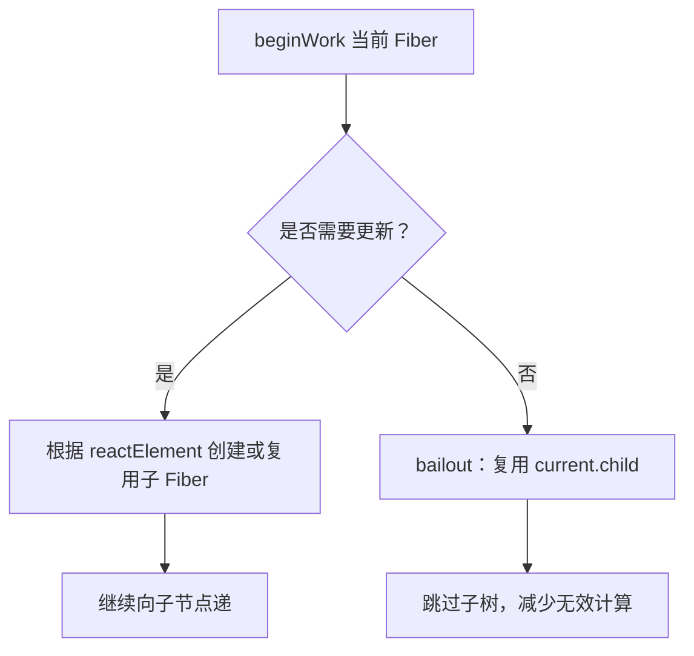

# 第五课 初探 mount 流程

## mount 流程

更新流程的目的：

- 生成 wip fiberNode 树
- 标记副作用 flags

更新流程的步骤：

- 递：beginWork
- 归：completeWork

## beginWork

对于如下结构的 reactElement：

```tsx
<A>
	<B/>
</A>
```

当进入 A 的 beginWork 时，通过对比 B current fiberNode 与 B reactElement，
生成 B 对应 wip fiberNode。

在此过程中最多会标记 2 类与「结构变化」相关的 flags：

- Placement

插入：

```txt
a -> ab
```

移动：

```txt
abc -> bca
```

- ChildDeletion

删除：

```txt
ul > li * 3 -> ul > li * 1
```

不包含与「属性变化」相关的 flag：

```txt
Update
```

例如：

```tsx
 -> 
```

## 实现与 Host 相关节点的 beginWork

首先，为开发环境增加 `__DEV__` 标识，方便 Dev 包打印更多信息：

```ts
@rollup/plugin-replace
```

HostRoot 的 beginWork 工作流程：

1. 计算状态的最新值
2. 创造子 FiberNode

HostComponent 的 beginWork 工作流程：

1. 创造子 FiberNode

HostText 没有 beginWork 工作流程，因为它没有子节点。

例如：

```tsx
<p>唱跳Rap</p>
```

## beginWork 性能优化策略

考虑如下结构的 reactElement：

```tsx
<div>
	<p>练习时长</p>
	<span>两年半</span>
</div>
```

beginWork 的核心目标是根据当前 Fiber 与新的 reactElement，生成对应的 wip fiberNode。
但并不是每次都需要无条件向下遍历整棵子树。

如果某个 Fiber 满足可以复用的条件，例如：

- props 没有变化
- state 没有变化
- 子树中没有更高优先级的更新

那么 beginWork 可以直接复用已有的 child fiberNode，跳过子树的递归处理。这个过程通常称为
`bailout`。



所以 beginWork 的性能优化重点是：**尽早判断当前 Fiber 以及它的子树是否真的有更新**。
能复用就复用，能跳过就跳过，避免在没有变化的子树上重复创建 wip fiberNode。
