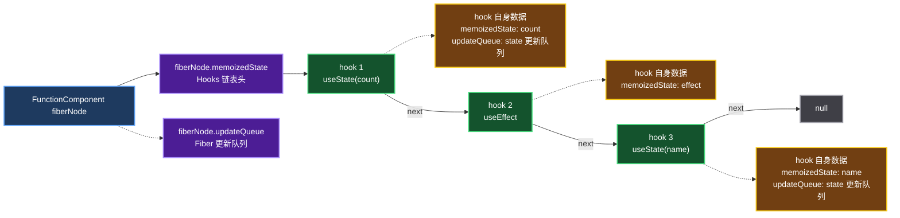

# 第八课 实现 useState

## hook 为什么需要上下文

`useState`、`useEffect` 这些 hook 暴露给用户时，看起来只是普通函数。但它们真正执行时，必须知道当前处于哪一种渲染环境。

例如：

```tsx
function App() {
	useEffect(() => {
		// 执行 useState 时，如何知道当前处于 useEffect 的上下文中
		useState(0)
	})
}
```

这里的关键点是：`hook` 本身脱离 `FunctionComponent` 后只是普通函数，它没有天然能力知道当前正在 render 哪个组件，也不知道自己处于 `mount`、`update`，还是某个 hook 的内部上下文。

因此，实现 hook 的第一步不是写 `useState` 的状态逻辑，而是先设计一套“当前正在使用哪组 hooks 实现”的共享机制。

## 不同上下文对应不同 hook 实现

原文档图中的核心关系可以概括为：

```text
Reconciler
├─ mount 时
│  ├─ useState
│  ├─ useEffect
│  └─ ...
├─ update 时
│  ├─ useState
│  ├─ useEffect
│  └─ ...
└─ hook 上下文中
   ├─ useState
   ├─ useEffect
   └─ ...

这些不同上下文中的 hook 实现，都会指向同一个“当前使用的 hooks 集合”。
```

也就是说，调用 `useState` 时执行的并不总是同一个函数。在 `mount` 阶段，它应该执行 `mountState`；在 `update` 阶段，它应该执行 `updateState`；在非法上下文中，它应该给出错误提示或走对应的保护逻辑。

简化后可以理解为：

```ts
const HooksDispatcherOnMount = {
	useState: mountState
}

const HooksDispatcherOnUpdate = {
	useState: updateState
}

const ContextOnlyDispatcher = {
	useState: throwInvalidHookError
}
```

用户调用的 `useState` 只是入口函数，它会读取当前 dispatcher，再把调用转发给真正的实现：

```ts
function useState(initialState) {
	const dispatcher = resolveDispatcher()
	return dispatcher.useState(initialState)
}
```

这样，`useState` 就不需要自己判断所有上下文。它只需要相信 `Reconciler` 在进入不同阶段前，已经把当前 dispatcher 设置好了。

## 内部数据共享层

截图中特别强调了“内部数据共享层”。它解决的是 `react` 包和 `react-reconciler` 包之间如何共享同一份运行时数据的问题。

以浏览器环境为例：

```text
Reconciler + hostConfig = ReactDOM
```

`react` 包负责导出 `useState`、`useEffect` 等公开 API；`react-reconciler` 负责在 render 过程中判断当前阶段，并设置当前 dispatcher。两者都需要访问同一个“当前 hooks 集合”。

如果让 `react` 和 `react-dom` 各自保存一份内部共享对象，就会出现问题：

```text
react 包中的 useState 读取 A 对象
react-reconciler 渲染时写入 B 对象
A 和 B 不是同一个对象，useState 就读不到 Reconciler 设置的 dispatcher
```

所以需要在 `react` 包中导出一个内部共享对象，并让 `react-reconciler` 使用这同一个对象。

简化结构如下：

```ts
const ReactCurrentDispatcher = {
	current: null
}

export const __SECRET_INTERNALS_DO_NOT_USE_OR_YOU_WILL_BE_FIRED = {
	ReactCurrentDispatcher
}
```

`react` 中的 `useState` 读取它：

```ts
function resolveDispatcher() {
	const dispatcher = ReactCurrentDispatcher.current
	if (dispatcher === null) {
		throw new Error('hook 只能在函数组件中执行')
	}
	return dispatcher
}
```

`react-reconciler` 在 render 函数组件前写入它：

```ts
ReactCurrentDispatcher.current = HooksDispatcherOnMount
```

这样，两边共享的是同一个 `ReactCurrentDispatcher` 对象。

## 打包边界要避免重复共享层

实现内部数据共享层时，需要注意打包方式。

如果把 `react` 的代码直接打进 `react-dom` 中，同时应用里又单独引用了 `react`，最终可能出现两份 `ReactCurrentDispatcher`：

```text
ReactDOM 内部的一份 ReactCurrentDispatcher
应用引用的 react 包里的一份 ReactCurrentDispatcher
```

这两份对象不是同一个对象。`Reconciler` 改的是 ReactDOM 内部那份，而用户调用 `useState` 时读的是应用 `react` 包里的那份，结果依然无法共享数据。

因此，`react-dom` 不应该把 `react` 代码内联成自己的私有副本，而应该依赖同一份 `react` 包。这样 `ReactDOM`、`Reconciler` 和用户代码才能围绕同一个内部共享层协作。

## hook 的数据保存在哪里

截图里还提出了另一个问题：

```tsx
function App() {
	// 执行 useState 为什么能返回正确的 num
	const [num] = useState(0)
}
```

答案是：记录当前正在 render 的函数组件对应的 `fiberNode`，并把 hook 数据保存在这个 `fiberNode` 上。

函数组件每次执行都会重新调用 `App`，所以状态不能保存在函数的局部变量里。局部变量会随着函数执行结束而消失。真正跨 render 保存的数据，需要挂在 Fiber 树上。

可以用一个全局变量记录当前正在渲染的函数组件 Fiber：

```ts
let currentlyRenderingFiber = null

function renderWithHooks(wip) {
	currentlyRenderingFiber = wip

	const Component = wip.type
	const props = wip.pendingProps
	const children = Component(props)

	currentlyRenderingFiber = null
	return children
}
```

当 `useState` 执行时，就可以把当前 hook 节点挂到 `currentlyRenderingFiber.memoizedState` 上。

## Hooks 的数据结构

函数组件对应的 `fiberNode` 中，有两个与本节容易混淆的字段：

- `memoizedState`
- `updateQueue`

其中，`fiberNode.memoizedState` 用来保存该函数组件的 Hooks 链表。`fiberNode.updateQueue` 是 Fiber 自身的更新队列字段，不是 Hooks 链表的头节点。

对于一个函数组件 Fiber，Hooks 数据分为两层：

1. `fiberNode.memoizedState` 指向 Hooks 链表的第一个 hook
2. 链表中的每个 hook 节点保存该 hook 自身的数据

例如：

```tsx
function App() {
	const [count, setCount] = useState(0)
	useEffect(() => {
		console.log(count)
	}, [count])
	const [name, setName] = useState('React')
}
```

它在 Fiber 上的关系如下。`memoizedState` 保存的是链表头指针，而不是某一个 `useState` 的值；每个 hook 节点再通过 `memoizedState`、`updateQueue` 等字段保存自身数据。



图中实线表示 Fiber 到 Hooks 链表以及 hook 节点之间的主连接关系；虚线表示相关数据归属。`fiberNode.updateQueue` 与 Hooks 链表并列属于 Fiber 字段，不参与 hook 节点的 `next` 链接。

每个 hook 节点可以抽象为：

```ts
interface Hook {
	memoizedState: unknown
	updateQueue: unknown
	next: Hook | null
}
```

这里需要区分两种 `updateQueue`：

- `fiberNode.updateQueue` 属于整个 Fiber
- `hook.updateQueue` 属于某一个 hook，例如保存该 `useState` 的更新

首次渲染时，React 按 hook 的调用顺序创建链表，并把第一个 hook 保存到 `fiberNode.memoizedState`。更新渲染时，React 仍按相同顺序遍历旧链表，并为本次 render 构造对应的 work-in-progress hook。

因此，hook 的类型不是链表匹配依据，调用顺序才是。即使同一组件中穿插了 `useState`、`useEffect` 和其他 hooks，它们仍按实际调用顺序连接在同一条链表上。这也是 hooks 不能写在条件语句或循环中的原因：顺序一旦变化，本次调用就无法和上一次保存的 hook 正确对应。

## mount 阶段的 useState

`mountState` 的职责是创建新的 hook 节点，并保存初始 state。

```ts
function mountState(initialState) {
	const hook = mountWorkInProgressHook()
	hook.memoizedState = initialState

	const queue = createUpdateQueue()
	hook.updateQueue = queue

	const dispatch = dispatchSetState.bind(null, currentlyRenderingFiber, queue)
	queue.dispatch = dispatch

	return [hook.memoizedState, dispatch]
}
```

这里返回的 `dispatch` 会和当前 Fiber、当前 hook 的更新队列绑定。后续调用 `setState` 时，就能知道这次更新属于哪个组件、哪个 hook。

## update 阶段的 useState

`updateState` 的职责是找到上一次 render 保存的 hook，并根据更新队列计算新的 state。

```ts
function updateState() {
	const hook = updateWorkInProgressHook()
	const queue = hook.updateQueue

	const pending = queue.shared.pending
	if (pending !== null) {
		const { memoizedState } = processUpdateQueue(
			hook.memoizedState,
			pending
		)
		hook.memoizedState = memoizedState
		queue.shared.pending = null
	}

	return [hook.memoizedState, queue.dispatch]
}
```

`updateState` 不再创建全新的状态，而是在旧 hook 的基础上处理更新。这样，函数组件重新执行后，仍然能拿到上一次 render 留下来的状态。

## 整体流程

把截图里的关系串起来，`useState` 的实现流程可以整理为：

```text
1. react 导出 useState
2. useState 内部读取 ReactCurrentDispatcher.current
3. react-reconciler 在 render 函数组件前设置 current dispatcher
4. mount 阶段使用 HooksDispatcherOnMount
5. update 阶段使用 HooksDispatcherOnUpdate
6. hook 数据挂在当前 render 的函数组件 fiberNode 上
7. 多个 hook 通过链表按调用顺序保存
```

核心结论是：`useState` 的状态不保存在 `useState` 函数里，也不保存在函数组件的局部变量里，而是保存在当前函数组件对应的 Fiber 节点上。`ReactCurrentDispatcher` 负责让 `react` 暴露的 hook API 和 `reconciler` 中的真实 hook 实现连接起来。
