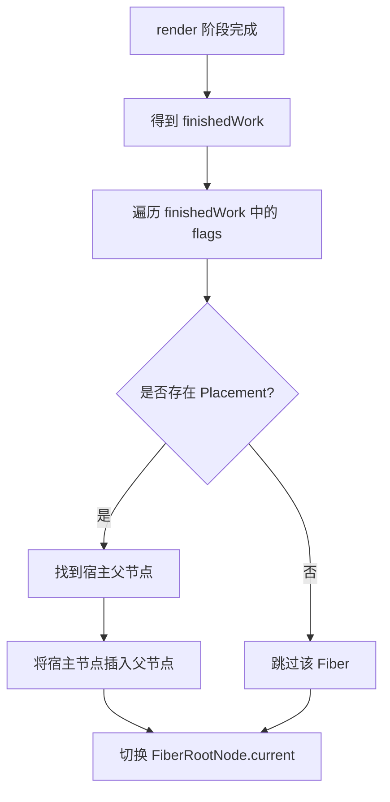

# 第六课 初探 ReactDOM

## React 内部的 3 个阶段

React 一次更新大致可以分为 3 个阶段：

- `schedule` 阶段
- `render` 阶段：执行 `beginWork`、`completeWork`
- `commit` 阶段：执行 `commitWork`

其中，`render` 阶段负责在内存中计算 Fiber 树与副作用；`commit` 阶段负责把这些副作用真正应用到宿主环境，例如浏览器 DOM。

## commit 阶段的 3 个子阶段

`commit` 阶段又可以拆分为 3 个子阶段：

- `beforeMutation` 阶段
- `mutation` 阶段
- `layout` 阶段

在当前实现进度中，重点先放在 `mutation` 阶段，因为它负责执行 DOM 插入、删除、更新等会改变页面结构的操作。

## 当前 commit 阶段要执行的任务

当前 `commit` 阶段主要需要完成两件事：

1. Fiber 树的切换
2. 执行 `Placement` 对应操作

Fiber 树切换指的是：当 `render` 阶段完成后，`FiberRootNode.current` 要从旧的 current Fiber 树切换到新的 finished work Fiber 树。

`Placement` 对应操作指的是：找到带有 `Placement` flag 的 Fiber，并把它对应的宿主节点插入到正确的 DOM 父节点中。

## Placement 操作需要注意的问题

考虑如下 JSX：

```tsx
<App>
	<div>
		<span>只因</span>
	</div>
</App>
```

如果 `span` 对应的 Fiber 带有 `Placement` flag，需要思考的问题是：

- `span` 自己对应的 DOM 节点是什么？
- 它应该插入到哪个 DOM 父节点下？
- 如何沿着 Fiber 树向上找到最近的宿主父节点？

在 Fiber 树中，并不是每个 Fiber 都对应真实 DOM。例如 `App` 通常是函数组件，它本身没有 DOM 节点。真正能作为 DOM 父节点的，一般是：

- `HostComponent`，例如 `div`、`span`
- `HostRoot`，对应根容器

因此执行 `Placement` 时，不能简单使用当前 Fiber 的父 Fiber，而是需要从当前 Fiber 的 `return` 指针一路向上查找，直到找到最近的宿主父节点。

## commit 的核心思路

一次基础的 `commit` 流程可以理解为：



这一节开始进入 ReactDOM 相关逻辑：`react-reconciler` 负责找出需要提交的副作用，而 `react-dom` 提供真实的宿主环境操作，例如创建 DOM、追加 DOM、插入 DOM。
